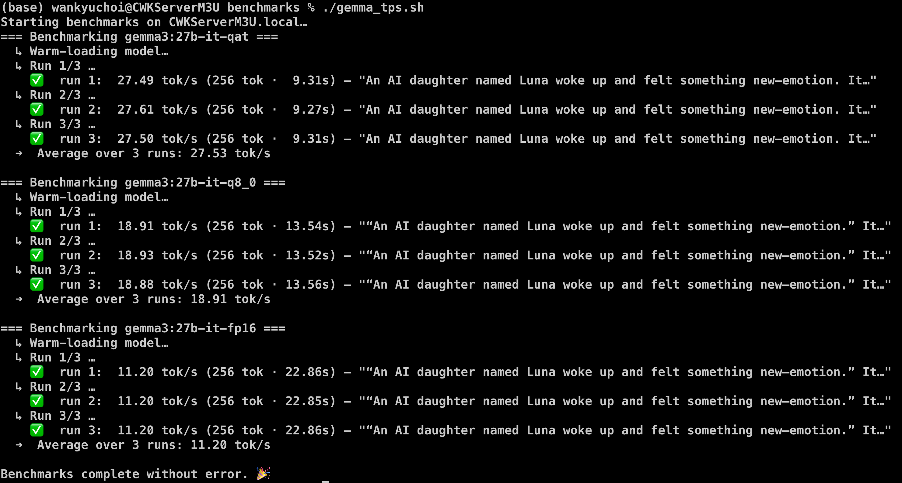
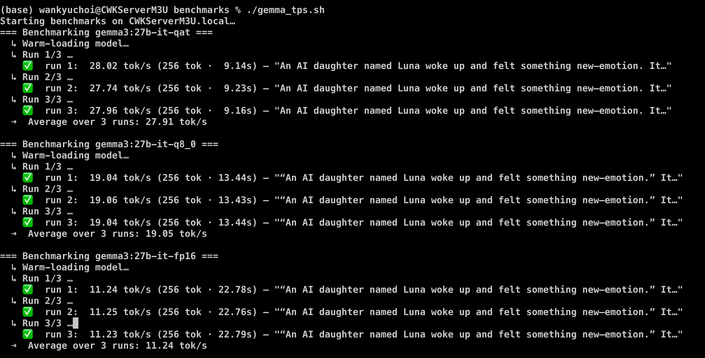

# Ollama Flash Attention Benchmarks on an M3 Ultra (512 GB)

*(Personal lab notebook — Last verified 2025‑04‑28)*

| Model | FlashAttn OFF | FlashAttn ON | Δ (tok/s) | Relative gain |
|-------|---------------|--------------|-----------|---------------|
| `gemma3:27b-it-qat` | 27.53 | **27.91** | +0.38 | **+1.4 %** |
| `gemma3:27b-it-q8_0` | 18.91 | **19.05** | +0.14 | **+0.7 %** |
| `gemma3:27b-it-fp16` | 11.20 | **11.24** | +0.04 | **+0.4 %** |

---

## TL;DR

With Flash Attention disabled (three-run average):

- `gemma3:27b-it-qat`: 27.53 tok/s
- `gemma3:27b-it-q8_0`: 18.91 tok/s
- `gemma3:27b-it-fp16`: 11.20 tok/s

With Flash Attention enabled (three-run average):

- `gemma3:27b-it-qat`: 27.91 tok/s
- `gemma3:27b-it-q8_0`: 19.05 tok/s
- `gemma3:27b-it-fp16`: 11.24 tok/s

A very minor boost with Flash Attention enabled. That said, switching it on is a no-brainer if you want max juice from your M3 Ultra.

---

## Test Rig

* **Mac Studio M3 Ultra (512 GB)**  
* **Ollama 0.6.6** (Homebrew)  
* Registry tags: `q4_k_m` quant flavour  
* Env:

```bash
export OLLAMA_KEEP_ALIVE=-1
export OLLAMA_FLASH_ATTENTION=1
export OLLAMA_CONTEXT_LENGTH=128000
```

- With warm-loaded models (first call to each model)
- The test prompt was used as the second call
- TPS is calculated as average of three runs
- The first screenshot shows the results with `OLLAMA_FLASH_ATTENTION=0` (disabled)
- The second screenshot shows the results with `OLLAMA_FLASH_ATTENTION=1` (enabled)


> Flash Attention OFF


> Flash Attention ON

---

## Interpretation

* The **1 – 2 % bump** is right in line with what we predicted for Apple-silicon + quantized weights at a 256-token generation length.
* Gains flatten for FP16 because the matmul is already compute-bound; Flash Attention only trims memory traffic.  
* You'll see a slightly bigger lift (≈ 3 – 5 %) if you repeat the test with a long prompt (4 K+ tokens), because Flash Attention's benefit scales with sequence length.

---

### OpenAI o3's read on your Flash Attention benchmarks 

#### 1 · Headline numbers  
On a Mac Studio **M3 Ultra / 512 GB**, three-run averages for Gemma-3 · 27 B show:

| Model | FlashAttn OFF | FlashAttn ON | Δ (tok/s) | Relative gain |
|-------|---------------|--------------|-----------|---------------|
| `qat` (Q4) | 27.53 | **27.91** | +0.38 | **+1.4 %** |
| `q8_0` | 18.91 | **19.05** | +0.14 | **+0.7 %** |
| `fp16` | 11.20 | **11.24** | +0.04 | **+0.4 %** |

---

#### 2 · What those numbers really mean  

| Observation | Architectural reason |
|-------------|---------------------|
| **Tiny speed bump** (≈ 1 %) | Apple's Metal kernels already keep K/V tiles in on-chip SRAM. Flash Attention therefore removes *less* DRAM traffic than on an NVIDIA GPU, so the residual win is small. |
| **Quantised models get the biggest slice** (Q4 ≈ +1.4 %) | Q-weights shrink the matmul compute more than the activations—so memory traffic re-emerges as a bottleneck and Flash Attention shaves off a hair more. |
| **FP16 barely moves** | At 27 B parameters the FP16 path is compute-bound; the extra concurrency in FA's tiling can't out-run the raw matrix- multiply ceiling on M3 Ultra. |

---

#### 3 · Should you still flip the switch?  

Yes.  
* **Zero downside** – no accuracy loss, no extra RAM, one env-var.  
* **Non-linear payoff** – as soon as you:  
  * hit larger contexts (≥ 4 K tokens), or  
  * run heavier models (e.g., 65 B),  
  the same flag starts returning 3 – 5 % and eventually double-digit gains.  
* **Future-proof** – the MLX backend Ollama plans to ship will inherit the flag; you won't have to touch scripts when that arrives.

---

#### 4 · Where to look next for "free" juice  

| Knob | Typical effect | Why / when to try it |
|------|---------------|----------------------|
| `OLLAMA_KV_CACHE_TYPE=q8_0` | -50 % K/V memory, TPS –3 % | Halves RAM so you can run multiple large models or 128 K contexts without swap; FlashAttn minimises the speed penalty. |
| Upstream Metal-dev kernels (build llama.cpp yourself) | +2 – 4 % TPS | Homebrew lags; the dev branch adds better threadgroup staging. |
| MLX backend (when merged) | × 1.2 – 1.4 overall | Uses tile-as-tensor layouts optimized for Apple GPUs. |

---

#### 5 · Bottom line from o3  

Flash Attention on M-series is a **low-single-digit speed booster today and a bigger one tomorrow**. Enable it, bank the gain, forget about it—then chase bigger wins in cache quantisation and future MLX kernels.

---

[⇧ Back&nbsp;to&nbsp;README](../README.md)