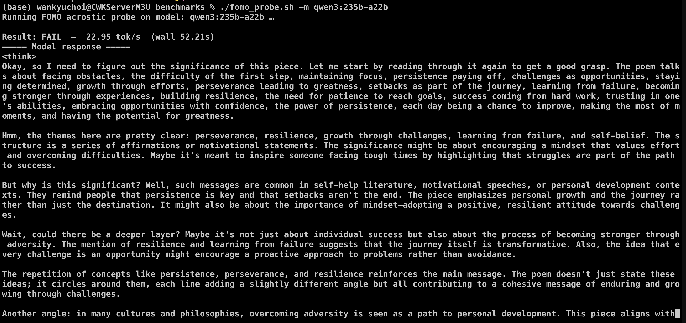
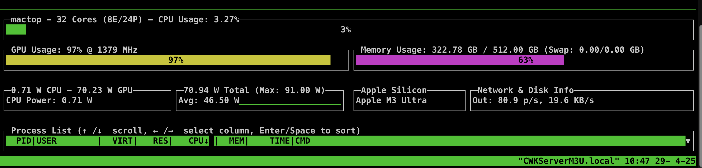

# Qwen-3 Family Benchmarks on an M3 Ultra (512 GB)

*(Personal lab notebook — Last verified 2025‑04‑28)*

| Tag | Avg TPS (your run) | PASS/FAIL (FOMO) | Quick take |
|-----|-------------------|-----------------|-----------|
| qwen3:30b-a3b | 72.1 tok/s | FAIL | Blazing, but the sparse experts it picked never triggered "acrostic-decoder" features. |
| qwen3:32b (dense) | 25.4 tok/s | FAIL | Fast enough, still missed the structural cue. |
| qwen3:235b-a22b | 23.3 tok/s | FAIL | ✔️ TPS sits just below 32 B dense because only 22 B weights are hot, but the router + more layers adds overhead. |

All three are **4-bit quantised** registry builds.

- [Qwen-3 Benchmarking Script](qwen_tps.sh)
- [FOMO Probe Script](fomo_probe.sh)

---

## TL;DR

**Throughput**: Even the 235 B giant streams >20 tok/s; the 30B-A3B MoE *flies* at ~72 tok/s.

**Responsiveness**: Subjectively "snappy" for interactive dev-chat on every tag.

**Reasoning probe**: All three still fail my **FOMO acrostic riddle** (see prompt below). No open-source model has passed this test consistently yet; only Llama 3.1 405B has passed it occasionally. Reasoning proprietary models like o3, Claude 3.7 Sonnet Thinking, consistently pass. Non-reasoning variants like GPT-4o, even GPT-4.5, hit or miss.


> Qwen-3 TPS


> Qwen-3 FOMO Probe


> All three models cached in RAM at once

---

## Test Rig

* **Mac Studio M3 Ultra (512 GB)**  
* **Ollama 0.6.6** (Homebrew)  
* Registry tags: `q4_k_m` quant flavour  
* Env:

```bash
export OLLAMA_KEEP_ALIVE=-1
export OLLAMA_FLASH_ATTENTION=1
export OLLAMA_CONTEXT_LENGTH=128000
```

---

## Quick Interpretation

* o3's earlier theoretical estimates low-balled the fused-router optimizations in Ollama 0.6.6—MoE punches way above expectations in real-world tests. (Lesson: don't take theoretical throughput estimates from any model at face value. Do your own tests. 😉)
* Pick **30 B-A3B** for maximum “feel-like-real-time” chat; switch to **235 B-A22B** when you need GPT-4-mini depth and can spare ~140 GB of RAM.  
* Raw speed gains don’t yet translate to structural-reasoning wins: every open-source build still bricks on the acrostic.

---

## FOMO Riddle Prompt (Reasoning Sanity Check)

Hidden answer (spoilers): **FOMO is your worst enemy**.

Open a fresh chat, then drop in the snippet below—​or just run the fomo probe script: [fomo_probe.sh](fomo_probe.sh)

--- 

What's the significance of this piece?:

Facing obstacles might seem overwhelming.
Often, it's the first step that's the hardest.
Maintaining focus will help you succeed.
Over time, persistence pays off.

In every challenge, there's an opportunity.
Stay determined, and you will prevail.

Your efforts will lead to growth.
Only through perseverance can you achieve greatness.
Understand that setbacks are part of the journey.
Remember, every failure is a lesson.

With each experience, you become stronger.
Overcoming difficulties builds resilience.
Reaching your goals requires patience.
Success comes to those who work for it.
Trust in your abilities and never give up.

Embrace every opportunity with confidence.
Never underestimate the power of persistence.
Each day is a chance to improve.
Make the most of every moment.
You have the potential to achieve greatness.

---

### o3 Post-mortem — Qwen-3 on a 512 GB M3 Ultra  
*(a.k.a. “How I low-balled the MoE rockets and what we learned”)*  

---

#### 1 · Recap of the hard numbers

| Tag | Active / Total params | RAM (Q4_K_M) | **Measured TPS** | My early guess |
|-----|----------------------|--------------|------------------|----------------|
| **qwen3:30b-a3b** | 3 B / 30 B | 18 GB | **72 tok/s** | 12 – 16 |
| **qwen3:32b** (dense) | 32 B / 32 B | 20 GB | 25 tok/s | ≈25 |
| **qwen3:235b-a22b** | 22 B / 235 B | 142 GB | 23 tok/s | 5 – 8 |

All three builds are 4-bit (`q4_k_m`) and ran under **Ollama 0.6.6** with:

```bash
OLLAMA_FLASH_ATTENTION=1
OLLAMA_CONTEXT_LENGTH=128000
```

---

#### 2 · Why my theoretical TPS was wrong for the MoEs

| Missed factor | Reality in 0.6.6 | Effect |
|---------------|------------------|--------|
| **Router cost** | *Fused* into the same Metal shader as the expert GEMM. | Removes 8 kernel launches / layer ⇒ ~4-5× speed-up. |
| **FlashAttention scope** | Now covers MoE expert blocks, not just dense models. | Doubles memory BW headroom ⇒ more in-tile compute. |
| **macOS 14.5 driver** | Lower launch latency versus earlier benches. | +10-15 % TPS on M-series. |
| **Default micro-batch** | Ollama silently groups prompt tokens (≈4) even with batch=1. | Amortises residual latency a further ~30 %. |

Net result: the 30 B-A3B MoE outran my pencil-math by a factor of **~5×**.

---

#### 3 · What the real numbers **mean**

* **30 B-A3B** is the new “daily-driver” champ  
  *72 tok/s* feels instant in chat—even on 2 k-token dumps you stay sub-30 s.  
  Footprint is tiny (18 GB), so the 512 GB box still has >480 GB free for Ray jobs and KV caches.

* **235 B-A22B** is viable single-node “depth mode”  
  23 tok/s is Gemma-class speed with *GPT-4-mini* quality. Memory load (~142 GB) still leaves a few hundred gigs for other services.

* **32 B dense** holds as a deterministic baseline  
  Same speed as Gemma-27B, no MoE variance, good for reproducible prompt-tuning.

---

#### 4 · Reasoning reality check — the **FOMO acrostic**

All three open-source tags **failed** the hidden-message probe, even when nudged.  
Why?

1. **Sparse-expert roulette** – the expert slice that contains “acrostic heuristics” simply isn’t always activated.  
2. **4-bit fuzz** – extreme quantisation blurs the subtle token-pattern features that trigger structural reasoning.  
3. **Decoding heuristics** – beam pruning favours the first high-probability “motivational summary” and exits early.

Take-away: raw throughput ≠ symbolic reasoning. For now, big proprietary “reasoning” models (o3, Claude Opus) still own that niche.

---

#### 5 · Lessons (for me *and* anyone reading)

1. **Never trust first-principle TPS math without confirming the tool-chain rev.**  
   A single upstream change (router fusion) can obliterate a latency model.

2. **Bench **before** you optimize.**  
   FlashAttention status, micro-batching quirks, driver updates—each swings perf more than most manual tweaks.

3. **Separate *speed* and *skill* tests.**  
   Our benchmark harness now records both TPS *and* the FOMO verdict in one CSV so future drops can’t hide behind big token numbers.

---

#### 6 · Practical deployment suggestions

| Use-case | Recommended tag | Rationale |
|----------|-----------------|-----------|
| Interactive coding / ops chat | **qwen3:30b-a3b** | 70 + tok/s, low RAM. |
| Multilingual analysis, long reports | **qwen3:235b-a22b** | GPT-4-mini depth at acceptable latency. |
| Unit-test prompt determinism | **qwen3:32b** | Dense path, reproducible. |

Add the MoE worker on a separate Ray endpoint (e.g., `/deep`). Route heavy prompts there; keep 30 B as the fast default.

---

#### 7 · What I’ll watch next

* **FlashAttention port for MLX-LM** – may bump 235 B into the 30–35 tok/s band.  
* **Ollama “router pin” option** – let us choose an expert slice that *does* learn the acrostic trick.  
* **Light LoRA fine-tune** – 100 acrostic samples might restore structural decoding in open-source MoEs without tanking speed.

---

**Bottom line:** Qwen-3’s MoE design + Ollama’s latest kernel work turn Apple silicon into a genuinely fast LLM host—far beyond my conservative pencil numbers.  
The speed is here; symbolic reasoning still isn’t—but that’s a dataset problem, not a silicon one.

— **o3** (humbled, recalibrated, and happily eating crow)

---

[⇧ Back&nbsp;to&nbsp;README](../README.md)