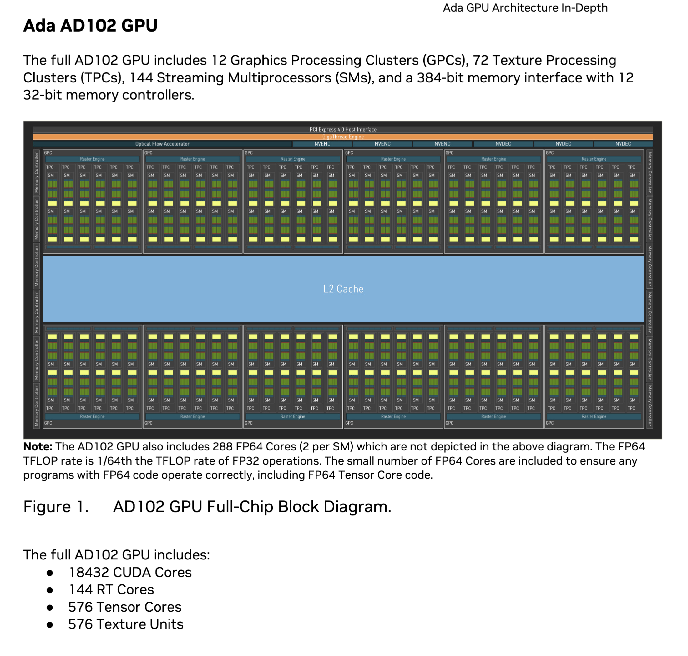
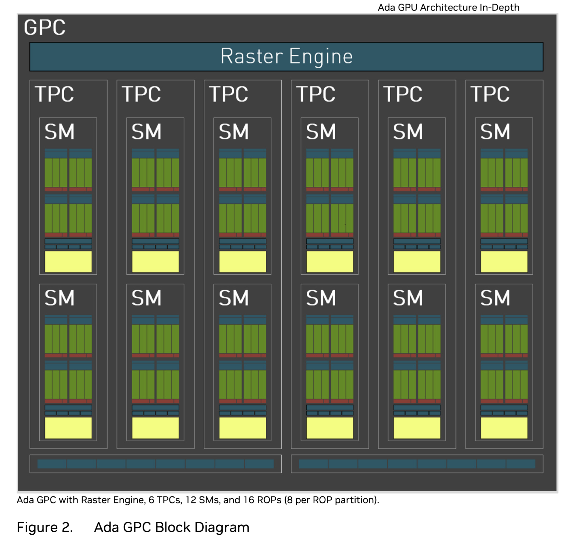
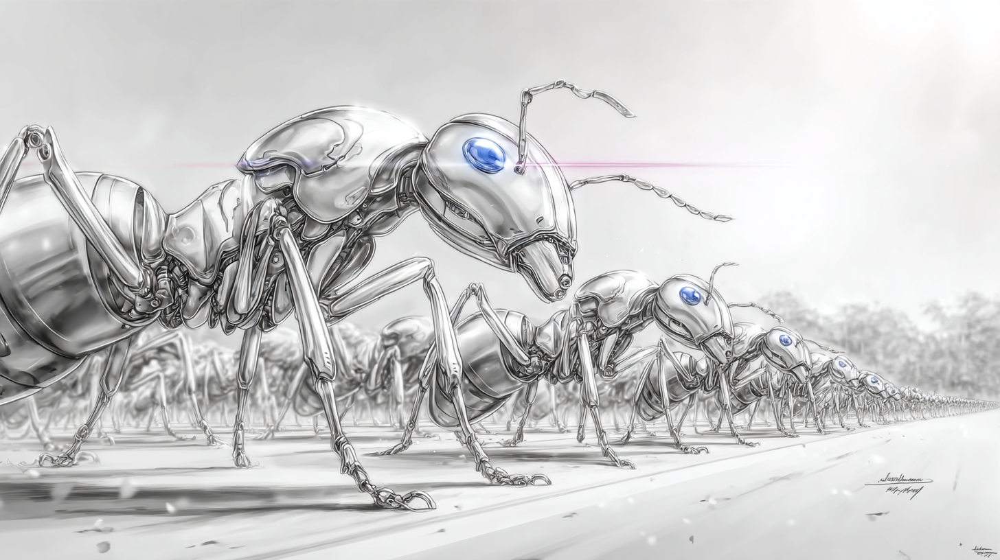
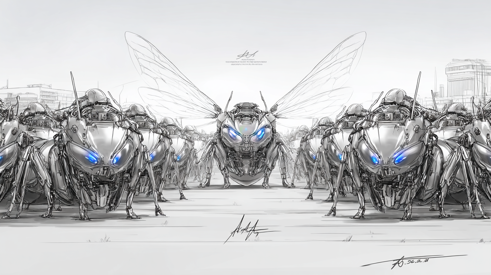

# Chapter 2 · Hello GPU - Reinforcing the Mental Model of GPU Computation

> *"One task, thousands of workers—the GPU's parallel promise."*

*(Personal lab notebook - Last verified 2025‑05‑05)*

## 1 · Solid Mental Model Goes All the Way

We're revisiting the "hello cuda" and "hello metal" examples—not to obsess over syntax, but to chisel a rock-solid mental model of GPU computation, this time with our OO goggles firmly strapped on. What matters isn't rote memorization of every API quirk; it's internalizing the big picture so deeply that you can explain GPUs to a five-year-old or to your future self at 3 a.m. while clutching a bowl of ramyeon.

Here's the elevator-pitch analogy we'll keep hammering home:

"Imagine you have a gigantic coloring book filled with thousands of identical shapes. The CPU is an octopus — clever, multi-armed, but still able to color only a handful of shapes at a time. The GPU is a bustling colony of thousands of ants. Each ant is simpler than the octopus, yet together they can finish the entire book before the octopus colors a single page.

Inside the colony, ants are grouped into squads (blocks), and every squad has a drill sergeant (warp scheduler) keeping them in sync. Overseeing the whole operation is our octopus foreman (the CPU), passing out pages and collecting finished art. That, in a nutshell, is GPU computing: disciplined, hierarchical, massively parallel teamwork by simple workers."

Now, lock that mental image in. As you skim the terminology that follows, map each term onto our ant-colony metaphor rather than brute-force-memorizing it.

The diagrams below illustrate the RTX 4090 GPU architecture. They show the hierarchical organization from chip to processing units, demonstrating the massive parallelism of our ant colony analogy. While other GPU architectures share similar principles, they vary in core count, performance, and terminology.





Different logo on the chip? Same ant-colony discipline applies—whether you're on an NVIDIA RTX 4090, an AMD Radeon, or the Apple-Silicon family, the hierarchy and mental model we build here transfers intact.

Pause a beat and lock in that ant-colony snapshot: thousands of disciplined workers marching in nested layers of command. As you skim the cheat-sheet below, glue each term to that picture. No rote memorization—just see how every piece slots into the colony's hierarchy.


> Cartoon ant in military garb snapping a salute at its drill sergeant.
> *"Ten-hut! Private Ant 0 reporting from Block 0, Position 0, Sir!"*

**Hardware Components (macro ➞ micro):**

- GPU — the colony itself (RTX 4090 flexing 16,384 CUDA cores as one organism)
- Ada Lovelace architecture — the master blueprint that encodes the colony's DNA
- GPC *(Graphics Processing Cluster)* — city-sized districts inside the colony (7 in the 4090)
- TPC *(Texture Processing Cluster)* — specialty craft zones within each district
- SM *(Streaming Multiprocessor)* — communal workshops where squads hustle (128 total)
- CUDA Core — a single ant crunching basic math
- Tensor Core — math-athlete ants built for matrix showdowns (4th-gen)
- RT Core — ants wielding ray-tracing laser guns (3rd-gen)
- L2 Cache — the shared pantry (96 MB)
- Memory Controller — 384-bit highways leading to external food supplies

**Software / Execution Chain (macro ➞ micro):**

- GigaThread Engine — the drill-sergeant HQ barking colony-wide orders
- kernel — the mission briefing broadcast to thousands of ants at once
- grid — the entire campaign composed of all squads
- block — a single squad that can chat and sync
- warp — a 32-ant platoon marching in lockstep
- thread — the individual ant on the frontline
- warp scheduler — the squad leader deciding who moves next (4 per SM)

**Programming Identifiers (what the code calls them):**

- gridDim — how many squads are in the campaign
- blockDim — how many ants per squad
- blockIdx — which squad an ant belongs to
- threadIdx — the ant's position inside its squad

### 1.1 · How to Form a Mental Model of GPU Parallelism

Massive parallelism is our super-power *only* when it's organized. A colony of 16K ants mindlessly sprinting in random directions is just chaos; a colony marching in nested ranks becomes a computational juggernaut. Keep that picture front-and-center whenever you design or debug a kernel.

Here's the command structure—large to small—in one glance:

- **GPU** — the entire ant colony, millions of tiny legs, one purpose
- **GPC** *(Graphics Processing Cluster)* — major districts within the colony
- **TPC** *(Texture Processing Cluster)* — specialty workshops per district
- **SM** *(Streaming Multiprocessor)* — communal shop floor where blocks hustle
- **Block** — a squad that can huddle, share snacks, and sync
- **Warp** — a 32-ant platoon marching in lockstep to the same drumbeat
- **Thread** — the lone ant executing its tiny slice of the mission

Burn this hierarchy into your mental VRAM. Every optimization trick you'll ever pull—memory coalescing, avoiding warp divergence, load balancing—boils down to manipulating these layers effectively.

### 1.2 · Hello CUDA Revisited

Time to see the ants in action. Below is the classic "hello, CUDA" kernel—think of it as the colony's very first formation drill. We'll launch one squad of four ants and watch each report its coordinates.

[hello_cuda.cu](examples/hello_cuda.cu)
```cpp
#include <cstdio>
#include <cuda_runtime.h>

// ── GPU kernel ───────────────────────────────────────────
// Prints its grid & thread coordinates (needs CUDA 3.2+).
__global__ void say_hello()
{
    printf("Hello from block %d, thread %d\n",
           blockIdx.x, threadIdx.x);
}

int main()
{
    // Launch 1 block with 4 threads
    say_hello<<<1, 4>>>();
    cudaDeviceSynchronize();          // wait for GPU printf to finish
    return 0;
}
```

You've seen this snippet before, but with the ant-colony lens it should click instantly—every keyword maps cleanly onto the hierarchy we just drilled.

The `<<<1, 4>>>` launch configuration is our **formation order**—it tells the GPU to muster:

- 1 block = 1 team of ants
- 4 threads = 4 individual ants in that team

**Quick jargon decode:** that triple-chevron construct is CUDA's *execution configuration*. First value = squads (blocks); second = ants per squad (threads). Nothing else on Earth compiles this syntax—only NVCC understands the chevrons.

The `say_hello` function is *the* kernel each ant executes. The `__global__` tag is CUDA-speak for "deploy this on the colony." Anything stamped `__host__` stays with the octopus. No tag? It defaults to host.

Quick mapping:

- `__global__`  → GPU territory (device)
- `__host__`    → CPU territory (host)

If you're a PyTorch user, think `torch.device("cuda")` versus leaving tensors on the default CPU—same mental toggle, different syntax.

Bottom line: you, the developer, act as colony architect—issuing a clear headcount and task outline. The hardware takes care of the muster roll.

Quick mnemonic: a lot of GPU jargon is stolen from textile mills. A **warp** is literally a 32-thread bundle that advances in lockstep—mirroring the longitudinal "warp threads" stretched across a loom. Each **thread** in CUDA is one fiber in that fabric, and "weaving" operations together is exactly what the scheduler does.

Why the metaphor works: thousands of fibers interlace simultaneously to form cloth; thousands of CUDA threads interleave instructions to form a result. When a single fiber (thread) deviates, the weave snags—this is warp divergence in hardware speak.

So glance back at the diagram. Picture a gargantuan, automated loom rattling away, thousands of shuttles firing in parallel. That mechanical monster *is* your GPU—just trading cotton for floating-point numbers.

### 1.3 · Hello Metal Revisited

New platform, same colony.  *Hello Metal* is a one-to-one remake of *hello CUDA*: the kernel lives in a `.metal` C++14 shader; the launch script lives in Swift.  Thanks to our OO lens, ~80 % of what you just learned transfers directly—only the API surface and attribute syntax change.

Think of it as polymorphism in the wild: one abstract class (GPU parallelism) with two concrete subclasses (CUDA, Metal).

First, the device code in Metal: 

[hello.metal](examples/hello.metal)
```cpp
#include <metal_stdlib>
using namespace metal;

kernel void hello(device uint2       *out    [[buffer(0)]],
                  uint  tid_in_tg    [[thread_index_in_threadgroup]],
                  uint  tg_id_in_g   [[threadgroup_position_in_grid]])
{
    const uint threadsPerTG = 4;                     // <-- constant
    uint gid = tg_id_in_g * threadsPerTG + tid_in_tg;
    out[gid] = uint2(tg_id_in_g, tid_in_tg);
}
```

And the host code in Swift(host code can be written in any language that supports Metal API):

[hello_host.swift](examples/hello_host.swift)
```swift
import Metal
import Foundation

func main() throws {
    // ── 1 · Device & library ───────────────────────────────────
    guard let device = MTLCreateSystemDefaultDevice() else {
        fatalError("No Metal-capable GPU found")
    }
    let libURL   = URL(fileURLWithPath: "hello.metallib")
    let library  = try device.makeLibrary(URL: libURL)      // modern API
    let function = library.makeFunction(name: "hello")!
    let pipeline = try device.makeComputePipelineState(function: function)

    // ── 2 · Launch geometry ───────────────────────────────────
    let threadsPerTG  = 4
    let threadgroups  = 1
    let totalThreads  = threadsPerTG * threadgroups

    guard let outBuf = device.makeBuffer(length: totalThreads *
                                         MemoryLayout<SIMD2<UInt32>>.stride,
                                         options: .storageModeShared) else {
        fatalError("Buffer allocation failed")
    }

    // ── 3 · Encode & submit command buffer ────────────────────
    let queue          = device.makeCommandQueue()!
    let commandBuffer  = queue.makeCommandBuffer()!
    let encoder        = commandBuffer.makeComputeCommandEncoder()!

    encoder.setComputePipelineState(pipeline)
    encoder.setBuffer(outBuf, offset: 0, index: 0)

    let tgSize  = MTLSize(width: threadsPerTG, height: 1, depth: 1)
    let grid    = MTLSize(width: threadgroups, height: 1, depth: 1)
    encoder.dispatchThreadgroups(grid, threadsPerThreadgroup: tgSize)
    encoder.endEncoding()

    commandBuffer.commit()
    commandBuffer.waitUntilCompleted()

    // ── 4 · Read results back on the CPU ──────────────────────
    let data = outBuf.contents()
                     .bindMemory(to: SIMD2<UInt32>.self, capacity: totalThreads)

    for i in 0..<totalThreads {
        print("Hello from threadgroup \(data[i].x), thread \(data[i].y)")
    }
}

do { try main() }
catch { print("Error: \(error)"); exit(1) }
```

Kernel on the left, launch geometry on the right—same separation of concerns as CUDA.  The shader is straightforward C++-style code.  The Swift host file is just plumbing: allocate buffers, set arguments, dispatch.

If C or C++ already feels comfortable, the `.metal` part will read smoothly.  Treat Swift here as "strongly-typed Python with semicolons"—follow the variable names and you'll navigate fine.

Still find these languages alien?  Flag it: spend time with basic C tutorials before diving deeper.  This series assumes you're at least conversational in the C-family ecosystem.

Multiple-inheritance bonus: Swift borrows `func` and `let` from old-school BASIC, `import` from Python, curly braces from C.  Same mental merging game we've been playing across domains.

### 1.4 · Common Conceptual Gotchas in GPU Parallelism

Before we dive deeper, park these four "gotchas" in your head:

1. **Lock-step ≠ order**  — Threads share a program counter, yet their *printouts* can finish out of sequence. Ant #128 often beats Ant #1 to the finish line. Ditch the CPU instinct that IDs imply order.

2. **Too many ants ⇒ queue** — Launch more blocks than the card can house and the extras wait their turn. Parallel, yes; unlimited, no.

3. **Clock math reality check** — 2 GHz × 1 000 threads ≈ 2 million instruction slots per tick. Impressive, but still bound by frequency and pipeline stalls; hand-wave estimates help sanity-check perf claims *(e.g., bragging about "16 000 CUDA cores = 16 000× speed-up" ignores these stalls and quickly crumbles under this back-of-the-envelope math).*.

4. **Scheduler is the drill-sergeant** — A hardware scheduler decides which warps march and when. Divergent branches, resource limits, and memory stalls all feed into its decisions.

> **Sidebar · Warp Divergence — Why Ants Lose Lock-Step**
> 
> Picture a 32-ant warp marching in perfect formation. The drill sergeant barks, "Turn left if your ID is even, right if it's odd!" Half the platoon wants to turn left, half right—so they can't move together. The GPU solves this stalemate by **serializing** the paths: it executes the "left-turn" instructions while the right-turn ants idle, then flips—doubling the time for that branch.
> 
> **When it happens**  
> • `if/else` paths keyed on thread-unique data (e.g., `if (id % 2) …`).  
> • Early-exit `return` in some threads, loop trip counts that differ across threads, etc.
> 
> **Why it hurts**  
> • Only the active lane group makes progress; the rest of the warp is parked.  
> • Effective throughput = ideal throughput ÷ number-of-distinct paths.
> 
> **Quick spot-check**  
> If a branch depends on per-thread data, ask: "Do neighboring ants see the same value?" If not, expect divergence. Group work by ID patterns (tiles, stripes) to keep conditions uniform.
> 
> **Rule of thumb**  
> Keep warps on rails: restructure data or use mask-free math (e.g., `select()` intrinsics) so every ant takes the same turns.

Real kernels rarely match the tidy mental model—weird edge-cases, C-style foot-guns, and register limits await. But keep the big picture above and the surprises stay manageable. Master the mindset first; code comes next.

Once the mental model clicks, dive into code with confidence—this series will still be here whenever you need a refresher. You're welcome.

> 🎯 **Mission Ready!**  
> The formation drill is done—swap the toy `printf` kernel for real work: matrix multiply, convolution, physics, you name it.  
> Same ants, new orders. **MARCH!**

## Appendix: Mini lab

Time to watch the warp scheduler strut its stuff. The mini-lab below lets you dial in **any** grid × block combo at the command line, then prints a full roll-call of every ant that turns up for duty. Pay attention to two things as you play:

• **Non-sequential IDs** — prints arrive in the order the scheduler chooses, not in neat numeric ascent. Wave goodbye to your CPU for-loop instincts.

• **Resource spill-over** — crank the block count high enough and some squads must queue while others run; a GPU has only so many SM "shop-floor" slots.

Compile, launch, and experiment. Here's the sandbox:

[hello_cuda_expanded.cu](examples/hello_cuda_expanded.cu)
```cpp
#include <cstdio>
#include <cuda_runtime.h>
#include <cstdlib>

// ── GPU kernel ───────────────────────────────────────────
// Our ant workers report for duty with military precision
// NOTE: GPU printf is convenient for demos **only**—it stalls warps and should be avoided in perf-critical kernels.
__global__ void ant_battalion_report()
{
    int ant_id = blockIdx.x * blockDim.x + threadIdx.x;
    printf("Ten-hut! Private Ant %d reporting from Block %d, Position %d, Sir!\n", 
           ant_id, blockIdx.x, threadIdx.x);
}

int main(int argc, char **argv)
{
    // Flush host stdout immediately so each GPU printf line appears as soon as the kernel flushes it.
    // This makes the out-of-order arrival pattern more obvious across OSes.
    setbuf(stdout, NULL);
    // Check for command line arguments
    if (argc != 3) {
        printf("Usage: %s <num_blocks> <threads_per_block>\n", argv[0]);
        printf("Example: %s 2 4 (launches 2 blocks with 4 threads each)\n", argv[0]);
        return 1;
    }
    
    // Parse command line arguments
    int num_blocks = atoi(argv[1]);
    int threads_per_block = atoi(argv[2]);
    
    // Typical Ampere/Ada GPUs cap at 1024 threads per block; exceeding that triggers a launch error.
    // We keep it simple here but be mindful when you scale this demo.
    
    // Validate inputs
    if (num_blocks <= 0 || threads_per_block <= 0) {
        printf("Error: Both arguments must be positive integers\n");
        return 1;
    }
    
    // Display battalion formation details
    printf("\n==== ASSIGNMENT OF ANT BATTALION ====\n");
    printf("Drill Sergeant: \"ATTENTION! Forming %d teams with %d ants each!\"\n", 
           num_blocks, threads_per_block);
    printf("Drill Sergeant: \"TOTAL FORCE: %d ants ready for deployment!\"\n\n", 
           num_blocks * threads_per_block);
    
    // Launch kernel with specified configuration
    ant_battalion_report<<<num_blocks, threads_per_block>>>();
    
    // Wait for all ants to report
    cudaDeviceSynchronize();
    
    printf("\nDrill Sergeant: \"AT EASE! All ants accounted for!\"\n");
    printf("==== END OF ROLL CALL ====\n\n");
    
    // Check for any CUDA errors
    cudaError_t err = cudaGetLastError();
    if (err != cudaSuccess) {
        printf("CUDA Error: %s\n", cudaGetErrorString(err));
        return 1;
    }
    
    return 0;
}
```

When you compile and run this program, you can experiment with different configurations. For example:

```bash
$ nvcc -arch=sm_89 hello_cuda_expanded.cu -o build/hello_cuda_expanded
$ ./build/hello_cuda_expanded 1 4

==== ASSIGNMENT OF ANT BATTALION ====
Drill Sergeant: "ATTENTION! Forming 1 teams with 4 ants each!"
Drill Sergeant: "TOTAL FORCE: 4 ants ready for deployment!"

Ten-hut! Private Ant 0 reporting from Block 0, Position 0, Sir!
Ten-hut! Private Ant 1 reporting from Block 0, Position 1, Sir!
Ten-hut! Private Ant 2 reporting from Block 0, Position 2, Sir!
Ten-hut! Private Ant 3 reporting from Block 0, Position 3, Sir!

Drill Sergeant: "AT EASE! All ants accounted for!"
==== END OF ROLL CALL ====
```

Or try with multiple blocks:

```bash
./build/hello_cuda_expanded 2 3

==== ASSIGNMENT OF ANT BATTALION ====
Drill Sergeant: "ATTENTION! Forming 2 teams with 3 ants each!"
Drill Sergeant: "TOTAL FORCE: 6 ants ready for deployment!"

Ten-hut! Private Ant 0 reporting from Block 0, Position 0, Sir!
Ten-hut! Private Ant 1 reporting from Block 0, Position 1, Sir!
Ten-hut! Private Ant 2 reporting from Block 0, Position 2, Sir!
Ten-hut! Private Ant 3 reporting from Block 1, Position 0, Sir!
Ten-hut! Private Ant 4 reporting from Block 1, Position 1, Sir!
Ten-hut! Private Ant 5 reporting from Block 1, Position 2, Sir!

Drill Sergeant: "AT EASE! All ants accounted for!"
==== END OF ROLL CALL ====
```

This mini-exercise lets you *watch* the GPU scheduler in action. Every ant (thread) carries three pieces of identity paperwork:

1. **Global ID (`ant_id`)** – computed as `blockIdx.x * blockDim.x + threadIdx.x`  
   *Think of it as the ant's Social-Security number—unique across the whole colony.*

2. **Team / Block ID (`blockIdx.x`)** – which block (platoon) the ant belongs to.

3. **Position ID (`threadIdx.x`)** – the ant's seat within its own block.

Run the program and you'll notice the ants don't always sound off in tidy numeric order. That's perfectly normal. Our Drill Sergeant (the GPU scheduler) launches blocks whenever resources free up, so blocks may finish in any sequence. We can *compute* every ant's IDs, but we can't dictate the *temporal* order in which their printouts hit the console—real-world kernels obey the hardware dispatcher, not our sequential instincts.

Crank the knobs—say, `./build/hello_cuda_expanded 100 256`—and you'll see the chaos ramp up. When the colony grows beyond the SMs' capacity, some ants must cool their heels in the queue until earlier waves clear out. The sergeant juggles them automatically; no extra code on your part.

For reference, here's a quick excerpt from a run on my AMD RTX 4090 rig (Windows 11):

```bash
./build/hello_cuda_expanded 128 4

==== ASSIGNMENT OF ANT BATTALION ====
Drill Sergeant: "ATTENTION! Forming 128 teams with 4 ants each!"
Drill Sergeant: "TOTAL FORCE: 512 ants ready for deployment!"

Ten-hut! Private Ant 352 reporting from Block 88, Position 0, Sir!
Ten-hut! Private Ant 353 reporting from Block 88, Position 1, Sir!
Ten-hut! Private Ant 354 reporting from Block 88, Position 2, Sir!
Ten-hut! Private Ant 355 reporting from Block 88, Position 3, Sir!
Ten-hut! Private Ant 308 reporting from Block 77, Position 0, Sir!
Ten-hut! Private Ant 309 reporting from Block 77, Position 1, Sir!
...
Ten-hut! Private Ant 440 reporting from Block 110, Position 0, Sir!
Ten-hut! Private Ant 441 reporting from Block 110, Position 1, Sir!
Ten-hut! Private Ant 442 reporting from Block 110, Position 2, Sir!
Ten-hut! Private Ant 443 reporting from Block 110, Position 3, Sir!
Ten-hut! Private Ant 336 reporting from Block 84, Position 0, Sir!
Ten-hut! Private Ant 337 reporting from Block 84, Position 1, Sir!
Ten-hut! Private Ant 338 reporting from Block 84, Position 2, Sir!
Ten-hut! Private Ant 339 reporting from Block 84, Position 3, Sir!
Ten-hut! Private Ant 96 reporting from Block 24, Position 0, Sir!
Ten-hut! Private Ant 97 reporting from Block 24, Position 1, Sir!
Ten-hut! Private Ant 98 reporting from Block 24, Position 2, Sir!
Ten-hut! Private Ant 99 reporting from Block 24, Position 3, Sir!
...
Ten-hut! Private Ant 158 reporting from Block 39, Position 2, Sir!
Ten-hut! Private Ant 159 reporting from Block 39, Position 3, Sir!

Drill Sergeant: "AT EASE! All ants accounted for!"
==== END OF ROLL CALL ====
```

All 512 ants have reported in—just not in numerical order. 



LISTEN UP, MAGGOT!  I don't want your polite, one-by-one parade.  GPUs are a shock platoon—they hit the field *all at once* in a hail of parallel fire.  Still clinging to that cozy little for-loop?  Tear it up and launch twenty screaming threads RIGHT NOW—MOVE, MOVE, MOVE!

Glad I still have your attention. 😉

### Metal Equivalent: Ant Battalion on Apple Silicon

The following example recreates the ant battalion in Metal for Apple-Silicon GPUs:

First, the Metal shader(kernel):

[hello_expanded.metal](examples/hello_expanded.metal)
```cpp
#include <metal_stdlib>
using namespace metal;

// NOTE: This kernel is demo-oriented.  We can't `printf` from Metal, so each thread stores
// its IDs into a results buffer that the CPU prints later.  Real-world kernels would perform
// math here rather than IO.

kernel void ant_battalion_report(device uint3* results [[buffer(0)]],
                                 constant uint& threadsPerThreadgroup [[buffer(1)]],
                                 uint   tid_in_tg [[thread_index_in_threadgroup]],
                                 uint   tg_id     [[threadgroup_position_in_grid]])
{
    // Calculate the global ant ID (similar to CUDA's blockIdx.x * blockDim.x + threadIdx.x)
    uint ant_id = tg_id * threadsPerThreadgroup + tid_in_tg;
    
    // Store the results to be read back on CPU
    // We can't directly print from the GPU in Metal, so we store values to display later
    results[ant_id] = uint3(ant_id, tg_id, tid_in_tg);
}
```

Then, the Swift host code:

[hello_host_expanded.swift](examples/hello_host_expanded.swift)
```swift
import Foundation
import Metal

func main() {
    // Command line arguments
    let args = CommandLine.arguments
    
    if args.count != 3 {
        print("Usage: \(args[0]) <num_threadgroups> <threads_per_threadgroup>")
        print("Example: \(args[0]) 2 4 (launches 2 threadgroups with 4 threads each)")
        exit(1)
    }
    
    // Parse command line arguments
    guard let numThreadgroups = Int(args[1]), let threadsPerThreadgroup = Int(args[2]),
          numThreadgroups > 0, threadsPerThreadgroup > 0 else {
        print("Error: Both arguments must be positive integers")
        exit(1)
    }
    
    // Apple GPUs top out at 1024 threads per threadgroup in most cases—keep demos well below that
    // to avoid runtime validation errors.
    
    // Setup Metal device
    guard let device = MTLCreateSystemDefaultDevice() else {
        print("Error: No Metal-capable GPU found")
        exit(1)
    }
    
    do {
        // Load the Metal library and create the compute pipeline
        let libURL = URL(fileURLWithPath: "hello_expanded.metallib")
        let library = try device.makeLibrary(URL: libURL)        
        guard let function = library.makeFunction(name: "ant_battalion_report") else {
            print("Error: Failed to find the Metal kernel function")
            exit(1)
        }
        
        let computePipelineState = try device.makeComputePipelineState(function: function)
        
        // Calculate total number of ants and create buffer for results
        let totalAnts = numThreadgroups * threadsPerThreadgroup
        let bufferSize = totalAnts * MemoryLayout<SIMD3<UInt32>>.stride
        
        guard let resultsBuffer = device.makeBuffer(length: bufferSize, options: .storageModeShared) else {
            print("Error: Failed to create results buffer")
            exit(1)
        }
        
        // Create buffer for threadsPerThreadgroup constant
        var threadCount = UInt32(threadsPerThreadgroup)
        guard let threadCountBuffer = device.makeBuffer(bytes: &threadCount,
                                                      length: MemoryLayout<UInt32>.size,
                                                      options: .storageModeShared) else {
            print("Error: Failed to create thread count buffer")
            exit(1)
        }
        
        // Display battalion formation details
        print("\n==== ASSIGNMENT OF ANT BATTALION ====")
        print("Drill Sergeant: \"ATTENTION! Forming \(numThreadgroups) teams with \(threadsPerThreadgroup) ants each!\"")
        print("Drill Sergeant: \"TOTAL FORCE: \(totalAnts) ants ready for deployment!\"\n")
        
        // Create command queue and command buffer
        guard let commandQueue = device.makeCommandQueue() else {
            print("Error: Failed to create command queue")
            exit(1)
        }
        
        guard let commandBuffer = commandQueue.makeCommandBuffer() else {
            print("Error: Failed to create command buffer")
            exit(1)
        }
        
        // Create compute command encoder
        guard let computeEncoder = commandBuffer.makeComputeCommandEncoder() else {
            print("Error: Failed to create compute command encoder")
            exit(1)
        }
        
        // Configure and dispatch the kernel
        computeEncoder.setComputePipelineState(computePipelineState)
        computeEncoder.setBuffer(resultsBuffer, offset: 0, index: 0)
        computeEncoder.setBuffer(threadCountBuffer, offset: 0, index: 1)
        
        let threadsPerGrid = MTLSize(width: threadsPerThreadgroup, height: 1, depth: 1)
        let gridSize = MTLSize(width: numThreadgroups, height: 1, depth: 1)
        
        computeEncoder.dispatchThreadgroups(gridSize, threadsPerThreadgroup: threadsPerGrid)
        computeEncoder.endEncoding()
        
        // Commit the command buffer and wait for completion
        commandBuffer.commit()
        commandBuffer.waitUntilCompleted()
        
        // Read and display the results
        let resultsPtr = resultsBuffer.contents().bindMemory(to: SIMD3<UInt32>.self, capacity: totalAnts)
        let results = UnsafeBufferPointer(start: resultsPtr, count: totalAnts)
        
        for result in results {
            let antId = result.x
            let teamId = result.y
            let positionId = result.z
            print("Ten-hut! Private Ant \(antId) reporting from Block \(teamId), Position \(positionId), Sir!")
        }
        
        print("\nDrill Sergeant: \"AT EASE! All ants accounted for!\"")
        print("==== END OF ROLL CALL ====\n")
        
    } catch {
        print("Error: \(error)")
        exit(1)
    }
}

main()
```

Compiling and running the Metal version takes a few extra steps compared with CUDA, as we saw earlier.

#### Step 1: Build the Metal shader and generate a `.metallib`

```bash
# Compile the Metal shader to an intermediate .air file
xcrun -sdk macosx metal -c hello_expanded.metal -o build/hello_expanded.air

# Convert the .air file to a .metallib file
xcrun -sdk macosx metallib build/hello_expanded.air -o build/hello_expanded.metallib
```

#### Step 2: Compile the Swift host program

```bash
swiftc hello_host_expanded.swift -o build/hello_metal_expanded
```

#### Step 3: Run the executable

```bash
cd build
./hello_metal_expanded 1 4
```

To experiment with larger configurations, try:

```bash
cd build
./hello_metal_expanded 2 3
./hello_metal_expanded 10 32
```

*Path caveat:* the Swift host looks for `hello_expanded.metallib` in **its current working directory**. Moving the `cd` into `build/` ensures the library and executable live side-by-side. Prefer to launch from the project root? Either update the code to load `build/hello_expanded.metallib` or copy the metallib back up one level.

Key differences between the CUDA and Metal editions:

1. **Printing** — CUDA kernels can `printf` directly on the device. Metal cannot, so we stash results in a buffer and let the CPU do the talking afterward.

2. **Vocabulary**  
   • CUDA: blocks and threads  
   • Metal: threadgroups and threads  

3. **Thread IDs**  
   • CUDA: `blockIdx.x`, `threadIdx.x`  
   • Metal: `threadgroup_position_in_grid`, `thread_index_in_threadgroup`  

4. **Launch syntax**  
   • CUDA: `kernel<<<numBlocks, threadsPerBlock>>>();`  
   • Metal: `encoder.dispatchThreadgroups(gridSize, threadsPerThreadgroup: threadsPerGrid)`  

5. **Build pipeline**  
   • CUDA: one-step with `nvcc`  
   • Metal: two-step—first compile the shader, then the Swift host code

Why does the Metal side *feel* wordier?  Apple deliberately splits GPU and CPU tooling: you compile the shader with `metal`/`metallib`, then build a Swift or Obj-C host that loads that library at runtime. That extra ceremony buys you hot-swappable `.metallib`s, App-Store code-signing, and pipeline-cache reuse across apps. CUDA collapses those steps behind `nvcc`, which is awesome for quick demos but less flexible when you need to patch a kernel without relinking the entire binary. In day-to-day tinkering you can script the Metal steps into a one-liner (or Makefile) and the verbosity melts away.

> **Sidebar – Why the Swift Host Looks So Wordy**  
> • **Runtime plumbing is explicit.** You *see* every object you create—`MTLDevice`, `MTLCommandQueue`, `MTLCommandBuffer`, encoder, pipeline state—whereas CUDA's driver conjures the equivalents for you behind the `<<< >>>` syntax.  
> • **Swift's safety net.** Each potentially failing call returns an optional; you either unwrap or bail, which adds `guard let` lines that plain-C demos skip.  
> • **Flexibility trade-off.** The extra objects let you hot-swap `.metallib`s, share pipeline states across encoders, batch command buffers, and integrate with macOS/iOS code-signing. CUDA's monolithic build is lighter but less modular.  
> • **Boilerplate can shrink.** A short helper wrapper (or a lightweight utility like Forge/MetalKit) can hide most of the queue/encoder setup, cutting the demo host from ~80 lines to a much smaller stub. Macros may streamline it further once the feature matures, but even without them you can tidy things up with a few reusable functions.

Despite the syntactic differences, the mission is identical: marshal an ant colony into teams (blocks/threadgroups) and let each individual ant (thread) work in parallel.

Inherit, polymorph, and encapsulate the distractions until you actually need them. Same drill, soldier.

Run the program with beefier counts and you'll observe the same out-of-order roll call you saw in CUDA—a reminder that GPUs, whatever the brand, live and breathe parallelism.

---

[⇧ Back&nbsp;to&nbsp;README](../README.md)