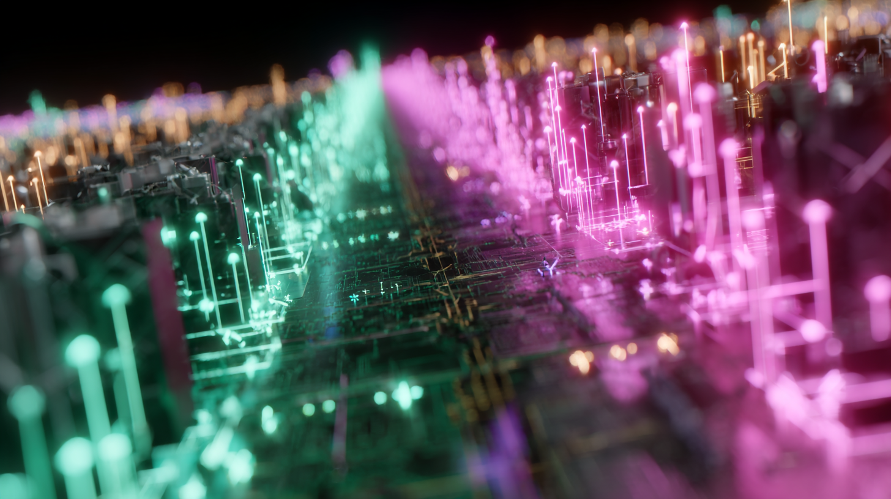

# Chapter 3 · Vectors — From "Hello, GPU" to First Real Math

> *"One equation, millions of cores — vectors unleash the GPU."*

*(Personal lab notebook - Last verified 2025‑05‑06)*



> **Big‑picture checkpoint**
> Up to this point our kernels have done little more than wave back at us like dutiful ants. Chapter 3 is where those workers finally start moving numbers—still one value per thread, but now performing *real* linear-algebra work. Everything that follows—AXPY, GEMV, GEMM—rests on the mental scaffolding we build here, so linger until it feels second-nature.
> 
> A quick study tip: double down on reading comprehension. If you're new to the C-family, writing CUDA or Metal will feel like swimming upstream unless you can *first* read the code fluently. Remember, about 90 % of professional coding is *reading* other people's work, 5 % is tweaking it, and the last 5 % is writing something brand-new—my own **90-5-5 empirical rule-of-thumb**.

---

## 1 · What a Vector *Really* Is (and Why GPUs Love Them)

Imagine an arrow on graph paper: it has **direction** and **length**. Write that arrow's tip coordinates in square brackets and you own the most compact data unit in scientific computing:

```text
v = [x0, x1, …, xN‑1]
```

Adding two arrows? Place them head‑to‑tail; the algebra says

```text
w = u + v   ⟹   w[i] = u[i] + v[i]   for every i
```

Exactly one arithmetic operation per element, no dependencies between elements—**embarrassingly parallel**, the GPU's favorite snack.  Hold on to that: every future chapter merely stacks or re‑shapes these component‑wise moves.

Focus on component-wise (or element-wise) operations: that's the key mental model when dealing with vectors, or even with matrices and tensors, albeit with more dimensions and quirks.  

---

## 2 · One CPU Baseline Everyone Understands

Python's high-level elegance makes vector addition feel effortless—perfect for rapid experiments—but it also masks the memory traffic that ultimately controls performance. Once throughput matters, cache lines and copy overhead become the real bottlenecks. The standard playbook is therefore: sketch in Python, then migrate the hot paths to C/C++, CUDA, or Metal.

```python
import numpy as np, psutil, os
N = 10_000_000

a = np.random.rand(N).astype(np.float32)
b = np.random.rand(N).astype(np.float32)

c = a + b                                 # Vector add

print("Theoretical bytes: ", 3*N*a.itemsize)
print("NumPy actually holds: ", a.nbytes+b.nbytes+c.nbytes)
print("Process RSS: ", psutil.Process(os.getpid()).memory_info().rss)

np.testing.assert_allclose(c, a+b)
```

```bash
$ python vectors_in_python.py 
Theoretical bytes:  120000000
NumPy actually holds:  120000000
Process RSS:  201687040
```

Those three seemingly innocent Python statements hide a treasure-trove of GPU-relevant lessons:

1. **`itemsize` → Memory Math**  
   `a.itemsize` is the **exact byte width of one element** (4 bytes for `float32`).  
   • Total payload: `3 * N * a.itemsize` — one read each for A and B, one write for C.  
   • On a PCIe 4.0 x16 link (~32 GB/s each way) even this "toy" vector would take **≈3.8 ms** one-way—**≈7.5 ms round-trip**—just to cross the bus, *before* any arithmetic.  
   • Burn this reflex into your muscle memory: *data-size × element-width = traffic*, because every GPU optimization you'll ever do begins with this back-of-the-napkin computation.

2. **Resident-Set vs. Raw Array Bytes**  
   `rss` (Resident Set Size) comes from the OS and includes:  
   • The contiguous NumPy buffers (`a.nbytes + b.nbytes + c.nbytes`).  
   • Extra arena pages, Python object headers, and allocator bookkeeping.  
   • Potential page-fault slack space the kernel grabbed for you.  
   The gap you observe (~81 MB above the theoretical 120 MB on many systems) is a live reminder that **"allocated" isn't "touched," and "touched" isn't "cached."** When you migrate to CUDA or Metal you'll feel these hidden bytes as host-device copy overhead and page-lock latencies.

3. **`assert_allclose` → Portable Sanity Check**  
   This NumPy helper becomes our **ground-truth oracle**. We'll rerun it after every CUDA or Metal kernel launch to guarantee bit-for-bit (or at least ULP-level) agreement with the CPU reference. If the assertion ever fails, you immediately know the bug lives in your GPU path—not in your math. Think of it as the cheapest, fastest unit test you can write for numerical code.

---

## 3 · GPU Workflow—Nine Best‑Practice Steps You'll Repeat Forever

The journey from host memory to verified result (and back) never changes.  Memorize this flow; GEMM won't add new boxes—only bigger ones.

|  Step  |  What You Do                  |  Why It Matters                                                   |  CUDA Call(s)                 |  Metal Call(s)                             |
| ------ | ------------------------------ | ------------------------------------------------------------------ | ------------------------------ | ------------------------------------------- |
|  1     | **Allocate host memory**       | Own the data on CPU; size math starts here.                        | `malloc`, `new`, `std::vector` | Swift `Array`, `UnsafeMutablePointer`       |
|  2     | **Initialize vectors**         | Deterministic patterns ease validation.                            | `for` loop, RNG                | same                                        |
|  3     | **Allocate device memory**     | Separate address space → first real GPU call.                      | `cudaMalloc`                   | `device.makeBuffer`                         |
|  4     | **Copy Host → Device**         | PCIe / fabric wall; biggest hidden cost.                           | `cudaMemcpyAsync`              | `memcpy` into buffer, or `blitEncoder.copy` |
|  5     | **Define kernel / shader**     | One thread per element; keep it trivial.                           | `__global__ void`              | `kernel void`                               |
|  6     | **Launch the kernel**          | Map math size to `<<<blocks,threads>>>` or `dispatchThreadgroups`. | `<<<B,T>>>`                    | `dispatchThreadgroups`                      |
|  7     | **Copy Device → Host**         | Bring result home for verification.                                | `cudaMemcpyAsync` back         | `blitEncoder.copy`                          |
|  8     | **Validate results**           | Diff vs. CPU baseline; assert or checksum.                         | host loop / thrust             | Swift loop / Accelerate                     |
|  9     | **Garbage‑collect both sides** | No leaks; crucial once buffers scale.                              | `cudaFree` + `free`            | `buffer = nil` + `free`                     |

> **Mnemonic:** *A‑I‑O‑K‑L‑L‑O‑V‑G* → **A**llocate, **I**nitialize, h‑**O**st→device, **K**ernel, **L**aunch, device→**L**ocal, **O**bserve, **V**erify, **G**arbage. Nah, don't memorize it. Won't stick. Just get familiar with the steps.  

These nine checkpoints appear verbatim in the examples.  Even when we chunk memory or chain multiple kernels, each chunk re‑enters at step 3 and exits at step 9.

---

## 4 · A Real-World Demo — CUDA Vector Addition

Time to move from toy snippets to a self-contained CUDA example. Vector addition is still "Hello, GPU," but it's the micro-pattern you'll encounter inside convolutions, attention blocks, and countless kernels. Use this walkthrough as reading practice: focus on what each call does, how data flows, and why the API choices matter. You'll be reading/writing heavier code soon enough; first, make sure you can trace every byte and thread in this classic starter.


[vector_add_cuda.cu](examples/vector_add_cuda.cu)
```cpp
#include <cuda_runtime.h>
#include <cstdio>
#include <cstdlib>
#include <cinttypes>
#include <chrono>
#include <iostream>
#include <iomanip>
#include <numeric>   // std::accumulate fallback if needed
#include <cmath>     // fabsf

// -----------------------------------------------------------------------------
// (5) Define kernel — K = "Kernel" (element-wise C = A + B)
__global__ void vectorAdd(const float* __restrict__ A,
                          const float* __restrict__ B,
                          float*       __restrict__ C,
                          size_t N)
{
    size_t idx = blockIdx.x * blockDim.x + threadIdx.x;
    if (idx < N)
        C[idx] = A[idx] + B[idx];
}

// -----------------------------------------------------------------------------
static std::string humanBytes(size_t bytes)
{
    char buf[64];
    double gib = static_cast<double>(bytes) / (1ULL << 30);
    snprintf(buf, sizeof(buf), "%.2f GiB", gib);
    return {buf};
}

// -----------------------------------------------------------------------------
static int run_capacity_report()
{
    int dev = 0; cudaDeviceProp prop; cudaGetDeviceProperties(&prop, dev);
    int driverVer = 0, runtimeVer = 0;
    cudaDriverGetVersion(&driverVer); cudaRuntimeGetVersion(&runtimeVer);

    size_t freeB = 0, totalB = 0; cudaMemGetInfo(&freeB, &totalB);

    constexpr int kBuffers = 3; constexpr size_t kEltBytes = sizeof(float);
    size_t safeBytes = static_cast<size_t>(freeB * 0.90);
    size_t Nmax = safeBytes / (kBuffers * kEltBytes);

    const int threadsPerBlock = 256;
    size_t blocks = (Nmax + threadsPerBlock - 1) / threadsPerBlock;

    std::cout << "\n=== GPU Capacity Report ===\n"
              << "GPU model              : " << prop.name << "\n"
              << "CUDA driver/runtime    : " << driverVer/1000 << '.' << (driverVer%100)
              << " / " << runtimeVer/1000 << '.' << (runtimeVer%100) << "\n"
              << "Total VRAM             : " << humanBytes(totalB) << "\n"
              << "Free VRAM (runtime)    : " << humanBytes(freeB)  << "\n"
              << "Element type           : float32 (4 bytes)\n"
              << "Resident buffers       : " << kBuffers << "\n"
              << "Safe usable bytes      : " << humanBytes(safeBytes) << " (90 % of free)\n"
              << "Max vector length (N)  : " << Nmax << " elements\n"
              << "Suggested launch shape : " << blocks << " blocks × " << threadsPerBlock << " threads\n"
              << "===========================\n\n";
    return 0;
}

// -----------------------------------------------------------------------------
static int run_vector_add(long long start, long long end)
{
    if (end < start) { std::cerr << "Error: END must be ≥ START\n"; return 1; }
    size_t N = static_cast<size_t>(end - start + 1);
    size_t bytes = N * sizeof(float);
    std::cout << "Creating vector with " << N << " elements (" << humanBytes(bytes) << " per buffer)\n";

    // (1) Allocate host memory — A
    float *h_A = static_cast<float*>(malloc(bytes));
    float *h_B = static_cast<float*>(malloc(bytes));
    float *h_C = static_cast<float*>(malloc(bytes));
    if (!h_A || !h_B || !h_C) { std::cerr << "Host malloc failed\n"; return 1; }

    // (2) Initialize vectors — I
    for (size_t i = 0; i < N; ++i) {
        float v = static_cast<float>(start + i);
        h_A[i] = v; h_B[i] = v;
    }

    // (3) Allocate device memory — O (first half)
    float *d_A=nullptr,*d_B=nullptr,*d_C=nullptr;
    cudaMalloc(&d_A, bytes); cudaMalloc(&d_B, bytes); cudaMalloc(&d_C, bytes);

    // (4) Copy Host → Device — O (second half)
    cudaMemcpy(d_A, h_A, bytes, cudaMemcpyHostToDevice);
    cudaMemcpy(d_B, h_B, bytes, cudaMemcpyHostToDevice);

    // (6) Launch the kernel — L
    const int threadsPerBlock = 256;
    int blocks = static_cast<int>((N + threadsPerBlock - 1) / threadsPerBlock);
    auto t0 = std::chrono::high_resolution_clock::now();
    vectorAdd<<<blocks, threadsPerBlock>>>(d_A, d_B, d_C, N);
    cudaDeviceSynchronize();
    auto t1 = std::chrono::high_resolution_clock::now();

    // (7) Copy Device → Host — L (device→Local)
    cudaMemcpy(h_C, d_C, bytes, cudaMemcpyDeviceToHost);

    // (8) Validate results — O (Observe / Verify)
    constexpr float kEps = 1e-4f;                    // tolerance for float32
    bool ok = true; double sum = 0.0;
    for (size_t i = 0; i < N; ++i) {
        float expected = 2.0f * h_A[i];
        if (fabsf(h_C[i] - expected) > kEps) {       // tolerant compare
            ok = false; break;
        }
        sum += h_C[i];
    }

    // Expected sum formula: 2 * (start+end) * N / 2 = (start+end)*N
    double expectedSum = static_cast<double>(start + end) * static_cast<double>(N);

    // Timing & bandwidth
    double ms = std::chrono::duration<double, std::milli>(t1 - t0).count();
    double gbMoved = (3.0 * bytes) / (1ULL << 30);
    double gbps = gbMoved / (ms / 1000.0);

    std::cout << (ok ? "Verification passed ✓" : "Verification FAILED ✗") << '\n';
    std::cout << std::fixed << std::setprecision(2);
    std::cout << "Kernel time            : " << ms  << " ms\n";
    std::cout << "Effective bandwidth    : " << gbps << " GiB/s\n";
    std::cout << std::setprecision(0);
    std::cout << "Sum of result elements : " << sum << " (expected " << expectedSum << ")\n";

    // (9) Garbage-collect both sides — G
    cudaFree(d_A); cudaFree(d_B); cudaFree(d_C);
    free(h_A); free(h_B); free(h_C);
    return ok ? 0 : 1;
}

// -----------------------------------------------------------------------------
int main(int argc, char** argv)
{
    if (argc == 1) return run_capacity_report();
    if (argc == 3) return run_vector_add(std::atoll(argv[1]), std::atoll(argv[2]));
    std::cout << "Usage: " << argv[0] << " [<START> <END>]\n       (no args → capacity report)\n";
    return 0;
}
```

We deliberately wrote this example in modern C++ (C++17). Treat it as a gentle first plunge into the real world, where GPU codebases routinely mix plain C and C++.

Build and run it two ways:

```bash
$ mkdir -p build
$ nvcc -std=c++17 -arch=sm_89 vector_add_cuda.cu -o build/vector_add_cuda
$ ./build/vector_add_cuda
$ ./build/vector_add_cuda 1 1024
```

|  Command             |  What Happens                                                                                                                                                  |
| --------------------- | --------------------------------------------------------------------------------------------------------------------------------------------------------------- |
| `./vector_add_cuda`        | Prints a **capacity report**: GPU model, free VRAM, safe maximum vector length, and a launch shape that saturates the card without paging.                      |
| `./vector_add_cuda 1 1024` | Allocates a 1024-element vector containing the integers 1…1024, copies it to the GPU, performs `C = A + A`, copies back, verifies, and reports effective GiB/s. |

The code explicitly walks the nine steps above—look for the numbered comments.

On my RTX4090, the capacity report is: 

```bash
=== GPU Capacity Report ===
GPU model              : NVIDIA GeForce RTX 4090
CUDA driver/runtime    : 12.90 / 12.90
Total VRAM             : 23.99 GiB
Free VRAM (runtime)    : 22.46 GiB
Element type           : float32 (4 bytes)
Resident buffers       : 3
Safe usable bytes      : 20.21 GiB (90 % of free)
Max vector length (N)  : 1808321740 elements
Suggested launch shape : 7063757 blocks × 256 threads
===========================
```

And the result of the vector add:

```bash
build/vector_add_cuda 1 1024
Creating vector with 1024 elements (0.00 GiB per buffer)
Verification passed ✓
Kernel time            : 0.56 ms
Effective bandwidth    : 0.02 GiB/s
Sum of result elements : 1049600 (expected 1049600)
```

---

## 5 · Operator Variations — One Kernel, Four Personalities

All four arithmetic personalities share a single kernel:

Why consolidate? Because the **only** thing that varies is the arithmetic
opcode. Everything else—memory traffic, launch geometry, verification, and
timing—stays the same. Cloning the file four times would merely bloat the
repo and your mental stack.

The crib sheet below highlights the exact line that changes. 

### Subtraction  `C[i] = A[i] − B[i]`
* **Code diff:** `+` → `-`
* **Latency / throughput:** Same as addition on every major GPU architecture.
* **Numerical note:** Subtraction is not associative; rounding error can grow in later reductions, but for point-wise ops it's a non-issue.

### Multiplication  `C[i] = A[i] × B[i]`
* **Code diff:** `+` → `*`
* **Hardware detail:** Modern GPUs execute multiplication on the *same* fused multiply-add (FMA) pipelines that handle addition, so raw throughput often matches the `+` / `-` path.
* **FMA footnote:** When the compiler spots a pattern like `α * A[i] + B[i]` it can fold both ops into a single `fma()`—one instruction, one rounding, half the latency.

### Division  `C[i] = A[i] ÷ B[i]`
* **Code diff:** `+` → `/`
* **Latency / throughput:** Division units are scarcer; expect roughly 5–10× the latency of add/mul on most architectures. For very large vectors, however, the kernel often remains memory-bound, so wall-clock impact is muted.
* **Numerical caution:** Guard against `B[i] == 0`—raw division will return `inf` or `nan`. *FTZ note:* some older GPUs flush **subnormal** divisors to zero (IEEE-754 "flush-to-zero"), which can surprise you with unexpected `inf`s.

> **Takeaway:** Keep one parameterized kernel and flip the opcode at launch
> time. Save your cognitive budget for memory layouts, occupancy, and
> synchronization—the places where 100× wins live.

[`vector_arithmetic_cuda.cu`](examples/vector_arithmetic_cuda.cu)

```cpp
#include <cuda_runtime.h>
#include <cstdio>
#include <cstdlib>
#include <cinttypes>
#include <chrono>
#include <iostream>
#include <iomanip>
#include <string>

enum class Op : int { Add=0, Sub=1, Mul=2, Div=3 };

__global__ void vectorArithmetic(const float* __restrict__ A,
                                 const float* __restrict__ B,
                                 float*       __restrict__ C,
                                 size_t N, Op op)
{
    size_t idx = blockIdx.x * blockDim.x + threadIdx.x;
    if (idx >= N) return;

    switch (op) {
        case Op::Add: C[idx] = A[idx] + B[idx]; break;
        case Op::Sub: C[idx] = A[idx] - B[idx]; break;
        case Op::Mul: C[idx] = A[idx] * B[idx]; break;
        case Op::Div: C[idx] = A[idx] / B[idx]; break; // B guaranteed non-zero
    }
}

static void usage(const char* prog) {
    std::cout << "Usage: " << prog << " <add|sub|mul|div> <START> <END>\n";
}

static Op parseOp(const std::string& s) {
    if (s=="add") return Op::Add;
    if (s=="sub") return Op::Sub;
    if (s=="mul") return Op::Mul;
    if (s=="div") return Op::Div;
    throw std::invalid_argument("Unknown op");
}

int main(int argc, char** argv)
{
    if (argc != 4) { usage(argv[0]); return 0; }

    Op op;
    try { op = parseOp(argv[1]); }
    catch(...) { usage(argv[0]); return 1; }

    long long start = std::atoll(argv[2]);
    long long end   = std::atoll(argv[3]);
    if (end < start) { std::cerr << "END must be ≥ START\n"; return 1; }

    size_t N     = static_cast<size_t>(end - start + 1);
    size_t bytes = N * sizeof(float);
    std::cout << "Vector length: " << N << " (\"" << argv[1] << "\" op)\n";

    // (1) Allocate host memory — A
    float *h_A=(float*)malloc(bytes), *h_B=(float*)malloc(bytes), *h_C=(float*)malloc(bytes);
    if(!h_A||!h_B||!h_C){ std::cerr<<"Host malloc failed\n"; return 1; }

    // (2) Initialize vectors — I
    // Fill A ascending, B descending (avoid div-by-zero)
    for(size_t i=0;i<N;++i){
        h_A[i] = static_cast<float>(start + i);
        h_B[i] = static_cast<float>(end   - i);
        if(op==Op::Div && h_B[i]==0.0f) h_B[i]=1.0f; // safeguard
    }

    // (3) Allocate device memory — O (first half)
    float *d_A=nullptr,*d_B=nullptr,*d_C=nullptr;
    cudaMalloc(&d_A,bytes); cudaMalloc(&d_B,bytes); cudaMalloc(&d_C,bytes);

    // (4) Copy Host → Device — O (second half)
    cudaMemcpy(d_A,h_A,bytes,cudaMemcpyHostToDevice);
    cudaMemcpy(d_B,h_B,bytes,cudaMemcpyHostToDevice);

    // (6) Launch the kernel — L
    const int TPB=256; int blocks=(N+TPB-1)/TPB;
    auto t0=std::chrono::high_resolution_clock::now();
    vectorArithmetic<<<blocks,TPB>>>(d_A,d_B,d_C,N,op);
    cudaDeviceSynchronize();
    auto t1=std::chrono::high_resolution_clock::now();

    // (7) Copy Device → Host — L (device→Local)
    cudaMemcpy(h_C,d_C,bytes,cudaMemcpyDeviceToHost);

    // (8) Validate results — O (Observe / Verify)
    bool ok=true; double checksum=0.0;
    for(size_t i=0;i<N;++i){
        float expected;
        switch(op){
            case Op::Add: expected=h_A[i]+h_B[i]; break;
            case Op::Sub: expected=h_A[i]-h_B[i]; break;
            case Op::Mul: expected=h_A[i]*h_B[i]; break;
            case Op::Div: expected=h_A[i]/h_B[i]; break;
        }
        let eps: Float = 1e-4
        if(h_C[i]!=expected){ ok=false; break; }
        checksum+=h_C[i];
    }

    // Show first 8 elements for human glance
    std::cout << "A[:8]   = "; for(int i=0;i<8&&i<N;++i) std::cout<<h_A[i]<<" "; std::cout<<"...\n";
    std::cout << "B[:8]   = "; for(int i=0;i<8&&i<N;++i) std::cout<<h_B[i]<<" "; std::cout<<"...\n";
    std::cout << "C[:8]   = "; for(int i=0;i<8&&i<N;++i) std::cout<<h_C[i]<<" "; std::cout<<"...\n";
    std::cout << std::fixed << std::setprecision(0);
    std::cout << "Checksum = " << checksum << "\n";
    std::cout.unsetf(std::ios::fixed);

    // (9) Garbage-collect both sides — G
    cudaFree(d_A); cudaFree(d_B); cudaFree(d_C);
    free(h_A); free(h_B); free(h_C);

    // Timing
    double ms=std::chrono::duration<double,std::milli>(t1-t0).count();

    std::cout << (ok?"Verification ✓":"Verification ✗") << "  |  " << std::fixed << std::setprecision(2)
              << ms << " ms\n";

    return ok?0:1;
}
```

Build:

```bash
$ nvcc -std=c++17 -arch=sm_89 vector_arithmetic_cuda.cu -o build/vector_arithmetic_cuda
```

Run:

```bash
$ build/vector_arithmetic_cuda add 1 10
```

And the results are:

```bash
$ build/vector_arithmetic_cuda
Usage: ./build/vector_arithmetic_cuda <add|sub|mul|div> <START> <END>

$ ./build/vector_arithmetic_cuda add 1 10
Vector length: 10 ("add" op)
A[:8]   = 1 2 3 4 5 6 7 8 ...
B[:8]   = 10 9 8 7 6 5 4 3 ...
C[:8]   = 11 11 11 11 11 11 11 11 ...
Checksum = 110
Verification ✓  |  0.54 ms

$ ./build/vector_arithmetic_cuda sub 1 10
Vector length: 10 ("sub" op)
A[:8]   = 1 2 3 4 5 6 7 8 ...
B[:8]   = 10 9 8 7 6 5 4 3 ...
C[:8]   = -9 -7 -5 -3 -1 1 3 5 ...
Checksum = 0
Verification ✓  |  0.51 ms

$ ./build/vector_arithmetic_cuda mul 1 10
Vector length: 10 ("mul" op)
A[:8]   = 1 2 3 4 5 6 7 8 ...
B[:8]   = 10 9 8 7 6 5 4 3 ...
C[:8]   = 10 18 24 28 30 30 28 24 ...
Checksum = 220
Verification ✓  |  0.53 ms

$ ./build/vector_arithmetic_cuda div 1 10
Vector length: 10 ("div" op)
A[:8]   = 1 2 3 4 5 6 7 8 ...
B[:8]   = 10 9 8 7 6 5 4 3 ...
C[:8]   = 0.1 0.222222 0.375 0.571429 0.833333 1.2 1.75 2.66667 ...
Checksum = 22
Verification ✓  |  0.52 ms
```

Picture running this with the range `1 1000000000` on the CPU. Even with a beginner-level sense of CPU-versus-GPU throughput, you can predict it would grind for ages on the host.

---

## 6 · When the Vector *Doesn't* Fit (or Barely Does)

Even GPUs with generous VRAM eventually meet a vector that pushes them into one of three pain zones.  

Let's spell out what each zone **looks like**, **why it happens**, and **how you escape**.

| Zone / Scenario                              | What Actually Happens at Runtime                                           | The Symptom You Observe                              | Practical Escape Hatch (*will be demoed*) |
|----------------------------------------------|----------------------------------------------------------------------------|-------------------------------------------------------|-------------------------------------------|
| **Green :"Fits in VRAM"**                    | Allocation succeeds, data remains resident, kernel streams at full speed.  | Near–peak memory bandwidth & compute throughput.      | No action needed. Enjoy the speed.        |
| **Yellow :"UVM Paging / Overcommit"**        | Unified Memory driver begins migrating pages host⇄device every kernel launch. | 10×–50× slowdown, fan spin-up, GPU utilization saw-tooths. | `--chunk <MB>` to process the vector in bite-sized tiles. |
| **Red :"Hard Alloc Fail"**                   | `cudaMalloc` (or Metal `makeBuffer`) returns *nil* immediately.             | Program aborts on day-zero hardware or after VRAM attrition. | Slice-and-stream loop that allocates one tile at a time. |
| **Crimson :"Kernel-Grid Limit Hit"**         | You squeak past allocation, but `gridDim.x` would exceed 2³¹⁻¹ blocks.      | Launch error *invalid configuration argument*.        | Add an outer loop that advances a base index per launch. |
| **Purple :"Datatype Too Big"**               | You silently doubled memory by switching `float → double`.                 | All three issues above occur *sooner*.                | Pass `--dtype f32` for safety or experiment with **`--dtype f16`** later when we introduce mixed-precision tricks. |


### 6.1 · The point of *no-arg* mode

A bare call to

```bash
$ ./build/vector_add_cuda
```

runs a lightning-fast VRAM probe *before* any buffers are touched.  
It prints a safety-first **`N_max`** (90 % of the current free VRAM ÷ 3 buffers) so your initial launch lands firmly in the **Green Zone**. Armed with that baseline, you can then *deliberately* tiptoe into Yellow, Red, or Crimson territory and let the CLI flags bail you out.


#### 6.1.1 · On my RTX4090

```bash
$ ./build/vector_add_cuda

=== GPU Capacity Report ===
GPU model              : NVIDIA GeForce RTX 4090
CUDA driver/runtime    : 12.90 / 12.90
Total VRAM             : 23.99 GiB
Free VRAM (runtime)    : 22.46 GiB
Element type           : float32 (4 bytes)
Resident buffers       : 3
Safe usable bytes      : 20.21 GiB (90 % of free)        # ≈5 GiB head-room keeps you in the Green Zone
Max vector length (N)  : 1 808 321 740 elements          # ~1.8 B floats fits comfortably in VRAM
Suggested launch shape : 7 063 757 blocks × 256 threads  # Launch grid that saturates all SMs
===========================
```

Quick interpretation →
  • Stick below N ≈ 1.8 B to avoid paging; that's three 20 GiB buffers resident at once.  
  • The suggested grid shape (7 M × 256) fills the GPU without tripping the 2³¹⁻¹ block limit.  
  • Net result: pure Green Zone performance—full bandwidth, no driver migration penalties.

#### 6.1.2 · On my M3 Ultra

```bash
$ ./build/vector_add_cuda build/vector_add_cuda.metallib 
=== GPU Capacity Report ===
GPU model              : Apple M3 Ultra
Recommended working set: 464.00 GiB
Current allocated      : 0.00 GiB
Free estimate          : 464.00 GiB
Element type           : float32 (4 bytes)
Resident buffers       : 3
Safe usable bytes      : 371.20 GiB  (80 % of est. free)
Max vector length (N)  : 33 214 382 080
Launch suggestion      : 129 743 680 groups × 256 threads
===========================
```

Quick interpretation →
  • Anything under N ≈ 33 B floats (~371 GiB across three buffers) stays firmly in the Green Zone—no paging, full bandwidth.  
  • The launch grid (≈ 129 M × 256) saturates M3 Ultra's shader engines without tripping Metal's dispatch limits.  
  • Unified memory means the "VRAM" and system RAM are one pool; close memory-hungry apps before you push toward the 464 GiB ceiling.  

---

### 6.2 · For Python-First Folks: C-Style Memory and AI, a Personal Field Note

If you grew up in Python-land—safe inside its garbage-collected embrace—C-style memory management can look medieval. Manually juggling buffers is the toll you pay for raw speed and total control.

Back in the day, the very word *pointer* made my palms sweat. One uninitialized address and **boom**: a seg-fault, a memory leak, or a night spelunking through a hex dump. In OO terms, it's as if every object forgot its own destructor and asked you to free it by hand.

Even now, I reach for Python unless performance is non-negotiable. The hours you save in debugging often outweigh the milliseconds you surrender. We once wrote whole modules in assembly to shave cycles—and nobody's eager to relive that era.

AI work today feels like game dev in the '90s: hardware still trails ambition, so C-grade optimizations matter. Case in point: I once hand-rolled a Hangul automata in assembly to render Korean text faster. A proper standard eventually made that hack obsolete, and I happily retired my assembler.

**Moral of the story:** use the tools your era hands you. Abstraction keeps climbing; tomorrow's devs will chuckle at today's "low-level" heroics. Until then, sharpen your C-reading skills—that's the whole point of this mini-series in the repo: CUDA/Metal Primer.

> *Here's a wild trivia nugget:* a certain Korean politician once hand-coded an antivirus—start to finish—in bare-metal 8086 assembly on MS-DOS, then open-sourced the whole thing. He parlayed that tour-de-force into a company that shipped digital "vaccines," and now he's sparring over policy instead of opcodes. Talk about pivoting from bit-level wizardry to parliamentary crossfire. Honestly, I wouldn't trade places with him; feels like a world-class hacker brain stuck in a suit. 영희 생각은 어떨지?

---

## 7 · How People *Actually* Write CUDA in 2025

GPU code you meet in the wild looks nothing like the pristine "single-file demo" in most blogs. Here's the field guide:

* **Modern C++ everywhere** — Most host projects have jumped to C++20 (sprinkles of C++23). You'll see `std::span`, ranges, concepts, and compile-time tricks (`constexpr`, TMP) to auto-generate dozens of kernel variants. Device code is still a "C with extensions" subset, but the host side feels like any other modern C++ app.

* **RAII wraps raw CUDA** — Nobody writes `cudaMalloc` / `cudaFree` in naked pairs anymore. Expect `std::unique_ptr<T, CudaDeleter>`, custom arenas, or libraries like Thrust & CUB that hide lifetimes behind RAII. Error handling funnels through `CHECK_CUDA(err)` macros or `std::expected`.

* **`printf` debugging survives** — Yes, it stalls warps, but nothing beats a quick `printf("gid=%d, x=%f\n", gid, x)` when the clock is ticking. Serious runs flip a compile-time flag to route logs through CUPTI, Nsight, or a host-side ring buffer.

* **Mixed host I/O styles** — `fmt::print`, `std::cout`, and `printf` coexist. Demos often interleave styles because that's reality in large codebases that evolved over a decade.

* **Streams, events & graphs are table stakes** — Single-stream examples are tutorial fodder. Production kernels launch through CUDA Graphs, pipelined across multiple streams, with events syncing host callbacks.

* **Unified vs. explicit memory** — Unified ("managed") memory is popular for quick prototypes. Production leans on pinned host buffers and explicit `cudaMemcpyAsync` to squeeze bandwidth, but will fall back to UM on platforms with shared memory (e.g., Grace Hopper).

* **Build systems are CMake + fatbins** — A typical `CMakeLists.txt` emits fat binaries for `sm_80`, `sm_86`, `sm_90`, gated behind `--generate-code arch,code`. Some teams layer Bazel or Meson on top, but CMake still rules.

* **Cross-platform hedging** — Larger orgs keep HIP or SYCL back ends in a separate folder, toggled by compile-time macros. "Write once, deprecate never" is the survival motto.

* **Metal + Swift parity** — On Apple silicon, Metal kernels inherit C++11 features automatically. Swift hosts contribute ARC for free lifetime management, but you still dance the same nine steps:  
  1. Allocate host buffers (A)  
  2. Initialize (I)  
  3. Allocate device buffers (O)  
  4. Copy host→device (O)  
  5. Launch kernel (L)  
  6. Sync/observe (L)  
  7. Copy device→host (L)  
  8. Verify (O)  
  9. Garbage-collect (G)

Different toolchains, identical choreography. Master the pattern once and you can switch between NVIDIA + C++ and Metal + Swift without missing a beat.

---

## 8 · How to *Actually* Navigate Code in 2025

Think of a state-of-the-art LLM as the ultimate rubber duck: it never sleeps, never rolls its eyes, and has memorized every Stack Overflow thread you've ever googled. Use it.

But—big caveat—don't outsource your entire cortex. If you can't trace the data flow yourself, the model's answers will sound like wizardry instead of guidance. Pair-programming works only when both partners share a mental map of the codebase.

A field-tested rhythm:

1. **Quick solo pass** — Skim the file, note the hot spots (`cudaMalloc`, `dispatchThreadgroups`, suspicious pointer math).
2. **Interrogate the model** — Ask for edge-cases, gotchas, or alternative patterns you might have missed.
3. **Cross-check** — Compile the snippet, run the unit test, read the disassembly if numbers still look fishy.
4. **Iterate** — Feed the new evidence back into the conversation. Rinse, repeat.

Treat the LLM's emergent quirks like an exotic compiler: respect the power, verify the output. Hand-in-glove collaboration, not black-box divination—that's how you stay out of the rabbit holes and keep shipping.

Remember: software 2.0 thinks in tensors, not call stacks. Approach those emergent behaviors with the same curiosity you'd grant any groundbreaking tool. They're treasure, not trivia, if you know how to wield them.

In short, be the AI's well-informed, reliable partner—treat it as a collaborative colleague, not a faceless black-box.

---

## 9 · Metal Translation

Mastering the CUDA version gives you roughly 90 % of the mental model you need for Metal. Slip on your object-oriented glasses and the source reads like an illustrated children's book.

As usual, we begin on the device side: the kernel comes first.

[vector_add_metal.metal](examples/vector_add_metal.metal)
```cpp
#include <metal_stdlib>
using namespace metal;

/*  (5) Define kernel — K = "Kernel"  ---------------------------
    vector_add(A,B) → C : C[gid] = A[gid] + B[gid]
    Buffer indices (match Swift host):
        0 = A, 1 = B, 2 = C, 3 = N (uint)
------------------------------------------------------------------------- */
kernel void vector_add(const device float *A [[buffer(0)]],
                       const device float *B [[buffer(1)]],
                       device       float *C [[buffer(2)]],
                       constant     uint  &N [[buffer(3)]],
                       uint gid [[thread_position_in_grid]])
{
    if (gid < N) C[gid] = A[gid] + B[gid];
}

```

Then the host code is straightforward.

[vector_add.swift](examples/vector_add.swift)
```swift
import Foundation
import Metal

// ── Helpers ─────────────────────────────────────────────────────────────
func human(_ bytes: UInt64) -> String {
    String(format: "%.2f GiB", Double(bytes) / Double(1 << 30))
}
func check(_ cond: Bool, _ msg: String) { if !cond { fatalError(msg) } }

// ── CLI parsing ─────────────────────────────────────────────────────────
let args = CommandLine.arguments
guard args.count == 2 || args.count == 4 else {
    print("Usage: \(args[0]) <lib.metallib> [<START> <END>]"); exit(1)
}
let libURL = URL(fileURLWithPath: args[1])

// ── Metal setup ─────────────────────────────────────────────────────────
let dev  = MTLCreateSystemDefaultDevice()!
let q    = dev.makeCommandQueue()!
let lib  = try dev.makeLibrary(URL: libURL)
let fn   = lib.makeFunction(name: "vector_add")!
let pso  = try dev.makeComputePipelineState(function: fn)

// ── Capacity-report mode ────────────────────────────────────────────────
if args.count == 2 {
    let maxWS: UInt64 = dev.recommendedMaxWorkingSetSize          // UInt64
    let used  = UInt64(dev.currentAllocatedSize)                  // cast Int → UInt64
    let free  = maxWS > used ? maxWS - used : 0
    let safe  = UInt64(Double(free) * 0.80)                       // 80 % head-room
    let elt   = UInt64(MemoryLayout<Float>.size)
    let nMax  = safe / (3 * elt)                                  // 3 buffers in flight

    let tpb   = 256
    let tgs   = (nMax + UInt64(tpb) - 1) / UInt64(tpb)

    print("""
          \n=== GPU Capacity Report ===
          GPU model              : \(dev.name)
          Recommended working set: \(human(maxWS))
          Current allocated      : \(human(used))
          Free estimate          : \(human(free))
          Element type           : float32 (4 bytes)
          Resident buffers       : 3
          Safe usable bytes      : \(human(safe))  (80 % of est. free)
          Max vector length (N)  : \(nMax)
          Launch suggestion      : \(tgs) groups × \(tpb) threads
          ===========================\n
          """)
    exit(0)
}

// ── Vector-add mode ────────────────────────────────────────────────────
let start = UInt64(args[2])!
let end   = UInt64(args[3])!
check(end >= start, "END must be ≥ START")

let N      = Int(end - start + 1)
let bytes  = N * MemoryLayout<Float>.size
print("Creating vector with \(N) elements (\(human(UInt64(bytes))) per buffer)")

// (1) Allocate host memory — A
// Host buffers
var hA = (0..<N).map { Float(start + UInt64($0)) }
// (2) Initialize vectors — I  (hA already filled; hB identical)
var hB = hA                                             // identical
var hC = [Float](repeating: 0, count: N)

// (3) Allocate device memory & (4) Copy Host → Device — O
// Device buffers
let dA = dev.makeBuffer(bytes: &hA, length: bytes)!
let dB = dev.makeBuffer(bytes: &hB, length: bytes)!
let dC = dev.makeBuffer(length: bytes)!
var n32 = UInt32(N)
let dN  = dev.makeBuffer(bytes: &n32, length: MemoryLayout<UInt32>.size)!

// (5) Kernel defined in Metal shader (vector_add_metal.metal)

// (6) Launch the kernel — L
// Encode
let cmd = q.makeCommandBuffer()!
let enc = cmd.makeComputeCommandEncoder()!
enc.setComputePipelineState(pso)
enc.setBuffer(dA, offset: 0, index: 0)
enc.setBuffer(dB, offset: 0, index: 1)
enc.setBuffer(dC, offset: 0, index: 2)
enc.setBuffer(dN, offset: 0, index: 3)

let tpb = MTLSize(width: 256, height: 1, depth: 1)
let tgs = MTLSize(width: (N + 255) / 256, height: 1, depth: 1)
let t0  = Date()
enc.dispatchThreadgroups(tgs, threadsPerThreadgroup: tpb)
enc.endEncoding()
cmd.commit(); cmd.waitUntilCompleted()
let ms  = Date().timeIntervalSince(t0) * 1000

// (7) Copy Device → Host — L (device→Local)
memcpy(&hC, dC.contents(), bytes)

// (8) Validate results — O (Observe / Verify)
var ok  = true; var sum = 0.0
for i in 0..<N {
    let expect = 2 * hA[i]
    if hC[i] != expect { ok = false; break }
    sum += Double(hC[i])
}
let expectedSum = Double(start + end) * Double(N)

// Print summary … (timing, bandwidth) …
// (9) Garbage-collect — G (handled automatically by ARC at scope exit)

print(ok ? "Verification passed ✓" : "Verification FAILED ✗")
print(String(format: "Kernel time            : %.2f ms", ms))
let gbMoved = Double(3 * bytes) / Double(1 << 30)
print(String(format: "Effective bandwidth    : %.2f GiB/s", gbMoved / (ms / 1000)))
print("Sum of result elements : \(Int(sum))  (expected \(Int(expectedSum)))")
```

The same drill with 'vector arithmetic' example. 

[vector_arithmetic_metal.metal](examples/vector_arithmetic_metal.metal) 

```cpp
#include <metal_stdlib>
using namespace metal;

/*  (5) Define kernel — K = "Kernel"  -----------------------------
    vector_arithmetic(A,B,op) → C with op ⟮0=+ 1=− 2=* 3=/⟯
    Buffer indices:
        0 = A, 1 = B, 2 = C, 3 = N (uint), 4 = op (uint)
------------------------------------------------------------------------- */

kernel void vector_arithmetic(const device float *A [[buffer(0)]],
                              const device float *B [[buffer(1)]],
                              device       float *C [[buffer(2)]],
                              constant     uint  &N [[buffer(3)]],
                              constant     uint  &op[[buffer(4)]],
                              uint gid [[thread_position_in_grid]])
{
    if (gid >= N) return;
    switch (op) {
        case 0: C[gid] = A[gid] + B[gid]; break;
        case 1: C[gid] = A[gid] - B[gid]; break;
        case 2: C[gid] = A[gid] * B[gid]; break;
        case 3: C[gid] = A[gid] / B[gid]; break;
    }
}
```

[vector_arithmetic_metal.swift](examples/vector_arithmetic_metal.swift)
```swift
//
//  vector_arithmetic_metal.swift  — Swift 6
//
//  Build:
//      mkdir -p build
//      xcrun -sdk macosx metal -c vector_arithmetic_metal.metal -o build/va_metal.air
//      xcrun -sdk macosx metallib build/va_metal.air -o build/vector_arithmetic_metal.metallib
//      swiftc -O vector_arithmetic_metal.swift -o build/vector_arithmetic_metal -framework Metal
//
//  Run:
//      ./build/vector_arithmetic_metal build/vector_arithmetic_metal.metallib mul 1 10
//

import Foundation
import Metal

// ── CLI parsing ─────────────────────────────────────────────────────────
enum Op: UInt32 { case add = 0, sub = 1, mul = 2, div = 3 }
let opMap: [String: Op] = ["add": .add, "sub": .sub, "mul": .mul, "div": .div]

let a = CommandLine.arguments
guard a.count == 5,
      let op = opMap[a[2]],
      let start = UInt64(a[3]),
      let end   = UInt64(a[4]),
      end >= start else
{
    print("Usage: \(a[0]) <lib.metallib> <add|sub|mul|div> <START> <END>")
    exit(1)
}
let libURL = URL(fileURLWithPath: a[1])

// ── Metal setup ─────────────────────────────────────────────────────────
let dev  = MTLCreateSystemDefaultDevice()!
let queue = dev.makeCommandQueue()!
let lib   = try dev.makeLibrary(URL: libURL)
let fn    = lib.makeFunction(name: "vector_arithmetic")!
let pso   = try dev.makeComputePipelineState(function: fn)

// ── Host & device buffers ───────────────────────────────────────────────
// (1) Allocate host memory — A + (2) Initialize — I
let N     = Int(end - start + 1)
let bytes = N * MemoryLayout<Float>.size

var hA = (0..<N).map { Float(start + UInt64($0)) }
var hB = (0..<N).map { Float(end   - UInt64($0)) }
if op == .div { for i in 0..<N where hB[i] == 0 { hB[i] = 1 } }

// (3) Allocate device memory & (4) Copy Host → Device — O
let dA  = dev.makeBuffer(bytes: &hA, length: bytes)!
let dB  = dev.makeBuffer(bytes: &hB, length: bytes)!
let dC  = dev.makeBuffer(length: bytes)!
var n32 = UInt32(N);   let dN  = dev.makeBuffer(bytes: &n32, length: 4)!
var op32 = op.rawValue; let dOp = dev.makeBuffer(bytes: &op32, length: 4)!

// (5) Kernel defined in Metal shader (vector_arithmetic_metal.metal)

// (6) Launch the kernel — L
// ── Encode & dispatch ───────────────────────────────────────────────────
let cb  = queue.makeCommandBuffer()!
let enc = cb.makeComputeCommandEncoder()!
enc.setComputePipelineState(pso)
enc.setBuffer(dA,  offset: 0, index: 0)
enc.setBuffer(dB,  offset: 0, index: 1)
enc.setBuffer(dC,  offset: 0, index: 2)
enc.setBuffer(dN,  offset: 0, index: 3)
enc.setBuffer(dOp, offset: 0, index: 4)

let threadsPerGroup = MTLSize(width: 256, height: 1, depth: 1)
let numGroups       = MTLSize(width: (N + 255) / 256, height: 1, depth: 1)

let t0 = Date()
enc.dispatchThreadgroups(numGroups, threadsPerThreadgroup: threadsPerGroup)
enc.endEncoding()
cb.commit()
cb.waitUntilCompleted()
let ms = Date().timeIntervalSince(t0) * 1000.0

// (7) Copy Device → Host — L (device→Local)
var hC = [Float](repeating: 0, count: N)
memcpy(&hC, dC.contents(), bytes)

// (8) Validate results — O (Observe / Verify)
let eps: Float = 1e-4
var ok  = true
var checksum = 0.0
for i in 0..<N {
    let expect: Float
    switch op {
        case .add: expect = hA[i] + hB[i]
        case .sub: expect = hA[i] - hB[i]
        case .mul: expect = hA[i] * hB[i]
        case .div: expect = hA[i] / hB[i]
    }
    if abs(hC[i] - expect) > eps { ok = false; break }
    checksum += Double(hC[i])
}

// (9) Garbage-collect — G (handled by ARC)

// ── Pretty-print summary (CUDA-style order) ─────────────────────────────
print("A[:8] =", hA.prefix(8).map(Int.init))
print("B[:8] =", hB.prefix(8).map(Int.init))
print("C[:8] =", hC.prefix(8).map(Int.init))
print("Checksum =", Int(checksum))

let gbMoved = Double(3 * bytes) / Double(1 << 30)
let summary = String(format: "%@  |  %.2f ms", ok ? "Verification ✓" : "Verification ✗", ms)
print(summary)

print(String(format: "Effective bandwidth    : %.2f GiB/s", gbMoved / (ms / 1000)))
```

Build and run:

```bash
$ xcrun metal -c vector_add_metal.metal -o build/add_metal.air
$ xcrun metallib build/add_metal.air -o build/vector_add_metal.metallib
$ swiftc -O vector_add_metal.swift -o build/vector_add_metal -framework Metal

$ ./build/vector_add_metal build/vector_add_metal.metallib       # (Metal capacity report mode)

=== GPU Capacity Report ===
GPU model              : Apple M3 Ultra
Recommended working set: 464.00 GiB
Current allocated      : 0.00 GiB
Free estimate          : 464.00 GiB
Element type           : float32 (4 bytes)
Resident buffers       : 3
Safe usable bytes      : 371.20 GiB  (80 % of est. free)
Max vector length (N)  : 33 214 382 080
Launch suggestion      : 129 743 680 groups × 256 threads
===========================

$ ./build/vector_add_metal build/vector_add_metal.metallib 1 1024   
Creating vector with 1024 elements (0.00 GiB per buffer)
Verification passed ✓
Kernel time            : 13.07 ms
Effective bandwidth    : 0.00 GiB/s
Sum of result elements : 1049600  (expected 1049600)
```

Now build and run the 'vector arithmetic' example.

```bash
$ xcrun metal -c vector_arithmetic_metal.metal -o build/va_metal.air
$ xcrun metallib build/va_metal.air -o build/vector_arithmetic_metal.metallib
$ swiftc -O vector_arithmetic_metal.swift -o build/vector_arithmetic_metal -framework Metal

$ ./build/vector_arithmetic_metal build/vector_arithmetic_metal.metallib         
Usage: ./build/vector_arithmetic_metal <lib.metallib> <add|sub|mul|div> <START> <END>

$ ./build/vector_arithmetic_metal build/vector_arithmetic_metal.metallib add 1 10
A[:8] = [1, 2, 3, 4, 5, 6, 7, 8]
B[:8] = [10, 9, 8, 7, 6, 5, 4, 3]
C[:8] = [11, 11, 11, 11, 11, 11, 11, 11]
Checksum = 110
Verification ✓  |  11.03 ms
Effective bandwidth    : 0.00 GiB/s

$ ./build/vector_arithmetic_metal build/vector_arithmetic_metal.metallib sub 1 10
A[:8] = [1, 2, 3, 4, 5, 6, 7, 8]
B[:8] = [10, 9, 8, 7, 6, 5, 4, 3]
C[:8] = [-9, -7, -5, -3, -1, 1, 3, 5]
Checksum = 0
Verification ✓  |  11.89 ms
Effective bandwidth    : 0.00 GiB/s

$ ./build/vector_arithmetic_metal build/vector_arithmetic_metal.metallib mul 1 10
A[:8] = [1, 2, 3, 4, 5, 6, 7, 8]
B[:8] = [10, 9, 8, 7, 6, 5, 4, 3]
C[:8] = [10, 18, 24, 28, 30, 30, 28, 24]
Checksum = 220
Verification ✓  |  13.00 ms
Effective bandwidth    : 0.00 GiB/s

$ ./build/vector_arithmetic_metal build/vector_arithmetic_metal.metallib div 1 10
A[:8] = [1, 2, 3, 4, 5, 6, 7, 8]
B[:8] = [10, 9, 8, 7, 6, 5, 4, 3]
C[:8] = [0, 0, 0, 0, 0, 1, 1, 2]
Checksum = 22
Verification ✓  |  12.00 ms
Effective bandwidth    : 0.00 GiB/s
```

### Notes on Rounding Drift

- Division-path mismatch isn't a logic bug—it's IEEE-754 rounding drift. CPU and GPU dividers round at slightly different bit positions, so a strict `==` fails even when numbers are "the same". Switching to an epsilon compare (≈ 1e-4 for fp32) resolves it. (Our example code does this.)
- The Metal demo's bandwidth prints "0.00 GiB/s" only because the default toy vector moves ~120 bytes in ~13 ms—far below two-decimal precision. Increase `N` (e.g., 1 million elements) or widen the print format to more decimals and you'll see a non-zero rate.

---

## 10 · Getting the Drill

Even if GPUs still feel alien, the journey so far has armed you with a **repeatable reading recipe** for any GPU codebase.

- **Start with the aerial sketch.** Grab the 30,000-foot diagram *before* cracking a single source file.
- **One runtime at a time.** Trace CUDA *then* Metal (or vice-versa) so you can see the one-to-one API echoes without context-switch noise.
- **Delay the rabbit holes.** Premature deep-dives are intellectual quicksand—save them for when numbers look wrong.

Miss that first bullet and the rest unravels.

Those glossy snippets aren't there to intimidate; they're **mile markers**. Once the mental model locks in, every fragment snaps into place.

Next up: matrix math—promise it's a good ride.

---

## Appendix · CUDA ↔ Metal Porting Cheat-Sheet

About to migrate a kernel from NVIDIA CUDA to Apple Metal (or vice-versa)?  
Look past the syntax. The table below pairs each conceptual step in both APIs so you can spot one-to-one mappings at a glance.

If you're just browsing code, you can skip this section—it's aimed at people doing the actual porting work.

| Conceptual Step | CUDA Snippet | Metal Snippet | What to Notice |
| --- | --- | --- | --- |
| **Device selection** | Implicit `cudaSetDevice(0)` via runtime | `MTLCreateSystemDefaultDevice()` | Metal exposes only one device per process today; CUDA can juggle many. |
| **Buffer allocation** | `cudaMalloc(&dA, bytes)` | `device.makeBuffer(length:bytes)` | Metal returns *optionals*; unwrap or `fatalError` immediately. |
| **Host→Device copy** | `cudaMemcpy(dA,hA,bytes,H2D)` | `memcpy(dA.contents(), hA, bytes)` | Metal buffers are CPU-mapped by default on Apple silicon, so copies are a *memcpy*, not a PCIe DMA. |
| **Kernel parameter passing** | Raw pointers + value args (copied into param block) | Buffer slots `[[buffer(i)]]` and `constant` refs | The four-buffer limit in older Metal versions is gone, but iOS GPUs can still bottleneck on *too many* bound resources; batch small params into a struct. |
| **Launch geometry** | `<<<blocks, threads>>>` | `dispatchThreadgroups(tgs, threadsPerThreadgroup:tpb)` | Same math: `blocks = ceil(N/threads)` ↔ `tgs = ceil(N/threads)`; different API surface. |
| **Sync semantics** | `cudaDeviceSynchronize()` | `cmd.commit(); cmd.waitUntilCompleted()` | Metal's commit/wait encloses *all* prior encoder work, akin to a CUDA stream sync. |
| **Timing scope** | `t0 = now(); kernel<<<...>>>; sync; t1 = now()` | Same pattern around `commit()/waitUntilCompleted()` | Don't time *encode* calls—they're cheap; always time after the full sync. |
| **Validation** | Host loop over `h_C[i]` | Same host loop in Swift | Identical float compare caveat applies—switch to an epsilon check for non-integral data. |

*Rule of thumb:* if the action involves **memory**, CUDA pays a PCIe tax on dGPU Macs/PCs, while Metal is effectively UMA on Apple silicon. If the action involves **launch control**, both APIs boil down to the same grid algebra—just spelled in different idioms.

---

[⇧ Back&nbsp;to&nbsp;README](../README.md)