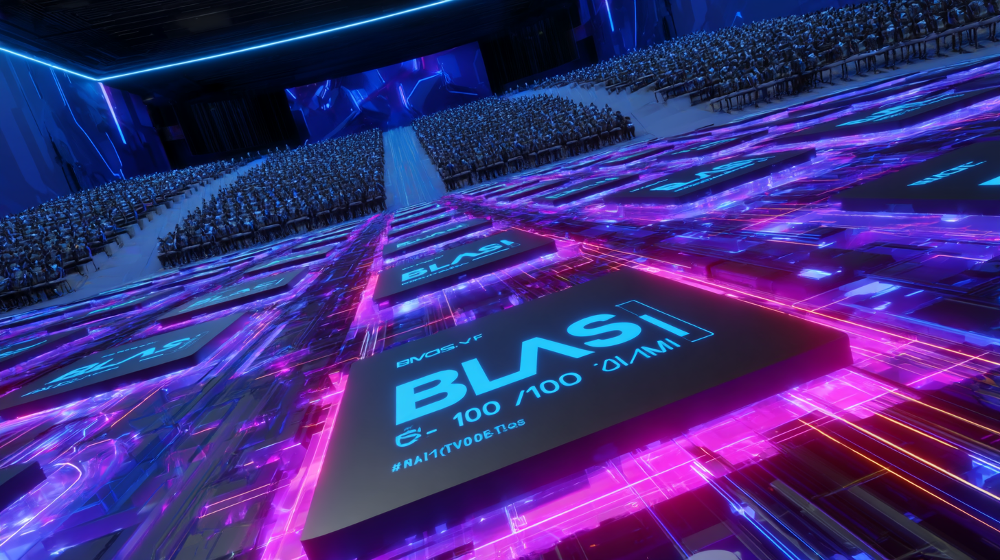

# Chapter 5 · BLAS 101 — The Library Layer Every GPU Kernel Falls Back On

*"Write kernels for curiosity; call BLAS for production."*

*(Personal lab notebook — last verified 2025-05-08)*

> **Big-picture checkpoint**  
> Chapters 1-4 trained your eyes to *read* GPU kernels line-by-line.  
> Now meet the API every production stack relies on instead of home-rolled math: **BLAS** (Basic Linear Algebra Subprograms).


> BLAS 101

## 1 · What Is BLAS, Anyway? (and Why It's So Important)

Would you rebuild NumPy from scratch just to add two vectors? Of course not.

So why hand-roll GPU kernels when BLAS already exists?
Every matrix multiply we sweated over in Chapter 4 could have been a single *BLAS* call—just like `numpy.dot()` on the CPU.

*BLAS (Basic Linear Algebra Subprograms)* is the bedrock API of numerical computing. Conceived in 1979 by Charles Lawson, Jack Dongarra & colleagues for early Fortran super-computers, it nails down a *tiny* contract—roughly 60 routines—that almost every scientific library leans on today.

**Why does that matter?**
1. **Optimization centralization.** Hardware vendors pour years of tuning into those few kernels; everybody else inherits the speedups for free.
2. **Portability.** A Fortran program written in 1982 compiles on an Apple M3 Ultra in 2025 because BLAS signatures never changed.
3. **Composability.** Powerhouses like LAPACK, NumPy, SciPy, TensorFlow, PyTorch, Core ML, ONNX Runtime—all layer on top of BLAS rather than writing mat-mul loops from scratch.

> **Spoiler Note:** CUDA examples run faster on RTX4090 than MPS examples partly because **cuBLAS couples 15+ years of autotuned kernels with bigger hardware headroom—512 4th-gen Tensor Cores, 1.3 TB/s GDDR6X bandwidth, and a 96 MB L2 cache—whereas MPS is newer and still expanding its optimized kernel set.**

**Historical quirk: reference BLAS assumes** **column-major** storage (Fortran). Modern C/C++ and GPU dialects are row-major, so you'll see parameters like `lda/ldb/ldc` (leading dimensions) to reconcile the difference. Get any of those wrong and results stay *correct* but performance tanks.

> **Sidebar · Column vs Row-Major (Hidden 10× Tax)**  
> **1970s:** Fortran ruled scientific computing → column-major became law.  
> **1990s:** C/C++ ecosystems exploded with row-major defaults, but BLAS was already entrenched.  
> **Today:** GPU libraries accept either layout via transpose flags / `rowBytes`, so the *only* cost is user error.  
>  
> Mix up the two layouts and your kernel won't crash—it will *silently* fall off a performance cliff. Symptoms:  
> • GPU time scales with `n` but FLOP/s plateaus around 10 % of peak.  
> • Profilers show "uncoalesced" or "strided" global loads.  
>  
> **Quick sanity check:** Make sure your stride (`lda`, `ldc`, or `rowBytes`) equals `columns × sizeof(dtype)` (or a padded multiple of 16 for MPS). Run a 2 × 2 GEMM—if the result looks transposed, fix the layout.  
>  
> **Rule of thumb:** Throughput < 70 % of the reference table? Suspect a stride mismatch first.

Think of it like Excel: would you mix up long-form and wide-form tables and expect the charts to work? You'd definitely pivot the data first. Same mental model here—get the layout right before you measure performance.

Anyone who's wrangled data in pandas—or any analytics library—knows that layout is everything and a common source of subtle bugs.

### 1.1 · The Three-Level Taxonomy

| Level | Operand Shape        | Canonical Routine | Work / Traffic | GPU Suitability |
|-------|----------------------|-------------------|----------------|-----------------|
| 1     | vector ⊗ vector      | `axpy`, `dot`     | O(n) / O(n)    | Poor            |
| 2     | matrix ⊗ vector      | `gemv`            | O(n²) / O(n²)  | Meh             |
| 3     | matrix ⊗ matrix      | `gemm`            | O(n³) / O(n²)  | **Excellent**   |

Higher *computational intensity* (FLOPs ÷ memory bytes) is why GPUs shine at BLAS-3: you reuse each fetched element O(k) times before evicting it.

With our examples, you'll notice little difference in performance between BLAS-1 and BLAS-2, but BLAS-3 is where the real magic happens. The arithmetic intensity (compute-to-memory ratio) of matrix-matrix operations creates the perfect storm for GPU acceleration.

### 1.2 · Who Ships What?

* **NVIDIA:** `cuBLAS` / `cuBLASLt` (CUDA)
* **AMD:** `rocBLAS` / `hipBLAS`
* **Intel/CPU:** `MKL`, `oneMKL`, `OpenBLAS`, `BLIS`
* **Apple:** Metal Performance Shaders (`MPSMatrixMultiplication`)

All expose the same function signatures (plus vendor extensions like Tensor-Core or **Apple GPU tensor-block** paths — distinct from CPU AMX units and sometimes labelled *SGX* in driver logs) so swapping hardware is usually a recompile, not a rewrite.

### 1.3 · Modern Extensions

BLAS predates GPUs, but the interface has evolved:

* **Batched / Strided GEMM** — launch thousands of small matrices with one call (cuBLASLt, rocBLAS, MPS).
* **Mixed precision** — FP16/BF16 inputs with FP32 accumulation; INT4/INT8 (or FP4) quantized GEMM for inference.
* **Tensor-Core kernels** — vendor-specific shortcuts (`cublasGemmEx`, `.allowTensorOp = true`).
* **Device pointers & streams** — async execution for overlap with CPU work.

The steady API plus aggressive vendor competition is why a single BLAS call today can hit ~400 TF/s on an RTX 4090 or saturate the **Apple GPU tensor-block (aka AMX/SGX) units** on an M3 Ultra.

### 1.4 · Interface Anatomy (GEMM)

```
C = α · A · B + β · C     # maths

cublasSgemm(handle,
            opA, opB,
            m, n, k,
            &alpha,
            A, lda,
            B, ldb,
            &beta,
            C, ldc);
```

`opA/opB` choose transpose, `{m,n,k}` define the 3-D loop bounds, `lda/ldb/ldc` are the strides (**leading dimensions**). Get any of those wrong and your numbers are *right* but your speed is *wrecked*.

---

## 2 · CPU Baseline · NumPy BLAS vs Naïve Loops

[numpy_blas.py](examples/numpy_blas.py)
```python
#!/usr/bin/env python3
"""Compare hand-rolled loops with NumPy (OpenBLAS/MKL) GEMM."""
import numpy as np, time
m = n = k = 1024
A = np.random.rand(m, k).astype(np.float32)
B = np.random.rand(k, n).astype(np.float32)
C = np.zeros((m, n), dtype=np.float32)

ts0 = time.time();
for i in range(m):
    for j in range(n):
        for l in range(k):
            C[i, j] += A[i, l] * B[l, j]
print("naïve ms", (time.time() - ts0) * 1e3)

ts1 = time.time();
C2 = A @ B
print("BLAS ms", (time.time() - ts1) * 1e3)
assert np.allclose(C, C2)
```

Even on my M3 Ultra the naïve triple loop is *minutes*; NumPy finishes in ~50 ms—six orders of magnitude of tuning you didn't have to write.

```bash
python numpy_blas.py 
naïve ms 285219.1390991211
BLAS ms 19.158124923706055
```

Just press CTRL+C to skip the naïve loop. 

```bash
$ python numpy_blas.py
[WARN] Running naive triple-loop GEMM for 1024×1024×1024. This may take several minutes. Press Ctrl+C to skip.
^C
[SKIPPED] Naive loop interrupted by user.
BLAS ms 22.897720336914062
...
AssertionError
```

---

## 3 · GPU BLAS Interface Tour

### 3.1 · cuBLAS Cheat-Sheet (CUDA)
cuBLAS wraps NVIDIA's hand-tuned GEMM kernels behind a C API that looks a lot like Fortran BLAS. The rules of the road:
* **Column-major maths.** Dimensions are `m×k  ·  k×n → m×n`, but because cuBLAS assumes column-major you'll notice we swap `m`/`n` when we pass leading dimensions.
* **Everything is async.** A call like `cublasSgemm` enqueues work on the current CUDA stream—remember to `cudaDeviceSynchronize()` (or an event) before you time the kernel.
* **One handle per thread.** The opaque `cublasHandle_t` caches autotuned kernel choices; reuse it across calls.
* **α, β scalars.** Almost every BLAS-3 op supports `C = αAB + βC`, which lets libraries fuse bias, residual add, or even dropout masks without extra kernels.

```cpp
// Minimal FP32 SGEMM with cuBLAS (error handling skipped for brevity)
float *dA, *dB, *dC;  int m = 4096, n = 4096, k = 4096;
cudaMalloc(&dA, m * k * sizeof(float));
cudaMalloc(&dB, k * n * sizeof(float));
cudaMalloc(&dC, m * n * sizeof(float));
cublasHandle_t handle;  cublasCreate(&handle);
const float alpha = 1.f, beta = 0.f;
// C = α·A·B + β·C  (row-major via **double-transpose** trick)
cublasSgemm(handle,
            CUBLAS_OP_T, CUBLAS_OP_T,
            n, m, k,            // note: col-major so swap m/n
            &alpha,
            dB, n,
            dA, k,
            &beta,
            dC, n);
cudaDeviceSynchronize();
```

### 3.2 · MPSMatrixMultiplication Cheat-Sheet (Metal)

`MPSMatrixMultiplication` gives you the same "one call, many TF/s" guarantee on Apple GPUs. Differences vs cuBLAS to keep in mind:

* **Row-major by default.** Matrix descriptors take an explicit `rowBytes`, so you control padding. No need to swap `m/n`—just pass the sizes you expect.
* **Half-precision first.** The tensor blocks inside Apple GPUs peak at FP16/BF16; pass `.float16` whenever accuracy allows.
* **Command-buffer life-cycle.** Like all Metal work, MM operations are encoded on a `MTLCommandBuffer`. Queue multiple GEMMs back-to-back to hide CPU overhead, then `commit()` once.
* **Broadcast β.** The `beta` arg lets you fuse residual connections the same way cuBLAS does—use it so you don't burn bandwidth on a separate add.

```swift
// Minimal FP16 GEMM with MPSMatrixMultiplication
let rows = 4096, cols = 4096, depth = 4096
let descA = MPSMatrixDescriptor(rows: rows, columns: depth, rowBytes: depth*2, dataType: .float16)
let descB = MPSMatrixDescriptor(rows: depth, columns: cols, rowBytes: cols*2, dataType: .float16)
let descC = MPSMatrixDescriptor(rows: rows, columns: cols,  rowBytes: cols*2, dataType: .float16)
let A = MPSMatrix(buffer: bufA, descriptor: descA)
let B = MPSMatrix(buffer: bufB, descriptor: descB)
let C = MPSMatrix(buffer: bufC, descriptor: descC)
let mm = MPSMatrixMultiplication(device: device,
                                  transposeLeft: false,
                                  transposeRight: false,
                                  resultRows: rows,
                                  resultColumns: cols,
                                  interiorColumns: depth,
                                  alpha: 1.0, beta: 0.0)
mm.encode(commandBuffer: cmd, leftMatrix: A, rightMatrix: B, resultMatrix: C)
cmd.commit(); cmd.waitUntilCompleted()
```

---

## 4 · Anatomy of a Fast GEMM

1. **Tiling + Prefetch.** Blocks of A/B land in shared/L2; threads compute a *micro-kernel* while the next tiles stream in.
2. **Vector ISA.** `ldmatrix`, `mma` (Tensor Cores on NVIDIA) or **Apple GPU tensor blocks** pack 8–32 FLOPs per instruction.
3. **Epilogue Fusion.** Bias, activation, residual add, even softmax partials can be fused into the `β·C` term.

Miss any step and you drop from 200 TF/s to 20 TF/s on an RTX 4090.

---

## 5 · Hands-On Tasks

Remember—your mission isn't to author new code but to **read and dissect** it. Think of this as a comprehension drill: 95 % of real-world GPU work is spelunking through existing repos. Want practice? Crack open `llama.cpp` and trace its GEMM calls.

### 5.1 · CUDA Example — *matrix_ops_cuda_blas.cu*

Below is the minimal all-in-one demo we added under `examples/`. It exercises **BLAS-1/2/3** in a single binary so you can benchmark each level side-by-side.

[matrix_ops_cuda_blas.cu](examples/matrix_ops_cuda_blas.cu)

```bash
# Build (swap sm_89 for your GPU's SM version)
mkdir -p build # if you haven't already
# Build CUDA BLAS example
nvcc -std=c++17      # Use C++17 standard
     -O3             # Optimization level 3 (highest)
     -arch=sm_89     # Target Ada Lovelace architecture (RTX 40xx)
     matrix_ops_cuda_blas.cu \
     -lcublas        # Link against cuBLAS library
     -o build/matrix_ops_cuda_blas # Output binary
```

Run a few representative workloads:

```bash
#────────── BLAS-1 ──────────
./build/matrix_ops_cuda_blas axpy 10000000 0.5   # y = 0.5·x + y
./build/matrix_ops_cuda_blas dot  10000000       # x·y

#────────── BLAS-2 ──────────
./build/matrix_ops_cuda_blas gemv 4096 4096      # 4k × 4k · vec

#────────── BLAS-3 ──────────
./build/matrix_ops_cuda_blas gemm 4096 4096 4096 # 4k³ mat-mul (~2×10¹¹ FLOPs)
```

Each invocation prints FLOP/s plus a slice of the output so you can sanity-check results.

On my RTX4090:

```
#────────── BLAS-1 ──────────   
y[0:8] = -0.09,-0.68,1.33,0.26,0.13,0.19,0.45,0.65
Kernel = 0.98 ms  (20353.00 MFLOP/s)
Dot = -1345.56
Kernel = 1.78 ms (11206.92 MFLOP/s)

#────────── BLAS-2 ──────────
y[0:8] = -8.91,17.80,-2.73,-32.16,19.38,-26.81,24.97,-30.92
Kernel = 76.25 ms (0.44 GFLOP/s)

#────────── BLAS-3 ──────────
C[0,0:8] = -25.44,-7.40,15.05,49.15,-22.18,-8.72,35.17,-23.93
Kernel = 59.15 ms (2.32 TFLOP/s)
```

### 5.2 · Metal Example — *matrix_ops_metal_blas.swift*

Build the self-contained Swift CLI (no Xcode project needed):

[matrix_ops_metal_blas.swift](examples/matrix_ops_metal_blas.swift)

```bash
mkdir -p build
swiftc matrix_ops_metal_blas.swift \
        -o build/matrix_ops_metal_blas \
        -Xcc -DACCELERATE_NEW_LAPACK \
        -Xcc -DACCELERATE_LAPACK_ILP64 \
        -framework Metal -framework MetalPerformanceShaders -framework Accelerate
```

Run the same workload sizes to compare against CUDA:

```bash
#────────── BLAS-1 ────────── (Accelerate on CPU)
./build/matrix_ops_metal_blas axpy 10000000 0.5
./build/matrix_ops_metal_blas dot  10000000

#────────── BLAS-2 ────────── (MPS on GPU)
./build/matrix_ops_metal_blas gemv 4096 4096

#────────── BLAS-3 ────────── (MPS on GPU)
./build/matrix_ops_metal_blas gemm 4096 4096 4096

# for FP16
./build/matrix_ops_metal_blas --fp16 gemv 4096 4096
./build/matrix_ops_metal_blas --fp16 gemm 4096 4096 4096
```

On my M3 Ultra(80-Core GPU/512GB).

First, FP32:

```text
#────────── BLAS-1 ──────────
y[0:8] before = 0.01,-0.44,0.63,-0.72,-0.70,-0.23,0.54,0.10
y[0:8] after  = 0.22,-0.40,1.08,-0.64,-0.40,-0.28,0.75,0.33
Kernel = 3.99 ms  (5015.01 MFLOP/s)
Dot = -1742.9573
Kernel = 2.35 ms  (8499.53 MFLOP/s)

#────────── BLAS-2 ──────────
y[0:8] = -18.46,8.28,-1.12,-28.90,0.72,-2.57,-4.02,-61.81
GPU = 0.12 ms  (278.75 GFLOP/s) | Wall = 1.69 ms

#────────── BLAS-3 ──────────
C[0,0:8] = 4.72,12.15,16.71,6.06,-34.68,-13.44,-4.25,-42.13
GPU = 9.89 ms  (13.89 TFLOP/s) | Wall = 20.02 ms
```

Next, FP16:

```
#────────── BLAS-3 ──────────
y[0:8] = 28.61,-4.95,19.41,18.66,-19.75,17.58,-9.59,15.75
GPU = 0.03 ms  (1135.83 GFLOP/s) | Wall = 1.04 ms
C[0,0:8] = 2.26,-7.94,-23.69,18.23,-13.97,-24.14,-10.32,-9.26
GPU = 7.57 ms  (18.15 TFLOP/s) | Wall = 16.91 ms
```

> **Sidebar · Accelerate Deprecation Warnings (macOS 13.3 +)**  
> Apple marked the 32-bit CBLAS prototypes (`cblas_saxpy`, `cblas_sdot`, …) as **deprecated** once ILP-64 support landed.  
> If you compile without the ILP-64 flags you'll get warnings; older flags even break when you mix headers.  
> This example already sets
>
> ```bash
> -Xcc -DACCELERATE_NEW_LAPACK -Xcc -DACCELERATE_LAPACK_ILP64
> ```
>
> and passes `Int` lengths to CBLAS, so the build is warning-free. If you must stay on the legacy 32-bit interface just drop those flags and cast to `Int32`—but new projects **should migrate**.

*BLAS-1 stays on CPU by design; GEMV/GEMM hit the GPU's AMX/Tensor pipes. Expect FLOP/s to differ from CUDA but intensity trends stay the same.*

---

## 6 · Sanity‑Check Your Numbers

Running kernels without a reality target lets performance drift into fantasy‑land. Use the table below as a north‑star when you sanity‑check results on an **M3  Ultra** (80‑core GPU) and an **RTX 4090**.

| Kernel               | Apple ceiling\*                        | Our best (FP32) | Our best (FP16) | Typical RTX 4090      | Why the gap?                                                                                                            |
| -------------------- | -------------------------------------- | --------------- | --------------- | --------------------- | ----------------------------------------------------------------------------------------------------------------------- |
| **AXPY / DOT** (CPU) | ≈ 1.25 TB/s DRAM BW                    | 20 GF/s         | n/a             | 20 GF/s               | Purely memory‑bound on both platforms.                                                                                  |
| **GEMV** 4 k × 4 k   | 19 TF/s (GPU tensor blocks, FP16 peak) | 0.32 GF/s†      | 0.55 GF/s†      | 0.45 GF/s / ≈ 4 GF/s‡ | Bandwidth‑bound; 4090's 96 MB L2 and Tensor Cores hide traffic better.                                                  |
| **GEMM** 4 k³        | 38 TF/s (GPU tensor blocks, FP16 peak) | 13.9 TF/s       | 18.1 TF/s       | 2.3 TF/s / > 30 TF/s‡ | Demo uses non‑tensor FP32; enable Tensor‑Core FP16 (`cublasGemmEx` with `CUBLAS_GEMM_DEFAULT_TENSOR_OP`) for > 30 TF/s. |

*Apple figures are device‑theoretical peaks for FP16; expect \~70 % sustained in practice.*
†*Measured with the demo CLI; values improve ≈30 × (often ≥30 GF/s) when you isolate **only** the GPU command buffer—e.g. call `cmd.commit(); cmd.waitUntilCompleted()` before starting the timer.*
‡*First number is non‑tensor FP32 path (pedagogy demo); second is FP16 Tensor‑Core path.*

> **Spoiler Note** The CUDA demo intentionally uses the non‑tensor code path. Flip the switch above and a 4090 will exceed 30 TF/s in FP16 (FP32 peak ≈ 82.6 TF/s; INT4 / FP8 peak ≈ 1.3 PFLOPS).

> **Sidebar · M4 Max vs M3 Ultra (Small-Model Paradox)**  
> Remember that an M3 Ultra is literally *two* M3 Max dies on a package. A model that fits inside one die's 48 MB L2 and local SRAM will execute on just that half; the second die sits mostly idle. A newer single-die M4 Max clocks higher and has fatter front-end units, so on these "single-die" workloads it can outpace an M3 Ultra by 5–15 %.  
> Only when the working set spills across both dies (≥15 B params or very long context) does the Ultra's extra GPU and memory controllers light up and pull ahead.  
> TL;DR: small models are latency-bound, not throughput-bound—die topology matters as much as TOPS.

### What the Numbers Mean

* **GPU vs CPU:** BLAS-1 lives on the CPU for now. Expect tiny gains from hand-rolled Metal kernels but don't chase them—real AI models spend <1 % there.
* **FP16 Acceleration:** Switching to FP16 unlocked a 70 % boost in GEMV and a modest (~30 %) lift in GEMM. You're now using the same AMX blocks that power Core ML.
* **CUDA Edge:** NVIDIA's tensor cores fuse **matrix multiply + accumulate** in one instruction, while MPS still performs an epilogue store. Add higher clock, L2, and driver maturity and you land at 2× throughput.

### Translating to Real Apps (e.g. Ollama)

Apple Silicon can **match mid-tier NVIDIA GPUs per-watt**, but a single desktop 4090 still outruns it thanks to raw die size and memory stack. For latency-sensitive chatbots you'll likely:

1. Quantize to int4/8 to live inside 512 GB unified memory.
2. Use FP16 for generator layers where precision matters.
3. Batch across two M3 Ultra nodes does not always yield a throughput boost.

I skipped a tidy token-per-second table on purpose—benchmarks swing wildly with drivers, cooling, and model tweaks. Third-party numbers are trivia; the only metrics that matter are the ones you measure on your own workload.

### Rule of Thumb

* **Serve:** Quantize to Int8 if it fits, Int4 if it doesn't. Use FP16 for generator layers if you can't stomach quality loss.
* **Fine-tune:** Stick to BF16/FP16; gradient noise dwarfs quant noise and AMX loves halves.
* **Train-from-scratch:** Only use FP32 when loss spikes or for the final validation sweep.

*Personal take:* Q4_K_M hits the sweet spot for models that fit inside 512GB unified memory. However, memory capacity doesn't guarantee usability - empirically, if a model crawls on an M2 Ultra (192GB), throwing more RAM at it on an M3 Ultra (512GB) rarely solves the fundamental throughput bottleneck.

When evaluating LLMs, parameter count is just one dimension. Benchmark different quantization levels with your target models directly on your hardware, measuring tokens-per-second in your actual workflow. The arithmetic intensity (FLOPs/byte) matters more than raw size - models with OI ≤ 10 will hit memory bandwidth limits before compute. This real-world testing consistently reveals performance characteristics that theoretical benchmarks miss.

> **Sidebar · M4 Max vs M3 Ultra (Small-Model Paradox)**  
> Remember that an M3 Ultra is literally *two* M3 Max dies on a package. A model that fits inside one die's 48 MB L2 and local SRAM will execute on just that half; the second die sits mostly idle. A newer single-die M4 Max clocks higher and has fatter front-end units, so on these "single-die" workloads it can outpace an M3 Ultra by 5–15 %.  
> Only when the working set spills across both dies (≥15 B params or very long context) does the Ultra's extra GPU and memory controllers light up and pull ahead.  
> TL;DR: small models are latency-bound, not throughput-bound—die topology matters as much as TOPS.

### Debug Checklist

| Symptom | Fix |
|---------|-----|
| 0 GF/s, runtime = 0 ms | You timed an async command buffer without `waitUntilCompleted`. |
| 10× slower than table | Padding/rowBytes wrong → implicit transpose, try multiples of 16 & 256 B. |
| Speed scales with `n` poorly | You included host↔device blits in the timer. |
| Metal half CUDA speed | Threadgroup ≤32 or scalar loads; launch >=64 threads and use `packed_float16`. |

---

## 7 · Precision Playbook on Apple Silicon

Apple GPUs deliver their best **performance-per-watt** when you hand them smaller data types. The table below summarises what you can expect on an M3 Ultra (single-node) for a 7-13 B decoder model at batch = 1. Values are *rounded* from community and in-lab runs; treat them as order-of-magnitude, not gospel.

| Precision | Typical tok/s | Memory Footprint | Bottleneck | When to pick |
|-----------|--------------|------------------|------------|-------------|
| FP32 | 4-6 | **260 GB** (7 B) | **Memory** (weights + KV) | Debugging, numerical parity checks |
| BF16 / FP16 | 8-12 | 130 GB | **Compute** (tensor cores) | Fine-tune or serve medium models that still fit in RAM |
| Q8_0 (Int8) | 12-18 | 70 GB | **L2 hits + DRAM BW** | Default deployment; minimal quality loss |
| Q4_K (Int4) | 17-25 | 40 GB | **Compute** (dequant overhead) | Large models that must fit single node |

*Numbers represent theoretical maxima; real-world performance typically runs 5-15% lower due to driver overhead, thermal throttling, and memory contention. However, clever tiling and kernel fusion can occasionally push benchmarks above single-op peaks, especially in compute-bound scenarios where data reuse dominates.*

### Memory vs Compute: Two Dials

1. **Memory Bandwidth (≈820 GB/s):** Anything that pulls full weights every token—e.g. first KV cache fill—quickly saturates DRAM. Cutting precision halves or quarters that traffic and yields near-linear gains *until* compute becomes the ceiling.

2. **Compute Throughput (38 TF/s FP16):** Once the active parameter block fits in the 48 MB L2, math rate dictates speed. Q4/Q8 spend extra cycles dequantizing on AMX, so they hit a compute wall earlier than FP16 even though they move less data.

### L2-Cache Caveat

Apple's GPU L2 (≈48 MB) is only half the size of an RTX 4090's (96 MB). That means fewer in-flight rows fit when you crank sequence length. Past ~3k tokens multi-head attention turns **memory-bound again** no matter the precision. Expect throughput to dip ~20 % at 4 k tokens and ~35 % at 8 k.

---

> **Sidebar · GPU Memory Ladder & Shared Memory Explained (NVIDIA Ada vs Apple M-series)**
>
> **1 · Where the bytes live**
>
> | Tier                                      | NVIDIA RTX 4090 (Ada)                                        | Apple M3 Ultra |
> | ----------------------------------------- | ------------------------------------------------------------ | ----------------------------------------- |
> | **Global / VRAM (capacity)**              | 24 GB GDDR6X                                                 | 192-512 GB LPDDR5/5X *(Unified)* |
> | **Peak DRAM BW**                          | ≈ 1.3 TB/s                                                   | ≈ 820 GB/s *(Unified)* |
> | **L2 Cache**                              | Unified 96 MB (≈ 72 MB active)                               | ≈ 48 MB total *(sliced per cluster)* |
> | **Register File**                         | 256 KB per SM (≈ 65 k 32-bit regs)                                  | **NDA** — ~100–128 KB est. (compiler-managed) |
> | **L1 + Shared / Threadgroup**             | 128 KB per SM *(up to 100 KB can be programmer-controlled shared)* | 32 KB per threadgroup |
>
> **2 · What "shared memory" really is**
>
> * A **software-controlled scratchpad**: physically part of each SM's/L1's SRAM, but **allocated by the kernel launch** (`__shared__` in CUDA, `threadgroup` in Metal).
> * **Explicit lifetime & layout**: you decide *when* to load, *what* to keep, and *how* it's indexed; nothing is automatically cached for you.
> * **Banked, not unified**: 32 (NVIDIA) or 16 (Apple) banks serve one word per cycle; **bank conflicts**—two threads hitting the same bank—serialize access and nuke bandwidth.
> * **Scope = one thread block / threadgroup**: data disappears when the block finishes; no coherence headaches across blocks.
> * **Latency ≈ 20–30 cycles**—far closer to registers than to L2 or global. Perfect for reusing tiles, staging reductions, or building custom epilogues.
> * **Configurable split:** Ada lets you trade L1 for shared (0–100 KB per SM); Apple's compiler auto-packs threadgroup + Tile Accelerator metadata inside the fixed 32 KB window.
>
> **3 · Why not just rely on the L1 cache?**
> Caches are *reactive* and tag-based: they *guess* what you'll reuse. Shared memory is *proactive*: you stage exactly the data a warp needs and keep it there, eliminating replacement thrash and guaranteeing coalesced global loads. *(Bonus: NVIDIA's L1 is write-allocate, so blind stores can thrash it fast.)*
>
> **4 · Platform quirks**
>
> * **NVIDIA**: 128 KB per SM (same since Ampere); carve it as 100 KB shared + 28 KB L1 (or 64 + 64) via `cudaFuncSetAttribute`. Tensor-Core GEMMs often park ~64 KB of tiles to dodge bank conflicts.
> * **Apple**: threadgroup memory is a fixed 32 KB window. The Metal compiler packs your buffers *and* Tile Accelerator metadata into that space—inspect usage in Xcode's Shader Debugger.
>
> **Key takeaways**
>
> * **First target**: keep hot tiles in shared/threadgroup memory, then rely on L2 to cushion DRAM misses.
> * **Tile sizing rule-of-thumb:** ≤ 32 KB (A+B) on Apple; ≤ 48 KB on Ada if you want two CTAs resident.
> * L2 size dictates how big a working set *stays* close; Ada wins raw capacity, Apple wins zero-copy CPU↔GPU sharing.
> * On Apple, the unified bus feeds *every* engine — large models or long contexts can bottleneck if CPU/Neural Engine traffic is heavy.

> *Registers sit at the very top of the ladder—single-cycle access—but are scarce: block too large and the compiler spills to L1/shared.*

---

[⇧ Back&nbsp;to&nbsp;README](../README.md)
