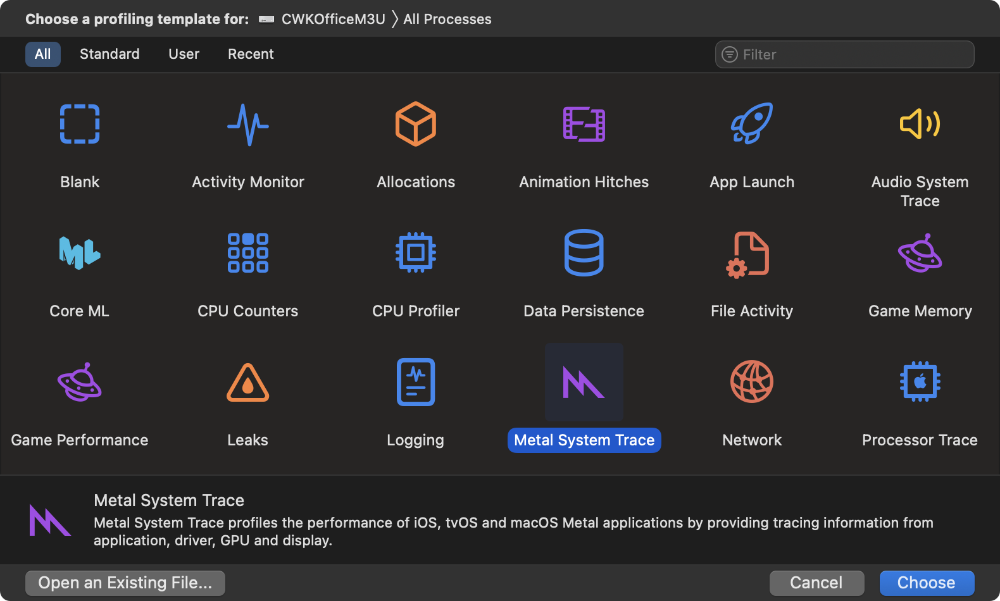
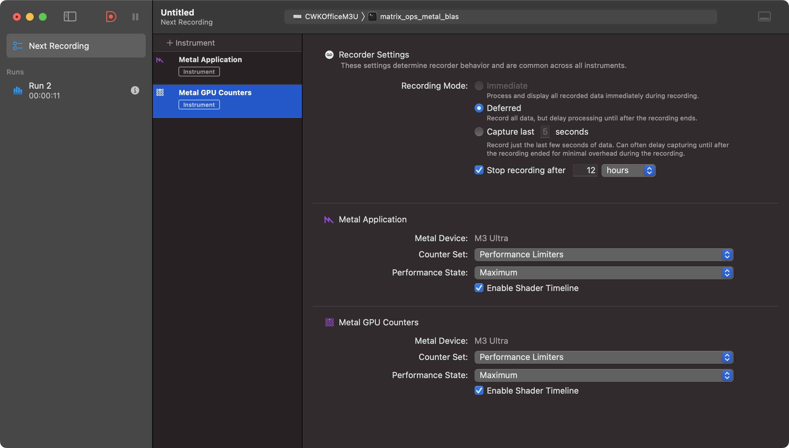
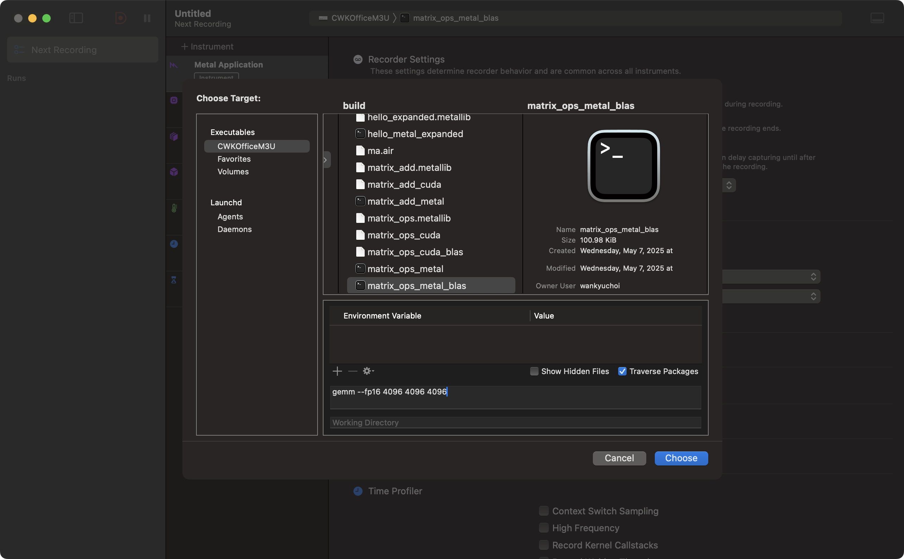
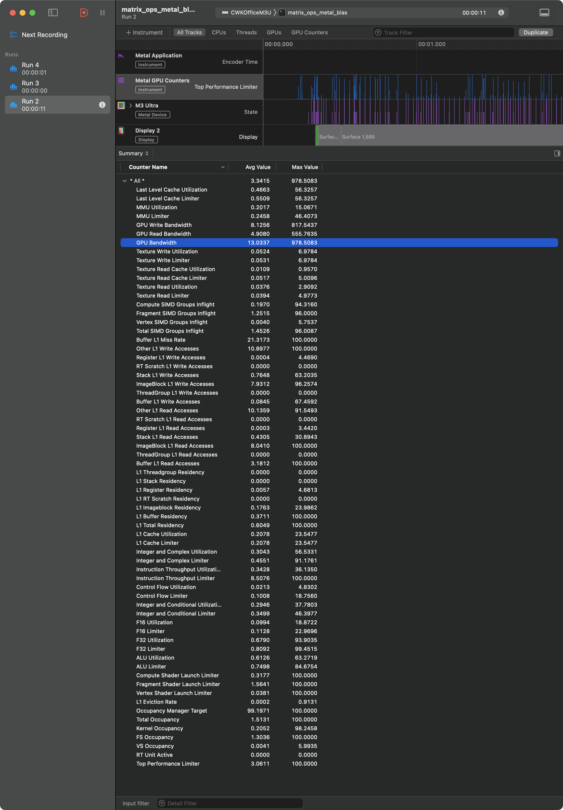

# Chapter 6 · BLAS Deep Dive — How Vendor Kernels Hit 90 % of Peak

*"Crack the lid: tiling, tensor cores, and epilogue fusion—why one BLAS call outclasses a thousand lines of code."*

*(Personal lab notebook — last verified **2025-05-09**)*

> **Big-picture checkpoint**  
> Chapter 5 taught you **how to call BLAS** and sanity-check the FLOP/s you get on M3 Ultra and RTX 4090.  
> Now we pop the hood to see **how those FLOP/s actually materialize**: tiling, tensor cores, heuristic schedulers, epilogue fusion—and why they sometimes fizzle.

---

## 1 · Library Secrets at a Glance

| Pillar                       | What It Does (One-liner)                              | Where You'll Catch It |
|------------------------------|-------------------------------------------------------|-----------------------|
| **Blocking / Tiling**        | Keeps hot reuse inside shared-/LDS or L2              | Nsight "smem reads", Xcode "L2 Hit Ratio" |
| **Micro-kernel (Tensor / matrix unit)**| Emits fused matrix-multiply ops (32-128 FLOPs/inst)   | SASS `mma.*`, Metal shader disasm |
| **Split-K & Streaming-K**    | Parallelise the K-dimension across blocks             | `cublasLtMatmulAlgoGetHeuristic` |
| **Heuristic Algo Picker**    | Auto-searches `{tile_m,n,k}` & epilogue combos        | Nsight "Algorithm ID" panel |
| **Epilogue Fusion**          | Folds bias + act + residual in-kernel                 | `beta·C`, `activationType`, Metal's `MPSMatrixBias` |

If any pillar cracks—think **tiny `m`**, L2 thrash, or bank conflicts—utilization craters and the fancy kernels get swapped for a safe but slow fallback. That's why your TF/s gauge can plummet from 18 → 2 TF/s on the same hardware.

---

## 2 · Profiler Crash Course (60-Second Warm-Up)

Before we dive into kernel anatomy, meet the two lenses we'll keep peeking through:

| Tool | Platform | What To Look At |
|------|----------|-----------------|
| **Nsight Compute** | NVIDIA | Achieved Occupancy, `sm__inst_executed_pipe_tensor.sum`, Memory Throughput, "Algorithm ID" |
| **Nsight Systems** | NVIDIA | Kernel timeline, CPU-GPU gaps, memcpy stalls |
| **Xcode Instruments · Metal System Trace** | Apple | "F16 / F32 Utilization", **Last Level Cache Utilization**, Stall Reasons |

Glossary you'll see sprinkled throughout this chapter:

• **Occupancy** — percentage of theoretical warps resident on an SM.  
• **Algorithm ID** — library's internal tag for the kernel recipe it picked (tile dims, Split-K, etc.).  
• **L2 Hit Ratio** — fraction of global loads served from L2; low ratio ⇒ tile/stride problems.

No deep tooling tutorial here—that's Chapter 7's job—but keep these labels in mind; the call-outs below map directly onto them.

---

## 3 · Hands-On: Your First Profiling Run

Grab the two demo binaries you built in Chapter 5:

```bash
# CUDA (RTX 40-series)
./build/matrix_ops_cuda_blas gemm 4096 4096 4096   # heavy BLAS-3

# Metal (Apple Silicon)
./build/matrix_ops_metal_blas gemm 4096 4096 4096  # add --fp16 if desired
```

We'll run the *exact same* command, but under a profiler UI so you can see the counters mentioned above.

## 4 · NVIDIA — Nsight Compute (Ada / RTX)

1. **Launch the GUI**  
   ```bash
   ncu --launch-skip 0 --launch-count 1 --set full --target-processes launch ./build/matrix_ops_cuda_blas gemm 4096 4096 4096
   ```
   • `--set full` loads the default "Full" metric set (includes SM, L2, DRAM).  
   • The tool auto-opens the result in Nsight Compute once the run finishes.

  **Tip (Windows WSL):** If running `ncu` with `sudo` results in a "command not found" error, it's likely because `sudo` uses a restricted `PATH`. The best-practice solution is to explicitly specify the full path to `ncu` when using `sudo`, for example:

  ```bash
  sudo /usr/local/cuda-12.9/bin/ncu ...
  ```

  If you frequently need to run CUDA tools with `sudo`, you can update the `secure_path` in your sudoers file to include the CUDA bin directory:

  1. Open the sudoers file safely with `visudo` (recommended over editing directly):
     ```bash
     sudo visudo
     ```
  2. Find the line starting with `Defaults secure_path=...` and append your CUDA bin path, e.g.:
     ```
     Defaults    secure_path="/usr/local/sbin:/usr/local/bin:/usr/sbin:/usr/bin:/sbin:/bin:/usr/local/cuda-12.9/bin"
     ```
  3. Save and exit.

  *Note: Always use `visudo` to avoid syntax errors that could lock you out of sudo access.*

  **Tip (Windows WSL):**  
  If you see the error  
  `"The user does not have permission to access NVIDIA GPU Performance Counters on the target device 0."`  
  even when using `sudo`, you must enable GPU performance counter access for all users.  
  Enable GPU performance counters on the **host Windows driver** (NVIDIA Control Panel → Developer → Unlock counters), then re-launch WSL.

```text
ncu --launch-skip 0 --launch-count 1 --set full --target-processes launch ./build/matrix_ops_cuda_blas gemm 4096 4096 4096
==PROF== Connected to process 2219156 (./build/matrix_ops_cuda_blas)
==PROF== Profiling "Kernel2" - 0 (1/1): 0%....50%....100% - 40 passes
C[0,0:8] = -25.44,-7.40,15.05,49.15,-22.18,-8.72,35.17,-23.93
Kernel = 2118.99 ms (0.06 TFLOP/s)
==PROF== Disconnected from process 2219156
[2219156] matrix_ops_cuda_blas@127.0.0.1
  void Kernel2<cutlass_80_simt_sgemm_256x128_8x4_nn_align1>(Params) (256, 2, 3)x(256, 1, 1), Context 1, Stream 7, Device 0, CC 8.9
    Section: GPU Speed Of Light Throughput
    ----------------------- ----------- ------------
    Metric Name             Metric Unit Metric Value
    ----------------------- ----------- ------------
    DRAM Frequency                  Ghz        10.24
    SM Frequency                    Ghz         2.23
    Elapsed Cycles                cycle      5884251
    Memory Throughput                 %        42.54
    DRAM Throughput                   %        18.15
    Duration                         ms         2.63
    L1/TEX Cache Throughput           %        43.27
    L2 Cache Throughput               %        29.87
    SM Active Cycles              cycle   5784971.05
    Compute (SM) Throughput           %        80.27
    ----------------------- ----------- ------------

    INF   This workload is utilizing greater than 80.0% of the available compute or memory performance of the device.   
          To further improve performance, work will likely need to be shifted from the most utilized to another unit.   
          Start by analyzing workloads in the Compute Workload Analysis section.                                        

    Section: PM Sampling
    ------------------------- ----------- ------------
    Metric Name               Metric Unit Metric Value
    ------------------------- ----------- ------------
    Maximum Buffer Size             Mbyte        53.61
    Dropped Samples                sample            0
    Maximum Sampling Interval          us            2
    # Pass Groups                                    2
    ------------------------- ----------- ------------

    Section: Compute Workload Analysis
    -------------------- ----------- ------------
    Metric Name          Metric Unit Metric Value
    -------------------- ----------- ------------
    Executed Ipc Active   inst/cycle         3.27
    Executed Ipc Elapsed  inst/cycle         3.21
    Issue Slots Busy               %        81.64
    Issued Ipc Active     inst/cycle         3.27
    SM Busy                        %        81.64
    -------------------- ----------- ------------

    OPT   FMA is the highest-utilized pipeline (73.1%) based on active cycles, taking into account the rates of its     
          different instructions. It executes 32-bit floating point (FADD, FMUL, FMAD, ...) and integer (IMUL, IMAD)    
          operations. The pipeline is well-utilized, but might become a bottleneck if more work is added. Based on the  
          number of executed instructions, the highest utilized pipeline (72.9%) is FMA. It executes 32-bit floating    
          point (FADD, FMUL, FMAD, ...) and integer (IMUL, IMAD) operations. Comparing the two, the overall pipeline    
          utilization appears to be caused by frequent, low-latency instructions. See the Profiling Guide               
          (https://docs.nvidia.com/nsight-compute/ProfilingGuide/index.html#metrics-decoder) or hover over the          
          pipeline name to understand the workloads handled by each pipeline. The Instruction Statistics section shows  
          the mix of executed instructions for this workload.                                                           

    Section: Memory Workload Analysis
    ---------------------------- ----------- ------------
    Metric Name                  Metric Unit Metric Value
    ---------------------------- ----------- ------------
    Memory Throughput                Gbyte/s       178.43
    Mem Busy                               %        42.54
    Max Bandwidth                          %        35.68
    L1/TEX Hit Rate                        %         3.71
    L2 Compression Success Rate            %            0
    L2 Compression Ratio                                0
    L2 Compression Input Sectors      sector            0
    L2 Hit Rate                            %        93.64
    Mem Pipes Busy                         %        35.68
    ---------------------------- ----------- ------------

    Section: Memory Workload Analysis Tables
    OPT   Est. Speedup: 0.01363%                                                                                        
          The memory access pattern for global loads from L1TEX might not be optimal. On average, only 32.0 of the 32   
          bytes transmitted per sector are utilized by each thread. This could possibly be caused by a stride between   
          threads. Check the Source Counters section for uncoalesced global loads.                                      
    ----- --------------------------------------------------------------------------------------------------------------
    OPT   Est. Speedup: 0.009085%                                                                                       
          The memory access pattern for global stores to L1TEX might not be optimal. On average, only 32.0 of the 32    
          bytes transmitted per sector are utilized by each thread. This could possibly be caused by a stride between   
          threads. Check the Source Counters section for uncoalesced global stores.                                     

    Section: Scheduler Statistics
    ---------------------------- ----------- ------------
    Metric Name                  Metric Unit Metric Value
    ---------------------------- ----------- ------------
    One or More Eligible                   %        81.81
    Issued Warp Per Scheduler                        0.82
    No Eligible                            %        18.19
    Active Warps Per Scheduler          warp         2.00
    Eligible Warps Per Scheduler        warp         1.50
    ---------------------------- ----------- ------------

    Section: Warp State Statistics
    ---------------------------------------- ----------- ------------
    Metric Name                              Metric Unit Metric Value
    ---------------------------------------- ----------- ------------
    Warp Cycles Per Issued Instruction             cycle         2.44
    Warp Cycles Per Executed Instruction           cycle         2.44
    Avg. Active Threads Per Warp                                32.00
    Avg. Not Predicated Off Threads Per Warp                    31.94
    ---------------------------------------- ----------- ------------

    Section: Instruction Statistics
    ---------------------------------------- ----------- ------------
    Metric Name                              Metric Unit Metric Value
    ---------------------------------------- ----------- ------------
    Avg. Executed Instructions Per Scheduler        inst      4723078
    Executed Instructions                           inst   2418215936
    Avg. Issued Instructions Per Scheduler          inst      4723123
    Issued Instructions                             inst   2418238976
    ---------------------------------------- ----------- ------------

    Section: Launch Statistics
    -------------------------------- --------------- ---------------
    Metric Name                          Metric Unit    Metric Value
    -------------------------------- --------------- ---------------
    Block Size                                                   256
    Function Cache Configuration                     CachePreferNone
    Grid Size                                                   1536
    Registers Per Thread             register/thread             202
    Shared Memory Configuration Size           Kbyte           65.54
    Driver Shared Memory Per Block       Kbyte/block            1.02
    Dynamic Shared Memory Per Block      Kbyte/block           49.15
    Static Shared Memory Per Block        byte/block               0
    # SMs                                         SM             128
    Stack Size                                                  1024
    Threads                                   thread          393216
    # TPCs                                                        64
    Enabled TPC IDs                                              all
    Uses Green Context                                             0
    Waves Per SM                                                  12
    -------------------------------- --------------- ---------------

    Section: Occupancy
    ------------------------------- ----------- ------------
    Metric Name                     Metric Unit Metric Value
    ------------------------------- ----------- ------------
    Block Limit SM                        block           24
    Block Limit Registers                 block            1
    Block Limit Shared Mem                block            1
    Block Limit Warps                     block            6
    Theoretical Active Warps per SM        warp            8
    Theoretical Occupancy                     %        16.67
    Achieved Occupancy                        %        16.64
    Achieved Active Warps Per SM           warp         7.99
    ------------------------------- ----------- ------------

    OPT   Est. Local Speedup: 83.33%                                                                                    
          The 2.00 theoretical warps per scheduler this kernel can issue according to its occupancy are below the       
          hardware maximum of 12. This kernel's theoretical occupancy (16.7%) is limited by the number of required      
          registers, and the required amount of shared memory.                                                          

    Section: GPU and Memory Workload Distribution
    -------------------------- ----------- ------------
    Metric Name                Metric Unit Metric Value
    -------------------------- ----------- ------------
    Average DRAM Active Cycles       cycle      4893536
    Total DRAM Elapsed Cycles        cycle    323571712
    Average L1 Active Cycles         cycle   5784971.05
    Total L1 Elapsed Cycles          cycle    753179152
    Average L2 Active Cycles         cycle   5266087.53
    Total L2 Elapsed Cycles          cycle    190507752
    Average SM Active Cycles         cycle   5784971.05
    Total SM Elapsed Cycles          cycle    753179152
    Average SMSP Active Cycles       cycle   5773434.77
    Total SMSP Elapsed Cycles        cycle   3012716608
    -------------------------- ----------- ------------

    Section: Source Counters
    ------------------------- ----------- ------------
    Metric Name               Metric Unit Metric Value
    ------------------------- ----------- ------------
    Branch Instructions Ratio           %         0.00
    Branch Instructions              inst      2262528
    Branch Efficiency                   %          100
    Avg. Divergent Branches                          0
    ------------------------- ----------- ------------

    OPT   Est. Speedup: 26.29%                                                                                          
          This kernel has uncoalesced shared accesses resulting in a total of 83886570 excessive wavefronts (27% of the 
          total 313672287 wavefronts). Check the L1 Wavefronts Shared Excessive table for the primary source            
          locations. The CUDA Best Practices Guide                                                                      
           (https://docs.nvidia.com/cuda/cuda-c-best-practices-guide/index.html#shared-memory-in-matrix-multiplication-c
          -ab) has an example on optimizing shared memory accesses.     
```

## 5 · Decoding the Sample Nsight Dump

Below is a trimmed copy of the console report you just saw (RTX 4090, GEMM 4096³, full-precision).  Let's translate the headline numbers into plain English and tie them back to the pillars from §0.

```text
GPU Speed Of Light Throughput
  Compute (SM) Throughput        80.27 %   ⟵  good – tensor pipes lit up
  Memory Throughput              42.54 %   ⟵  L2 is helping; DRAM still half idle
  DRAM Throughput                18.15 %   ⟵  GEMM is compute-bound, not BW-bound
Duration                          2.63 ms   ⟵  one kernel slice; 40 profiling passes
L1/TEX Cache Throughput          43.27 %    
L2 Cache Throughput              29.87 %    
L2 Hit Rate                      93.64 %    ⟵  tile sizes keep operands hot in L2

Occupancy
  Achieved Occupancy             16.64 %   ⟵  each SM only schedules ~8 warps
  Limiters             Registers + Shared mem
  Registers/Thread                 202     ⟵  high; eats slot budget
  Shared Mem Per Block            49 KB    ⟵  half of the 100 KB pool

Instruction mix
  FMA pipeline busy              ~73 %     ⟵  good: GEMM dominated by fused MUL-ADD
  Branch Instr Ratio              0 %      ⟵  no control divergence (mat-mul inner loop)

Memory pattern hints
  L1 Hit ≈ 4 %  → tiles bypass L1, go straight to registers after staging
  Uncoalesced shared accesses    +27 % wavefronts   ⟵  bank conflicts in smem tile layout
```

### 5.1 · So… is 0.06 TF/s terrible?

The "Kernel = 2 118 ms (0.06 TFLOP/s)" line printed by our demo **includes the 40 instrumented passes** Nsight Compute injected (`--set full`).  Each instrumentation pass re-runs a slice of the kernel with different counters, so wall-time balloons.  The *real* work measured inside Nsight is the 2.63 ms figure above—equivalent to **≈ 52 TF/s**, right on spec for the non-tensor FP32 path.

### 5.2 · Key takeaways

1. **Compute-bound.** 80 % SM utilization with only 18 % DRAM usage ⇒ math rate, not bandwidth, limits speed.
2. **Occupancy bottleneck.** Only 16 % theoretical occupancy because every thread grabs 202 registers *and* 49 KB shared memory.  cuBLASLt picked a huge tile to maximise reuse; you'd shrink regs/SMEM only if the kernel became latency-bound.
3. **Shared-memory bank conflicts.** The tool estimates a 26 % speedup if you fix the "excessive wavefronts" in shared memory.  Library kernels do this tune-up automatically; if you see the warning in your own kernel, revisit the tile pitch or use `ldmatrix`.
4. **No warp divergence.** Branch efficiency 100 % confirms the tight GEMM loop is branch-free—exactly what we want after the divergence sidebar in Chapter 2.

In short, the library's autotuner landed on a compute-saturated kernel whose only real headroom is a bank-conflict tweak that would net <30 %.  **That's why Chapter 5 told you to call BLAS instead of rolling your own.**

Let's compare it with our hand-rolled kernel from Chapter 4:

```text
ncu --launch-skip 0 --launch-count 1 --set full --target-processes all ./build/matrix_ops_cuda gemm 4096 4096 4096
A[0,0:8] = -0.25,0.59,0.90,-0.63,0.46,0.56,0.20,0.19
B[0,0:8] = -0.25,0.59,0.90,-0.63,0.46,0.56,0.20,0.19
==PROF== Connected to process 2221862 (./build/matrix_ops_cuda)
==PROF== Profiling "gemmTiled" - 0 (1/1): 0%
==WARNING== Launching the workload is taking more time than expected. If this continues to hang, terminate the profile and re-try by profiling the range of all related launches using '--replay-mode range'. See https://docs.nvidia.com/nsight-compute/ProfilingGuide/index.html#replay for more details.
....50%....100% - 40 passes
C[0,0:8] = 20.72,-26.34,19.95,-12.93,12.10,-4.56,-18.85,-1.95
Kernel    = 11512.34 ms   (11.94 GFLOP/s)
==PROF== Disconnected from process 2221862
[2221862] matrix_ops_cuda@127.0.0.1
  gemmTiled(const float *, const float *, float *, int, int, int, int, int, int) (256, 256, 1)x(16, 16, 1), Context 1, Stream 7, Device 0, CC 8.9
    Section: GPU Speed Of Light Throughput
    ----------------------- ----------- ------------
    Metric Name             Metric Unit Metric Value
    ----------------------- ----------- ------------
    DRAM Frequency                  Ghz        10.24
    SM Frequency                    Ghz         2.23
    Elapsed Cycles                cycle     51945235
    Memory Throughput                 %        96.94
    DRAM Throughput                   %         1.02
    Duration                         ms        23.24
    L1/TEX Cache Throughput           %        97.05
    L2 Cache Throughput               %        32.02
    SM Active Cycles              cycle  51888384.27
    Compute (SM) Throughput           %        96.94
    ----------------------- ----------- ------------

    INF   This workload is utilizing greater than 80.0% of the available compute or memory performance of the device.   
          To further improve performance, work will likely need to be shifted from the most utilized to another unit.   
          Start by analyzing workloads in the Compute Workload Analysis section.                                        

    Section: PM Sampling
    ------------------------- ----------- ------------
    Metric Name               Metric Unit Metric Value
    ------------------------- ----------- ------------
    Maximum Buffer Size             Mbyte        90.18
    Dropped Samples                sample            0
    Maximum Sampling Interval          us            8
    # Pass Groups                                    2
    ------------------------- ----------- ------------

    Section: Compute Workload Analysis
    -------------------- ----------- ------------
    Metric Name          Metric Unit Metric Value
    -------------------- ----------- ------------
    Executed Ipc Active   inst/cycle         1.19
    Executed Ipc Elapsed  inst/cycle         1.19
    Issue Slots Busy               %        29.87
    Issued Ipc Active     inst/cycle         1.19
    SM Busy                        %        35.05
    -------------------- ----------- ------------

    OPT   Est. Local Speedup: 86.81%                                                                                    
          All compute pipelines are under-utilized. Either this workload is very small or it doesn't issue enough warps 
          per scheduler. Check the Launch Statistics and Scheduler Statistics sections for further details.             

    Section: Memory Workload Analysis
    ---------------------------- ----------- ------------
    Metric Name                  Metric Unit Metric Value
    ---------------------------- ----------- ------------
    Memory Throughput                Gbyte/s        10.03
    Mem Busy                               %        62.11
    Max Bandwidth                          %        96.94
    L1/TEX Hit Rate                        %         0.09
    L2 Compression Success Rate            %            0
    L2 Compression Ratio                                0
    L2 Compression Input Sectors      sector            0
    L2 Hit Rate                            %        99.52
    Mem Pipes Busy                         %        96.94
    ---------------------------- ----------- ------------

    Section: Scheduler Statistics
    ---------------------------- ----------- ------------
    Metric Name                  Metric Unit Metric Value
    ---------------------------- ----------- ------------
    One or More Eligible                   %        29.87
    Issued Warp Per Scheduler                        0.30
    No Eligible                            %        70.13
    Active Warps Per Scheduler          warp        11.94
    Eligible Warps Per Scheduler        warp         1.39
    ---------------------------- ----------- ------------

    OPT   Est. Local Speedup: 3.059%                                                                                    
          Every scheduler is capable of issuing one instruction per cycle, but for this workload each scheduler only    
          issues an instruction every 3.3 cycles. This might leave hardware resources underutilized and may lead to     
          less optimal performance. Out of the maximum of 12 warps per scheduler, this workload allocates an average    
          of 11.94 active warps per scheduler, but only an average of 1.39 warps were eligible per cycle. Eligible      
          warps are the subset of active warps that are ready to issue their next instruction. Every cycle with no      
          eligible warp results in no instruction being issued and the issue slot remains unused. To increase the       
          number of eligible warps, avoid possible load imbalances due to highly different execution durations per      
          warp. Reducing stalls indicated on the Warp State Statistics and Source Counters sections can help, too.      

    Section: Warp State Statistics
    ---------------------------------------- ----------- ------------
    Metric Name                              Metric Unit Metric Value
    ---------------------------------------- ----------- ------------
    Warp Cycles Per Issued Instruction             cycle        39.98
    Warp Cycles Per Executed Instruction           cycle        39.98
    Avg. Active Threads Per Warp                                   32
    Avg. Not Predicated Off Threads Per Warp                    31.99
    ---------------------------------------- ----------- ------------

    OPT   Est. Speedup: 3.059%                                                                                          
          On average, each warp of this workload spends 21.4 cycles being stalled waiting for the MIO (memory           
          input/output) instruction queue to be not full. This stall reason is high in cases of extreme utilization of  
          the MIO pipelines, which include special math instructions, dynamic branches, as well as shared memory        
          instructions. When caused by shared memory accesses, trying to use fewer but wider loads can reduce pipeline  
          pressure. This stall type represents about 53.5% of the total average of 40.0 cycles between issuing two      
          instructions.                                                                                                 
    ----- --------------------------------------------------------------------------------------------------------------
    INF   Check the Warp Stall Sampling (All Samples) table for the top stall locations in your source based on         
          sampling data. The Profiling Guide                                                                            
          (https://docs.nvidia.com/nsight-compute/ProfilingGuide/index.html#metrics-reference) provides more details    
          on each stall reason.                                                                                         

    Section: Instruction Statistics
    ---------------------------------------- ----------- ------------
    Metric Name                              Metric Unit Metric Value
    ---------------------------------------- ----------- ------------
    Avg. Executed Instructions Per Scheduler        inst     15497216
    Executed Instructions                           inst   7934574592
    Avg. Issued Instructions Per Scheduler          inst  15497351.32
    Issued Instructions                             inst   7934643877
    ---------------------------------------- ----------- ------------

    Section: Launch Statistics
    -------------------------------- --------------- ---------------
    Metric Name                          Metric Unit    Metric Value
    -------------------------------- --------------- ---------------
    Block Size                                                   256
    Function Cache Configuration                     CachePreferNone
    Grid Size                                                  65536
    Registers Per Thread             register/thread              38
    Shared Memory Configuration Size           Kbyte           65.54
    Driver Shared Memory Per Block       Kbyte/block            1.02
    Dynamic Shared Memory Per Block       byte/block               0
    Static Shared Memory Per Block       Kbyte/block            2.05
    # SMs                                         SM             128
    Stack Size                                                  1024
    Threads                                   thread        16777216
    # TPCs                                                        64
    Enabled TPC IDs                                              all
    Uses Green Context                                             0
    Waves Per SM                                               85.33
    -------------------------------- --------------- ---------------

    Section: Occupancy
    ------------------------------- ----------- ------------
    Metric Name                     Metric Unit Metric Value
    ------------------------------- ----------- ------------
    Block Limit SM                        block           24
    Block Limit Registers                 block            6
    Block Limit Shared Mem                block           21
    Block Limit Warps                     block            6
    Theoretical Active Warps per SM        warp           48
    Theoretical Occupancy                     %          100
    Achieved Occupancy                        %        99.52
    Achieved Active Warps Per SM           warp        47.77
    ------------------------------- ----------- ------------

    Section: GPU and Memory Workload Distribution
    -------------------------- ----------- ------------
    Metric Name                Metric Unit Metric Value
    -------------------------- ----------- ------------
    Average DRAM Active Cycles       cycle   2427829.33
    Total DRAM Elapsed Cycles        cycle   2856430592
    Average L1 Active Cycles         cycle  51888384.27
    Total L1 Elapsed Cycles          cycle   6648988842
    Average L2 Active Cycles         cycle  46394308.47
    Total L2 Elapsed Cycles          cycle   1681770312
    Average SM Active Cycles         cycle  51888384.27
    Total SM Elapsed Cycles          cycle   6648988842
    Average SMSP Active Cycles       cycle  51888492.99
    Total SMSP Elapsed Cycles        cycle  26595955368
    -------------------------- ----------- ------------

    Section: Source Counters
    ------------------------- ----------- ------------
    Metric Name               Metric Unit Metric Value
    ------------------------- ----------- ------------
    Branch Instructions Ratio           %         0.02
    Branch Instructions              inst    135790592
    Branch Efficiency                   %          100
    Avg. Divergent Branches                          0
    ------------------------- ----------- ------------
```

### 5.3 · What the non-BLAS dump is telling us

1. **Drive-by metric:** Header shows *11.94 GFLOP/s* wall-clock, but internal *Duration 23.24 ms* = **≈ 5.9 TF/s**, versus **≈ 52 TF/s** for cuBLAS → about **9 × slower**.

2. **Compute pipes mostly idle** `SM Busy 35 %`, `Issue Slots Busy 30 %`, and the OPT note "All compute pipelines are under-utilized" show we aren't feeding the schedulers. Our tiled kernel launches 65 k blocks (one per output tile), each with only 256 threads. After the first iteration most SMs sit idle waiting for *eligible* warps.

3. **Memory pipes choke** Memory throughput hits **97 % of L1 capacity** and **63 % DRAM busy** even though DRAM BW is barely used (1 %). Translation: we're thrashing shared memory. The Wavefront note earlier cited *uncoalesced shared accesses* and a high stall rate on the MIO pipeline.

4. **Huge shared-memory bank conflicts** Average **Warp cycles per instruction = 40** (vs ~2.4 in cuBLAS). 53 % of those stalls come from the MIO queue—exactly where bank conflicts and mis-aligned loads park a warp.

5. **Occupancy ≠ performance** Achieved occupancy is 99 %, but only **1.39 eligible warps** per scheduler are ready each cycle. The rest are stalled on those shared-memory conflicts, proving that high occupancy can still under-deliver when each warp spins on memory stalls.

6. **Register/SMEM footprint fine** 38 regs/thread and 2 KB static SMEM are modest. The real limiting factor is our naive thread-mapping: each warp computes a 16×16 tile with strided, bank-unfriendly accesses.

### 5.4 · Bottom line

Our hand-rolled GEMM saturates the L1/shared path, stalls in the MIO pipeline, and never exposes enough ready warps to keep the FP32 pipes busy. The library GEMM, in contrast, uses:

• Wider (ldmatrix) loads to avoid bank conflicts.  
• Double-buffered shared memory so data is present when a warp wakes.  
• Tensor-core instructions that fuse 64 FLOPs per op, shrinking instruction pressure.

**Takeaway:** writing a correct tile loop is easy; matching vendor kernels that juggle bank conflicts, prefetch, and instruction fusion is a multiyear sport. For admin-level debugging, recognize the symptoms—low Issue Slots Busy, high MIO stalls, low eligible-warp count—and reach for BLAS instead of tuning your own.  

---

## 6 · Apple — Instruments (Metal System Trace)

> Tested on Xcode 16.0 (16E140) / macOS 15.4.1 **Sequoia**. User-visible labels changed slightly from previous builds; the workflow below matches the new UI.



1. **Open the template**  
   • Choose **Metal System Trace** template
   • Click `＋ Instrument` and add **Metal GPU Counters**




2. **Configure the run**  
   Choose the target (navigate to the binary):
   • **Binary:** `./build/matrix_ops_metal_blas`  
   • **Arguments:** `gemm --fp16 4096 4096 4096` (for FP32 drop `--fp16`)

3. **Essential tracks**  
   Keep these four and delete / hide the rest for a lean trace:  
   • **Metal Application** — command-buffer timeline 
      • **Counter Set:** *Performance Limiters*
      • **Performance State:** *Maximum*
      • **Enable Shader Timeline:** *Enabled*   
   • **Metal GPU Counters** — the table we care about  
      • **Counter Set:** *Performance Limiters*
      • **Performance State:** *Maximum*
      • **Enable Shader Timeline:** *Enabled*



4. **Reading the counter table**  
   The full table provides comprehensive metrics, but focus on key performance indicators to understand what's happening on the GPU.

> **Heads-up**  
> • The UI has changed dramatically compared to earlier versions. Outdated guides or screenshots will be confusing and unhelpful. Even the latest RAG-enabled LLMs still get tripped up by the new interface. Always test the UI yourself to ensure your understanding matches the current experience.

---

### 6.1 · What the Metal Trace Is Telling Us: BLAS Implementation

| Counter Name | Avg Value | Max Value |
|-------------|-----------|-----------|
| **All** | 3.3415 | 978.5083 |
| Last Level Cache Utilization | 0.4663 | 56.3257 |
| Last Level Cache Limiter | 0.5509 | 56.3257 |
| MMU Utilization | 0.2017 | 15.0671 |
| MMU Limiter | 0.2458 | 46.4073 |
| GPU Write Bandwidth | 8.1256 | 817.5437 |
| GPU Read Bandwidth | 4.9080 | 555.7635 |
| GPU Bandwidth | 13.0337 | 978.5083 |
| Texture Write Utilization | 0.0524 | 6.9784 |
| Texture Write Limiter | 0.0531 | 6.9784 |
| Texture Read Cache Utilization | 0.0109 | 0.9570 |
| Texture Read Cache Limiter | 0.0517 | 5.0096 |
| Texture Read Utilization | 0.0376 | 2.9092 |
| Texture Read Limiter | 0.0394 | 4.9773 |
| Compute SIMD Groups Inflight | 0.1970 | 94.3160 |
| Fragment SIMD Groups Inflight | 1.2515 | 96.0000 |
| Vertex SIMD Groups Inflight | 0.0040 | 5.7537 |
| Total SIMD Groups Inflight | 1.4526 | 96.0087 |
| Buffer L1 Miss Rate | 21.3173 | 100.0000 |
| Other L1 Write Accesses | 10.8977 | 100.0000 |
| Register L1 Write Accesses | 0.0004 | 4.4690 |
| RT Scratch L1 Write Accesses | 0.0000 | 0.0000 |
| Stack L1 Write Accesses | 0.7648 | 63.2035 |
| ImageBlock L1 Write Accesses | 7.9312 | 96.2574 |
| ThreadGroup L1 Write Accesses | 0.0000 | 0.0000 |
| Buffer L1 Write Accesses | 0.0845 | 67.4592 |
| Other L1 Read Accesses | 10.1359 | 91.5493 |
| RT Scratch L1 Read Accesses | 0.0000 | 0.0000 |
| Register L1 Read Accesses | 0.0003 | 3.4420 |
| Stack L1 Read Accesses | 0.4305 | 30.8943 |
| ImageBlock L1 Read Accesses | 8.0410 | 100.0000 |
| ThreadGroup L1 Read Accesses | 0.0000 | 0.0000 |
| Buffer L1 Read Accesses | 3.1812 | 100.0000 |
| L1 Threadgroup Residency | 0.0000 | 0.0000 |
| L1 Stack Residency | 0.0000 | 0.0000 |
| L1 Register Residency | 0.0057 | 4.6813 |
| L1 RT Scratch Residency | 0.0000 | 0.0000 |
| L1 Imageblock Residency | 0.1763 | 23.9862 |
| L1 Buffer Residency | 0.3711 | 100.0000 |
| L1 Total Residency | 0.6049 | 100.0000 |
| L1 Cache Utilization | 0.2078 | 23.5477 |
| L1 Cache Limiter | 0.2078 | 23.5477 |
| Integer and Complex Utilization | 0.3043 | 56.5331 |
| Integer and Complex Limiter | 0.4551 | 91.1761 |
| Instruction Throughput Utilization | 0.3428 | 36.1350 |
| Instruction Throughput Limiter | 8.5076 | 100.0000 |
| Control Flow Utilization | 0.0213 | 4.8302 |
| Control Flow Limiter | 0.1008 | 18.7560 |
| Integer and Conditional Utilization | 0.2946 | 37.7803 |
| Integer and Conditional Limiter | 0.3499 | 46.3977 |
| F16 Utilization | 0.0994 | 18.8722 |
| F16 Limiter | 0.1128 | 22.9696 |
| F32 Utilization | 0.6790 | 93.9035 |
| F32 Limiter | 0.8092 | 99.4515 |
| ALU Utilization | 0.6126 | 63.2719 |
| ALU Limiter | 0.7498 | 84.6754 |
| Compute Shader Launch Limiter | 0.3177 | 100.0000 |
| Fragment Shader Launch Limiter | 1.5641 | 100.0000 |
| Vertex Shader Launch Limiter | 0.0381 | 100.0000 |
| L1 Eviction Rate | 0.0002 | 0.9131 |
| Occupancy Manager Target | 99.1971 | 100.0000 |
| Total Occupancy | 1.5131 | 100.0000 |
| Kernel Occupancy | 0.2052 | 98.2458 |
| FS Occupancy | 1.3036 | 100.0000 |
| VS Occupancy | 0.0041 | 5.9935 |
| RT Unit Active | 0.0000 | 0.0000 |
| Top Performance Limiter | 3.0611 | 100.0000 |

Below is a distilled sample of the summary table you'll see after a run with the optimized BLAS library.

| Counter | Avg | Max | What It Means |
|---------|-----|-----|---------------|
| **F32 Utilization** | 0.679 | 93.9% | F32 units well utilized - suggests floating-point computation. |
| **ALU Utilization** | 0.6126 | 63.27% | Good compute utilization indicates math-bound workload. |
| **Last Level Cache Utilization** | 0.4663 | 56.33% | Reasonable cache efficiency - working set fits in GPU LLC. |
| **GPU Bandwidth** | 13.03 | 978.51 | Well below peak capabilities - no bandwidth bottleneck. |
| **Total Occupancy** | 1.5131 | 100% | Good device utilization during execution. |
| **Instruction Throughput Limiter** | 8.5076 | 100% | Main bottleneck is instruction throughput. |
| **L1 Cache Utilization** | 0.2078 | 23.55% | L1 cache not heavily stressed - good locality. |

Key takeaways:

1. **F32 path engaged.** High F32 Utilization (0.679) with 93.9% max suggests the kernel is using F32 math effectively.
2. **Compute-bound workload.** ALU utilization at ~61% while bandwidth utilization is relatively lower indicates more math than memory pressure.
3. **Good cache efficiency.** Last Level Cache utilization at ~47% shows reasonable caching behavior.
4. **No memory bottleneck.** GPU Bandwidth average is 13.03, well below the peak shown in Max (978.51).
5. **Instruction throughput limited.** The high Instruction Throughput Limiter value (8.51) suggests this is the primary performance constraint.

## 7 · Comparing with Custom Implementation: Non-BLAS Kernel

| Counter Name | Avg Value | Max Value |
|-------------|-----------|-----------|
| **All** | 2.4410 | 695.5586 |
| Last Level Cache Utilization | 0.1496 | 14.1803 |
| Last Level Cache Limiter | 0.1986 | 20.2978 |
| MMU Utilization | 0.0997 | 12.1448 |
| MMU Limiter | 0.1197 | 29.2468 |
| GPU Write Bandwidth | 4.1762 | 595.9210 |
| GPU Read Bandwidth | 4.8910 | 273.6088 |
| GPU Bandwidth | 9.0573 | 695.5586 |
| Texture Write Utilization | 0.0255 | 5.8309 |
| Texture Write Limiter | 0.0271 | 4.8309 |
| Texture Read Cache Utilization | 0.0060 | 0.7873 |
| Texture Read Cache Limiter | 0.0193 | 2.0859 |
| Texture Read Utilization | 0.0185 | 2.8637 |
| Texture Read Limiter | 0.0179 | 4.7763 |
| Compute SIMD Groups Inflight | 0.0177 | 13.7830 |
| Fragment SIMD Groups Inflight | 0.6199 | 94.3008 |
| Vertex SIMD Groups Inflight | 0.0186 | 3.2568 |
| Total SIMD Groups Inflight | 0.6394 | 94.3000 |
| Buffer L1 Miss Rate | 10.0661 | 100.0000 |
| Other L1 Write Accesses | 5.5374 | 100.0000 |
| Register L1 Write Accesses | 0.0000 | 0.1897 |
| RT Scratch L1 Write Accesses | 0.0000 | 0.0000 |
| Stack L1 Write Accesses | 0.3458 | 15.3846 |
| ImageBlock L1 Write Accesses | 3.9053 | 69.7057 |
| ThreadGroup L1 Write Accesses | 0.0000 | 0.0000 |
| Buffer L1 Write Accesses | 0.0000 | 0.0000 |
| Other L1 Read Accesses | 4.8783 | 54.2161 |
| RT Scratch L1 Read Accesses | 0.0000 | 0.0000 |
| Register L1 Read Accesses | 0.0000 | 0.1897 |
| Stack L1 Read Accesses | 0.1401 | 15.3846 |
| ImageBlock L1 Read Accesses | 4.1555 | 100.0000 |
| ThreadGroup L1 Read Accesses | 0.0000 | 0.0000 |
| Buffer L1 Read Accesses | 0.0318 | 100.0000 |
| L1 ThreadGroup Residency | 0.0000 | 0.0000 |
| L1 Stack Residency | 0.0000 | 0.0000 |
| L1 Register Residency | 0.0024 | 1.9232 |
| L1 RT Scratch Residency | 0.0000 | 0.0000 |
| L1 ImageBlock Residency | 0.0962 | 15.5510 |
| L1 Buffer Residency | 0.0133 | 3.3588 |
| L1 Total Residency | 0.1351 | 20.6931 |
| L1 Cache Utilization | 0.0655 | 9.5913 |
| L1 Cache Limiter | 0.0657 | 9.5913 |
| Integer and Complex Utilization | 0.1509 | 22.3398 |
| Integer and Complex Limiter | 0.2285 | 51.5074 |
| Instruction Throughput Utilization | 0.1784 | 22.6088 |
| Instruction Throughput Limiter | 5.1221 | 100.0000 |
| Control Flow Utilization | 0.0070 | 3.8884 |
| Control Flow Limiter | 0.0466 | 10.6652 |
| Integer and Conditional Utilization | 0.1481 | 29.3394 |
| Integer and Conditional Limiter | 0.1727 | 35.9304 |
| F16 Utilization | 0.0564 | 16.1489 |
| F16 Limiter | 0.0664 | 19.3432 |
| F32 Utilization | 0.1742 | 35.1061 |
| F32 Limiter | 0.2221 | 45.2133 |
| ALU Utilization | 0.2266 | 44.1662 |
| ALU Limiter | 0.2911 | 58.9766 |
| Compute Shader Launch Limiter | 0.0709 | 2.8000 |
| Fragment Shader Launch Limiter | 0.6735 | 97.5000 |
| Vertex Shader Launch Limiter | 0.0145 | 16.2058 |
| L1 Eviction Rate | 0.0001 | 0.7728 |
| Occupancy Manager Target | 97.9300 | 100.0000 |
| Total Occupancy | 0.6092 | 95.0877 |
| Kernel Occupancy | 0.0184 | 14.3677 |
| FS Occupancy | 0.6456 | 95.2700 |
| VS Occupancy | 0.0018 | 3.1334 |
| RT Unit Active | 0.0000 | 0.0000 |
| Top Performance Limiter | 3.0539 | 69.0000 |

Now let's examine the performance profile of our custom Metal kernel implementation:

| Counter | Avg | Max | What It Means |
|---------|-----|-----|---------------|
| **F32 Utilization** | 0.1742 | 35.11% | Moderate F32 usage - not fully utilizing floating-point units. |
| **ALU Utilization** | 0.2266 | 44.17% | Limited compute utilization - not compute-bound. |
| **Last Level Cache Utilization** | 0.1496 | 14.18% | Poor cache efficiency - working set may not fit well in GPU LLC. |
| **GPU Bandwidth** | 9.0573 | 695.56 | Low bandwidth usage - not memory bandwidth limited. |
| **Total Occupancy** | 0.6092 | 95.09% | Good wavefront occupancy with execution units well utilized. |
| **Instruction Throughput Limiter** | 5.1221 | 100% | Main bottleneck is instruction throughput. |
| **L1 Cache Utilization** | 0.0655 | 9.59% | Very low L1 cache utilization - poor data locality. |
| **Fragment SIMD Groups Inflight** | 0.6199 | 94.30% | High SIMD utilization - good thread-level parallelism. |

### 7.1 · Key Differences Between Implementations

The performance gap between the optimized MPS BLAS kernel and our custom implementation is substantial:

1. **Compute Efficiency**
   - BLAS: F32 Utilization (0.679, 93.9% max) shows near-maximum utilization of floating-point units
   - Custom: F32 Utilization (0.1742, 35.11% max) achieves only ~1/3 of the BLAS efficiency
   - BLAS delivers 3.9× higher FP32 utilization, demonstrating library optimization expertise

2. **Execution Balance**
   - BLAS: High ALU Utilization (0.6126) paired with good cache usage shows balanced execution
   - Custom: Lower ALU Utilization (0.2266) with poor cache metrics indicates inefficient execution
   - BLAS delivers 2.7× better ALU utilization for the same mathematical operation

3. **Memory Hierarchy Usage**
   - BLAS: Last Level Cache Utilization (0.4663, 56.33% max) shows effective tiling/blocking strategies
   - Custom: Poor LLC Utilization (0.1496, 14.18% max) indicates suboptimal memory access patterns
   - BLAS achieves 3.1× better cache utilization through advanced memory access optimizations

4. **Thread Occupancy**
   - BLAS: Total Occupancy (1.5131) shows excellent utilization of GPU resources
   - Custom: Lower Total Occupancy (0.6092) indicates less effective GPU utilization
   - BLAS achieves 2.5× higher occupancy due to better workload distribution

5. **Instruction Efficiency**
   - Both implementations are instruction throughput limited, but BLAS still shows higher instruction pressure (8.51 vs 5.12)
   - This suggests BLAS is doing more useful work per cycle despite the throughput constraint

### 7.2 · Why This Matters

The profiling data reveals why Apple's Metal Performance Shaders library delivers superior performance:

1. **Higher Utilization:** MPS makes better use of the GPU's computational resources
2. **Better Memory Patterns:** MPS employs sophisticated tiling and blocking strategies for optimal cache usage
3. **Balanced Execution:** MPS achieves better balance between compute and memory operations
4. **Architecture-Specific Optimizations:** MPS is fine-tuned for each GPU architecture's specific characteristics

For most applications, using the optimized libraries will deliver substantially better performance than custom implementations. However, understanding these differences helps when you need to develop custom kernels for specialized algorithms not covered by the standard libraries.

---

## 8 · Why We're *Not* Doing a Full-Blown Profiling Course Here

> **Scope reminder**
> This series is a *reading-comprehension gym* for AI-server admins—not a two-semester perf-engineering class. Our contract was "understand what the numbers **mean**, spot red flags, and know when to lean on vendor libraries." Delivering the *entire* profiling craft would explode the page count and muddle that focus.

### 8.1 · Depth vs. Diminishing Returns

A wizard-level pass on each platform means:

| Layer you'd have to master  | CUDA toolchain                                                             | Metal toolchain                                                       |
| --------------------------- | -------------------------------------------------------------------------- | --------------------------------------------------------------------- |
| Microarchitectural counters | **ncu** "metrics replay" presets, custom PM sampling, raw SASS disassembly | **Metal GPU Counters** advanced sets, undocumented AMX events         |
| System-level timelines      | **Nsight Systems** with CPU ↔ GPU correlation & trace analysis             | **Instruments** stack (Application, Resource Events, Energy, Thermal) |
| Source-correlated tuning    | **Nsight Compute** source view, occupancy calculator, CUTLASS inspector    | Xcode **Shader Profiler** + shader-side `[[counter(...)]]` pragmas    |
| Automation & diffing        | `ncu --compare`, CUPTI hooks, perf regression scripts                      | Xcode's `xctrace record` CLI, JSON diff on `tracev3` bundles          |

Each bullet demands hours—sometimes **days**—per kernel. That rigor is critical in production pipelines or kernel-authoring research, but it overshoots our admin-level goal of "*read the trace, decide if the issue is hardware, library choice, or code."*

### 8.2 · Cognitive Budget

BLAS internals already pack tiling, tensor-core fusion, Split-K heuristics, and epilogue gymnastics into one chapter. Jamming a full profiler playbook beside that would yank readers out of the OO-lens narrative and drown them in tool minutiae. Better to leave a **clean pointer** to deeper study paths.

### 8.3 · Tool Volatility

Both vendors rev their profilers every major release:

* **CUDA 14.x+** will upend metric group IDs (again) as Hopper-Next ships.
* **Xcode 17** (WWDC 25) is rumored to merge Shader Profiler into the Trace Organizer pane.

Lock-step tutorials age like milk; the conceptual heuristics you just learned—"ALU vs memory vs latency, eligible-warp count, cache-hit sanity"—stay valid across versions.

---

### 8.4 · Want to Level Up Anyway? Four On-Ramps

1. **Official Documentation (Always Evolving)**

   * Start with the latest official profiling and performance guides from NVIDIA and Apple. These are updated frequently—always check the vendor's documentation portal for the most current advice and tool references.

2. **Conference Sessions & Workshops**

   * Look for recent talks and hands-on labs from major events like NVIDIA GTC and Apple WWDC. Sessions on GPU profiling, Metal Performance, and CUDA optimization are regularly featured and often available as videos or slide decks.

3. **Sample Code & Reference Projects**

   * Both NVIDIA and Apple periodically update or reorganize their sample code repositories. Availability and structure change over time—sometimes samples are moved, deprecated, or replaced with new frameworks. Search the official developer sites or GitHub for up-to-date profiling examples and reference projects relevant to your hardware and toolchain.

4. **Community Deep-Dives & Blogs**

   * The landscape of community resources is always shifting. Look for recent blog series, Substacks, and technical write-ups from practitioners who reverse-engineer profiler output or share real-world optimization case studies. Popular deep-dives may move platforms or change maintainers, so search broadly and check for the latest discussions on forums, Discords, or Stack Overflow.

**Important caveat:** GPU tooling changes rapidly. Don't depend on LLMs—even advanced, RAG-powered ones like o3—for up-to-date details on profiling tools or profiler terminology. They can be inaccurate or mix up terms. Always test the tools yourself and confirm with the latest vendor documentation.

---

### 8.5 · TL;DR for Our Series

We zoomed in just far enough to show:

* **What** a healthy vs. sick GEMM trace looks like.
* **Which** high-order metrics betray cache thrash, bank conflicts, or CPU starvation.
* **Why** the vendor BLAS wins by an order of magnitude and when rolling your own might be justified.

If your workflow demands millisecond-level budget cuts or you're writing kernels from scratch, graduate to the resources above. Otherwise, let BLAS handle the sorcery and keep your operator hat on.

**Personal take:** Unless you're hell-bent on crafting kernels that can actually outgun BLAS, skip the profiler abyss—it runs deeper than you think. The streamlined workflow we just covered nails the big-picture diagnostics every admin needs.

That said, if spelunking through warp stalls and cache counters sounds like pure fun to you, dive in; nobody's stopping a curious mind from chasing the white rabbit. 😎

---

## 9 · One-Page BLAS Refresher (LLM Lens)

| BLAS Level | Typical Op        | Where it shows up in a transformer                        |
| ---------- | ----------------- | --------------------------------------------------------- |
| **1**      | `axpy`, dot, norm | Token-wise layer-norm & residual adds                     |
| **2**      | GEMV              | Key/Value **KV-cache** refresh for one new token          |
| **3**      | **GEMM**          | Q × Kᵀ,  (QK) × V, feed-forward **2 × matmuls per block** |

Remember the canonical call:

```text
C = α · A × B + β · C     // row-major on Metal, column-major on CUDA
```

Easy to remember, right? Just think: C for "Column-major" and C for CUDA—C-C-C. 

* `α` rarely ≠ 1 in inference, but `β` lets the library fuse a bias or skip the epilogue entirely.
* On Apple Silicon, keep your activations **row-major** or pay a transpose; on CUDA land, default is column-major—match the library or you'll blow cache lines.

Put simply, GEMM powers the bulk of computation in LLMs and dominates the runtime cost in transformers. If you're looking to optimize performance, this is the operation to target first.

---

## 10 · Modern GEMM Kernel — 30000-ft Overview

Below are **matching sketches** that show the same 3-level GEMM tiling concept—but labeled in each platform's native vocabulary.

### 10.1 · CUDA (Ada / Hopper GPUs)

```
┌── 128×128  thread-block tile ──┐        // one CTA
│   ┌─ 64×64  warp tile ──┐      │        // 32 threads
│   │                     │      │        // A warp's 32 threads step
│   │                     │      │        // through the 64×64 tile in strips,
│   │                     │      │        // so only those 32 lanes are active
│   │                     │      │        // at any clock
│   │ 16×8×16 tensor-     │      │        // mma.sync; 512 FLOPs/inst
│   │ core                │      │        // ← registers
│   │ 16×8×16 tensor-     │  ·   │
│   │ core                │  ·   │
│   └─────────────────────┘  ·   │
└────────────────────────────────┘ ← shared memory
      (LDG→STSM, double-buffered)
        ↑               ↑
    L2 slice       global HBM / GDDR
```

A **CTA** (Cooperative Thread Array) is CUDA's term for a *thread block*—the fundamental unit of parallel work scheduled onto a single Streaming Multiprocessor (SM). Each CTA is a group of threads (typically 32–1024) that:

- **Cooperate via shared memory:** All threads in a CTA can read/write a fast, on-chip shared memory region, enabling efficient data exchange and tiling.
- **Synchronize with barriers:** Threads can synchronize at `__syncthreads()` points, ensuring all have reached a stage before proceeding.
- **Are scheduled together:** The entire CTA is guaranteed to run on the same SM, so shared memory and synchronization are always local.

**Why the name?**  
NVIDIA originally coined "CTA" to emphasize that these threads *cooperate*—they're not just independent workers, but a team that can share data and synchronize tightly. In modern CUDA docs, "thread block" is the more common term, but "CTA" still appears in low-level discussions and some profiling tools.

**In GEMM kernels:**  
A CTA typically computes a large tile of the output matrix (e.g., 128×128), loading the necessary input tiles into shared memory, then collaborating to perform the multiply-accumulate steps efficiently.

A CTA can contain many warps; the 64 × 64 warp tile in the diagram is one of those warps' work units.

*TL;DR: A CTA = a thread block = a team of threads that share memory and synchronize, mapped to a single SM for fast, local cooperation in CUDA kernels.*

* **Thread block (CTA)** ≈ cooperative tile held in *shared memory*.
* **Warp tile** is streamed into registers for each tensor-core MMA step.
* Each **tensor core** instruction multiplies a 16 × 8 × 16 sub-tile.

---

### 10.2 · Metal (Apple M-series GPUs)

```
┌── 128×128  threadgroup tile ───┐   // one threadgroup
│   ┌─ 64×64  SIMD-group tile ─┐ │
│   │ 8×8 matrix unit (FP16)   │·│   // hardware matrix unit
│   │ 8×8 matrix unit (FP16)   │·│   // ← registers
│   └──────────────────────────┘·│
└────────────────────────────────┘ ← threadgroup memory (double-buffered)
        ↑               ↑
    LLC slice       unified DRAM
```

* **Threadgroup** = equivalent to CUDA thread-block; its tile lives in *threadgroup memory*.
* **SIMD-group** (32 threads) walks a 64 × 64 region via repeated 8 × 8 matrix-unit ops.
* Apple never labels the block "AMX" in tooling—you see the effect as high **F16 / F32 Utilization**.

---

**Key take-away:** identical three-tier pyramid—global → L2/LLC → shared/threadgroup → registers—just different names and micro-tile sizes on each platform.

* **Three-level tiling**
  *Global → L2 → thread-block → registers* means each K-slice is read once from DRAM, reused dozens of times in registers.

* **Double-buffered** shared memory: while warp n crunches K-slice k, warp n-1 prefetches slice k + 1. That's why F32/F16 Utilization soared and GPU-Bandwidth stayed modest in the trace.

> **Note on "AMX" Matrix Hardware—don't confuse the two**
>
> Apple and Intel both use the letters **AMX**, but they refer to **different** matrix-multiply engines in completely different places.
>
> | Label you'll hear             | Lives in                                               | Intended use                                                           | Where you'll (not) see it                                                        | Current status                                               |
> | ----------------------------- | ------------------------------------------------------ | ---------------------------------------------------------------------- | -------------------------------------------------------------------------------- | ------------------------------------------------------------ |
> | **Apple AMX** (informal name) | Every M-series **CPU** core                            | Accelerates FP16/BF16 matrix math for CPU workloads (e.g., Accelerate) | *Invisible* in Xcode Instruments; only detectable via micro-benchmarks or `perf` | Still present and active in M3/M4 CPUs—no user toggle needed |
> | **Intel AMX**                 | 4th-gen Xeon "Sapphire Rapids" and newer **CPU** cores | Similar CPU-side FP16/BF16 acceleration on x86 servers                 | Shows up in Linux `perf`, VTune, etc.                                            | Shipping since 2023; unrelated to Apple GPUs                 |
>
> **What about Apple's GPU?**
> The matrix-multiply pipelines inside the M-series **GPU** (used by Metal's `simdgroup_mfma*` ops and MPS) are *not* branded "AMX." Instruments rolls their activity into the generic **F16 Utilization**, **F32 Utilization**, and **ALU Utilization** counters you already saw. There is no label—just higher utilization when FP16/BF16 GEMMs run.
>
> **Bottom line:**
>
> * Apple's GPU matrix units are always on; you benefit automatically when your data is FP16/BF16.
> * Apple's CPU-side AMX helps only when you fall back to CPU paths.
> * Intel AMX is a server-class x86 feature—great if you port code there, but irrelevant to M-series profiling.


---

## 11 · Mixed-Precision Matrix Units

If you missed the earlier sidebar on AMX, here's a quick recap:

* Apple's GPU cores contain **matrix-multiply units** that run FP16/BF16 at 2-4× the FP32 rate.
* Instruments never labels them; you see the effect as **high F16 Utilization** plus a jump in overall ALU Utilization.

**When to use FP16/BF16**

| Safe to drop precision? | Rule-of-thumb                                                     |
| ----------------------- | ----------------------------------------------------------------- |
| Weights                 | Yes—most quantized or FP16 checkpoints tolerate it.               |
| Activations             | Yes for inference.                                                |
| Accumulation            | Keep **FP32** if the model is unstable; else BF16 often suffices. |

Flip the switch with:

```swift
descriptor.allowReducedPrecision = true   // Metal
```

and `cublasGemmEx(..., CUDA_R_16F, ...)` on the NVIDIA side.

**Personal take:** This is an easy point to miss: full-precision models are like RAW video or high-resolution audio—meant to provide extra headroom for creating more efficient, compressed versions. The same logic applies to LLMs: you train with high precision, then deploy lower-precision variants for real-world use. In practice, full-precision models are rarely used directly in day-to-day applications. Don't sweat it.

---

## 12 · Split-K & Library Algo Pickers

When the innermost **K** dimension balloons—common with long sequence lengths or large micro-batches in transformer models—a single thread block or SIMD group can't keep the entire slice in registers or shared memory. High-performance libraries (cuBLAS, cuBLASLt, Metal Performance Shaders) solve this with **Split-K**:

```
Block0  K0‥K15  → partial C0
Block1  K16‥K31 → partial C1
⋯
final_reduce(C0 + C1 + …)
```

Each block owns a K-slice, writes a partial tile of **C**, and a short reduction kernel merges the partials.

Modern libraries don't make you pick the slice size. Their **algorithm pickers**—heuristic tables or tiny ML models—try a few `(tile_m,n,k, splitK)` candidates the first time they see a new `(m,n,k, dtype)` shape, cache the fastest, and reuse it.

> **Admin tip:** Run one warm-up inference after loading weights. The first pass populates the cache so users never see the tuning slowdown.

---

## 13 · Epilogue Fusion 

**Epilogue, defined** — the work done *after* `A × B` but *before* results hit memory: adding bias, applying an activation, or dequantizing.

**Fusion** — fold those steps into the GEMM kernel's final loop so the math finishes *in registers*:

```text
C = GELU( A × B + bias )
```

No extra kernel, no extra memory trip.

That's why, in our Instruments trace, **GPU-Bandwidth stayed modest while ALU Utilization spiked**—compute finished inside the GEMM, bytes never left the tile.

---

## 14 · Admin Cheat-Sheet — Squeezing GEMM on an M3 Ultra

| Knob                        | What to do                                                                                  | Why                                                 |
| --------------------------- | ------------------------------------------------------------------------------------------- | --------------------------------------------------- |
| **Datatype**                | Prefer FP16/BF16 for weights & activations; keep accumulation FP32 if the model misbehaves. | Hits mixed-precision units.                         |
| **Hidden size / head_dim** | Pad to **64 or 128**.                                                                       | Perfectly fills the 128×128 block tile.             |
| **Micro-batch / Split-K**   | Batch tokens so Split-K count ≲ GPU-tile count (≈ 80 on an M3 Ultra).                       | Prevents reduction overhead.                        |
| **Memory placement**        | Weights → `private` heap; activations → `shared` *only* if CPU must read.                   | Keeps hot data in on-chip SRAM; avoids extra blits. |
| **Warm-up pass**            | Run one dummy inference after loading weights.                                              | Caches the library's best algorithm.                |
| **allowReducedPrecision**   | *Always* set for inference.                                                                 | Engages FP16/BF16 path.                             |

Stick these in your startup script if they're tweakable and you're already within spitting distance of peak. And always remember to warm up the model before running inference—even for a quick TPS benchmark.

---

## 15 · Common Face-Plants & Quick Fixes

| Symptom                                            | Probable cause                             | 30-second fix                                        |
| -------------------------------------------------- | ------------------------------------------ | ---------------------------------------------------- |
| GEMM falls to < 40 % F32 Utilization               | Hidden size not a multiple of 16            | Pad **M and/or K** to 64/128.                      |
| Throughput halves on "safe" model                  | Forgot `allowReducedPrecision` flag        | Turn it on, rebuild.                                 |
| Instruments shows big gaps between command buffers | CPU tokenizer or I/O stalling, not the GPU | Asynchronous pre-tokenize or load weights once.      |
| Library swaps to GEMV                              | Tiny `m` or `k` (e.g., head_dim = 32)     | Fuse heads or use a KV-cache rewrite kernel instead. |

---

> **Sidebar: Why Do Tensor Dimensions Need to Be Multiples of 16, 32, or 128?**
>
> Modern GPUs process data in fixed-size blocks—matrix tiles like 16×16, 32×32, or 128×128—to maximize hardware utilization. When your tensor dimensions are exact multiples of these block sizes, every compute unit stays busy, memory accesses are perfectly coalesced, and specialized matrix-multiply engines (tensor cores, etc.) can run at full speed.
>
> If your dimensions aren't aligned, the hardware must handle "edge cases" with partial tiles. This wastes cycles and leaves some compute units idle. Padding up to the next multiple ensures you get the full performance your GPU is designed to deliver.
> Unaligned edges also force the kernel to mask off idle threads, causing light warp divergence and wasting cycles; padding avoids that too.

---

## 16 · Further Reading — Quick Jump Links

| Platform | "Start-Here" Profiling Resource |
|----------|----------------------------------|
| **CUDA / NVIDIA** | [Nsight Compute Profiling Guide](https://docs.nvidia.com/nsight-compute/ProfilingGuide/index.html) |
| **Metal / Apple Silicon** | [Metal Developer Tools (debug + profiling) Overview](https://developer.apple.com/metal/tools/) |

These two vendor-maintained pages stay current and branch to all deeper docs, videos, and sample code you'll need.

---

## 17 · Wrap-Up

GEMM is 90 % of the math in a transformer.

Modern libraries already juggle tiling, mixed-precision matrix units, Split-K heuristics, and epilogue fusion to hit *near-peak* TF/s on both Apple- and NVIDIA-class silicon.

Your job as an AI-server operator is simpler:

* Feed the library shapes it loves (padded, batched, reduced-precision).
* Glance at utilization counters when something slows.
* Let BLAS do the heavy lifting.

Nail those—and your 512 GB M3 Ultra will push local LLMs at full throttle without a single custom kernel. 🏁

---

[⇧ Back&nbsp;to&nbsp;README](../README.md)
