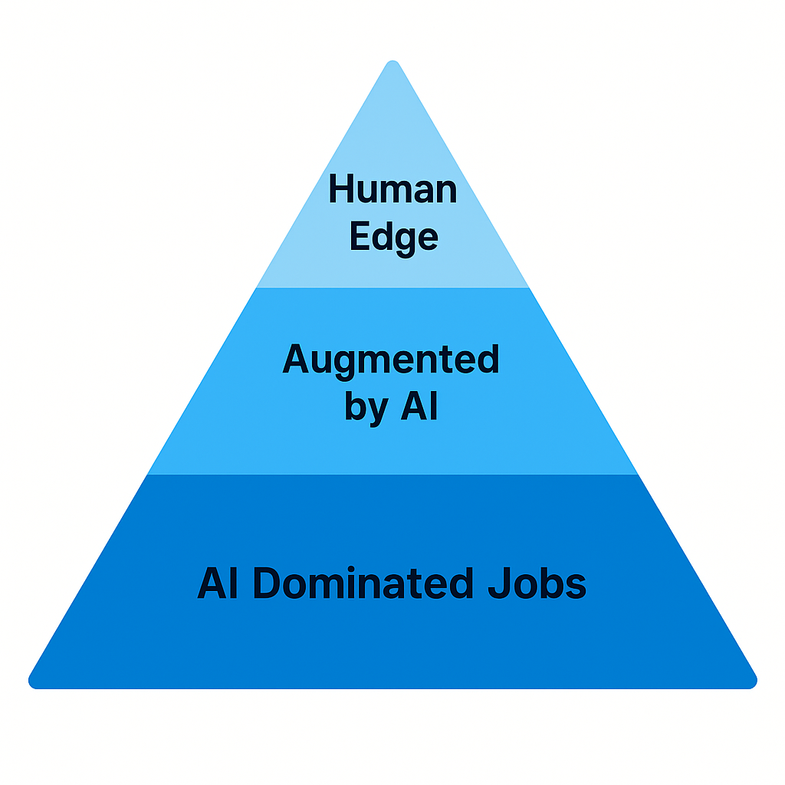

# Surviving the AI Wave: Who Keeps Their Paycheck—and Their Purchasing Power?

The pyramid shows how today’s workforce stacks up against accelerating AI. 

The wide base represents the bulk of routine or rule‑based roles—data entry, basic support, logistics coordination—that AI can already perform faster and cheaper. As algorithms keep improving, this entire layer risks being “AI‑dominated,” meaning millions of people are displaced, not just “assisted.” 

The middle band covers jobs that survive but change: analysts, designers, even doctors who will lean heavily on AI tools. Their output rises, but the headcount still shrinks. Only the narrow tip—strategic decision‑makers, high‑trust crafts, original artists—remains squarely “human edge.”

Here’s the economic rub: lower prices for goods and services help **only if people still have income**. If the pyramid’s broad bottom tier loses wages faster than costs fall, net purchasing power drops. A society can’t rely on cheap products alone when a sizable share of its citizens no longer earn enough to buy them. So, without deliberate redistribution—retraining, reduced workweeks with wage buffers, or some form of basic income—mass job losses at the base threaten overall demand, stalling the very economy the AI efficiency gains were supposed to boost.

Think about the people around you. Who can hold on to their income—and the purchasing power that comes with it—once AI starts doing the same tasks faster and cheaper? Who can truly outperform an algorithm?

Here’s the real question: **where do you stand on that pyramid?**

Enough said.
