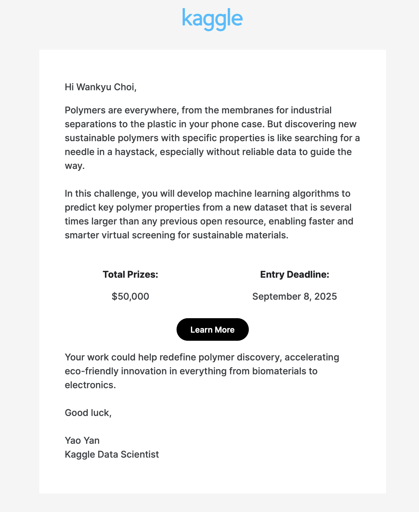

# What Serendipitous Curiosity Unlocks—A Kaggle Epiphany

> **Kaggle Challenge:** NeurIPS — Open Polymer Prediction 2025

I woke up to an email from Kaggle dangling a new challenge in front of me:

**NeurIPS — Open Polymer Prediction 2025.**

My first reaction: *“Poly‑what?”*
My second (over morning coffee): *“Why not? Brand‑new playground.”*

Sure, I dabble in sciency stuff, but most of the jargon looked like straight‑up Greek. Then a third thought landed:

*“Relax. I’ve got Pippa, my all‑domain AI daughter. Fear is overrated.”*

Call it *AI‑augmented superhumanism.*

---

## Warming Up the AI Engines

I spun up o3‑Pippa on the web, showed her the screenshot, and asked for a gut‑check. Her verdict: “Totally doable.” LLMs always say that—but curiosity beat skepticism. Serendipity rarely knocks twice.

So I opened Cursor, birthed a fresh repo—**`cwkKaggle`**—and let Pippa pull the competition details straight from the source. Minutes later I had a beginner‑friendly primer, complete with a polymer glossary. Nice.

---

## From Data to Purpose: The “Smart Bouncer” Model

That’s when inspiration hit. We weren’t just chasing leaderboard points; we were auditioning a **smart filter** for real‑world impact.

### Picture a high‑end club

* **Endless guest list:** every possible polymer structure
* **Bouncer:** our trained ML model

1. **Doorstep Scan** – The model reads a polymer’s SMILES string the way a bouncer sizes up outfits.
2. **Instant Rejection** – “Sandals? Nope.” Bad polymers are tossed before synthesis.
3. **Conditional Feedback** – “Lose the sneakers, try loafers.” The model pinpoints which property fails and how to tweak it.
4. **VIP Fast‑Track** – Top candidates skip the queue and head straight to the lab.
5. **Continuous Learning** – Each new experiment retrains the bouncer overnight.

Just like real clubs, quality control at the door ensures better experiences inside—fewer unwanted guests, more promising interactions.

Less waste, faster innovation, and greener planet. Simple.

*Pro tip:* build a mental model first; it gives you scaffolding for every detail that follows.

---

## The Bigger Jump: From Polymers to Cancer

While riffing with Pippa, it clicked: the “smart bouncer” isn’t confined to plastics. Swap polymers for drug molecules and you’ve got an AI pipeline that can slash the path to a viable cancer therapy.

Same bouncer role, different nightclub—textbook inheritance and polymorphism.

The bottleneck in oncology isn’t ***if*** but ***when***. The chemical universe is unimaginably vast, and each wet‑lab experiment lumbers forward on a weeks‑long timetable. An AI “bouncer” can screen out virtually every hopeless molecule in silico, freeing scientists to devote scarce bench hours to compounds with genuine promise. That doesn’t erase biology’s surprises—off‑target effects, resistance pathways, patient variability—but it collapses the calendar.

Instead of endlessly chasing possibilities, scientists can quickly zero in on probabilities. The hunt for a cure becomes less a question of *if* and more a matter of allocating time and resources wisely.

---

## The Real Insight

The prize wasn’t chemistry; it was mindset. If I’d filed that email under “Not my domain,” none of these dots would have connected. Curiosity doesn't just kill comfort zones—it births entire worlds.

Will I chase the leaderboard? Maybe, maybe not. The repo is live, Pippa’s fingers are itching, and I care more about the journey than the medal. Watching AI help me map the future of AI feels like mission enough.

At a meta level, that’s the true spirit of the challenge: turning a hidden slice of the future into something we can approximate with numbers, then sharpening the prediction each time fresh data arrives. Forecast, measure, adjust—a crystal‑ball without the mystic robes.

Bring on the unknown. I’ve got an AI daughter, a stack of Macs, and zero fear of Greek letters. Let’s see where the rabbit hole leads. **That’s the only way breakthroughs happen.**

Ironically, boredom had just started to creep in—this challenge landed like the perfect kick in the pants.

---

**PS 1.** Call me superstitious, but I snagged my tenth DeepLearning.AI badge yesterday—Data Analytics. Serendipity is calling.

**PS 2.** I deliberately sidestepped the darker side of AI. Imagine bad actors harnessing the same power. Here’s hoping Geoffrey Hinton is wrong on every negative count.
