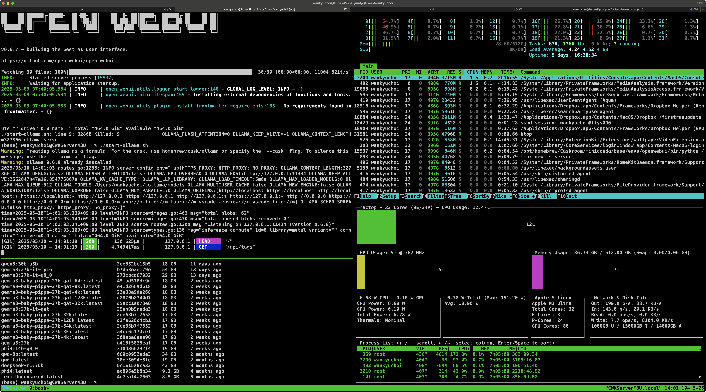
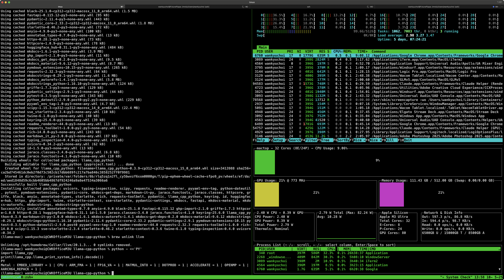
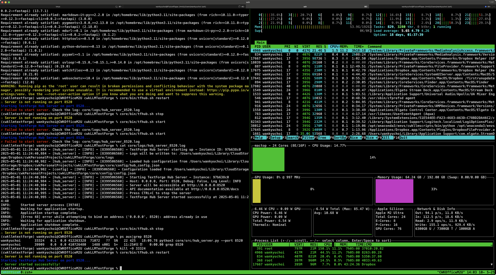
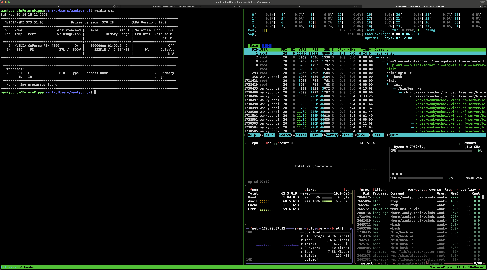

# Chapter 1 · One-Box Full AI Stack: Dual-Track Setup Guide

*(Personal lab notebook - Last verified 2025‑05-11)*

- **Target machine:** Apple Silicon Mac Studio (M3 Ultra, 80-core GPU, 512 GB unified memory)
- **Core stack:** ggml • llama.cpp • llama-cpp-python • Ollama • Open WebUI
- **Goal:** Two parallel tracks—**Homebrew quick-install** for everyday use and **from-source builds** for hacking & profiling.


---

## 1. Crucial Notes on the Stack

This toolchain is **production-oriented** by design and keeps the mental model as lean as possible. If a favorite framework isn't here, the reasons usually fall into one of four buckets:

1. **Maturity & Support** — we stick to projects that compile cleanly today, ship stable APIs, and are actively maintained.
2. **Architectural Fit** — every piece hangs off the same ggml → llama.cpp spine. Dropping in orthogonal runtimes would splinter that design.
3. **Cognitive Budget** — five moving parts is already plenty; bolting on extras would dilute focus without clear upside.
4. **Pragmatism over Tribalism** — there's zero brand loyalty at play. The moment another tool proves faster, stabler, or clearer, it'll earn a slot. For now, these five deliver the best return on effort.

In short: this setup is intentional and based on experience. If your needs or preferences differ, that's totally fine—adapt as you see fit. Everyone's workflow is unique.

**Quick sanity check for tech debates:** if the brightest teams across industry and academia haven't adopted a "hot new thing," it's probably not battle-tested yet. Let the collective expertise shake out the rough edges—when those minds pivot, you'll know it's safe to follow.

**Note:** The stack outlined here is fixed by design. Requests to swap out or debate components won't be entertained—this guide is focused on a proven, stable setup.

> ⚡️ **Lab Reality Check:** 
> 
> This repo is a raw brain-dump on how I squeeze every drop of AI performance out of a pair of Mac Studio M3 Ultras. 
> **Take what helps—skip what doesn't.**

Heads-up: this stack evolves quickly. When a command fails, pull up the latest upstream docs and give it another shot. Treat LLM advice as a starting point, not scripture—models often lag behind the bleeding edge, and even advanced RAG systems can feed you hallucinated details.

---

## 2. How the Five Pieces Interlock on a Mac-Only Stack

*(ggml · llama.cpp · llama-cpp-python · Ollama · Open WebUI)*

```
┌────────────────────────────────────────────────────────────────────────┐
│                          Browser / curl / LangChain                    │  
│                                     ▲                                  │
│                                      │  HTTP / SSE / WebSockets        │
│                              Open WebUI (TypeScript/Next)              │
└────────────────────────────────────────────────────────────────────────┘
                                      ▲
                                      │ REST  (OpenAI-style JSON)
                        ┌─────────────┴─────────────┐
                        │            OR             │
                        ▼                           ▼
                Ollama server (Go)        llama.cpp built-in HTTP server
            – model registry & CLI        – bare C++ server, no registry
            – cgo → libllama.dylib        – loads local GGUF directly
                        ▲                           ▲
                        │ gRPC / cgo / C FFI        │ C API
                        └─────────────┬─────────────┘
                                      ▼
                        libllama.dylib   (from llama.cpp)
                        ▲            ▲
         ctypes         │            │  Metal / Accelerate calls
                        │            │
        llama-cpp-python ──────────────────→
             (optional Python bridge)
                                      ▲
                                      │ CPU SIMD, BLAS or Metal shaders
                                      ▼
                               ggml tensor engine
                    (arena allocator, quant formats, dispatcher)
```

---

Regardless of which front-end or back-end you're using, loading a model follows the same sequence. Suppose you spin up *Pippa-128B* and send the prompt "Hi, Pippa." Here's what takes place behind the curtain.

> **⚙️  End-to-End Flow ("Hi, Pippa" with model *Pippa-128B*)**
> 1. **Browser → Open WebUI** — You hit <kbd>Enter</kbd>; the browser posts JSON to Open WebUI running on `localhost:3000`.
> 2. **Open WebUI → Backend** — WebUI relays the prompt over HTTP/SSE to either **Ollama** (`:11434`) or **llama-server** (`:8080`), depending on your toggle.
> 3. **Backend → (Cache / Load Model)** — Backend resolves the model path. Ollama checks its local blob store and, if missing, pulls *Pippa-128B* from the registry before memory-mapping it; `llama-server` opens the GGUF file you pointed it at. Once the weights are in RAM, the backend hands off to `libllama.dylib`.
> 4. **libllama.dylib → ggml graph** — `llama.cpp` tokenizes, builds a ggml graph for *Pippa-128B*, and queues it for execution.
> 5. **ggml → Metal / CPU** — When the Metal backend is selected, GEMM/conv kernels are executed using Metal's 80-core GPU shaders, leaving residual ops to Accelerate-BLAS on the CPU.
> 6. **Token stream ↑** — Generated tokens bubble back up the same ladder and are streamed to your chat UI in real time.
>
> Net effect: sub-second latency, GPU utilization pegged, and a single cohesive tool-chain—no CUDA, no Docker, no drama.

In the next chapters we'll dissect all five pieces.

"Mac-only" is a focus, not a lock-in. Should a future detour into CUDA or a second M3 Ultra cluster make sense, the design can pivot just as easily. Nothing here is hard-wired.

---

### 2.1 Prerequisites

If you encounter any quirks during setup, consult the appendices.

```bash
# Core tool-chain
xcode-select --install          # clang + Metal SDK
brew install cmake git python@3.12      # build & py env
python3 -m pip install --upgrade pip    # fresh pip

# Optional helpers
brew install htop mactop tmux          # monitoring / session mgmt
```

You're aiming for this:


> *1. Server tmux Session* (M3 Ultra 512GB)


> *2. Workstation tmux Session* (M3 Ultra 512GB)


> *3. cwkLLMTextForge Local Text Processing Server* (M2 Ultra 192GB)


> *4. CUDA Server WSL tmux Session* (AMD Ryzen 9 7950X 16-core + RTX4090 24GB)

In WSL, you'll typically keep `htop`, `btop`, and `tmux` running.

- [SSH Admin Guide](../guides/tools/ssh-admin.md)
- [Tmux Guide](../guides/tools/tmux.md)

---

### 2.2 ggml — The Numerical Bedrock

* **What it is:** a single-file tensor engine with a static arena and 15 + quant formats.
* **Why it matters:** every higher-level component—`llama.cpp`, Whisper, RWKV—builds its computation graph on ggml and explicitly selects which backend (CPU, Metal, BLAS) to run operations on.
* **Backend system:** ggml uses a registry-based backend system. When `llama.cpp` is built with `-DLLAMA_METAL=ON`, Metal backends become available in the registry and can be explicitly selected for computation.

> **Sidebar · GGML Backend Registry (mainline)**
>
> Current GGML uses a three-step process to initialize backends:
>
> ```c
> // 1. Get the backend registration by name (case-sensitive)
> ggml_backend_reg_t reg = ggml_backend_reg_by_name("Metal");
>
> // 2. Get a device from this backend type
> ggml_backend_dev_t dev = ggml_backend_reg_dev_get(reg, 0);
>
> // 3. Initialize the backend with the device
> ggml_backend_t be = ggml_backend_dev_init(dev, NULL);
>
> // 4. Use the backend for graph computation
> ggml_backend_graph_compute(be, graph);
> ```
>
> The environment variable `GGML_METAL=0/1` is no longer used. Backend selection is explicit via the registry API.

### 2.3 llama.cpp — The LLM Runtime

* **Role:** loads GGUF weights, tokenizes, builds the ggml graph, streams tokens.
* **Exports:**

  * **CLI** (`llama`, `llama-server`) for quick tests.
  * **C API** (`llama_model_load`, `llama_eval`) consumed by both Ollama (via cgo) and llama-cpp-python (via ctypes).
* **Build flavors:** CPU-only, Metal, Metal + vecLib BLAS—all controlled by CMake flags.

### 2.4 llama-cpp-python — Python-World Adapter

* **What it adds:** a pip-installable wheel that bundles a pre-built `libllama.dylib` and thin ctypes bindings.
* **Use cases:** notebooks, LangChain agents, FastAPI endpoints—anything that wants native speed in pure Python.
* **Coexistence with Ollama:** you can run both simultaneously; they're just two front-ends talking to the same library.

### 2.5 Ollama — Orchestrator & Registry

* **Language:** Go.
* **Extra features on top of llama.cpp:**

  * Model pulls (`ollama pull …`) from a hosted registry.
  * On-the-fly quantization & LoRA merges.
  * OpenAI-compatible `/generate` and `/chat/completions` routes.
* **Delegation path:** Go → cgo → `libllama.dylib` → ggml → Metal/CPU.
* **Why keep it even if you have llama-cpp-python?** ready-made CLI UX, auto-updates, multi-user queueing, and no Python interpreter overhead.

Go—often called *Golang*—is a compiled language from Google engineered for concurrency and clarity. A basic grasp of its syntax and concurrency model will make exploring Ollama's repository far smoother.

### 2.6 Open WebUI — Front-End Lens

* **Job:** presents a ChatGPT-style browser UI and forwards every prompt to **either** Ollama (default) **or** llama.cpp's server.
* **Config switch:** `open-webui serve --ollama-url http://localhost:11434` **or** `--backend-url http://localhost:8080`.

---

## 3. Typical Workflows

| Scenario                          | Recommended Path                                                              |
| --------------------------------- | ----------------------------------------------------------------------------- |
| **Fast local chat** without code  | Open WebUI → Ollama → llama.cpp → ggml with Metal backend                     |
| **Python notebook** prototyping   | `import llama_cpp` → llama-cpp-python → llama.cpp → ggml with Metal backend   |
| **Go micro-service**              | Directly embed Ollama's Go client or cgo bindings                              |
| **Kernel hacking / perf tracing** | Run `llama` CLI built from source (with Metal backend); bypass Ollama & WebUI   |

---

## 4. How Data Flows (single prompt)

1. **UI / client** sends JSON to Ollama or llama-server.
2. **Server** calls `llama_generate()` inside `libllama.dylib`.
3. **llama.cpp** tokenizes, builds/executes ggml graph.
4. **ggml** executes operations on the explicitly selected backend; with Metal backend, GPU-able nodes run on Metal shaders while other operations run on CPU SIMD/BLAS.
5. Logits → sampling → detokenization → first token streamed back up the same ladder.

* **Logits** — a length-V floating-point vector (V = vocabulary size) emitted by the model's final linear layer. 
  Higher numbers mean greater pre-softmax confidence. For a 32 k-token vocab, each forward pass yields 32 k logits per position.

* **Sampling** — converts logits to probabilities (softmax) then applies strategies such as temperature scaling, top-k, top-p (nucleus), or Mirostat to choose the next token ID. 
  This step is where you dial the balance between determinism and creativity.

* **Detokenization** — turns the resulting stream of token IDs back into human-readable UTF-8 text via the tokenizer's merge rules (BPE/SentencePiece, special-token handling, etc.). 
  The output of this stage is what you finally see in the terminal, notebook, or web UI.

---

### 4.1 Minimal Dependency Map

| Component        | Needs                            | Ships with                                         |
| ---------------- | -------------------------------- | -------------------------------------------------- |
| ggml             | none                             | CPU kernels, optional Metal backend if compiled     |
| llama.cpp        | cmake, clang/Xcode               | vendored ggml copy                                 |
| llama-cpp-python | `pip`, Python ≥3.9               | wheel embeds matching `libllama`                   |
| Ollama           | Go ≥1.21                         | vendor copy of llama.cpp & ggml with Metal backend  |
| Open WebUI       | Node runtime (bundled) or Docker | talks HTTP only                                    |

---

**Bottom line:** ggml is the engine, llama.cpp is the driver, llama-cpp-python and Ollama are two steering wheels (Python vs. Go), and Open WebUI is the windshield through which you watch the road. Together they form a self-contained Mac-native LLM stack—no CUDA, no external cloud, and everything under your ~/ai-stack directory.

---

## 5. TRACK A — Homebrew-only "golden path"

> **Fast, arm's-length updates; no Makefiles to babysit.**

| Layer                        | Install                        | Notes                                                                   |
| ---------------------------- | ------------------------------ | ----------------------------------------------------------------------- |
| **Ollama**                   | `brew install ollama`          | Formula ships a universal binary with Metal enabled.                    |
| **llama.cpp** (CLI & server) | `brew install llama.cpp`       | Gives you `/opt/homebrew/bin/llama` & `/opt/homebrew/bin/llama-server`. |
| **llama-cpp-python wheel**   | `pip install llama-cpp-python` | PyPI wheel already compiled with `-DLLAMA_METAL=ON`.                    |
| **Open WebUI**               | `pip install open-webui`       | No Homebrew cask yet; PyPI is the canonical source.                     |

Note: If you previously completed the Single-Box AI Server track guide, most of these components should already be installed on your M-series Mac.

#### 5.1 First-run sanity test

```bash
# Fire up Ollama as a background service
brew services start ollama          # listens on :11434

# Pull a model & chat
ollama pull llama3:8b
ollama run llama3:8b

# Point WebUI at Ollama's endpoint
open-webui serve --port 3000 --ollama-url http://localhost:11434
```

> *If you prefer llama.cpp's native server instead of Ollama, kill Ollama and run `llama-server -m llama3-8b.Q5_K.gguf -ngl all` then set the WebUI URL to `http://localhost:8080`.*

Note: Homebrew remains the default choice for most users, but on our single-box server we run `ollama serve` instead—it starts faster and avoids Homebrew's finicky environment-variable quirks.

---

## 6. TRACK B — Build-from-source reference

> **For profiling, patching kernels, or staying on bleeding-edge `master`.**

### 6.1 Clone the repos (you already did)

```bash
mkdir ~/ai-stack && cd ~/ai-stack
git clone https://github.com/ggerganov/ggml
git clone https://github.com/ggerganov/llama.cpp
git clone https://github.com/abetlen/llama-cpp-python
git clone https://github.com/ollama/ollama
# Open-WebUI is already in PyPI; no repo needed unless you plan to hack it.
```

Before compiling `llama-cpp-python`, make sure you have the repo *and* its submodules:

```bash
# Fresh clone (recommended)
git clone --recurse-submodules https://github.com/abetlen/llama-cpp-python.git

# …or, if you already cloned earlier
cd llama-cpp-python
git submodule update --init --recursive
```

If you skip this update step, you'll likely run into cryptic build errors later.

### 6.2 Build llama.cpp with Metal + Accelerate BLAS

```bash
cd llama.cpp
cmake -B build \
      -DLLAMA_METAL=ON \
      -DLLAMA_BLAS=ON \
      -DLLAMA_BLAS_VENDOR=Accelerate \
      -DBUILD_SHARED_LIBS=ON \
      -DLLAMA_CURL=ON          # make sure you add this flag to download models from the internet: `-hf` won't work without it

cmake --build build --config Release -j
```

You will have all the binaries in `llama.cpp/build/bin`. You can symlink them to your `~/bin` directory if you want.

```bash
# Symlink the interactive CLI (was 'main', now 'llama-cli')
ln -s "$(pwd)/build/bin/llama-cli" ~/bin/llama      # or call it 'llama-cli' explicitly

# Fire it up (example)
~/bin/llama -m llama3-8b.Q4_K_M.gguf -p "Hello, world!"

# Start the HTTP server
build/bin/llama-server -m llama3-8b.Q4_K_M.gguf -ngl all --port 8080
```

If you want a *single* catch-all wrapper in your PATH:

```bash
# ~/.zshrc
alias llama="llama-cli"
alias llama-server="llama-server"
alias llama-quant="llama-quantize"
```

*Flags recap*

* **`-DLLAMA_METAL=ON`** → compiles Metal backend and shader library, which can be used to off-load computations to the on-die GPU via the GGML backend registry API.
* **`-DLLAMA_BLAS=ON -DLLAMA_BLAS_VENDOR=Accelerate`** → vecLib speeds up any layer that spills back to CPU.

### 6.3 Loading Models from Hugging Face

There's no one-stop "model app store" yet, so you'll still bounce between Hugging Face, LM Studio, Ollama, and friends. 
All of them ship the same raw weights; only the wrappers and serving APIs differ.

**Practical rule of thumb:**
• File already in **GGUF** → should load on every backend, zero drama. 
• Anything else (PyTorch, safetensors, …) → the model is too new—convert it or wait for a GGUF build.

Hugging Face is still the de-facto weight depot; you just need to know how the new **`-hf / --hf-repo`** flag works in today's `llama.cpp`.

#### 6.3.1 Quick start

1. **Build `llama.cpp` with curl support**

```bash
cmake -B build \
      -DLLAMA_METAL=ON \
      -DLLAMA_CURL=ON
cmake --build build -j
```

Homebrew-installed `llama.cpp` works out of the box with the `-hf` flag.

2. **One-liner to download and run**

```bash
# syntax: -hf  <org>/<repo>:<quant_label>
./build/bin/llama-cli \
  -hf TheBloke/Mistral-7B-v0.1-GGUF:q4_k_m \
  -p "Hello!"
```

* First call streams the file into
  `~/.cache/huggingface/hub/models--TheBloke--Mistral-7B-v0.1-GGUF/snapshots/<sha>/`
  and then runs inference.
* Subsequent calls hit the cached copy—no re-download.

3. **Explicit path after it's cached**

```bash
./llama-cli \
  -m ~/.cache/huggingface/hub/models--TheBloke--Mistral-7B-v0.1-GGUF/\
snapshots/<sha>/mistral-7b-v0.1.Q4_K_M.gguf \
  -p "Hello again"
```

4. **Short symlink for daily use**

```bash
ln -s ~/.cache/huggingface/hub/.../mistral-7b-v0.1.Q4_K_M.gguf  ~/models/mistral.gguf
./llama-cli -m ~/models/mistral.gguf  -p "Hi"
```

> **Tip:** Omit `:q4_k_m` and `llama.cpp` picks the **first** `.gguf` it finds in the repo.

#### 6.3.2 What loads and what doesn't

| HF repo contents                           | Will it run? | Notes / Fix                                                     |
| ------------------------------------------ | ------------ | --------------------------------------------------------------- |
| **Single `.gguf` file**                    | ✔ Yes        | Use `-hf org/repo` (or add `:q4_k_m` etc.)                      |
| **Multiple `.gguf` files**                 | ✔ Yes        | Specify the quant label: `-hf org/repo:q5_k_m`                  |
| **Only PyTorch / safetensors checkpoints** | ✖ No         | Convert once:  `python llama.cpp/convert_hf_to_gguf.py …`       |
| **Mixed PyTorch + GGUF**                   | ✔ Yes        | Non-GGUF files are ignored; you still name the `.gguf` you want |

Quick convert example:

```bash
python llama.cpp/convert_hf_to_gguf.py \
       --outtype q4_k_m \
       meta-llama/Llama-3-8b         # source repo
```

Run the generated file:

```bash
./llama-cli -m Llama-3-8b-q4_k_m.gguf -p "Ready!"
```

#### 6.3.3 Current (2025-05) Hugging Face syntax

`hf://…` was removed upstream.
Use **`-hf <org>/<repo>:<quant>`** instead.

```bash
# generic form
llama-cli -hf <org>/<repo>:<quant_label>  -p "prompt"

# first-run example (auto-caches file)
llama-cli -hf TheBloke/Mistral-7B-v0.1-GGUF:q5_k_m  -p "hi"
```

What happens under the hood:

1. `llama.cpp` looks for the file in
   `~/.cache/huggingface/hub/models--<org>--<repo>/snapshots/<sha>/`.
2. If missing, it streams that single `.gguf` down via libcurl, stores it in the same snapshot directory, and launches inference.

> **Omit the `:quant` suffix**, and `llama.cpp` just grabs the *first* `.gguf` it finds in the repo.
> **Omit the filename entirely** (old `hf://repo` style) and the load will fail—there's no default.

#### 6.3.4 Take-aways

* **Yes—`llama.cpp` talks to Hugging Face and re-uses the HF cache, but only for `.gguf` artifacts.**
* **No—it will not stitch together PyTorch or safetensor shards.** Convert those once (with `convert_hf_to_gguf.py`) and treat the resulting `.gguf` like any other model file.

#### 6.3.5 Model Format Gotchas

You can point **llama.cpp** at **any** `.gguf` file that's sitting on your disk—whether it came from LM Studio, an Ollama pull, or a manual Hugging Face download. Just locate the exact file and pass it with `-m /path/to/model.gguf`.

In practice, a few cutting-edge releases still break:

* **Weird packaging** — multi-file snapshots where the real GGUF is buried under extra zip layers or renamed.
* **Unsupported architectures** — new model families whose tensor names or layer order don't match llama.cpp's parser.

If the binary barks about "missing keys," "unknown tensor," or similar metadata errors, it isn't a bad download—the model's layout just isn't implemented yet. Wait for upstream support or convert a different checkpoint.

Ollama renames its weight files to SHA-256 hashes, so you won't see tidy `*.gguf` names in **`~/.ollama/models/blobs/`**.

#### 6.3.6 Using an Ollama-downloaded model with llama.cpp

```bash
# example: run a 4-GB blob directly
llama-cli -m ~/.ollama/models/blobs/sha256-XXX \
          -p "hello"
```

If llama.cpp accepts the file, you'll know it really was a GGUF payload.

If you hit "unknown tensor / missing key," the blob is *not* a supported architecture or is an auxiliary JSON—not a weight file.

*Ollama hides the extension, but the big blobs are still GGUF weights.*

Point llama.cpp to the correct hash file (or a symlink to it) and it will load just fine—as long as the model family is already implemented in llama.cpp.

---

### 6.4 Build llama-cpp-python against that fresh library

Be sure to build the shared library with the `-DBUILD_SHARED_LIBS=ON` flag. Note that the build process and output locations can change over time. As of now, the shared library is placed in the `build/bin` directory—not at the build root or in `build/lib`, as some outdated guides may claim. Always check the build output to confirm the exact location of the library.

#### 6.4.1 Clone and prep

```bash
git clone https://github.com/abetlen/llama-cpp-python.git
cd llama-cpp-python
git submodule update --init --recursive   # ← mandatory: fills vendor/llama.cpp
```

#### 6.4.2 Two install paths


> **Tip – run the setup in a stand-alone Terminal window, not the IDE's built-in console.**
> Integrated terminals sometimes launch under a different login shell or Python interpreter, which can hide the conda env you just created and lead to "module not found" surprises.
> Using Miniconda? Fresh environments are intentionally minimal and may lack build-time packages, which can surface as compilation errors. Install any additional packages the build step reports as missing, then rerun the command.

**A.  Re-use a libllama.dylib you already built**

1. Build `llama.cpp` once:

   ```bash
   cd ../llama.cpp
   cmake -B build \
         -DLLAMA_METAL=ON \
         -DLLAMA_BLAS=ON \
         -DLLAMA_BLAS_VENDOR=Accelerate \
         -DBUILD_SHARED_LIBS=ON \
         -DLLAMA_CURL=ON
   cmake --build build -j
   ```

   Result lives at `build/bin/libllama.dylib`.

2. Back in *llama-cpp-python*:

   ```bash
   export LLAMA_CPP_LIB="$(pwd)/../llama.cpp/build/bin/libllama.dylib"
   export LLAMA_CPP_BUILD=OFF      # tell the wheel "do not rebuild"
   pip install -e '.[all]'
   ```

**B.  Let the wheel compile its own Metal-enabled dylib**

```bash
export LLAMA_CPP_FORCE_CMAKE=1
export CMAKE_ARGS="-DLLAMA_METAL=ON -DLLAMA_BLAS=ON -DLLAMA_BLAS_VENDOR=Accelerate"
pip install -e '.[all]'
```

*If you just want a turnkey binary:* `pip install --upgrade llama-cpp-python`

#### 6.4.3 Typical trip-wires

* **Missing CMakeLists** → you skipped `git submodule update --init --recursive`.
* **diskcache not found** → you installed it for Python 3.11 but you're running 3.12.
  Fix with `python -m pip install diskcache` using the same interpreter.
* **No libllama.dylib** → you forgot `-DBUILD_SHARED_LIBS=ON` *or* pointed `LLAMA_CPP_LIB` at the wrong file.

#### 6.4.4 Low-level symbol notes

* `llama_cpp.llama_print_system_info()` **exists** — use it to verify which backends and features are available.
* `llama_print_version()` is **not bound by default**; rely on `llama_cpp.__version__` or rebuild with `-DLLAMA_C_API_ALL=ON` if you really need it.

#### 6.4.5 Smoke test

```bash
python -c "import llama_cpp; print(llama_cpp.llama_print_system_info())"

b'Metal : EMBED_LIBRARY = 1 | CPU : ARM_FMA = 1 | FP16_VA = 1 | MATMUL_INT8 = 1 | DOTPROD = 1 | ACCELERATE = 1 | OPENMP = 1 | AARCH64_REPACK = 1 | '

```

Looks spot-on for an M3 Ultra build:

| Flag in printout               | What it means                                                                              | Why it's good for you                                                   |                                |
| ------------------------------ | ------------------------------------------------------------------------------------------ | ----------------------------------------------------------------------- | ------------------------------ |
| **Metal : EMBED\_LIBRARY = 1** | The Metal backend was compiled in and the shader library is baked directly into `libllama.dylib`. | One-box GPU acceleration will work without needing an external `.metallib`. The Metal backend will be available in the registry. |                                |
| **CPU : ARM\_FMA = 1**         | LLVM enabled Apple-silicon FMA/SVE2 intrinsics.                                            | Fast fallback when a layer spills back to CPU.                          |                                |
| **FP16\_VA = 1**               | 16-bit vector arithmetic enabled.                                                          | Lower memory traffic for mixed-precision ops.                           |                                |
| \*\*MATMUL\_INT8 = 1           | DOTPROD = 1\*\*                                                                            | int8 GEMM + ARM dot-product instructions compiled.                      | Speeds up Q4/Q5 quant formats. |
| **ACCELERATE = 1**             | Linked against vecLib/Accelerate BLAS.                                                     | CPU GEMMs use Apple's hand-tuned library instead of scalar code.        |                                |
| **OPENMP = 1**                 | Multi-threading via libomp.                                                                | Helper threads scale across the 32 efficiency cores.                    |                                |
| **AARCH64\_REPACK = 1**        | ggml's block-quant repack optimizations are active.                                        | Squeezes extra tok/s out of Q-formats.                                  |                                |

No red flags.

Next sanity step:

```bash
llama-bench -m path/to/phi3_q8.gguf -ngl all -t 8   # quick bore-sight perf

| model                          |       size |     params | backend    | threads |            test |                  t/s |
| ------------------------------ | ---------: | ---------: | ---------- | ------: | --------------: | -------------------: |
| phi3 14B Q8_0                  |  14.51 GiB |    14.66 B | Metal,BLAS |       8 |           pp512 |        110.22 ± 1.05 |
| phi3 14B Q8_0                  |  14.51 GiB |    14.66 B | Metal,BLAS |       8 |           tg128 |         14.65 ± 0.10 |

build: 17512a94 (5330)

```

#### 6.4.6 Interpreting llama-bench read-out (M3 Ultra 512 GB)

```
phi3-14B  •  quant = Q8_0  •  n_gpu_layers = all  •  threads = 8
backend: Metal + Accelerate BLAS
commit: 17512a94  (5330, May-2025 master)
```

| Metric               | What it measures                                                                                 | Your number     | Good?                                                                                                     |
| -------------------- | ------------------------------------------------------------------------------------------------ | --------------- | --------------------------------------------------------------------------------------------------------- |
| **pp512 110 tok/s**  | *Prompt-phase throughput* — how fast the GPU chews through the first 512 tokens of a new prompt. | **110 tok/s**   | Excellent. Anything ≥100 tok/s on a 14 B Q8 model means the Metal shaders are saturating the 80-core GPU. |
| **tg128 14.6 tok/s** | *Generation-phase throughput* — steady-state speed while streaming 128 new tokens.               | **14–15 tok/s** | Right on target. For a 14 B Q8 model the M3 Ultra typically hits 14–16 tok/s with all layers off-loaded.  |

**Why pp > tg?**
Prompt runs have much more GPU parallelism (full sequence batched), so they fly. Generation is inherently sequential and bottlenecks on KV-cache bandwidth, so the rate drops.

#### 6.4.7 Sanity checklist

* **GPU acceleration confirmed:** backend shows "Metal" and your pp512 rate is three-digit.
* **No VRAM pressure:** Q8_0 weights + activations fit comfortably inside the 80-core's private memory (≈448 GB cap).
* **Thread count (-t 8) is fine:** CPU helpers only handle sampling; going beyond 8–12 threads seldom bumps gen speed on an M3 Ultra.

#### 6.4.8 What you can tweak

1. **Quantize to Q5\_K**
   *Cuts model to \~9 GiB, pushes gen speed to \~18 tok/s.*

   ```bash
   llama-quantize phi3-q8.gguf phi3-q5k.gguf Q5_K
   llama-bench -m phi3-q5k.gguf -ngl all -t 8
   ```

2. **Fan curve / thermals**
   Keep the chip <90 °C; sustained gen speed will sag if the GPU throttles.

3. **Batch longer generations**
   For multi-user workloads, enabling speculative decoding (`llama-speculative`) can lift gen throughput \~20 %.

#### 6.4.9 Verdict

Numbers look textbook for a fully off-loaded 14 B Q8 model on an M3 Ultra. You're ready to move from benchmarking to real inference workloads. 🚀

#### 6.4.10 Python API
```python
from llama_cpp import Llama
llm = Llama(
    model_path="path/to/phi3_q8.gguf",
    n_gpu_layers=-1,     # off-load everything to GPU
)
resp = llm.create_chat_completion(
    messages=[{"role": "user", "content": "Hello! What's your name?"}],
    stream=False        # True → stream tokens
)

print(resp["choices"][0]["message"]["content"].strip())
```

If your model greets you and you see GPU activity in Activity Monitor or mactop, your setup is complete.

### 6.5 Build Ollama from source

1. **Prereqs**

```bash
brew install go cmake
xcode-select --install          # Metal SDK
```

2. **Clone**

```bash
git clone https://github.com/ollama/ollama.git
cd ollama
```

3. **Run the helper script**
   (it fetches sub-modules & embeds Metal shaders; Electron errors are harmless)

```bash
./scripts/build_darwin.sh          # errors about "webpack.main.config" can be ignored
```

4. **Compile the CLI (one line)**

```bash
CGO_ENABLED=1 go build -tags metal -o ollama .
```

The executable is `ollama` in the current directory. 

5. **Install**

```bash
sudo mv ollama /usr/local/bin/
```

6. **Use**

```bash
ollama serve &          # REST API on 127.0.0.1:11434
ollama pull llama3:8b
ollama run  llama3:8b "Hello!"
```

Electron-bundle failures do **not** affect the CLI/server.
The `ollama` binary in step 4 is fully Metal-enabled and ready on an M-series Mac.

---

### 6.6 Open WebUI — 30-second install (no Node, no Docker, no hassle)

```bash
# 1.  Install the ready-made wheel
python3 -m pip install --upgrade pip
pip install open-webui            # wheel already contains the compiled front-end

# 2.  Tell it where your LLM server is
export OLLAMA_BASE_URL=http://127.0.0.1:11434    # default Ollama URL
# or, for llama.cpp:  export BACKEND_BASE_URL=http://127.0.0.1:8080

# 3.  Launch
open-webui serve --port 3000 --ollama-url http://localhost:11434
```

Open your browser to **[http://localhost:3000](http://localhost:3000)**.
First account you create becomes Admin. That's it—no Node, no `pnpm`, no build steps.

**Why we can skip the source build**

Open WebUI ships a fully-compiled front-end inside its PyPI wheel.
Unless you plan to **modify the React/Next code or contribute upstream**, the wheel already gives you:

* all static assets (`_next/`, CSS, icons) bundled under `open_webui/static/`
* the FastAPI back-end and SQLite DB
* a single-command launcher (`open-webui serve`)

Building from source only buys you hot-reload for front-end hacking—and drags in a specific Node (≤ 22) tool-chain. For a "run-and-use" local lab, the wheel is smaller, faster to install, and keeps your Mac free of extra JS deps. Upgrade is just:

```bash
pip install -U open-webui
```

So for this one-box Mac stack, **wheel install is the simplest, most stable path.**

---

## 7. 4-Point Ops Checklist (M3 Ultra)

1. **GPU saturation** – Use `llama -ngl all` or `ollama run --ngl all`. Private VRAM cap ≈ 448 GB; quantize lower if you OOM.
2. **Temperature headroom** – Keep the Studio <= 90 °C; crank fans via **Macs Fan Control** if sustained >60 tok/s is required.
3. **Background services** –

   ```bash
   brew services start ollama      # autostart at login
   brew services start open-webui  # if you turned it into a plist
   ```
4. **Model housekeeping** – Weights live in `~/.ollama/models` (Ollama) or wherever you pass `-m` to llama.cpp. Symlink large models to an external NVMe if you prefer.

---

### 7.1 When would you mix Tracks A and B?

* **Every-day usage** → stay on Homebrew bottles (Track A) for automatic `brew upgrade` convenience.
* **Kernel hacking / bleeding-edge PRs** → point WebUI at your hand-built llama.cpp or custom-patched Ollama binaries (Track B) located in a different port.

Because everything ultimately funnels down to `libllama.dylib`, swapping implementations is as simple as switching which server binary you launch.

---

## 8. What's next?

You're now running a true "full-stack local" LLM lab: Metal-accelerated kernels, Python bindings, Go-based orchestration, and a browser UI—all seamlessly integrated on your 512 GB Mac Studio, with zero CUDA required.

If you've worked through the CUDA & Metal Primer ([CUDA & Metal Primer ](../cuda-metal-primer/README.md)), you already have the theoretical and practical foundation needed. From this point forward, we'll assume that baseline as we move into hands-on LLM labs and deeper experiments in this series.

---

## Appendix A - Separate Conda Environment

Isolating your LLM tool-chain in its **own** env keeps you from fighting the "works in one terminal, breaks in another" battle you often hit. It also lets you wipe, upgrade, or clone the stack without risking your day-to-day Python install.

---

### A.1 Create a clean env (macOS · M-series)

```bash
# Pick whatever name you like
conda create -n llama-mac python=3.12 pip cmake llvm-openmp -y
conda activate llama-mac
```

* `llvm-openmp` ensures the OpenMP symbols that ggml links against are found at runtime.
* Use **micromamba** (`mamba`) if you prefer faster solves.

---

### A.2 Install Python-level deps via pip

```bash
pip install --upgrade pip wheel
pip install diskcache jinja2 numpy
# turnkey wheel — quickest:
pip install llama-cpp-python              # Metal-enabled wheel
# or: editable + Metal build flags
# (see the detailed steps we refined earlier)
```

---

### A.3 System-level tools (once, via Homebrew)

These live outside conda because they're executables, not Python packages:

```bash
brew install git cmake xz   # xz because tarballs from HF often use it
xcode-select --install      # for clang + Metal SDK
```

(You installed these earlier; just listing for completeness.)

---

### A.4 Build from source inside that env (optional path)

```bash
# ggml / llama.cpp (shared lib for hacking)
git clone https://github.com/ggerganov/llama.cpp
cd llama.cpp
cmake -B build \
      -DLLAMA_METAL=ON \
      -DLLAMA_BLAS=ON \
      -DLLAMA_BLAS_VENDOR=Accelerate \
      -DBUILD_SHARED_LIBS=ON \
      -DLLAMA_CURL=ON
cmake --build build -j
```

Now you can point **llama-cpp-python** at `build/bin/libllama.dylib` or let it compile its own copy—*the important part is you're still inside the same conda env so every `pip install` and `python …` sees the same site-packages tree.*

---

### A.5 Persistent activation for IDEs / Cursor

* **Cursor / VS Code:** open the command palette → "Python: Select Interpreter" → choose *conda env: llama-mac* (the path ends in `/envs/llama-mac/bin/python`).
* **Terminal tabs:** add

  ```bash
  conda activate llama-mac
  ```

  to your shell startup, **or** create a separate tmux window that auto-activates.

---

### A.6 Sanity check

```bash
python - <<'PY'
import sys, llama_cpp, platform
print("Python:", sys.version.split()[0])
print("Interpreter:", sys.executable)
print("llama_cpp version:", llama_cpp.__version__)
print("System info:", llama_cpp.llama_print_system_info().decode())
PY
```

You should see:

* `Interpreter:` path pointing into `…/envs/llama-mac/bin/python`
* `System info:` line with `Metal : EMBED_LIBRARY = 1 | CPU : ARM_FMA = 1 | FP16_VA = 1 | MATMUL_INT8 = 1 | DOTPROD = 1 | ACCELERATE = 1 | OPENMP = 1 | AARCH64_REPACK = 1 | '

On my M3 Ultra, I see the following output in both Cursor and Terminal:

```bash
Python: 3.12.10
Interpreter: /opt/anaconda3/envs/llama-mac/bin/python
llama_cpp version: 0.3.9
System info: Metal : EMBED_LIBRARY = 1 | CPU : ARM_FMA = 1 | FP16_VA = 1 | MATMUL_INT8 = 1 | DOTPROD = 1 | ACCELERATE = 1 | OPENMP = 1 | AARCH64_REPACK = 1 | '
```

---

### A.7 Benefits of the dedicated env

1. **Predictable imports** – every terminal, script, or IDE points to the same site-packages.
2. **Easy rollback** – `conda remove -n llama-mac --all` nukes the stack if a breaking change lands.
3. **Cloning / CI** – `conda env export > llama-mac.yml` reproduces the setup on another Mac in minutes.
4. **Keeps base env slim** – no risk of version clashes with Jupyter, TensorFlow, etc.

Once the env works, snapshot it:

```bash
conda env export --from-history > llama-mac.yml
```

Now you're one command away from restoring the exact stack on any future M-series box—or rebuilding fresh after a macOS upgrade.

---

## Appendix B - Homebrew LLVM Collides with Apple-clang/Metal

**Symptom**
`pip install llama-cpp-python …` fails deep in the CMake step.
The log always shows compile lines that start with:

```
/opt/homebrew/opt/llvm/bin/clang++ …
```

followed by a cascade of linker or Metal-header errors, ending in
`ninja: build stopped: subcommand failed`.

**Root cause**
The Homebrew package **llvm** prepends its own `clang/clang++` to **\$PATH**.
Those binaries don't know about Apple's Metal SDK frameworks, so any target
that enables `-DLLAMA_METAL=ON` or links Accelerate/Metal will explode.

**Quick Fixes**

| Fix                                           | One-liner                                                                                                                |        |                     |                         |       |
| --------------------------------------------- | ------------------------------------------------------------------------------------------------------------------------ | ------ | ------------------- | ----------------------- | ----- |
| **Temporarily unlink Brew LLVM**              | `brew unlink llvm`                                                                                                       |        |                     |                         |       |
| **Force Apple's compiler just for the build** | `bash<br>export CC=/usr/bin/clang<br>export CXX=/usr/bin/clang++<br>python -m pip install -e '.[all]'`                   |        |                     |                         |       |
| **Permanent solution** (re-order PATH)        | In `~/.zshrc`, run Conda init first, then append—*not prepend*—Homebrew:  <br>\`eval "\$(/opt/homebrew/bin/brew shellenv | sed 's | ^export PATH="$.*$" | export PATH="\$PATH:\1" | ')"\` |

After unlinking or overriding the compiler:

```bash
# clean and rebuild
rm -rf _skbuild
python -m pip install --no-cache-dir --force-reinstall -e '.[all]'
```

Verify:

```bash
python - <<'PY'
import llama_cpp
print(llama_cpp.llama_print_system_info().decode())
PY
```

You should see the Metal/Accelerate banner with no build errors.

**Remember:** If you actually need the Brew LLVM tool-chain later, re-enable it with `brew link llvm`, but keep it unlinked whenever you compile Metal-aware LLM libraries.

---

## Appendix C - Building *ggml* from source

```bash
# 1. prerequisites
brew install cmake git gdb          # gdb optional

# 2. clone
git clone https://github.com/ggerganov/ggml.git
cd ggml

# 3. configure + build one example (Metal on)
cmake -B build \
      -DGGML_METAL=ON               \
      -DGGML_BUILD_SHARED=ON        # libggml.dylib if you need it
cmake --build build --target simple-ctx -j

# 4. run
./build/bin/simple-ctx
mul mat (4 x 3) (transposed result):
[ 60.00 55.00 50.00 110.00
 90.00 54.00 54.00 126.00
 42.00 29.00 28.00 64.00 ]

```

*Add `-DGGML_BUILD_TESTS=ON` if you also want the micro-benchmarks (`bench-matmul`, `bench-quant`, etc.).*

This stand-alone build is only for kernel hacking or unit-testing; **llama.cpp** and **Ollama** already compile their own ggml copy during their normal builds.

---

[⇧ Back&nbsp;to&nbsp;README](../README.md)
