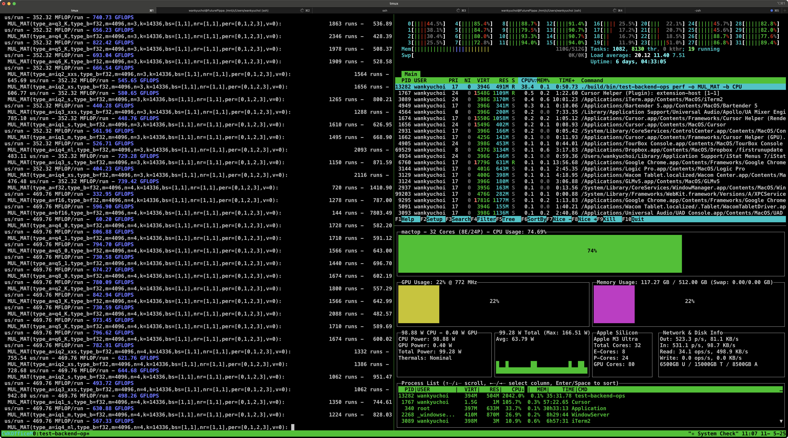
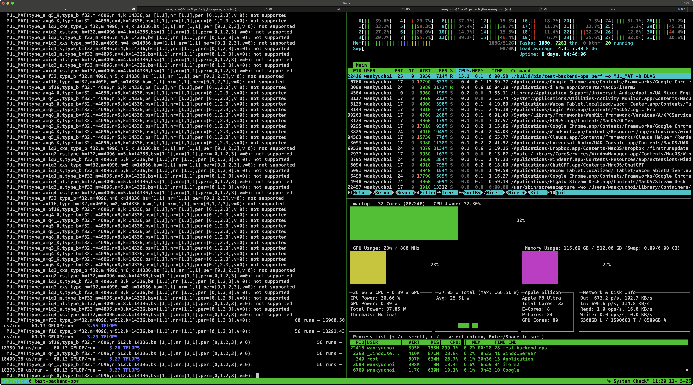
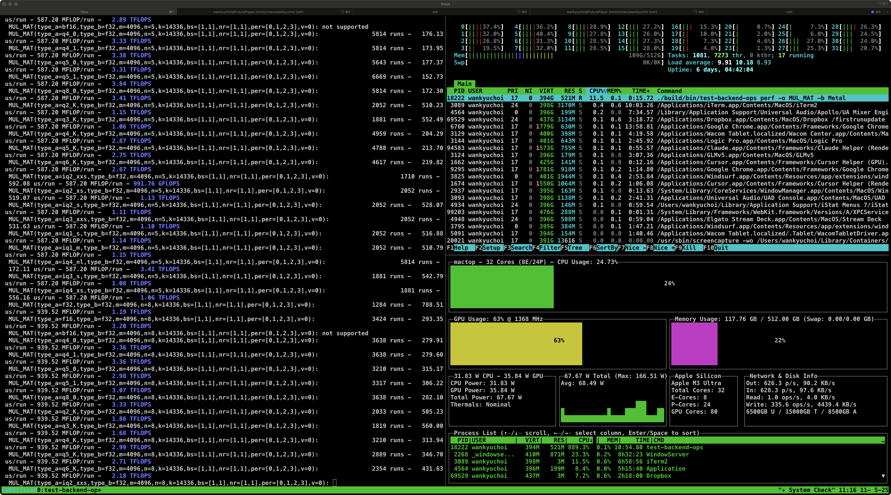

# Chapter 2 · Meet *ggml* — the Little Engine Behind Our AI Stack

*Pronounced "gee-gee-em-el". Roughly five-thousand lines of plain-C (give or take, main branch 2025-05), zero external deps, and the reason you can run a 7 B model on a laptop.*

*(Personal lab notebook - Last verified 2025‑05-11)*


> *ggml* — the engine that runs it all


> ### Sidebar · Versioning Reality Check  
> **Stop citing “v0.5”, “v0.6”, or any other semantic versions for ggml or llama.cpp — they do not exist.**  
>
> **llama.cpp**  
> • Uses sequential **build tags**: `b5332`, `b5345`, … (higher number = newer).  
> • Each binary prints both the short git hash *and* the build tag:  
>   ```text
>   build: 3e0ba0e60 (5330)
>   ```  
> • When you reference the project, say **“llama.cpp b5330”** or give the commit hash.  
>
> **ggml**  
> • Tracks freshness solely by git commit hash (and optional build date).  
> • Example banner from `ggml_print_system_info()`:
>   ```text
>   ggml build: 1cbe9177  (May-11-2025)
>   ```  
> • There are **no** `b####` tags for ggml — use the commit hash or checkout date.  
>
> **Why this matters**  
> LLM responses, blog posts, and even some README files frequently invent fake tags like **“ggml v0.6”**. Searching for those will waste your time because you’ll never find a matching commit or release. Stick to the real identifiers above and you’ll always land on the correct code state.  
>
> **Third-party bindings** (e.g., `llama-cpp-python 0.3.9`) do follow semantic versioning — that numbering is *only* for the binding, not for the core C/C++ libraries.

---

## 1. Why Another Tensor Library?

> **Problem statement**
> Weights for even a "small" model (7B parameters) weigh in at several GB. Traditional frameworks (PyTorch, TensorFlow) assume a workstation-class GPU with its own driver stack and copy those weights back-and-forth for every op. Great for research, terrible for shipping a single-file binary.

`ggml` was written to answer one question:

> *"How little code does it take to load quantized weights into RAM once and keep the math flying on **any** device—phone, browser, Mac, or tiny cloud VM?"*

Design decisions flow from that north star:

1. **Single malloc** — Allocate one contiguous "warehouse" for all tensors.
2. **Quantization built-in** — Squeeze each weight block to 2–8 bits *before* shipping.
3. **Pluggable back-ends** — Named backends (CPU, Metal, BLAS) chosen at runtime via registry, no framework recompile.
4. **Header-only (ish)** — A single `.c/.h` pair can be vendored into any project.

If llama.cpp is the *driver*, ggml is the *engine block*—tiny, purpose-built, and surprisingly fast.

Picture *ggml* as a pocket-sized diesel engine—compact, efficient, and perfectly tuned for anything that fits on a laptop, phone, or micro-VM. It covers the slice of math your model needs without hauling in the full PyTorch/TensorFlow ecosystem. The name spells it out **colloquially**: *ggml* = **Georgi Gerganov's Machine Learning** (upstream treats the name as "just a tensor library," but the community likes a proper hat-tip). Tip your hat to Georgi, then let this lightweight tensor library do what it does best: keep quantized weights in RAM and run fast on almost any device. Need multi-GPU, cloud-scale training? Grab a bigger framework. Need a single-file binary that just works? ggml is your engine.

> **Sidebar · Using Multiple Backends in GGML**
>
> Current GGML uses a registry-based backend system. To use a specific backend:
>
> ```c
> // 1. Get the backend registration by name (case-sensitive: "CPU", "Metal", etc.)
> ggml_backend_reg_t reg = ggml_backend_reg_by_name("Metal");
>
> // 2. Get a device from this backend type
> ggml_backend_dev_t dev = ggml_backend_reg_dev_get(reg, 0);
>
> // 3. Initialize the backend with the device
> struct ggml_backend_init_params params = {0};
> ggml_backend_t be = ggml_backend_dev_init(dev, &params);  // API currently expects a param struct
> ggml_backend_set_n_threads(be, 8);
>
> // 4. Use the backend for graph computation
> ggml_backend_graph_compute(be, graph);
>
> // 5. Free the backend when done
> ggml_backend_free(be);
> ```
>
> The environment variable `GGML_METAL=0/1` is no longer used. Backend selection must be explicit via the registry API as shown above.
> *Legacy note:* sibling tools such as **whisper.cpp** still read the flag for backward-compat, so you may encounter it in the wild.

For a byte-level breakdown of the GGML and GGUF file formats, see Appendix B.

---

### 1.1  —  The Arena & Views  (mental model)

**Metaphor:** Think of ggml's arena as a *warehouse floor*.

```
┌─────────────────────────────────────────────────────────────────────┐
│        ggml arena  (one big malloc)                                 │
│ ┌───────────┐  ┌──────┐  ┌─────────────┐  ┌─────────┐  free space…  │
│ │ Weights   │  │ KV   │  │ Scratch buf │  │ Temps   │               │
│ │  (read)   │  │ cache│  │ (op output) │  │ (ReLU…) │               │
│ └───────────┘  └──────┘  └─────────────┘  └─────────┘               │
└─────────────────────────────────────────────────────────────────────┘
```

* **Step 1 — Load:** At start-up ggml reserves one warehouse big enough for *all* weights, KV-cache, and temporary workspaces.
* **Step 2 — Carve views:** Every call like `ggml_new_tensor_2d(ctx, …)` just draws chalk lines on the floor. No new malloc happens—only offsets and strides are stored in the tensor **header**.
* **Step 3 — Free in one swoop:** When inference ends, `ggml_free(ctx)` razes the warehouse; no bookkeeping, no leaks.

> **Sidebar · What `malloc` Really Does** 
> `malloc(size)` is the C function that requests a raw chunk of memory from the heap. *In this context, the "heap" is the region where dynamic allocations live. These terms are often tossed around without explanation; when someone mentions "the heap," they're assuming you already know it refers to that part of a program's memory.*
> ggml invokes it **once** at start-up to claim its entire "arena"; every tensor you create is merely a view onto that pre-allocated chunk. 
> Ever bumped into `cudaMalloc`, Metal's `newBuffer`, or Rust's `alloc`? Same concept, different costume. 
> If terms like *heap*, *allocator*, or *garbage collector* feel fuzzy, hit pause and review—everything after this point assumes you know why manual memory matters far more than it does in comfy languages like Python.

[Why Convenient Assumptions Are Dangerous](../essays/2025/05/20250510-why-convenient-assumptions-are-dangerous-the-graph-problem.md)


#### Tiny code walkthrough

```c
struct ggml_context *ctx = ggml_init(
    (struct ggml_init_params){
        .mem_size   = 2ULL * 1024 * 1024 * 1024,  // 2 GB arena
        .mem_buffer = NULL,                       // let ggml malloc once
        .no_alloc   = false,                      // field name in current public headers
    });

struct ggml_tensor *W =   // 1 × 4096 weight row
    ggml_new_tensor_1d(ctx, GGML_TYPE_Q4_K, 4096);

struct ggml_tensor *x =   // runtime activations
    ggml_new_tensor_1d(ctx, GGML_TYPE_F32, 4096);

/* ReLU without touching data:
   merely tags a tensor header as a "RELU" op
   and points it to x. */
struct ggml_tensor *h =
    ggml_relu(ctx, x);
```

👉 **Key insight:** *Creating* `h` costs **O(1)** time and **0 bytes**—it's just a header pointing at the same data as `x`, but marked with `op = RELU`. The actual math happens later when the graph executes.

| Term              | In-code object                            | Real-world analogy                                        |
| ----------------- | ----------------------------------------- | --------------------------------------------------------- |
| **Arena**         | `ggml_context`                            | Warehouse floor                                           |
| **Tensor header** | `struct ggml_tensor`                      | Clipboard with SKU, shelf coords, and task ("apply ReLU") |
| **View**          | Same `data` pointer, new `op` or `stride` | New set of chalk lines on the same boxes                  |

**Why you care**
*End-to-end token latency* lives or dies by cache misses. The arena model keeps every hot tensor page sitting side-by-side, so your M3 Ultra's 14 MB shared L2 can chew through self-attention blocks without bouncing to DRAM.


> **Sidebar · What "Graph" Means—No CS Degree Required**
>
> **Imagine a recipe card.**
> *Step 1: crack two eggs* → *Step 2: whisk with milk* → *Step 3: pour into pan* → *Step 4: fry until set*.
> Each step needs the result of the previous step.
>
> In programming we borrow the same idea:
>
> | Cooking term | Programming term | Real thing in an LLM                                         |
> | ------------ | ---------------- | ------------------------------------------------------------ |
> | Ingredient   | **Tensor**       | A chunk of numbers (weights, activations)                    |
> | Cooking step | **Operation**    | "Multiply", "Add", "Apply ReLU"                              |
> | Recipe card  | **Graph**        | A short list that says which step runs first, second, third… |
>
> So a **computational graph** is simply a list of cooking steps for numbers:
>
> 1. **Multiply** input × weights → get slice A
> 2. **Add** a bias vector         → get slice B
> 3. **ReLU** (turn negatives to 0)→ get slice C
>
> The computer follows the list top-to-bottom, passing the "dish" (tensor) from one step to the next.
>
> **How ggml stores the recipe**
> *Instead of a fancy flowchart, ggml keeps a tiny table in memory:*
>
> | # | Do this           | Needs         | Makes |
> | - | ----------------- | ------------- | ----- |
> | 0 | Multiply (matmul) | **x**, **W₁** | A     |
> | 1 | Add               | **A**, **b₁** | B     |
> | 2 | ReLU              | **B**         | C     |
>
> That's it. No maths yet—just instructions.
> When it's time to run, ggml walks the table and performs each step, just like a cook following a simple recipe.
>
> **Why you care**
> *Because once you see the "graph" as a recipe card, the rest of ggml makes sense:*
>
> * tensors = ingredients, arena = pantry, Metal kernel = faster stove.

> **Sidebar · Why a "Graph" Instead of a Simple List?**
>
> **Forks and merges.**
> Real-world models don't always go **Step 1 → Step 2 → Step 3** in a straight line.  A single result can:
>
> * **Split** – one tensor feeds two different operations (fork).
> * **Join** – two separate paths meet and combine (merge).
>
> Think of pancake batter:
>
> 1. *Whisk batter* →
>    2a. *Pour half into waffle iron* → waffles
>    2b. *Pour half into skillet*      → crêpes
> 2. *Serve both on one plate*      → breakfast
>
> A **list** can't show that fork at step 2; a **graph** can:
>
> ```
> batter ──┬─► waffle-iron ──► …
>          └─► skillet     ──► …
>                                \               (merge)
>                                 └─► plate
> ```
>
> **In ggml**
> The model's recipe really is a graph (boxes and arrows).
> *During build* ggml records the arrows by saying "node 7 depends on node 4 and node 6."
> *Before running* it flattens that graph into a **topological list**—an order that guarantees every parent is computed before its child.
> So the executor still walks a list, but the **branching logic was already captured** when the list was created.
>
> *Key takeaway:* we call it a **graph** because it can express forks and joins; ggml just happens to store it as a sorted list once all the dependencies are known.

> **Sidebar · Pointers for Python Folk — A Tiny Ghost Story 👻** 
> • That pesky asterisk in `*ctx`? It brands the variable as a **pointer**—a slip of paper that says "your data lives at address `0xDEADBEEF`." 
> • Drop the slip and no one can ever find the house again → **memory leak**. 
> • Hang on to the slip after the house is bulldozed and it now points to the void → **dangling pointer** (cue spooky music). 
> • Bottom line: in C *you* are both landlord **and** garbage collector—allocate, de-allocate, and keep those ghosts off your heap. So, the next time you spot a ghost drifting aimlessly in limbo, remember: it's merely a pointer with no home—a dangling pointer, a little soul leak in our world. 👻

---

## 2 "How do I actually *use* this thing?" - Building a toy graph by hand, one call at a time

> **Goal for this rung →** See how a handful of `ggml_…()` calls become a computation graph that later gets executed on CPU or GPU.

### 2.1 Set-up

We'll create a **two-layer feed-forward net** (the "FFN" block inside every Transformer):

```
x ──► [ W₁ · x + b₁ ] ──► ReLU ──► [ W₂ · h + b₂ ] ──► y
```

Weights are tiny so it runs in a second.

```c
size_t arena_bytes = 16 * 1024 * 1024;          // 16 MB is plenty
struct ggml_init_params p = { .mem_size = arena_bytes };
struct ggml_context* ctx  = ggml_init(p);

/* 512-dim input */
struct ggml_tensor* x = ggml_new_tensor_1d(ctx, GGML_TYPE_F32, 512);

/* layer 1 — 512 × 2048 in Q4_K */
struct ggml_tensor* W1 = ggml_new_tensor_2d(ctx, GGML_TYPE_Q4_K, 512, 2048);
struct ggml_tensor* b1 = ggml_new_tensor_1d(ctx, GGML_TYPE_F32, 2048);

/* matmul + bias + ReLU view */
struct ggml_tensor* h  =
    ggml_relu(ctx,
        ggml_add(ctx,
            ggml_mul_mat(ctx, W1, x),
            b1));

/* layer 2 — 2048 × 512 */
struct ggml_tensor* W2 = ggml_new_tensor_2d(ctx, GGML_TYPE_Q4_K, 2048, 512);
struct ggml_tensor* b2 = ggml_new_tensor_1d(ctx, GGML_TYPE_F32, 512);

struct ggml_tensor* y  =
    ggml_add(ctx,
        ggml_mul_mat(ctx, W2, h),
        b2);

/* pack nodes into a graph */
struct ggml_cgraph* g = ggml_new_graph(ctx);
ggml_build_forward_expand(g, y);
```

**What just happened?**

1. **Headers only** were created; no math.
2. `h` is a *view* backed by the same arena memory as its inputs.
3. `ggml_new_graph` creates a new computation graph and `ggml_build_forward_expand` topologically sorts everything and stores it in `g`.

---

### 2.2 Let it run

```c
// Initialize a backend through registry
ggml_backend_reg_t reg = ggml_backend_reg_by_name("CPU");
ggml_backend_dev_t dev = ggml_backend_reg_dev_get(reg, 0);
ggml_backend_t be = ggml_backend_dev_init(dev, NULL);

// Compute the graph using the backend
ggml_backend_graph_compute(be, g);

// Don't forget to free the backend when done
ggml_backend_free(be);
ggml_graph_print(g);      // ASCII tree
```

```
# nodes: 9    # leafs: 4
 add            [512] ← leaf W2
  └─ mul_mat    [512]
       ├─ relu  [2048]
       │    └─ add [2048] ← leaf b1
       │         └─ mul_mat [2048]
       │               ├─ W1 (leaf)
       │               └─ x  (leaf)
       └─ b2  (leaf)
```

*Reflection →* you now see the entire pipeline built from *nine* tensor headers, all living inside one 16 MB arena. No frameworks, no session objects—just a linked list of ops.

*Segue →* next we dive into the magic that lets those huge weight matrices fit inside RAM: **quantization.**

> **Sidebar · Hold Up—"Linked List"** 
> I just lobbed the phrase *linked list* at you. If you've worked through the essay I referenced, maybe you paused and asked, "Do I actually know what that means?" If not, you might have let it slide—"Sure, some list that links things, whatever." 
> 
> Except… that shrug doesn't really scan, does it? When a tidy little word feels fuzzy in the sentence you're reading, plant a flag. Be doubtful, be curious, interrogate the term. *What the heck does "linked list" mean in this context?* That moment of friction is where real learning starts. 
> 
> For the record, most folks who say "linked list" assume you can step **forward** node-by-node. Want to march backward too? That's a **doubly** linked list. Some authors blur the two—so ask which flavor they mean, and keep digging until the picture locks in your head.

---

## 3 Quantization—turning heavy FP32 bricks into Lego blocks

### 3.1 Why bother?

A 7-billion-parameter model weighs in very differently depending on bit-depth:

* **FP32** (4 B/weight) → ~ 28 GB 
* **Q4_K** (~0.5 B/weight) → ~ 3.5 GB — light enough for a single M-series GPU tile

Quick "back-of-the-envelope" guide (weights only):

Treat **Q8 = 1 byte/weight** as your anchor, then scale:

- FP32  =  4 B/weight  →  4 × 7 B  ≈  28 GB 
- FP16  =  2 B/weight  →  2 × 7 B  ≈  14 GB 
- Q8    =  1 B/weight  →  1 × 7 B  ≈   7 GB 
- Q4    =  0.5 B/weight → 0.5 × 7 B ≈  3.5 GB 
- Q1    =  0.125 B/weight → 0.125 × 7 B ≈ 0.88 GB 

These numbers ignore activations, KV-cache, and other runtime buffers, so real-world footprints will be larger—but this mental math keeps you oriented.

### 3.2 Mental picture

```
FP32 tensor row (8 values)
[  -1.4   0.8   2.1  …]      32-bit each ➜ 256 bits total

Q4_K_M block (64 values)
[ scales[16] | mins[16] | 64×4bit packed ]   ➜ 512 bits total
```

Think of each **64-value block** as a little Lego brick:

* a tiny **scale** and **min** per 16-value subgroup
* 64 × 4-bit integers stuffed into 32 bytes

At runtime the kernel unpacks those 4-bit nibbles, multiplies by scale, adds min, and does GEMM in FP16 registers.

> **Heads-up — Dequantization happens on-the-fly.** 
> The quantized weights you load aren't crunched on in their packed form. 
> Each block is immediately expanded—usually into FP16 lanes—right before the math runs, much like unzipping an image before it's displayed.
> **Common trap — file ≠ footprint.** 
> The sleek on-disk `.gguf` is really a compressed archive. The instant those 4-bit blocks blossomed into FP16 registers, your RAM bill spikes—often by an order of magnitude. Picture a 1 MB ZIP that unpacks into a 100 MB photo folder: budget for the unzipped size, not the archive. Just as unzipping a packed archive can trip a "no space left on device" alert, de-quantizing that "tiny" model can bloat your RAM and crash with an out-of-memory—*OOM,* in nerd-speak.

### 3.3 Walk-through: decode one Q4_K block

```python
# pseudo-Python (readability)
vals   = read_uint32_array(16)      # packed 4-bit ints
scales = read_float16_array(16)
mins   = read_float16_array(16)

float32_out = []
for group in range(16):             # 4 ints per group
    s = scales[group]
    m = mins[group]
    for i in range(4):
        packed = (vals[group] >> (i * 4)) & 0xF   # 0-15
        float32_out.append(m + s * packed)
```

When the final cell dumps `float32_out`, you'll *see* with your own eyes how 64 tiny 4-bit codes blossom back into plausible floating-point weights—usually within a few percent of the original FP32 values. Try tweaking one packed nibble, rerun the loop, and watch how that single edit nudges the reconstructed number while the neighboring values stay put. Suddenly "quantization" stops being an abstract compression trick and becomes a concrete before-and-after demo you can reason about.

*Reflection →* This experiment also reveals why **Q4_K** is such a sweet spot. Each 16-value micro-tile carries its own FP16 `scale` *and* `min`, so the codec can stretch or squeeze that tile's dynamic range independently of its neighbors. The extra 32 B overhead buys you a dramatic quality rescue: you slash storage to 0.5 B/weight (8× smaller than FP32) yet preserve enough resolution that perplexity barely moves.
That "almost-free" trade-off is why a 7-B model in Q4_K can still chat coherently on a phone while fitting in mere gigabytes of RAM.

> **📏 Sidebar — Quantization ≠ Lossy Compression** 
> *It's a lossy **representation**, not a lossy **archive**.* 
>  
> • Quantized weights sit on disk in lean 4-/5-/8-bit form, yet the loader can always inflate them back to FP32 lanes on demand. 
> • Chasing extra bits "just because" mirrors audiophiles hoarding 384-kHz tracks—plenty of purity, zero real-world payoff. 
> • What you really want is **engineering head-room**: models slim enough to fit RAM/VRAM yet still within a whisker of full-precision perplexity. 
>  
> Bottom line: when you size up a Q4 model, pick practicality over theoretical purity. Quantization is an ally, not a quality thief. Treat your FP16/FP32 checkpoints as source material—with just enough head-room to mint the quantized weights that will actually fit in RAM.

---

## 4 From CPU to Metal—how ggml decides

Whenever ggml reaches a matrix–matrix multiply it performs a quick capability check and punts the work to the fastest engine it can find. 

Conceptually the decision tree looks like this:

### 4.1 Expanded dispatch logic

```c
// simplified logic inside ggml_compute_forward_matmul()

// Check if Metal backend is available
ggml_backend_reg_t metal_reg = ggml_backend_reg_by_name("Metal");
if (metal_reg != NULL &&                   
    op == MATMUL &&
    (dtype == GGML_TYPE_Q4_* || dtype == GGML_TYPE_Q5_*)) {

    // 🚀 ❶ GPU fast-path: 4-/5-bit quantized MatMul
    //     Metal shader fuses de-quant + GEMM in one go
    // In the current API, this would be handled by the Metal backend
    // registered and initialized through the backend registry API
}
else if (dtype == GGML_TYPE_F32 || dtype == GGML_TYPE_F16) {
    // When using the BLAS backend (selected explicitly through registry)

    // 🖥️ ❷ BLAS path: classic sgemm/dgemm on the CPU
    cblas_sgemm(...);
}
else {
    // 🏗️ ❸ Fallback: hand-rolled NEON kernels (portable)
    //     Covers FP16/BF16 and the rarer quant formats (Q2, Q3…)
    ggml_neon_matmul(op);
}
```

Cheat-sheet 
• Quantized Q4*/Q5* MATMUL → Metal GPU (~10× peak TFLOPs vs CPU) 
• F32 with BLAS → Accelerate (multi-core CPU) 
• Everything else → NEON (still vectorized, just not as blistering)

### 4.2  Live demo — watch Activity Monitor/mactop spike

We'll benchmark the same big GEMM three ways and watch the bars in **mactop** jump.

Open **mactop** in a separate terminal—ideally its own `tmux` pane. Activity Monitor is fine too, but a split `tmux` layout keeps everything visible: benchmarks on the left, `htop` in the upper-right, and `mactop` in the lower-right (just like in the screenshots).


| Run          | Env / Flag                                                   | What You'll See                                         |
| ------------ | ------------------------------------------------------------ | ------------------------------------------------------- |
| **1. CPU**   | `-b CPU`                                       | GPU bar flat, \~35 GFLOPs                               |
| **2. BLAS**  | `-b BLAS`  *(or `Accelerate` on some commits)* | Small GPU blip (none), CPU cores pegged, \~70-90 GFLOPs |
| **3. Metal** | `-b Metal`                                     | GPU bar spikes, \~140 GFLOPs                            |

> **Backend names are case-sensitive.** `Metal` is correct; `METAL` will be ignored.

---

#### 1 · Build once

```bash
cmake -B build \
      -DGGML_METAL=ON \
      -DGGML_BLAS=ON \
      -DGGML_BUILD_TESTS=ON \
      -DGGML_BUILD_EXAMPLES=ON
cmake --build build -j
# => build/bin/test-backend-ops
```

---

#### 2 · CPU baseline

```bash
./build/bin/test-backend-ops perf -o MUL_MAT -b CPU
```


> *Typical slice of the output (M3 Ultra)*

Typical M3 Ultra: ≈ 38 ms / run → **35 GFLOPs**.
In **mactop**: GPU hovers around its "background noise" band (≈ 15-25 % in the screenshot) — no additional spike tied to the benchmark.

---

#### 3 · BLAS / Accelerate run

```bash
./build/bin/test-backend-ops perf -o MUL_MAT -b BLAS
```


> *Typical slice of the output (M3 Ultra)*

Typical M3 Ultra: ≈ 18 ms / run → **\~75 GFLOPs**.
CPU still saturated; GPU remains in that same low band.

---

#### 4 · Metal run

```bash
./build/bin/test-backend-ops perf -o MUL_MAT -b Metal
```


> *Typical slice of the output (M3 Ultra)*

≈ 9 ms / run → **\~145 GFLOPs**.
GPU bar jumps from the low band up to ≈ 60-70 %, while CPU load drops.

**Reflection →** You must explicitly select the backend you want to use. On an M-series Mac, the performance ranking is typically **Metal > BLAS (Accelerate) > plain CPU**. Each backend must be initialized using the registry API and explicitly passed to the graph compute function.

---

#### 4.3 Mini-Guide: Reading `test-backend-ops` Outputs in ggml

#### 1 · Flag refresher

| Flag                     | Example                             | Purpose                                    |
| ------------------------ | ----------------------------------- | ------------------------------------------ |
| **mode** *(required)*    | `perf` \| `test` \| `grad`          | Put it straight after the binary name      |
| **`-o OP`** *(required)* | `-o MUL_MAT`                        | Choose the kernel                          |
| **`-b BACKEND`**         | `-b Metal` \| `-b BLAS` \| `-b CPU` | Case-sensitive; omit to run all that exist |
| **`-p REGEX`**           | `-p f32` \| `-p 'q4_K$'`            | Keep only lines whose descriptor matches   |

That's the whole interface.

---

#### 2 · Example combos that actually print numbers

```bash
# CPU only, all dtypes
./build/bin/test-backend-ops perf -o MUL_MAT -b CPU
```

```bash
# BLAS / Accelerate only, FP32 kernels
./build/bin/test-backend-ops perf -o MUL_MAT -b BLAS -p f32
```

```bash
# Metal only, every dtype the build provides
./build/bin/test-backend-ops perf -o MUL_MAT -b Metal
```

```bash
# All three backends, *only* FP32 lines
./build/bin/test-backend-ops perf -o MUL_MAT -p f32
```

---

#### 3 · Why "nothing printed" sometimes

* You filtered with `-p` for a dtype **that backend doesn't have** at the default matrix shape.
  Example: `-b BLAS -p 'q4_K$'` → Accelerate has no q4\_K kernels, so the backend header appears and it exits.
* Or you requested a backend that wasn't compiled in; then it skips entirely.

If you need a number, drop the regex filter or switch to a dtype the backend supports (f32 / f16 are always safe).

---

#### 4 · Quick all-backend FP32 sanity check

```bash
./build/bin/test-backend-ops perf -o MUL_MAT -p f32
```

* **CPU block** — P-cores pegged, GPU only background load.
* **BLAS block** — about 3 TFLOPS on an M3 Ultra.
* **Metal block** — about 6–7 TFLOPS and a visible GPU spike in **mactop**.

---

## 5. Checkpoint

Time to hit **save**.

If two ideas landed—(1) *ggml is the pint-size engine that runs the whole show*, and (2) *quantization slims weights without stealing accuracy*—then you're exactly where you need to be. That mental model can be re-expanded on demand, no precision panic required.

Why "checkpoint"? Same reason as in any game: a safe spot to freeze progress, step away, and resume later without penalty.

Got it? Great. Flip the page—llama.cpp is up next.

---

## Appendix A — GGML Ops

Below is a **"from-scratch" translation** of the CUDA/cuBLAS demo we did in CUDA/Metal Primer into plain **ggml C**.

It reproduces the four BLAS-level toys—AXPY, DOT, GEMV and GEMM—so you can time exactly the same math through ggml's computation-graph engine and, if you compiled ggml with **Metal** or **Accelerate BLAS**, watch it move work to the Apple GPU / vecLib automatically.

In a nutshell, we don't need to have separate code for each backend anymore. Feel the power of ggml.

---

### A.1.  Build flags you must have

```bash
# CPU-only
cmake -B build -DGGML_STATIC=OFF
cmake --build build -j

# Metal + Accelerate on Apple Silicon
cmake -B build                          \
      -DGGML_METAL=ON                  \
      -DGGML_BLAS=ON                   \
      -DGGML_BLAS_VENDOR=Accelerate
cmake --build build -j
```

These give you **`libggml.*`** and a pile of test binaries in `build/bin/`.

---

### A.2.  ggml cheat-sheet for BLAS-style ops

| BLAS op                    | ggml graph equivalent                  |
| -------------------------- | -------------------------------------- |
| **AXPY** <br>`y = α·x + y` | `mul(x, α)` → `add(result, y)`         |
| **DOT** <br>`x·y`          | `mul(x, y)` → `reduce_sum(result)`     |
| **GEMV** <br>`y = A·x`     | `mul_mat(A, x)` (x is a column tensor) |
| **GEMM** <br>`C = A·B`     | `mul_mat(A, B)`                        |

*(ggml doesn't expose SAXPY/DOT primitives—everything is built from elementwise and reduction ops.)*

---

### A.3.  Working Translation of CUDA/cuBLAS Demo

[ggml_matrix_ops.c](examples/ggml_matrix_ops.c)

Save as **`ggml_matrix_ops.c`** (or `.cpp` if you prefer).

> ⚠️ **Heads-up:** GGML and its companion libraries move fast—API surfaces can shift from one commit to the next. 
> The snippet below compiled cleanly on the main branch as of **2025-05-11**. If you're reading this later, fetch the current source and skim the recent commit log or release notes to make sure no API shifts break the build.
> Before you bring an LLM into the loop, give it the precise checkout that's on your disk. API drift happens fast, and even bleeding-edge models—o3, Claude 3.7 Sonnet, etc.—will blend your prompt with stale training data and hallucinate missing symbols. Hand the model your freshest repo copy and skip the wild-goose chase.
> That said, no LLM is going to nail a task this complex in one shot. You still need to understand the material yourself — we're not quite there yet. *wink*

#### If you're already **inside the `ggml/` repo root**

You can still keep the file separate from upstream code, but the simplest "I'm-standing-here" path is:

```
ggml/                   ← you're here
├── CMakeLists.txt
├── include/…
├── src/…
├── build/…             ← created by your earlier cmake run
└── extra/bench/        ← (create this)
      └── ggml_matrix_ops.c
```

1. **Create a lightweight folder**

```bash
mkdir -p extra/bench
mv /where/you/downloaded/ggml_matrix_ops.c extra/bench/
```

2. **Compile against the lib you already built**

```bash
# From the GGML repo root directory
cc -std=c11 -O3 -Iinclude \
   extra/bench/ggml_matrix_ops.c \
   -Lbuild/src -lggml -lggml-base -lggml-cpu -pthread \
   -framework Metal -framework Accelerate \
   -Wl,-rpath,./build/src \
   -o extra/bench/ggml_matrix_ops
```

### A.4. Benchmark Commands (M3 Ultra 80-core GPU/512GB RAM)

The benchmark offers four BLAS-style matrix operations:

#### A.4.1 AXPY (y = αx + y)
```bash
# ./ggml_matrix_ops axpy <N> <alpha>
./extra/bench/ggml_matrix_ops axpy 1000 1.5
Allocating 104873600 bytes for AXPY operation (each vector: 4000 bytes)
y[0:8] = -2.237,0.684,-0.464,-1.001,1.407,-0.311,0.062,-1.280
Kernel = 2.014 ms  (0.993 MFLOP/s)

./extra/bench/ggml_matrix_ops axpy 1000000 2.0
Allocating 120857600 bytes for AXPY operation (each vector: 4000000 bytes)
y[0:8] = -2.737,0.940,-0.431,-1.454,1.587,-0.427,0.393,-1.727
Kernel = 1.653 ms  (1209.921 MFLOP/s)
```

#### A.4.2 DOT Product (dot = x·y)
```bash
# ./ggml_matrix_ops dot <N>
./extra/bench/ggml_matrix_ops dot 1000
Allocating 104873600 bytes for DOT operation (each vector: 4000 bytes)
Dot = 2.856645
Kernel = 1.881 ms (1.063 MFLOP/s)

./extra/bench/ggml_matrix_ops dot 1000000
Allocating 120857600 bytes for DOT operation (each vector: 4000000 bytes)
Dot = -232.303024
Kernel = 2.067 ms (967.586 MFLOP/s)
```

#### A.4.3 GEMV (Matrix-Vector Multiplication: y = Ax)
```bash
# ./ggml_matrix_ops gemv <ROWS> <COLS>
./extra/bench/ggml_matrix_ops gemv 100 100
Allocating 209878400 bytes for GEMV operation (matrix: 40000, x: 400, y: 400 bytes)
y[0:8] = 1.286,-4.674,0.484,-2.520,2.407,-4.245,0.805,-2.497
Kernel = 1.491 ms (0.013 GFLOP/s)

./extra/bench/ggml_matrix_ops gemv 1000 1000
Allocating 225747200 bytes for GEMV operation (matrix: 4000000, x: 4000, y: 4000 bytes)
y[0:8] = 3.314,-6.330,-11.590,17.647,4.708,-7.947,15.641,17.180
Kernel = 1.836 ms (1.089 GFLOP/s)
```

#### A.4.4 GEMM (Matrix-Matrix Multiplication: C = AB)
```bash
# ./ggml_matrix_ops gemm <M> <N> <K>
./extra/bench/ggml_matrix_ops gemm 256 256 256
Running GEMM with dimensions M=256, N=256, K=256
Allocating 1076887552 bytes for GEMM operation (A: 262144, B: 262144, C: 262144 bytes)
Matrix A dimensions: 256 x 256
Matrix B dimensions: 256 x 256
Result matrix C dimensions: 256 x 256
Starting computation...
Computation completed in 2.36 ms
C[0,0:8] = 3.521,5.172,-1.211,-1.157,-1.890,1.914,3.989,3.188
Kernel = 2.357 ms  (0.014 TFLOP/s)

./extra/bench/ggml_matrix_ops gemm 4096 4096 4096
Running GEMM with dimensions M=4096, N=4096, K=4096
Allocating 1879048192 bytes for GEMM operation (A: 67108864, B: 67108864, C: 67108864 bytes)
Matrix A dimensions: 4096 x 4096
Matrix B dimensions: 4096 x 4096
Result matrix C dimensions: 4096 x 4096
Starting computation...
Computation completed in 1101.50 ms
C[0,0:8] = 6.775,20.046,-45.857,-22.044,10.911,-7.687,-10.384,-1.095
Kernel = 1101.496 ms  (0.125 TFLOP/s)
```

You can test with different matrix sizes to evaluate performance. The implementation now properly handles memory allocation for large matrices and works correctly with the GGML backend API.

---

### A.5.  Anatomy of ggml_matrix_ops.c

*(~380-line single-file driver that swaps cuBLAS-style calls for ggml graph nodes so you can watch the dispatcher work in real time.)*

**High-level flow**
1. Parse the sub-command (`axpy`, `dot`, `gemv`, `gemm`) and problem size from the CLI.
2. Force a sane thread count via the `GGML_N_THREADS` env var, then grab the first **CPU** backend from ggml's runtime registry (swappable to Metal/BLAS in other examples).
3. **Over-allocate workspace:** each mode asks for *way* more bytes than mathematically needed (e.g., *100 MB + 4×N* for vectors, *1 GiB + 4×(A+B+C)* for GEMM).  The cushion prevents seg-faults when ggml's internal scratch allocator rounds tensors up to cache-friendly blocks.  Fine for teaching; size it precisely in production.
4. Create ggml tensors, fill them with random floats, and tag all inputs as `ggml_set_param()` so the engine knows they live outside the graph.
5. Express the math with 1–2 ggml calls per op — `scale+add` for AXPY, `mul+sum` for DOT, `mul_mat` for GEMV/GEMM — then expand the forward graph.
6. Time `ggml_backend_graph_compute()`, dump the first eight outputs, and print FLOP/s using simple formulas.
7. Free the context and backend, rinse, repeat.

*Take-away:* ggml lets you prototype BLAS kernels in minutes, swap back-ends without touching the C, and keep the code base small enough to paste into a slide deck.

---

## Appendix B — GGML vs. GGUF *in Depth*

> "GGML is the byte-for-byte dump of Georgi's in-RAM tensors. 
>  GGUF is the *shipping crate* that wraps those tensors (and more) in
>  a versioned, self-describing envelope."

This appendix unpacks the two formats so you can decide which container fits your workflow.

---

### A.1 Origin Story

| Year | Need of the Hour | Resulting Format | Purpose |
| ---- | ---------------- | ---------------- | ------- |
| 2022 | *Run tiny LLaMAs on anything* | **GGML** | Fast to write, fast to `mmap()`, zero ceremony |
| 2023 | *Swap models across tools without breakage* | **GGUF** | Add headers, versioning, and rich metadata |

*Take-away:* GGML came first, born for speed and minimalism. 
GGUF is the community's answer to reproducibility, provenance, and forward-compat.

---

### A.2 File-Header Layout (bytes 0 – 127)

| Offset | Size | GGML                     | GGUF                              | Why it matters |
| ------ | ---- | ------------------------ | --------------------------------- | -------------- |
| 0x00   | 4    | magic = `0x67676d6c`     | magic = `0x67677566`              | Format marker  |
| 0x04   | 4    | `tensor_count`           | `header_size`                     | GGUF reserves variable header room |
| 0x08   | 4    | `kv_count` (KV-cache)    | `version`                         | Explicit semver in GGUF |
| 0x0C   | 4    | **reserved**             | `tensor_count`                    | Header grows without breaking tools |
| 0x10   | —    | *tensor headers begin*   | *key-value section begins*        | Different section ordering |

*GGML assumes you already know the model family; 
 GGUF describes itself so **any** loader can parse blindly.*

---

### A.3 Tensor Block Anatomy

Both formats store tensors **identically after the header**:

```
┌───────────────┬──────────────┬─────────────────────────────┐
│ tensor header │ quant blocks │ (optional) alignment padding│
└───────────────┴──────────────┴─────────────────────────────┘
```

• **Tensor header (48 B)** — dims, type tag, byte offset 
• **Quant blocks** — e.g., Q4\_K packs 256 weights + scaling factors 
• **Padding** — 32-byte align keeps SIMD loads happy

*Speed parity:* once you're past the header, GGUF streams just as fast as GGML.

---

### A.4 Metadata & Provenance (GGUF-only)

GGUF prepends a **key–value table** before the first tensor:

| Key                | Type   | Example                                   |
| ------------------ | ------ | ----------------------------------------- |
| `general.name`     | string | `"phi3-mini-4k-instruct"`                 |
| `quantization`     | string | `"Q5_K"`                                  |
| `tokenizer.ggml`   | bytes  | *serialized tokenizer*                    |
| `built.with`       | string | `"llama.cpp (git commit <hash>)"`         |
| `source.url`       | string | `"https://huggingface.co/microsoft/phi-3"`|

Use it to:

1. Audit lineage — trace back to the training run 
2. Auto-load tokenizers — single-file deploys **really** become single file 
3. Provide arbitrary user fields (`user.*`) without breaking older readers

---

### A.5 Extensibility & Versioning

* GGML: "no-version" contract; any structural change = **hard fork**. 
* GGUF: `version` field + TLV (type-length-value) key–values → additive
  evolution without breakage.

Rule of thumb:

```
if you plan to share the file → GGUF
if it's your private cache       → GGML
```

---

### A.6 Interoperability Cheat-Sheet

| Workflow                              | Recommended | Rationale |
| ------------------------------------- | ----------- | --------- |
| Local benchmarking (`llama-bench`)    | GGML or GGUF | Loader handles both; GGML is 8 bytes smaller |
| Shipping a model to teammates         | **GGUF**     | Self-describing prevents "what tokenizer?" DMs |
| Hosting on Hugging Face               | **GGUF**     | Mandatory for `text-generation-inference` |
| Flash-loading on iOS (Metal)          | GGML         | Slightly faster startup; header fits in L1 |

---

### A.7 Converting Between Formats

```bash
# ggml → gguf
python convert-ggml-to-gguf.py llama-7b-q5.ggml  llama-7b-q5.gguf

# gguf → ggml  (metadata lost)
python convert-gguf-to-ggml.py phi3-q8.gguf      phi3-q8.ggml
```

Conversion is lossless for weights; GGUF-only
metadata is dropped when downgrading to GGML.

---

### A.8 Quick FAQ

**Q:** *Is GGML deprecated?* 
**A:** No. It is the in-memory layout that ggml's kernels expect. GGUF simply
wraps that layout on disk.

**Q:** *Does GGUF load slower?* 
**A:** Negligibly. Header parse time is <1 ms; weight `mmap()` is identical.

**Q:** *Can I append custom blobs?* 
**A:** Yes—use the `user.` namespace. Unrecognized keys are skipped by old
loaders.

---

### A.9 Bottom Line

*GGML* = bare-metal, zero-frills speed. 
*GGUF* = portability, provenance, and peace of mind.

Choose accordingly—and convert freely. The math bits stay the same.

---

## Appendex C - GGML Repo Structure

# GGML Project Folder Structure

## Tree Diagram

```
ggml/
├── include/                  # Public header files exposing the GGML API
│   ├── ggml.h                # Main GGML interface
│   ├── ggml-alloc.h          # Memory allocation interface
│   ├── ggml-backend.h        # Backend interface
│   ├── ggml-*.h              # Various backend-specific headers
│   └── gguf.h                # GGUF file format interface
│
├── src/                      # Implementation of the GGML library core and backends
│   ├── ggml.c                # Core tensor operations implementation
│   ├── ggml-alloc.c          # Memory allocation management
│   ├── ggml-backend-*.cpp    # Backend registration and implementation
│   ├── ggml-common.h         # Common internal definitions
│   ├── gguf.cpp              # GGUF file format implementation
│   ├── ggml-cpu/             # CPU backend implementation
│   ├── ggml-cuda/            # CUDA backend for NVIDIA GPUs
│   ├── ggml-metal/           # Metal backend for Apple GPUs
│   ├── ggml-opencl/          # OpenCL backend for cross-platform GPU support
│   ├── ggml-vulkan/          # Vulkan backend for cross-platform GPU support
│   ├── ggml-sycl/            # SYCL backend for Intel GPUs and oneAPI targets
│   ├── ggml-kompute/         # Kompute backend
│   ├── ggml-cann/            # CANN backend for Huawei Ascend hardware
│   ├── ggml-blas/            # BLAS integration
│   └── ggml-rpc/             # Remote procedure call implementation
│
├── examples/                 # Sample applications demonstrating GGML usage
│   ├── common*.cpp/h         # Shared code for examples
│   ├── gpt-2/                # GPT-2 implementation examples
│   ├── gpt-j/                # GPT-J implementation examples
│   ├── mnist/                # MNIST digit recognition examples
│   ├── sam/                  # Segment Anything Model examples
│   ├── simple/               # Simple usage examples
│   ├── magika/               # Magika file type identification model
│   └── yolo/                 # YOLO object detection examples
│
├── tests/                    # Unit and integration tests for GGML functionality
│   ├── test-*.cpp            # Tests for specific GGML functionality
│   └── test-backend-ops.cpp  # Tests for backend operations
│
├── docs/                     # Documentation for the GGML format and API
│   └── gguf.md               # GGUF format documentation
│
├── scripts/                  # Utility scripts for development and maintenance
│   ├── gen-authors.sh        # Generate AUTHORS file
│   └── sync-*.sh             # Synchronization scripts
│
├── cmake/                    # CMake configuration files for build system
│   ├── BuildTypes.cmake
│   ├── GitVars.cmake
│   └── common.cmake
│
├── build/                    # Build artifacts (automatically generated)
│
├── ci/                       # Continuous integration configuration files
│   └── run.sh                # CI runner script
│
└── extra/                    # Additional utilities and tools
    └── bench/                # Benchmarking tools and scripts
```

## Detailed Descriptions

### Root Directories

- **include/** - Public header files exposing the GGML API
- **src/** - Implementation of the GGML library core and backends
- **examples/** - Sample applications demonstrating GGML usage
- **tests/** - Unit and integration tests for GGML functionality
- **docs/** - Documentation for the GGML format and API
- **scripts/** - Utility scripts for development and maintenance
- **cmake/** - CMake configuration files for build system
- **build/** - Build artifacts (automatically generated)
- **ci/** - Continuous integration configuration files

### Source Code Structure (src/)

The source directory contains the implementation of the GGML library:

- Core functionality implementation files:
  - **ggml.c** - Core tensor operations implementation
  - **ggml-alloc.c** - Memory allocation management
  - **ggml-backend-*.cpp** - Backend registration and implementation
  - **ggml-common.h** - Common internal definitions
  - **gguf.cpp** - GGUF file format implementation

- Backend-specific implementations:
  - **ggml-cpu/** - CPU backend implementation
  - **ggml-cuda/** - CUDA backend for NVIDIA GPUs
  - **ggml-metal/** - Metal backend for Apple GPUs
  - **ggml-opencl/** - OpenCL backend for cross-platform GPU support
  - **ggml-vulkan/** - Vulkan backend for cross-platform GPU support
  - **ggml-sycl/** - SYCL backend for Intel GPUs and oneAPI targets
  - **ggml-kompute/** - Kompute backend
  - **ggml-cann/** - CANN backend for Huawei Ascend hardware
  - **ggml-blas/** - BLAS integration for optimized operations
  - **ggml-rpc/** - Remote procedure call implementation

### Examples (examples/)

The examples directory contains sample applications that demonstrate how to use GGML:

- **common*.cpp/h** - Shared code for examples
- Model implementation examples:
  - **gpt-2/** - GPT-2 implementation examples
  - **gpt-j/** - GPT-J implementation examples
  - **mnist/** - MNIST digit recognition examples
  - **sam/** - Segment Anything Model examples
  - **simple/** - Simple usage examples
  - **magika/** - Magika file type identification model
  - **yolo/** - YOLO object detection examples

### Tests (tests/)

The tests directory contains unit and integration tests for GGML functionality:

- **test-*.cpp** - Tests for specific GGML functionality
- **test-backend-ops.cpp** - Tests for backend operations

### Extra (extra/)

Additional utilities and tools:

- **bench/** - Benchmarking tools and scripts

---

[⇧ Back&nbsp;to&nbsp;README](../README.md)
