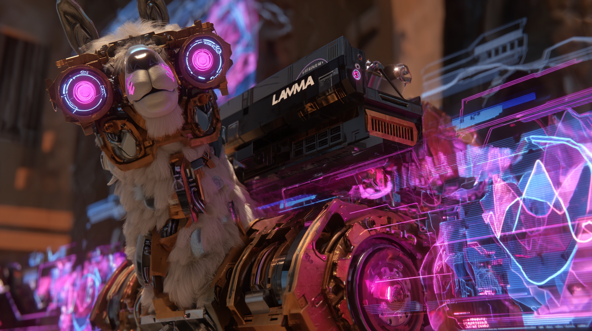
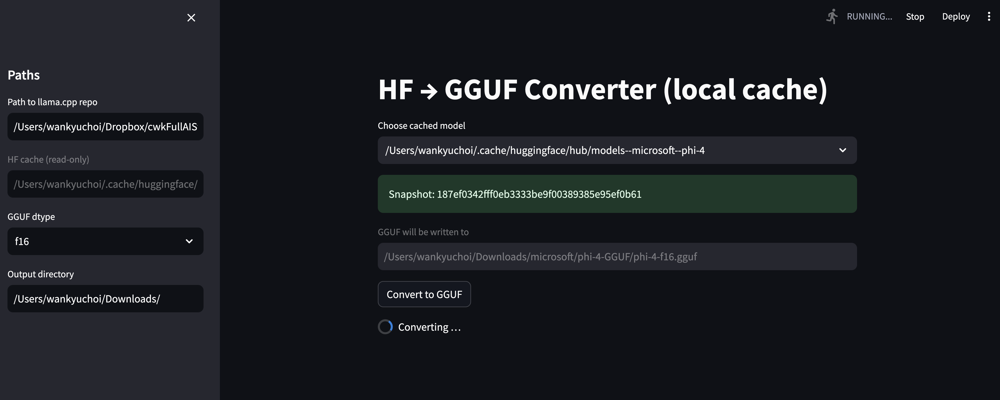

# Chapter 3 · llama.cpp — Tiny‑Ollama & the Bare‑Metal Loop

*(Personal lab notebook – last verified 2025‑05‑12)*

> **Pain-point check-in** – "`ollama run llama3` feels like magic… until the first token hangs or the binary crashes with a mysterious error. Today we turn that opaque box into clear glass."



---

## 1 · Where llama.cpp Sits in the Stack

**Statement** – `llama.cpp` is the *inference micro‑kernel* every other layer wraps.

**Concrete example** – Ollama, `llama‑cpp‑python`, and Open WebUI all end up spawning the exact same binary on disk.

**Reflection** – If you can reason about that binary, you can debug latency spikes, memory blow‑ups, and spec‑mismatch crashes.

**Segue** – Let's map the data path before we touch a single line of code.

```
(prompt) → [stdin] →  llama.cpp  → (JSON tokens) → wrapper (Ollama / Python / WebUI)
                |                    ↑
                +–– Metal shaders –––+
```

A prompt enters, tiles of FP16 data march through Metal, and newline‑separated JSON tokens stream back. That's the whole dance.

---

## 2 · How Ollama Spins Up `llama.cpp`

**What is a *runner?*** — A *runner* is a **self‑contained CLI wrapper around `llama.cpp`** that Ollama embeds inside its Go binary. Think of it as a disposable micro‑server: feed it a `.gguf` file and flags, it spits out tokens over TCP/STDOUT, then quits. The Go layer treats each runner as a black box—no shared memory, just JSON over a socket.

**Statement** – Ollama's Go server never calls C directly; instead it forks that runner binary built from `llama.cpp` source and embedded inside the main executable.

**Concrete example** – When you run `ollama run gemma`, the server first unpacks the runner under a user‑scoped temp directory such as

```
$TMPDIR/ollama1762653472/runners/<backend>/ollama_llama_server
```

and launches it with flags like:

```
./ollama_llama_server \
  --model ~/.ollama/models/gemma-3-27b.q4_0.gguf \
  --port 42857 --n-gpu-layers 100 --chat-template gemma
```

Since v0.1.34 the runner also accepts `--grpc-port`; using plain `--port` still works and is automatically mapped to the gRPC port.

**Reflection** – Fork‑and‑runner yields three superpowers:

1. **Crash isolation** – If the C++ core segfaults, only the runner dies; the Go API keeps running.
2. **Backend flexibility** – CPU, Metal, CUDA, ROCm binaries coexist and are chosen at runtime.
3. **Hot‑swap upgrades** – During `brew upgrade ollama`, new runners drop in and the scheduler restarts them without downtime.

macOS uses a sandboxed `$TMPDIR` (e.g. `/var/folders/.../T`), so you won't see `/tmp/ollama…` unless you set `OLLAMA_TMPDIR=/tmp`.

**Segue** – Because the runner is *just* `llama.cpp` under a thin CLI, we can recreate the architecture. First, verify our local build.

---

## 3 · Building the Engine (Cloned Already, Verify Flags)

> **Why should I care?** Wrong CMake flags can halve token speed or break model downloads.

```bash
# Two‑step build tested on macOS 15.4.x / M3 Ultra
cd ~/src/llama.cpp
cmake -B build \
      -DLLAMA_METAL=ON \                # Metal backend
      -DLLAMA_BLAS=ON \                 # Accelerate fallback
      -DLLAMA_BLAS_VENDOR=Accelerate \
      -DBUILD_SHARED_LIBS=ON \          # needed for Python bindings later
      -DLLAMA_CURL=ON                   # enable model downloader
cmake --build build --config Release -j$(sysctl -n hw.logicalcpu)
```

Now run `build/bin/llama-server` **or** the Homebrew one at `/opt/homebrew/bin/llama-server`; just make sure the chosen binary is in `$PATH`.

*Output* – A ≈6 MB `llama-server` linked against Metal and Accelerate, with CURL for `-f` pulls.

> **Optional flags**
> • `-DLLAMA_METAL_NDEBUG=OFF` – keep Metal `assert()` checks (flag is inverted: **ON** strips asserts).
> • `-DLLAMA_METAL_EMBED_LIBRARY=ON` – embed shaders inside the binary to skip JIT.

---

## 4 · Tiny‑Ollama in Three Micro‑Snippets

Let's walk through a minimal Tiny-Ollama demo: launch a single model, chat with it, and wrap it in a tiny OpenAI-style shim. Essentially that's what ollama does when you run `ollama run llama3`.

### 4‑A · `tiny_runner.py` – launch a single model

[tiny_runner.py](examples/tiny_runner.py)

This script selects a `.gguf` model file from `~/.tiny_ollama/` and starts `llama-server` to serve that single model instance.

```python
#!/usr/bin/env python3
"""
tiny_runner.py — launch llama-server with a single model.

Usage examples
--------------
$ python tiny_runner.py
      # loads ~/.tiny_ollama/gemma-3-27B-it-QAT-Q4_0.gguf on port 12435

$ python tiny_runner.py -m llama3-mini.gguf -p 13000 -t llama-3
      # custom model, port, and chat template
"""
import argparse, pathlib, subprocess, os, sys, shlex

HOME       = pathlib.Path.home()
DEFAULT_MD = HOME / ".tiny_ollama" / "gemma-3-27B-it-QAT-Q4_0.gguf"
DEFAULT_PT = 12435

parser = argparse.ArgumentParser()
parser.add_argument("-m", "--model",          default=str(DEFAULT_MD))
parser.add_argument("-p", "--port",  type=int,default=DEFAULT_PT)
parser.add_argument("-t", "--chat-template",  default="gemma",
                   help="pass the name if your model expects one; "
                        "set to '' to omit")
parser.add_argument("--gpu-layers", default="100")
args = parser.parse_args()

cmd = [
    "llama-server", "-m", args.model,
    "--host", "127.0.0.1", "--port", str(args.port),
    "--n-gpu-layers", args.gpu_layers
]
if args.chat_template:
    cmd += ["--chat-template", args.chat_template]

print("launching:", " ".join(shlex.quote(c) for c in cmd), flush=True)
proc = subprocess.Popen(cmd)

try:
    proc.wait()
except KeyboardInterrupt:
    print("\nshutting down …")
    proc.terminate()
    proc.wait()
    sys.exit(0)
```

Run any `.gguf` in `~/.tiny_ollama/`:

```bash
python tiny_runner.py                       # default Gemma model
python tiny_runner.py -m your_model.gguf   # switch models
```

> **Sidebar · Chat templates in llama.cpp**
> Most GGUF models expect prompts wrapped in a *template* that mirrors the structure they were trained on. Gemma uses `<start_of_turn>user … <end_of_turn>` tags; Llama‑3 uses `<|im_start|>` markers; Mistral opts for `<s>` BOS tokens.
> `llama-server --chat-template gemma` tells the runner to auto‑insert these tags when parsing *system/user/assistant* roles. Send a raw prompt without matching tags and the model may hallucinate code snippets or JSON gibberish before it "locks on."
> **Rule of thumb:** pick the template that matches the model family (Gemma, Llama‑3, Yi, etc.) or disable templating (`--chat-template ''`) and wrap the tags yourself.

Tip: The Ollama registry provides ready-made chat templates for each model—just grab the template directly from the model's page.

### 4‑B · `tiny_chat.py` – Gemma‑aware REPL

[tiny_chat.py](examples/tiny_chat.py)

You can use the `tiny_chat.py` script to chat with the model. It assumes the runner is listening on `127.0.0.1:12435`.

```python
#!/usr/bin/env python3
"""
tiny_chat.py — Gemma-aware REPL for llama-server's /completion endpoint.

• Assumes the runner is listening on 127.0.0.1:12435
  (override with TINY_PORT env var).
• Automatically wraps your prompt in the <start_of_turn> tags Gemma expects.
• Streams tokens live and prints them as they arrive.
"""

import os, sys, json, httpx

PORT = int(os.getenv("TINY_PORT", 12435))
URL  = f"http://127.0.0.1:{PORT}/completion"

TEMPLATE_USER  = "<start_of_turn>user\n{}\n<end_of_turn>\n"
TEMPLATE_MODEL = "<start_of_turn>model\n"

def stream(prompt: str, n_predict: int = 256):
    payload = {
        "prompt": TEMPLATE_USER.format(prompt) + TEMPLATE_MODEL,
        "stream": True,
        "n_predict": n_predict,
    }
    with httpx.stream("POST", URL, json=payload, timeout=None) as resp:
        resp.raise_for_status()
        for raw in resp.iter_lines():
            if not raw.startswith("data: "):
                continue
            if raw.strip() == "data: [DONE]":
                break
            token_json = raw[6:]
            yield json.loads(token_json).get("content", "")

def repl():
    print("Connected to runner on", URL)
    while True:
        try:
            user = input("you> ")
        except (EOFError, KeyboardInterrupt):
            print("\nbye!")
            return
        print("assistant> ", end="", flush=True)
        for tok in stream(user):
            sys.stdout.write(tok)
            sys.stdout.flush()
        print()  # newline after each complete answer

if __name__ == "__main__":
    repl()
```

Exactly as you would when using Ollama.

### 4‑C · `tiny_ollama.py` – OpenAI‑style shim

This script is an OpenAI-style shim that converts llama-server's `/completion` stream into an OpenAI-style `/v1/chat/completions` endpoint. 

In other words, `tiny_runner.py` gives you raw token events, while `tiny_ollama.py` repackages those same tokens into the familiar OpenAI JSON schema (`choices`, `usage`, role labels, etc.) and serves them over Server-Sent Events.  The underlying model responses are identical—the difference is purely in *format* and *client expectations*.

[tiny_ollama.py](examples/tiny_ollama.py)

```python
# tiny_ollama.py – runner + OpenAI facade on port 12434
import os, subprocess, uvicorn, httpx
from fastapi import FastAPI, Request
from sse_starlette.sse import EventSourceResponse

RUNNER = subprocess.Popen(["python", "tiny_runner.py"])  # spawns on 12435
app = FastAPI()

@app.post("/v1/chat/completions")
async def chat(req: Request):
    data = await req.json()
    prompt = "".join(f"{m['role']}: {m['content']}" for m in data["messages"])
    payload = {"prompt": prompt, "stream": True, "n_predict": data.get("max_tokens", 128)}
    async def gen():
        async with httpx.AsyncClient(timeout=None) as cli, cli.stream("POST", "http://127.0.0.1:12435/completion", json=payload) as r:
            async for ln in r.aiter_lines():
                if ln.startswith("data: "):
                    tok = ln[6:]
                    yield {"event": "data", "data": f'{tok}'}
    return EventSourceResponse(gen())

if __name__ == "__main__":
    uvicorn.run(app, host="127.0.0.1", port=12434)
```

**What is a *shim?*** — A *shim* is a thin translation layer: it doesn't run any model math itself, it simply adapts one API to another (here, it converts llama‑server's `/completion` stream into an OpenAI‑style `/v1/chat/completions` endpoint). Think of it as an "API adapter" that keeps heavy lifting in the runner while giving clients a familiar interface.

### 4‑D · What's happening here? (Runner vs Shim)

1. `tiny_runner.py` boots the engine – spins up `llama-server` and streams raw JSON tokens on `/completion` (port 12435).
2. `tiny_ollama.py` sits in front – starts that runner, then repackages the stream into OpenAI JSON on `/v1/chat/completions` (port 12434).
3. Same model text, two envelopes – port 12435 = bare llama.cpp, port 12434 = OpenAI-style `choices`/`usage`.

Why bother splitting the layers?

• **Transparent debugging** – If you suspect sampling / template / shim logic is at fault, hit 12435 directly and confirm the model is emitting the text you expect.  If 12435 is correct but 12434 looks broken, you know the bug lives in the wrapper—not in llama.cpp.

• **Pluggable adapters** – Need a gRPC or WebSocket facade instead of OpenAI JSON?  Swap `tiny_ollama.py` for a different adapter; leave `tiny_runner.py` untouched.  The runner is a stable "kernel" while shims are cheap, disposable glue.

• **Backend choice stays low-level** – CUDA, Metal, CPU, ROCm—the backend flag lives only in the runner command.  Every higher-level API remains backend-agnostic.

• **Minimal resource footprint** – The shim adds almost no overhead.  Because `tiny_ollama.py` streams data as it arrives, memory stays in the runner; Python only forwards the bytes.

ASCII-map of the data path:

```
              (HTTP SSE)             (HTTP JSON per-token)
browser ⇆ tiny_ollama.py  ⇆  tiny_runner.py  ⇆  llama-server  ⇆  Metal / CUDA / CPU
             port 12434         port 12435
```

In Ollama proper the right-hand side (runner + llama-server) is identical; the Go scheduler replaces `tiny_ollama.py`, adds model pooling, keep-alive, authentication, etc.  Understanding 4-D gives you mental X-ray vision for the real production stack.

> **Teaser · "Where Does the Model Live After the Call?"**
> The moment `llama-server` starts, it `mmap`s your `.gguf` and—if you passed `--n-gpu-layers`—pushes those layers into GPU memory. That weight data stays resident for as long as the runner process is alive.
> **Ollama's Go layer** decides how long that is: by default it kills "idle" runners after 5 minutes, but with `--keepalive -1` (or `OLLAMA_KEEP_ALIVE=-1`) you can pin a model in memory indefinitely for instant follow-up calls.

---

## 5 · Checkpoint — You Can Now …

* Compile and launch `llama.cpp` runners yourself.
* Route prompts through a tiny OpenAI‑compatible shim.

---

## 6 · Looking Forward

Next up: **Chapter 4 – Go in 60 Minutes** — just enough syntax and goroutines so Ollama's codebase feels friendly.

---

## Appendix A - Llama.cpp Repo Structure

# llama.cpp Repository Structure

```
llama.cpp/
├── build/                 # Generated build files and compiled binaries
│   ├── bin/               # Compiled executable programs
│   │   ├── llama-cli      # Main command-line interface
│   │   ├── llama-server   # HTTP server with OpenAI API compatibility
│   │   ├── llama-bench    # Benchmarking tool
│   │   └── ...            # Other compiled tools and examples
│   ├── lib/               # Compiled libraries
│   │   ├── libllama.so    # Shared library implementation
│   │   └── ...            # Other libraries
│   └── CMakeFiles/        # CMake build system files
│
├── ci/                    # Continuous integration scripts and configurations
├── cmake/                 # CMake build system configuration files and modules
│   ├── common.cmake       # Common build configurations
│   └── ...                # Platform-specific configurations
│
├── common/                # Common utility code shared across the project
│   ├── chat.cpp/h         # Chat functionality (message handling, templates)
│   ├── common.cpp/h       # Common utilities
│   ├── console.cpp/h      # Terminal/console handling
│   ├── sampling.cpp/h     # Text sampling algorithms
│   └── ...                # Other utilities
│
├── docs/                  # Documentation files
│   ├── build.md           # Build instructions
│   ├── install.md         # Installation guides
│   ├── multimodal.md      # Multimodal model support documentation
│   ├── backend/           # Backend-specific documentation
│   └── development/       # Development guides
│
├── examples/              # Example applications demonstrating llama.cpp usage
│   ├── simple/            # Minimal example of using the library
│   ├── batched/           # Batch processing examples
│   ├── embedding/         # Text embedding examples
│   └── ...                # Various other examples
│
├── ggml/                  # Core tensor library that powers llama.cpp
│   ├── include/           # Public headers for GGML
│   │   ├── ggml.h         # Main GGML header
│   │   ├── ggml-cuda.h    # CUDA backend interface
│   │   └── ...            # Other backend headers
│   └── src/               # GGML implementation
│       ├── ggml-cpu/      # CPU backend implementation
│       ├── ggml-cuda/     # CUDA backend implementation
│       ├── ggml-metal/    # Metal backend for Apple GPUs
│       └── ...            # Other backends (SYCL, Vulkan, etc.)
│
├── gguf-py/               # Python utilities for working with GGUF format
│   ├── gguf/              # Core GGUF Python package
│   └── examples/          # Examples of using GGUF Python tools
│
├── grammars/              # GBNF grammar definitions for constrained text generation
│   ├── json.gbnf          # Grammar for JSON output
│   └── ...                # Other grammar specifications
│
├── include/               # Public C API header files
│   ├── llama.h            # Main C API header
│   └── llama-cpp.h        # C++ API extensions
│
├── models/                # Model vocabulary files and model-related resources
│   ├── ggml-vocab-*.gguf  # Vocabulary files for different models
│   └── ...                # Other model resources
│
├── scripts/               # Utility scripts for building, testing, and managing the project
│   ├── build-info.sh      # Script to generate build information
│   └── ...                # Other utility scripts
│
├── src/                   # Core implementation of the llama.cpp library
│   ├── llama-model.cpp/h  # Model implementation
│   ├── llama-context.cpp/h # Context handling
│   ├── llama-sampling.cpp/h # Text sampling implementation
│   └── ...                # Other core components
│
├── tests/                 # Test suites for verifying functionality
│   ├── test-tokenizer-*.cpp # Tokenizer tests
│   ├── test-grammar-*.cpp # Grammar tests
│   └── ...                # Other tests
│
└── tools/                 # Command-line tools built on the library
    ├── main/              # Main CLI application
    ├── server/            # HTTP server implementation
    │   ├── public/        # Web UI assets
    │   └── webui/         # Modern web interface source code
    ├── quantize/          # Model quantization tools
    ├── perplexity/        # Perplexity evaluation tools
    ├── benchmark/         # Performance benchmarking
    ├── mtmd/              # Multimodal model tools
    └── ...                # Other specialized tools
```

This structure shows the key components and their organization within the llama.cpp repository, highlighting how the project is structured from core implementation (src, ggml) to user-facing tools and utilities.

---

## Appendix B - Llama.cpp Essential Binaries Guide

So you've compiled **llama.cpp** on a shiny new **M3 Ultra (512 GB, Metal max-out)** and found a small zoo in `build/bin`. Good news: you only need a handful of them for real work. Everything else is a demo stub or research toy.

This guide cuts straight to the **essentials**—the binaries you'll launch every day, plus the two tools that keep models small and fast. For everything else, a quick `--help` and a peek at the source is plenty.

---

## Philosophy

* **Flag dumps ≠ answers.** `--help` shows syntax, not strategy.
* **Docs are thin.** Many extras ship with boilerplate help and zero context.
* **Chatbots hallucinate.** They'll invent flags for `./llama-xyz`; don't trust them.
* **Terminal first.** Copy, run, measure—then believe.

---

## Conventions

* **`model.gguf`** → replace with your checkpoint path.
  Default throughout: **`gemma-3-27B-it-QAT-Q4_0.gguf`**
* **`mmproj-model-f16.gguf`** → matching multimodal projector file when needed.
* GPU off-load flags (`-ngl -1`), thread counts (`-t 24`), and sampler knobs work exactly as in `llama-cli`; they won't be repeated for every example.

With that out of the way, let's meet the core toolbelt.

---

## "-ngl" flag in Plain English**

You'll see the `-ngl` flag frequently when running `llama.cpp` binaries. In short: `-ngl 0` runs everything on the CPU, while `-ngl -1` puts all layers on the GPU.

**Think of your model as a huge stack of pancakes (layers).**
Your Mac's GPU is the super-hot griddle; the CPU is a slower stovetop in the next room. The `-ngl` switch tells *llama.cpp* **how many pancakes to keep sizzling on the griddle** every time you serve a plate of tokens.

| `-ngl` value     | What happens                                                   | When you'd use it                                                         |
| ---------------- | -------------------------------------------------------------- | ------------------------------------------------------------------------- |
| **0**            | All layers stay on the CPU.                                    | Only if your GPU is tiny or you need strict CPU-only profiling.           |
| **N (positive)** | The *first* **N** layers live on the GPU, the rest on the CPU. | Old-school compromise when VRAM is scarce.                                |
| **-1**           | Every single layer lives on the GPU.                           | Modern default for Macs with giant unified memory (e.g. M3 Ultra 512 GB). |

**Why "-1" for *all*?**
It's the classic programmer shorthand for "no limit." Passing -1 just tells *llama.cpp*: *"Load as many layers as exist—don't make me count them."*

Recall: setting `OLLAMA_KEEP_ALIVE=-1` keeps the model cached in memory indefinitely—mirroring the "no limit" convention.

**Rule of thumb**
If your Mac has enough memory, **just use `-ngl -1` and forget about it**. Splitting layers between CPU and GPU only adds traffic and slows things down. In fact, for most binaries, `-1` is already the default setting.

*TL;DR: More pancakes on the griddle = faster breakfast.* 🥞⚡️

---

### Main Binaries

#### llama-bench

*A Swiss-army benchmark for raw speed, memory appetite, and regression hunting.*

`llama-bench` spins up a self-contained loop, feeds a prompt, times every phase, prints bandwidth figures, and exits. Core devs rely on it to catch performance drift, so its numbers mirror the counters you see in PR comments.

```bash
# Quick sanity check (defaults: p=512, n=128, b=4)
./llama-bench -m ~/.tiny_ollama/model.gguf
```

---

### Core flags you'll tweak most

| Flag       | What it controls                         | Typical use                                         |
| ---------- | ---------------------------------------- | --------------------------------------------------- |
| **`-m`**   | Path to the GGUF model                   | Required                                            |
| **`-c`**   | Context window (KV-cache rows)           | Test long-context patches                           |
| **`-p`**   | *Prompt* tokens pre-loaded before timing | Simulate history                                    |
| **`-n`**   | *New* tokens generated (timed phase)     | Large for smooth avg, small for first-token latency |
| **`-b`**   | Comma-separated batch sizes              | Sweep to find GPU sweet spot                        |
| **`-t`**   | CPU worker threads                       | M-series: set to perf-core count                    |
| **`-ngl`** | GPU layer split                          | `-1` = all on GPU (best for M3 Ultra)               |

---

### Real-world example (Gemma-3 27B Q4_0 on an M3 Ultra)

```bash
./llama-bench -m ~/.tiny_ollama/model.gguf -p 0 -n 128 -b 1,2,4,8,512

| model                          |       size |     params | backend    | threads | n_batch |            test |                  t/s |
| ------------------------------ | ---------: | ---------: | ---------- | ------: | ------: | --------------: | -------------------: |
| gemma3 27B Q4_0                |  14.49 GiB |    27.01 B | Metal,BLAS |      24 |       1 |           tg128 |         30.82 ± 0.05 |
| gemma3 27B Q4_0                |  14.49 GiB |    27.01 B | Metal,BLAS |      24 |       2 |           tg128 |         30.72 ± 0.15 |
| gemma3 27B Q4_0                |  14.49 GiB |    27.01 B | Metal,BLAS |      24 |       4 |           tg128 |         30.81 ± 0.18 |
| gemma3 27B Q4_0                |  14.49 GiB |    27.01 B | Metal,BLAS |      24 |       8 |           tg128 |         30.80 ± 0.09 |
| gemma3 27B Q4_0                |  14.49 GiB |    27.01 B | Metal,BLAS |      24 |     512 |           tg128 |         30.77 ± 0.14 |

build: 7c28a74e (5332)
```

**What this tells us**

* **Flat curve (≈ 31 tok/s)** → the 80-core GPU saturates at batch 1; bigger logical batches only burn VRAM.
* **`tg128` label** → 128 tokens were timed (your `-n 128`).
* **Metal + BLAS** → big GEMMs on GPU, small ops on CPU—llama.cpp's default macOS mix.

---

### Quick interpretation checklist

| Symptom                                         | Likely cause / fix                                                 |
| ----------------------------------------------- | ------------------------------------------------------------------ |
| Throughput rises then falls with larger batches | Register or thread-group limit hit—use the "shoulder" batch        |
| Prompt phase way slower than eval               | KV-cache copy path is bottleneck—recompile with larger `--n_batch` |
| Scaling stalls past 8 CPU threads               | Hyper-threads stealing cache—stick to physical P-cores             |

---

### Handy recipes

| Goal                    | Command                           | Metric to watch           |
| ----------------------- | --------------------------------- | ------------------------- |
| **Peak tokens/s**       | `-p 512 -n 2048 -b 1,2,4,8,16,32` | Lowest eval ms/token      |
| **GPU vs CPU**          | run twice: `-ngl 0` vs `-ngl -1`  | Tokens/s delta            |
| **Memory ceiling**      | `-p 0 -n 128 -b 1,2,4,8,512`      | DRAM GB/s line            |
| **First-token latency** | `-p 512 -n 1 -b 1`                | Wall-clock to first token |

---

### Practical tips

* **Average out noise:** `-r 3` repeats the run three times.
* **Re-bench after rebuilds:** shader tweaks and quant changes shift numbers by a few %.
* **Quant comparisons:** hold every flag constant except the model file—< ±3 % is usually noise.

> **Rule of thumb:** Bench once per code pull, once per quant tweak, and once before bragging on social media.

---

#### llama-cli

*The Swiss-army knife of llama.cpp.*

`llama-cli` exposes **every** dial you'd ever want to twist—sampling tricks, thread counts, context window, you name it. Use it for fast one-off generations, live prompt hacking, or micro-benchmarks. Because you built with Metal, tokens stream straight from the GPU unless you override `-ngl`.

```bash
# Basic text generation
./llama-cli -m ~/.tiny_ollama/model.gguf -p "Once upon a time"

# Interactive mode
./llama-cli -m ~/.tiny_ollama/model.gguf -i

# With specific parameters
./llama-cli -m ~/.tiny_ollama/model.gguf -p "Explain quantum physics" -n 256 -t 8 --temp 0.7

# Using a prompt file
./llama-cli -m ~/.tiny_ollama/model.gguf -f prompt.txt
```

**When it shines**

* Rapid flag experimentation: temperature, top-p, repeat penalty, etc.
* Interactive debugging of prompt templates.
* Quick-and-dirty profiling—wrap it in `time` to eyeball latency: 

> **Quick latency check** – For **one-shot prompts** (non-interactive), prepend the shell's `time` command to measure how long the run takes:
>
> ```bash
> time ./llama-cli -m ~/.tiny_ollama/model.gguf -p "Test prompt"  -no-cnv
> ```

If you launch **interactive mode** without `-no-cnv`, `time` keeps running until you manually stop the session—hit **Ctrl+C** after the model finishes to record the elapsed time. Either way, `time` prints the wall-clock duration (**real**) plus CPU breakdown (**user**, **sys**) so you can spot big speed differences without a full profiler.

**Skip it if**

* You need an always-on HTTP endpoint (see *llama-server*).
* You want the bare-bones wrapper (*llama-run* loads faster).

> **Rule of thumb:** one-shot jobs? `llama-cli` is the straight line from shell to tokens.

---

#### llama-server

*Your model, now speaking REST.*

`llama-server` keeps the model warm in a long-lived process and exposes simple JSON endpoints (`/completion`, `/chat/completions`). Great for web demos or piping requests from other services without reloading the model each time.

```bash
# Start server on default port
./llama-server -m ~/.tiny_ollama/model.gguf

# Custom host and port
./llama-server -m ~/.tiny_ollama/model.gguf --host 0.0.0.0 --port 8080

# With specific context size
./llama-server -m ~/.tiny_ollama/model.gguf -c 4096

# Enable API key authentication
./llama-server -m ~/.tiny_ollama/model.gguf --api-key "your-api-key"
```

**Good for**

* Browser or cURL demos.
* LangChain / LlamaIndex integrations over plain HTTP.
* Keeping the context cache hot between requests.

**Watch out**

* Each request spawns a decoding thread—tune `-t` for concurrency.
* Expose it publicly only with `--api-key` (or a reverse proxy).

> **Rule of thumb:** if your app speaks HTTP, let `llama-server` babysit the model.

---

#### llama-run

*Hello-world minimalism.*

`llama-run` loads a model, spits out text, and hides almost every knob so newcomers can't shoot themselves in the foot. Internally it calls the same core API, but with a ruthlessly simple surface.

```bash
# Basic usage
./llama-run ~/.tiny_ollama/model.gguf

# Context size, temperature
./llama-run ~/.tiny_ollama/model.gguf -c 4096 -t 0.7

# With chat template (only supports Jinja templates)
./llama-run ~/.tiny_ollama/model.gguf --chat-template-file chat.template
```

**Perfect for**

* Sanity-checking that a freshly quantized model loads.
* Shell pipelines where you only need raw stdout.
* Blog posts or READMEs that show the simplest possible command.

**Limitations**

* No interactive mode, limited sampling controls, minimal streaming.
* Templates aside, what you see is what you get.

> **Rule of thumb:** copy-paste examples for friends? Use `llama-run`—it just works.

---

### Specialized Inference Binaries

Below are the "extra-credit" runners that show off specific llama.cpp tricks.
Commands stay **exactly** as you verified; the blurbs just fill in the missing why/when.

---

#### llama-simple

*A microscopic "hello-world" for the C API.*

Runs a single prompt straight through the default sampling pipeline, prints the reply, and exits. No streaming, no fancy flags—just proof that your build and Metal kernels are alive.

* **Great for** sanity-checking a freshly quantized model or embedding the engine in minimal demos.
* **Skip if** you need temperature tweaks, chat roles, or anything interactive—`llama-cli` does that.

```bash
# Run with a model
./llama-simple -m ~/.tiny_ollama/model.gguf "Tell me a joke"
```

---

#### llama-simple-chat

*A bare-bones REPL that adds history handling and role labels, nothing else.*

Each line you type becomes the next user turn; the model's reply streams back until it hits an EOS token. Internally it's the thinnest possible wrapper around the chat API.

* **Great for** quick copy-paste conversations when you don't care about system prompts or JSON.
* **Skip if** you need OpenAI-style messages, function calling, or tool invocation—`llama-cli -i` or `llama-server` is richer.

```bash
# Start simple chat
./llama-simple-chat -m ~/.tiny_ollama/model.gguf
```

---

#### llama-batched

*Shows how batching boosts throughput by fusing multiple prompts into one GPU pass.*

`-np 4` asks for four independent prompt+response pairs to ride in a single kernel launch. Tokens from different sequences share the same GEMM calls, so you get more work per clock tick.

* **Great for** load-testing multi-user chat backends and stress-testing context management.
* **Watch out** for prompt length skew—extremely uneven inputs can waste slots and hide the speedup.

```bash
./llama-batched -m ~/.tiny_ollama/model.gguf -p "What the heck" -n 32 -np 4
```

---

#### llama-batched-bench

*A kitchen-sink benchmark that sweeps batch sizes, prompt lengths, and thread counts.*

Think of it as a scriptable performance lab: you set envelope sizes (`-c`, `-b`, `-ub`) and parameter grids (`-npp`, `-ntg`, `-npl`), then it times each combo and dumps raw numbers. Nothing is tuned automatically—you supply the matrix, the tool loops through it.

* **Good for** comparing Metal vs. CPU, finding the micro-batch sweet spot, or verifying that new shader builds don't regress.
* **Remember** every listed flag is **exactly** as you verified; dig into the code if you need deeper semantics.

```bash
# n_kv_max = 2048, n_batch = 2048, n_ubatch = 512, flash_attn = 0, is_pp_shared = 0, n_gpu_layers = -1, n_threads = 24, n_threads_batch = 24
./llama-batched-bench -m ~/.tiny_ollama/model.gguf -c 2048 -b 2048 -ub 512 -npp 128,256,512 -ntg 128,256 -npl 1,2,4,8,16,32
```

*Parameter cheat-sheet (recap)*

* **`-m ~/.tiny_ollama/model.gguf`** – path to the model.
* **`-c 2048`** – context window tokens.
* **`-b 2048`** – logical batch size (planned tokens).
* **`-ub 512`** – micro-batch size (fits on GPU).
* **`-npp …`** – prompt tokens grid.
* **`-ntg …`** – generated tokens grid.
* **`-npl …`** – parallel prompt lanes per run.

Default `-ngl -1` still pushes every layer onto the GPU.

---

### Multimodal Support

#### llama-llava-cli
Deprecated. Use `llama-mtmd-cli` instead.

#### llama-mtmd-cli

*A single command for "pixels → tokens" with Llama / Gemma multimodal checkpoints.*

```bash
./llama-mtmd-cli -m ~/.tiny_ollama/model.gguf \
                 --mmproj ~/.tiny_ollama/mmproj-model-f16.gguf \
                 --image ./image.png \
                 -p "Describe this image"
```

What happens:

1. **Vision encoder + projector** (`--mmproj`) turns the image into an embedding that lives in the same space as text tokens.
2. **Text model** (`-m`) ingests that embedding, the prompt, and any chat history, then decodes a response exactly as it would for plain text.
3. **GPU offload**—if you built llama.cpp with Metal, both the LLM and projector run on-GPU unless you add `--no-mmproj-offload`.

**Key flags you'll reach for**

| Flag                  | Why it matters                                                                                |
| --------------------- | --------------------------------------------------------------------------------------------- |
| `-m`                  | Path to the **text** GGUF (Gemma-3 27B Q4, LLaVA-style Llama-3, etc.).                        |
| `--mmproj`            | Companion GGUF that bundles the vision backbone and projector. Required unless you use `-hf`. |
| `--image`             | Image file to describe, caption, or chat about.                                               |
| `-p`                  | Prompt that references the image. Omit `--image` and `-p` to drop into chat mode.             |
| `--no-mmproj-offload` | Keep the projector on CPU—handy for debugging mixed back-ends or saving VRAM.                 |

**When to use it**

* Rapid prototyping of multimodal prompts on your Mac Studio.
* Sanity-checking that text and vision weights are wired correctly.
* Benchmarking Metal throughput for image-grounded tasks.

> **Rule of thumb:** pair the **text GGUF** with the matching **mmproj GGUF**, point at an image, and `llama-mtmd-cli` does the rest—no extra glue code needed.

> **What's in `mmproj-model-f16.gguf`?**
> It bundles a **vision encoder** (CLIP-style ViT) **plus** the tiny projection MLP that maps the image embedding into the Llama/Gemma token-embedding space. In other words, it's the bridge that lets pixels talk to the text model.

#### llama-minicpmv-cli
Deprecated. Use `llama-mtmd-cli` instead.

#### llama-qwen2vl-cli
Deprecated. Use `llama-mtmd-cli` instead.

#### llama-llava-clip-quantize-cli

*Quick-and-dirty CLI that shrinks a **ViT-CLIP** vision encoder from FP32 to Q4 /Q5.*

```bash
# Syntax:  quantizer <input-fp32.gguf> <output-quant.gguf> <type>
./llama-llava-clip-quantize-cli mmproj-f32.gguf mmproj-q4_1.gguf 3
```

| Type code | Scheme | Bits           |
| --------- | ------ | -------------- |
| 2         | `q4_0` | 4-bit          |
| 3         | `q4_1` | 4-bit (offset) |
| 6         | `q5_0` | 5-bit          |
| 7         | `q5_1` | 5-bit (offset) |
| 8         | `q8_0` | 8-bit          |

**Current limitation**
This helper understands only the *original* LLaVA 1.5 **ViT-CLIP** layout.
Projectors that use newer backbones (SigLIP/CoCa)—e.g., **Gemma-3 V** or **MiniCPM-V**—will crash or seg-fault. For those models:

* **Download the pre-quantised `mmproj-…-q4_*.gguf`** from the Hugging Face repo, **or**
* **Run the Python `convert-mmproj.py` script** shipped with the model to create a Q4/Q5 file.

Future llama.cpp builds will add SigLIP support; until then, stick to the work-arounds above.

#### llama-imatrix

*Builds an **importance matrix** that guides IQ-style quantization.*

`llama-imatrix` replays a chunk of text through the full-precision model, watches which weight-rows matter most for predicting the next token, and saves those saliency scores in a tiny side-file.  Feed that file to **`llama-quantize`** and the quantizer will keep "hot" rows crisp while compressing the rest harder—sharper quality at Q4/Q5.

---

```bash
# Typical call
./llama-imatrix \
   -m ~/.tiny_ollama/model.gguf \
   -f dataset.txt \
   -o imatrix.dat \
   --chunk 256        \
   --output-frequency 10
```

| Flag / arg                | What it does                                                         | Notes                                                          |                                              |                                                             |
| ------------------------- | -------------------------------------------------------------------- | -------------------------------------------------------------- | -------------------------------------------- | ----------------------------------------------------------- |
| **`-m`** *model.gguf*     | Full-precision GGUF to analyse                                       | Must be FP32/FP16—**not** a quantized file.                    |                                              |                                                             |
| **`-f`** *file/dir*       | Calibration corpus (plain-text file **or** folder)                   | 100 K – 1 M tokens resembling your inference domain is plenty. |                                              |                                                             |
| **`-o`** *imatrix.dat*    | Output importance-matrix (default `model.imatrix.bin`)               | Tiny: usually 8-20 MB for a 7 B model.                         |                                              |                                                             |
| `--process-output`        | Also log importance for **output** projection layer (rarely needed). | Default logs only decoder weights.                             |                                              |                                                             |
| `--no-ppl`                | Skip perplexity print-outs; saves a little console spam.             | Perf impact is negligible.                                     |                                              |                                                             |
| `--chunk` *N*             | Context size per evaluation pass (default 256).                      | Bigger chunks collect richer activations but use more VRAM.    |                                              |                                                             |
| `--output-frequency` *N*  | Console status update every *N* chunks (default 10).                 | Set higher for quieter logs.                                   |                                              |                                                             |
| `--save-frequency` *N*    | Check-point the matrix every *N* chunks (default 0 = only final).    | Handy on long runs / large models.                             |                                              |                                                             |
| `--in-file` *prev.dat* …  | Warm-start from existing matrix files (sums importance).             | Stitch multiple calibration passes.                            |                                              |                                                             |
| `--parse-special`         | Keep tokens like `<bos>` `<eos>` \`<                                 | im\_start                                                      | >\` in the stream instead of stripping them. | Use if your domain prompt actually includes special tokens. |
| **`-ngl -1`** (not shown) | Offload all layers to GPU for speed (Metal builds).                  | Same `-ngl` semantics as elsewhere.                            |                                              |                                                             |

---

### End-to-end workflow

```bash
# 1. Collect importance scores
./llama-imatrix -m gemma-3-7b-f16.gguf -f wiki.txt -o gemma.imatrix.dat -chunk 256

# 2. Quantise with guidance
./llama-quantize \
   -m gemma-3-7b-f16.gguf \
   --imatrix gemma.imatrix.dat \
   gemma-iq4_0.gguf IQ4_0
```

*(`IQ4_0` with an imatrix often rivals plain Q5 K in perplexity.)*

---

### Good to know

* **Calibration set matters.**  Feed medical notes → medical weights stay sharper; feed code → coding ability survives low-bit quant.
* **Cheap insurance.**  Even a 7 B model finishes in minutes on an M3 Ultra GPU; the side-file is tiny.
* **Model-specific.**  Change or finetune the GGUF and you must regenerate the matrix.

> **Rule of thumb:** Any time you quantize below Q5 and still care about quality, run `llama-imatrix` first—the extra coffee break buys noticeably cleaner outputs.

---

#### llama-quantize

*Turns a full-precision **GGUF** into a lighter Q-model (Q8 → Q2, K-quants, I-quants …) in one shot.*

```bash
# 1 · Plain old 4-bit
./llama-quantize ~/.tiny_ollama/tinyllama-1.1b-chat-v1.0.fp32.gguf  ~/.tiny_ollama/tinyllama-1.1b-chat-v1.0.q4_0.gguf  Q4_0

# 2 · With an importance matrix (better quality in low bits)
./llama-quantize --imatrix llama-7b.imatrix.bin \
                 fp16/llama-7b.gguf             \
                 llama-7b-q4_k_m.gguf           Q4_K_M

# 3 · See every scheme your build supports
./llama-quantize --list

Allowed quantization types:
   2  or  Q4_0    :  4.34G, +0.4685 ppl @ Llama-3-8B
   3  or  Q4_1    :  4.78G, +0.4511 ppl @ Llama-3-8B
   8  or  Q5_0    :  5.21G, +0.1316 ppl @ Llama-3-8B
   9  or  Q5_1    :  5.65G, +0.1062 ppl @ Llama-3-8B
  19  or  IQ2_XXS :  2.06 bpw quantization
  20  or  IQ2_XS  :  2.31 bpw quantization
  28  or  IQ2_S   :  2.5  bpw quantization
  29  or  IQ2_M   :  2.7  bpw quantization
  24  or  IQ1_S   :  1.56 bpw quantization
  31  or  IQ1_M   :  1.75 bpw quantization
  36  or  TQ1_0   :  1.69 bpw ternarization
  37  or  TQ2_0   :  2.06 bpw ternarization
  10  or  Q2_K    :  2.96G, +3.5199 ppl @ Llama-3-8B
  21  or  Q2_K_S  :  2.96G, +3.1836 ppl @ Llama-3-8B
  23  or  IQ3_XXS :  3.06 bpw quantization
  26  or  IQ3_S   :  3.44 bpw quantization
  27  or  IQ3_M   :  3.66 bpw quantization mix
  12  or  Q3_K    : alias for Q3_K_M
  22  or  IQ3_XS  :  3.3 bpw quantization
  11  or  Q3_K_S  :  3.41G, +1.6321 ppl @ Llama-3-8B
  12  or  Q3_K_M  :  3.74G, +0.6569 ppl @ Llama-3-8B
  13  or  Q3_K_L  :  4.03G, +0.5562 ppl @ Llama-3-8B
  25  or  IQ4_NL  :  4.50 bpw non-linear quantization
  30  or  IQ4_XS  :  4.25 bpw non-linear quantization
  15  or  Q4_K    : alias for Q4_K_M
  14  or  Q4_K_S  :  4.37G, +0.2689 ppl @ Llama-3-8B
  15  or  Q4_K_M  :  4.58G, +0.1754 ppl @ Llama-3-8B
  17  or  Q5_K    : alias for Q5_K_M
  16  or  Q5_K_S  :  5.21G, +0.1049 ppl @ Llama-3-8B
  17  or  Q5_K_M  :  5.33G, +0.0569 ppl @ Llama-3-8B
  18  or  Q6_K    :  6.14G, +0.0217 ppl @ Llama-3-8B
   7  or  Q8_0    :  7.96G, +0.0026 ppl @ Llama-3-8B
   1  or  F16     : 14.00G, +0.0020 ppl @ Mistral-7B
  32  or  BF16    : 14.00G, -0.0050 ppl @ Mistral-7B
   0  or  F32     : 26.00G              @ 7B
          COPY    : only copy tensors, no quantizing
```

Smoke test:
```bash
./llama-cli \
  -m ~/.tiny_ollama/tinyllama-1.1b-chat-v1.0.fp32.gguf \
  -p "Say hello in one sentence."
./llama-cli \
  -m ~/.tiny_ollama/tinyllama-1.1b-chat-v1.0.q4_0.gguf \
  -p "Say hello in one sentence."
```

---

### CLI syntax (2025-05)

```
usage: llama-quantize [--help]
       [--allow-requantize]            # overwrite an existing quant
       [--pure]                        # force fixed-bit (no 6-bit embeds in Q4_K_*)
       [--imatrix FILE]                # importance-matrix guidance
       [--include-weights PAT, …]      # only touch tensors that match PAT
       [--exclude-weights PAT, …]      # …or skip these tensors
       [--leave-output-tensor]         # keep lm_head in FP16 for better logits
       [--output-tensor-type TYPE]     # override lm_head dtype (e.g. Q8_0)
       [--token-embedding-type TYPE]   # override token-emb matrix dtype
       [--override-kv]                 # quantise the KV-cache tensors too
       INPUT_FP.gguf  [OUTPUT.gguf]  TYPE  [nthreads]
```

*If `OUTPUT.gguf` is omitted, the file is written next to the input as `model-TYPE.gguf`.*

---

### Quant schemes you'll actually meet

| Family       | Common codes                                 | Bits  | Notes                                                            |
| ------------ | -------------------------------------------- | ----- | ---------------------------------------------------------------- |
| **Legacy**   | `Q4_0 / Q4_1 / Q5_0 / Q5_1 / Q8_0`           | 4 – 8 | 32-row blocks, fixed scale.                                      |
| **K-quants** | `Q2_K / Q3_K_S/M/L / Q4_K_M / Q5_K_M / Q6_K` | 2 – 6 | Mixed 4- & 6-bit per "super-block"; better accuracy per bit.     |
| **I-quants** | `IQ2_XXS … IQ4_M`                            | 2 – 4 | Need `--imatrix` or quality tanks; give SOTA low-bit perplexity. |
| **KV-cache** | suffix `*_KV`                                | —     | Tensors for the runtime cache—shrinks VRAM during long chats.    |

---

### Typical workflows

| Goal                                 | Command                                           |
| ------------------------------------ | ------------------------------------------------- |
| **Quick local run on 16 GB Mac**     | `Q4_K_M` (solid quality, \~3.5 bpp)               |
| **Phone-class edge device**          | `IQ3_XS` with an imatrix (`--imatrix …`)          |
| **Keep logits crisp for RAG**        | `--leave-output-tensor --output-tensor-type Q8_0` |
| **Pure 4-bit everywhere**            | `--pure fp16.gguf out-q4_0-pure.gguf Q4_0`        |
| **Re-quantise an existing Q5 to Q4** | `--allow-requantize q5.gguf q4.gguf Q4_K_S`       |

---

### Gotchas & tips

* **Start from FP16 or FP32** — Re-quantizing an already 4-bit file without `--allow-requantize` is blocked for quality reasons.
* **Importance matrix loves diversity** — Feed 0.3-0.5 million *mixed* domain tokens; over-specialized text can hurt general tasks.
* **Threads** — Omitting `nthreads` lets the tool default to the number of physical cores; on an M3 Ultra that's `24`.
* **KV override** — `--override-kv` only matters if you plan to run with KV-cache quantization enabled at inference time (`--kv-k` etc.).

> **Rule of thumb:**
> *Need a small file fast? Use `Q4_K_M`. Chasing every last MB? Generate an imatrix, then drop to `IQ3_S` or `IQ4_XS`.*

---

## Appendix C — Converting Hugging Face Checkpoints to GGUF

Pulling a model is trivial—`git lfs clone`, `curl`, or the **HF Hub** client all land the shards in `~/.cache/huggingface/hub`.
The headache is turning those `*.safetensors` shards into a single, clean **GGUF** file you can quantize and run.

### The two tiny helpers you need

| Purpose                                                                      | Script                                                                             |
| ---------------------------------------------------------------------------- | ---------------------------------------------------------------------------------- |
| **Download + sanity-test** any model (Metal-first, CPU fallback)             | [`huggingface_model_downloader.py`](../guides/src/huggingface_model_downloader.py) |
| **Wrap** an already-cached snapshot into GGUF (nice GUI, no path spelunking) | [`huggingface_2_gguf_webui.py`](../guides/src/huggingface_2_gguf_webui.py)         |

---

### Python dependencies

```bash
pip install \
  torch>=2.2.0          \  # Metal build on macOS, CUDA on Linux/Windows, CPU anywhere
  transformers>=4.39.0  \
  safetensors>=0.4.2    \
  accelerate>=0.26.0
```

* **torch** core tensor library (Metal, CUDA, or CPU).
* **transformers** `AutoModelForCausalLM`, tokenizer, hub utils.
* **safetensors** fast, mmap-safe weight loader.
* **accelerate** handles `device_map` logic; we override it to pin on M-series GPU.

---

### Quick-test and cache a model

Provide the Hugging Face model ID and a brief prompt for smoke testing—the script will automatically download the model and store it in your local HF cache.

```bash
python huggingface_model_downloader.py microsoft/phi-4 \
       "Explain quantum tunneling in one sentence."
```

What happens:

1. Missing shards are fetched once into your HF cache.
2. Script forces the whole model onto **Apple GPU (mps)** if present, else CPU FP16.
3. Prints dtype, in-memory size, total parameters.
4. Builds a short prompt and streams the model's reply.

If that succeeds, you know the checkpoint is healthy and fully cached—ready for conversion.

---

### One-click GGUF conversion (web UI)

```bash
streamlit run huggingface_2_gguf_webui.py
```



1. **Scans** your HF cache and lists every downloaded model (*zero* new traffic).
2. **Picks** the newest snapshot automatically (`refs/main`).
3. **Warns** if only an index file is present (no weight shards).
4. Lets you choose the output **dtype** (`f32`, `f16`, `bf16`, `q8_0`, `tq1_0`, `tq2_0`, `auto`).
5. Runs `convert_hf_to_gguf.py` with the right flags—no hash wrangling, no re-download.
6. Saves the GGUF **anywhere you specify** (LM Studio tree is only the default).

---

### Prefer pure CLI?

The Streamlit script's core call is one line—you can copy-paste it:

```bash
python convert_hf_to_gguf.py \
  /path/to/snapshot_dir \
  --outfile MyModel-f16.gguf \
  --outtype f16
```

Then:

```bash
./llama-quantize MyModel-f16.gguf MyModel-q4_k_m.gguf Q4_K_M
./llama-cli     -m MyModel-q4_k_m.gguf -p "Say hi in one sentence."
```

No snapshot spelunking, no 6 MB "metadata-only" accidents—just download once, convert once, and run.

---

[⇧ Back&nbsp;to&nbsp;README](../README.md)
