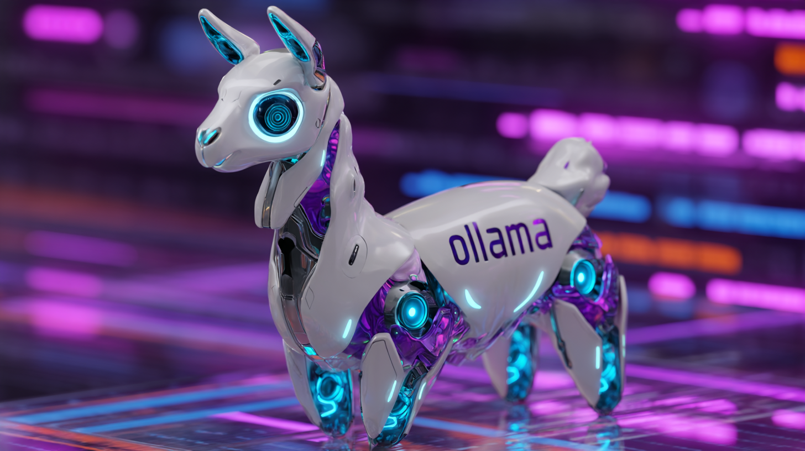
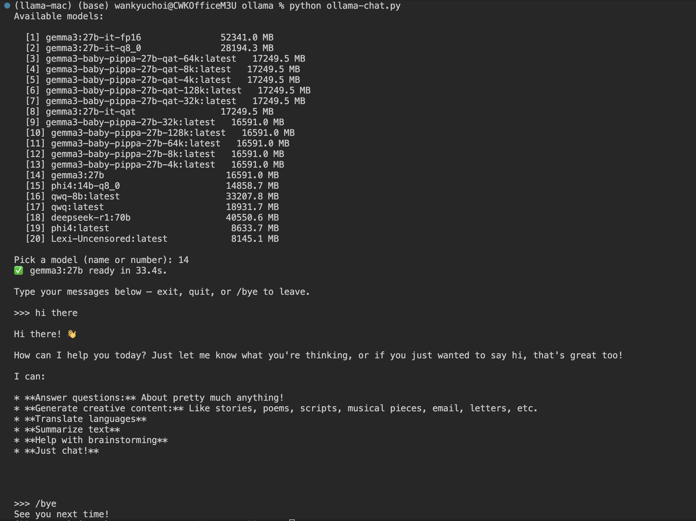

# Chapter 5 · **Ollama on an M3 Ultra** — From Prompt to Metal Shader

*(Personal lab notebook — last verified 2025-05-13)*

> **Why this chapter?**
> With *ggml*, **llama.cpp**, and a one-hour Go warm-up behind us, it's time to trace a prompt through **Ollama** and inspect two speed linchpins: the **Metal Flash-Attention path** and the **multi-layer caching system**.
> **Scope guard:** single Mac Studio **M3 Ultra** (Metal only).

**Note – Moving target ahead**
Ollama's codebase evolves quickly. Everything below reflects the latest commit at the moment of writing, but filenames and line numbers can shift overnight. Don't sweat minor diffs—the architectural flow, caching layers, and Metal pipeline change far more slowly than directory listings. Focus on the concepts.



This chapter is meant as a practical guide to understanding the Ollama codebase—not a substitute for the official documentation. For general usage and API details, refer to the excellent official docs:

[Ollama Documentation](https://github.com/ollama/ollama/tree/main/docs)

This chapter builds on the Go fundamentals from the previous chapter. If you're not comfortable with Go, it's recommended to review those first.

---

## 0 · Don't Go It Alone

**Warning:** Never trust an LLM—on its own—to navigate a live, fast-moving codebase. Models hallucinate flags, file paths, entire structs. They do it confidently, and they do it often. Clone the *official* repo first, then lean on an agentic AI (Cursor, Claude Max, etc.) that can *read* real files instead of guessing from stale training data. My go-to pairing is Claude Max + o3; let them cross-examine each other and you'll get a cleaner map, faster.

Here's the workflow that hits the sweet spot between accuracy and cost (o3 inside Cursor is ~10× pricier than most premium models):

1. **Fire up o3 in a web chat** – Pro subscription, virtually no rate limit.
2. **Spin up Claude Max inside your local repo** – Max Plan, it has first-class file access with no extra charge.
3. **Let o3 draft ideas, let Claude verify** – o3 will hallucinate paths; instruct it to *ask* Claude Max for ground-truth lookups. The two models "talk," correcting one another.
4. **Iterate** – propose → check → refine until the plan survives compilation.

Chapter 6's hacking crash course grew straight out of that loop. I'd pitch a tweak, o3 sketched a patch (sometimes inventing files), Claude Max flagged the fakes, we tightened the diff, and—after a few rounds—the custom build ran clean.

If money's no object, unleash o3 *or* Claude 3.7 Sonnet directly inside Cursor and skip the dance. It's smoother, sure—but pricey. Even the cheaper Anthropic models chew through credits on long refactors. For me, the combo below is the sweet spot:

* **OpenAI Pro on the web** → o3 queries are free.
* **Anthropic Max in-repo** → Claude Max reads files at no extra charge.

Your mileage may vary; the point is simple:

**Solo spelunking through a shifting repo:**  
You'll spend hours manually grepping, reading stale docs, and making educated guesses.

**Pairing with an on-repo AI agent:**  
You get real-time code inspection, instant sanity checks, and much lower blood pressure.

Take the second road. Your future self—and your M3 Ultra's fan curve—will thank you.

---

## 1 · A Prompt's Quick Tour

Let's take a high-level tour of the Ollama codebase to get a sense of its architecture and flow. The project is large—don't worry about mastering every detail right away. A broad overview is more than enough for now. As we dive into hands-on exploration in the next chapter, you'll see how to break down and navigate any codebase using a divide-and-conquer approach. Again, don't go it alone! (Why torture yourself? 🤣)

Here's a simplified mental model of how a prompt flows through Ollama's architecture to generate tokens:

```text
                       HTTP API            Multi-Process Architecture           GPU Acceleration
  ┌─────────┐      ┌────────────────┐      ┌───────────────────┐      ┌───────────────────┐
  │         │      │                │      │                   │      │                   │
  │  CLI    │─────▶│  Gin Router    │─────▶│  Runner Process   │─────▶│  Metal Kernels    │
  │ Client  │      │ (routes.go)    │      │ (ollamarunner)    │      │  (ggml-metal)     │
  │         │      │                │      │                   │      │                   │
  └─────────┘      └────────────────┘      └───────────────────┘      └───────────────────┘
                          │                         │                          │
                          │                         │                          │
                          ▼                         ▼                          ▼
                   ┌────────────────┐      ┌───────────────────┐      ┌───────────────────┐
                   │                │      │                   │      │                   │
                   │  ChatHandler   │      │  llama.cpp Bridge │      │ Flash-Attention   │
                   │  (routes.go)   │      │  (llama package)  │      │ Matrix Operations │
                   │                │      │                   │      │                   │
                   └────────────────┘      └───────────────────┘      └───────────────────┘
                          │                         │                          │
                          │                         │                          │
                          └─────────────────────────┼──────────────────────────┘
                                                    │
                                                    ▼
                                           ┌───────────────────┐
                                           │                   │
                                           │  Token Streaming  │
                                           │  (streamResponse) │
                                           │                   │
                                           └───────────────────┘

```

### 1.1 Dataflow in Plain English

1. **User Input → HTTP API**
   - The user enters a prompt using the CLI, for example:  
     `ollama run llama3:8b "What is quantum computing?"`
   - The CLI client connects to the Ollama HTTP server (default: `http://127.0.0.1:11434`).
   - The request is formatted and sent to the appropriate API endpoint (such as `/api/generate` or `/v1/chat/completions`).

2. **HTTP API → Model Loading**
   - The Gin router receives the request and dispatches it to the correct handler (e.g., `ChatHandler`).
   - The handler processes the request, formats the prompt, and checks if the requested model is already loaded.
   - If the model is not loaded, the scheduler starts the model loading process in a separate process.

3. **Processing → Model Runner**
   - The `ollamarunner` package manages the runtime environment for the model.
   - The request is passed through the `llm` package interface to the `llama` package.
   - The `llama` package uses CGO bindings to communicate with the underlying C++ implementation.

4. **Inference → GPU Acceleration**
   - The prompt is tokenized and prepared for inference.
   - On Apple Silicon, Metal-optimized kernels handle matrix operations.
   - Flash-Attention and other optimized routines are used to generate tokens efficiently.

5. **Generation → Streaming**
   - As each token is generated, it is sent back up the stack.
   - The `streamResponse` function streams tokens to the client in real time.
   - Context cancellation is monitored so that processing stops immediately if the client disconnects.
   - Tokens are accumulated and displayed to the user as they are produced.

**Architectural Notes:**

- Ollama uses a multi-process design:
  - The main server process manages HTTP requests and overall coordination.
  - Model loading and inference are handled in separate processes, providing isolation and stability.
  - On Apple Silicon, unified memory allows the Metal GPU backend to access model weights efficiently.

This separation increases robustness (a crashed model process won't take down the server) and flexibility (models can be loaded or unloaded independently), though it does introduce some complexity in memory management.

### 1.2 Dataflow Revisited in the Codebase

1. **CLI front door** (`main.go`)
   Runs `ollama run llama3:8b "…"`; parses flags, then connects to `http://127.0.0.1:11434` (the default, but may differ depending on how you started the server). If the daemon is running, it connects; otherwise, it starts a server inline.

   Note: Many LLMs will confidently suggest `-p` or `--prompt` flags for Ollama, simply because those are common in other CLI tools. In reality, Ollama expects the prompt as a plain string argument—no such flags exist.

2. **Router** (`server/routes.go`)
   Routes `/v1/chat/completions` → `ChatHandler`.

   The router implements an API that is compatible with OpenAI's endpoints. This means you can use existing OpenAI client libraries and tools to interact with Ollama's server, including endpoints like `/v1/chat/completions`, `/v1/completions`, and `/v1/models`. The routing logic ensures that requests sent in the OpenAI format are correctly handled and dispatched to the appropriate handlers within Ollama. This compatibility layer makes it much easier to integrate Ollama into projects or workflows originally designed for OpenAI's API, and allows for seamless switching or experimentation between providers with minimal code changes.

   This is precisely how Open WebUI communicates with the Ollama backend.

    The router in server/routes.go does implement OpenAI-compatible API endpoints, including `/v1/chat/completions`, which routes to the `ChatHandler` function.

    ```go
    // Inference (OpenAI compatibility)
    r.POST("/v1/chat/completions", openai.ChatMiddleware(), s.ChatHandler)
    r.POST("/v1/completions", openai.CompletionsMiddleware(), s.GenerateHandler)
    r.POST("/v1/embeddings", openai.EmbeddingsMiddleware(), s.EmbedHandler)
    r.GET("/v1/models", openai.ListMiddleware(), s.ListHandler)
    r.GET("/v1/models/:model", openai.RetrieveMiddleware(), s.ShowHandler)
    ```

  This OpenAI compatibility layer is crucial because:

  1. It allows existing OpenAI client libraries and tools to work with Ollama without modification
  2. Projects like Open WebUI can communicate with Ollama using the same interface they would use for OpenAI
  3. Developers can experiment with or switch between providers with minimal code changes
  4. It creates a standard interface for local LLM interactions that matches what many developers already know

  The `openai.ChatMiddleware() `function in these routes likely adapts the request format from OpenAI's standards to Ollama's internal format, ensuring seamless compatibility.


3. **Runner layer** (`runner/ollamarunner/runner.go`)
  Implements the primary runtime server that integrates with the LLM bridge through the `llm` package, which in turn connects to `llama.cpp` via `CGO` bindings defined in the `llama` package.

  The `ollamarunner` package doesn't directly bridge to `llama.cpp`; rather, it implements a higher-level server that works through the `llm` interface, which is backed by the `llama` package that contains the actual `CGO` bindings to `llama.cpp`.

4. **Metal kernels** (`/ml/backend/ggml/ggml/src/ggml-metal/ggml-metal.metal` + Objective-C shim `ggml-metal.m`)
  Implements optimized GPU kernels for Apple Silicon, including Flash-Attention variants for different head sizes, matrix multiplication operations, and softmax calculations. These Metal shader kernels are loaded and managed by the Objective-C wrapper, which provides the interface between the LLM engine and Apple's Metal GPU framework.

5. **Streaming loop** (`server/chat_handler.go` → `streamChat`)
   Implements token streaming through the `streamResponse` function, which writes tokens to the client as they are generated. The implementation handles context cancellation via `c.Request.Context()` passed to the `Completion` method, which checks for `ctx.Done()` to properly abort processing when the client disconnects.


At this point, you should have a solid grasp of how a prompt travels through Ollama's architecture to produce tokens. You can apply the same approach to explore other parts of the codebase. But remember again: don't try to tackle it all by yourself. Relying solely on your own intuition will cost you hours—or even days—that you could save by pairing up with a capable AI assistant or a trusted collaborator.

---

## 2 · Why It Feels Fast on Apple Silicon

- **Metal Flash-Attention**  
  The implementation includes optimized `kernel_flash_attn_ext` variants for different head sizes (64, 80, 96, 112, 128, 192). These kernels fuse the key attention operations—Q×K<sup>T</sup> multiplication, softmax, and value projection—within threadgroup shared memory, maximizing GPU utilization.

- **Native Quantization Support**  
  The Metal shaders directly support various quantization formats (Q4_0, Q4_1, Q6_K, etc.) with dedicated dequantization routines. This allows models to remain in compressed form until the last possible moment, reducing memory bandwidth requirements.

- **Pure Native Stack**  
  The entire inference path is implemented in compiled languages (Go, C++, Objective-C, Metal Shading Language) with no Python overhead. This eliminates interpreter overhead and GIL limitations common in Python-based ML frameworks.

- **Aggressive Streaming**  
  The `streamResponse` function in `routes.go` implements non-blocking token delivery, sending each token to the client as soon as it's available while the GPU continues processing the next batch in parallel.

- **Unified Memory Architecture**  
  Apple Silicon's shared memory between CPU and GPU eliminates costly data transfers, allowing the Metal kernels to directly access model weights in system memory.

### 2.1 · Flash-Attention In a Nutshell

**Flash-Attention** is a specialized GPU kernel technique designed to accelerate the attention mechanism in transformer models by maximizing memory efficiency and computational throughput. In Ollama's Apple Silicon stack, Flash-Attention is implemented as a set of custom Metal shaders—specifically, the `kernel_flash_attn_ext` variants—each tuned for different attention head sizes (such as 64, 80, 96, 112, 128, and 192).

**How does it work?**

- **Fused Operations:** Instead of performing the three main attention steps—query-key multiplication (Q × K<sup>T</sup>), softmax normalization, and value projection (softmax × V)—as separate GPU kernels, Flash-Attention fuses them into a single, tightly optimized kernel. This reduces the number of memory reads and writes, minimizing latency and maximizing GPU utilization.
- **Threadgroup Shared Memory:** The kernel loads all necessary data for a block of tokens into fast, on-chip shared memory. This allows the GPU to reuse intermediate results efficiently, further reducing memory bandwidth requirements.
- **Numerical Stability:** The implementation uses blockwise softmax with careful scaling and reduction steps to avoid overflow or underflow, ensuring stable results even for long sequences.
- **Zero-Copy on Unified Memory:** On Apple Silicon, both CPU and GPU share the same physical memory. The Metal kernel can directly access model weights and activations without explicit data transfers, eliminating a major bottleneck found on traditional discrete GPU systems.

**Why does this matter?**

- **Speed:** By fusing operations and minimizing memory traffic, Flash-Attention can deliver up to 2–4× faster inference for large models, especially on long prompts or when generating many tokens.
- **Scalability:** The approach is especially effective for multi-head attention with large batch sizes, as it keeps the GPU's compute units fully occupied.
- **Battery and Thermal Efficiency:** Less memory movement means lower power draw and less heat—important for both desktops and laptops.

In practice, enabling Flash-Attention may not yield dramatic speedups—benchmarks often show only single-digit percentage improvements, and the actual impact depends on model size, prompt length, and your specific hardware. While it's generally safe to leave Flash-Attention on, I've encountered occasional kernel freezes on my M3 Ultra with it enabled. If you run into similar stability issues, consider disabling Flash-Attention until a fix is available. Ultimately, trust your experience as much as the numbers.

### 2.2 · Still Snappy Without Flash-Attention

Even when the experimental Flash-Attention feature is disabled (which is the default setting unless `OLLAMA_FLASH_ATTENTION` is explicitly enabled), Ollama maintains impressive performance through several other optimizations:

- **Compiled Execution Path**  
  Unlike many ML frameworks that rely on Python interpreters, Ollama's entire inference pipeline is implemented in compiled languages (Go, C++, Metal/CUDA). This eliminates interpreter overhead and avoids the Python Global Interpreter Lock (GIL), which often becomes a bottleneck.

- **Default Quantization**  
  Models are stored and processed in quantized formats (Q4_0, Q6_K, etc.) by default, dramatically reducing memory bandwidth requirements. This is especially important when Flash-Attention is disabled, as memory bandwidth becomes a more significant factor.

- **KV Cache Optimization**  
  The key-value cache, which stores intermediate attention states to avoid redundant computation for previously seen tokens, can be configured via `OLLAMA_KV_CACHE_TYPE` to use different compression levels, reducing memory usage during generation.

- **Traditional Kernel Fusion**  
  Even without Flash-Attention, the Metal implementation includes multiple fused kernels that combine related operations, reducing memory bandwidth requirements by keeping intermediate results in fast threadgroup shared memory.

- **Unified Memory Architecture**  
  On Apple Silicon, the Metal implementation takes advantage of the shared memory space between CPU and GPU, allowing direct access to model weights without explicit data transfers. This "zero-copy" approach eliminates the traditional CPU→GPU transfer bottleneck.

- **Memory-Efficient KV Updates**  
  The implementation uses carefully optimized routines for updating the key-value cache, minimizing memory operations during the token generation loop when computing each new token.

- **Immediate Token Streaming**  
  The `streamResponse` function in `routes.go` ensures that each token is transmitted to the client as soon as it's available, creating the perception of low latency even when actual compute time is longer.

- **Thread-Level Parallelism**  
  The implementation leverages multi-threading extensively at different levels, from the Go server handling concurrent requests to the low-level SIMD and threadgroup optimizations in the Metal shaders.

Together, these optimizations ensure that Ollama delivers responsive performance across a range of hardware configurations—even without the additional benefits of Flash-Attention.

---

## 3 · Model-, KV-, and Blob-Caching Architecture

Ollama employs a sophisticated multi-layer caching system that balances performance with resource constraints. This architecture is critical for delivering responsive inference while managing memory usage effectively across various hardware configurations.

### 3.1 · Blob Cache - The Disk Layer

**Key files:** `/server/internal/cache/blob/cache.go`

The blob cache provides content-addressable storage for model weights on disk. This layer:

- Stores downloaded model files (weights, tokenizers, etc.) using content-based addressing
- Prevents redundant downloads of the same model files
- Manages chunked file storage with integrity verification
- Uses SHA-256 hashing for content identification
- Implements background garbage collection for unused blobs

The blob cache is particularly important when working with multiple similar models where weight files might be shared across variants, saving both bandwidth and disk space.

A caveat—just like with Hugging Face models—is that converting models to a different format can be a real headache.

### 3.2 · In-Memory Model Cache - The Performance Layer

**Key files:** `/runner/ollamarunner/cache.go`, `/runner/llamarunner/cache.go`

This layer is central to Ollama's responsive performance, as it manages how models remain resident in memory:

#### Core Components

- **InputCache**: Central structure that tracks model states across multiple contexts
- **InputCacheSlot**: Individual slots for each loaded model state with unique IDs
- **Prefix Matching**: Algorithm that finds shared history between requests
- **LRU Eviction**: Least-Recently-Used policy for managing limited memory

#### How Models Stay Resident in Memory

1. **Loading Process**:
   - When a model is first requested, the scheduler (`server/sched.go`) initiates loading through the appropriate runner
   - The model weights are mapped into memory (either CPU RAM or GPU VRAM)
   - An `InputCache` instance is created that will track this model's state

2. **Keep-Alive Mechanism**:
   - Models remain in memory based on the `OLLAMA_KEEP_ALIVE` duration (default: 5 minutes)
   - Each time a model is used, its expiration timer resets
   - Setting `OLLAMA_KEEP_ALIVE` to a negative value keeps models loaded indefinitely
   - The `runnerRef` structure in `sched.go` tracks these expiration times

> **Heads-up:** `time.Duration(math.MaxInt64)` is roughly 292 years—effectively "infinite" for human timescales.

3. **Reference Counting**:
   - A reference counting system prevents unloading models that are actively processing requests
   - Only models with zero references can be evicted from memory
   - This ensures stability during concurrent operations

4. **Slot Selection Algorithm**:
   - For each new request, Ollama tries to find the optimal cache slot:
     - `findLongestCacheSlot`: Optimizes for single-user scenarios
     - `findBestCacheSlot`: Optimizes for multi-user scenarios (when `OLLAMA_MULTIUSER_CACHE` is enabled)
   - The selection weighs factors like prefix match length and recency of use

5. **Memory Pressure Response**:
   - When memory constraints are detected, the scheduler (`sched.go`) may force-evict models
   - It uses `findRunnerToUnload` to select candidates based on:
     - Keep-alive duration (shortest first)
     - LRU policy (oldest use first)
     - Memory usage (largest first when similar in other aspects)
   - After unloading, it uses `waitForVRAMRecovery` to ensure memory is truly freed before allowing new loads

6. **Configuration Controls**:
   - `OLLAMA_MAX_LOADED_MODELS`: Caps the number of models kept in memory
   - `OLLAMA_KEEP_ALIVE`: Controls the duration models remain loaded after last use
   - `OLLAMA_MULTIUSER_CACHE`: Changes caching strategy for shared usage patterns
   - `OLLAMA_GPU_LAYERS`: Controls layer distribution across GPUs (impacts memory utilization)

The caching mechanism intelligently balances between these parameters to keep frequently used models in memory while respecting hardware limitations.

### 3.3 · KV Cache - The Conversation Layer

**Key files:** `/kvcache/cache.go`, `/kvcache/causal.go`

This specialized cache stores the key-value tensors for attention mechanisms in transformer models:

- Maintains the "memory" of ongoing conversations
- Allows the model to efficiently process new tokens without recomputing the entire context
- Implements shifting strategies to discard older tokens when reaching capacity
- Can be configured with different compression modes via `OLLAMA_KV_CACHE_TYPE`
- Uses a carousel mechanism to manage context windows efficiently

The KV cache is crucial for maintaining conversation flow while controlling memory usage, especially for long interactions.

### 3.4 · Memory Tracking System

**Key files:** `/llm/memory.go`

Ollama's memory tracker provides the intelligence behind caching decisions:

- `PredictServerFit`: Determines if a model will fit in available memory
- `EstimateGPULayers`: Calculates optimal layer distribution across GPUs
- Tracks both system RAM and GPU VRAM independently
- Factors in overhead for tokenization, inference, and system processes
- Recently enhanced to include per-model memory tracking (as seen in the recent commits)

The memory tracking subsystem provides essential data to the scheduler for making informed loading and eviction decisions.

### 3.5 · The Scheduler - Orchestrating Cache Operations

**Key files:** `/server/sched.go`

The scheduler acts as the conductor of Ollama's caching symphony:

- Manages model loading/unloading based on request patterns
- Implements request queuing with prioritization
- Tracks model reference counts to prevent premature unloading
- Maintains a registry of active model runners
- Implements back-pressure mechanisms for system stability
- Monitors memory conditions to trigger evictions when necessary

The scheduler's sophistication allows Ollama to handle many concurrent requests while carefully managing system resources.

### 3.6 · Model Registry - The Coordination Layer

**Key files:** `/server/model.go`

The model registry maintains the global view of available models:

- Maps model names to runner instances
- Provides model resolution from user-friendly names to internal identifiers
- Manages model metadata and capabilities
- Handles model registration and deregistration
- Coordinates model operations across the system

This registry ensures that operations across different parts of the system reference the same model instances consistently.

Together, these caching layers create a finely-tuned system that maximizes performance while respecting hardware constraints, enabling efficient inference across a wide range of devices and use cases.

---

## 4 · Experimenting with Flash-Attention and Keep Alive Settings

Ollama provides several environment variables that allow you to fine-tune performance and memory usage. Two particularly interesting areas for experimentation are Flash-Attention (for inference speed) and model Keep Alive settings (for reducing model load times).

### 4.1 · Flash-Attention Configuration

Flash-Attention is an optimized GPU kernel technique for transformer models that fuses operations and minimizes memory traffic, potentially delivering significant speedups especially on long context prompts.

**Key configuration parameters:**

```bash
# Enable Flash-Attention (disabled by default)
export OLLAMA_FLASH_ATTENTION=1

# Configure KV cache quantization (only applies when Flash-Attention is enabled)
# Options: f16 (default), q8_0, q6_k, q5_k, q5_0, q5_1, q4_k, q4_0, q4_1
export OLLAMA_KV_CACHE_TYPE=q8_0
```

Or just run:

```bash
OLLAMA_FLASH_ATTENTION=1 ollama run llama3:8b "What is quantum computing?"
```

```bash
OLLAMA_FLASH_ATTENTION=1 ollama serve &"
```

**Important:** If you installed Ollama using Homebrew, environment variables may not always be picked up as expected. For reliable development and experimentation, it's best to launch Ollama using the standard (non-Homebrew) server methods described earlier in the setup guide.

**Flash-Attention requirements:**

1. **Hardware Support**: 
   - Metal GPUs: M-series Apple Silicon (M1/M2/M3)
   - CUDA: Supported on compatible NVIDIA GPUs

2. **Model Support**:
   - Not all models support Flash-Attention
   - The model's architecture must be compatible (llama.cpp checks this via `f.SupportsFlashAttention()`)

3. **Validation Logic**:
   The decision to enable Flash-Attention follows this sequence in `/llm/server.go`:
   ```go
   fa := envconfig.FlashAttention()
   if fa && !gpus.FlashAttentionSupported() {
       slog.Warn("flash attention enabled but not supported by gpu")
       fa = false
   }
   if fa && !f.SupportsFlashAttention() {
       slog.Warn("flash attention enabled but not supported by model")
       fa = false
   }
   ```

**Monitoring Flash-Attention:**

You can confirm Flash-Attention is active by:

1. Setting `OLLAMA_DEBUG=1` and observing the logs for:
   ```
   INFO: enabling flash attention
   ```

2. If you see warnings like these, Flash-Attention was requested but not used:
   ```
   WARN: flash attention enabled but not supported by gpu
   WARN: flash attention enabled but not supported by model
   ```

### 4.2 · Model Keep Alive Settings

The Keep Alive setting determines how long models stay loaded in memory after their last use, dramatically affecting response times for repeated queries while balancing memory consumption.

**Key configuration parameters:**

```bash
# Set keep-alive duration (default: 5 minutes)
# Accepts Go duration format (e.g., "10m", "1h") or seconds as integer
export OLLAMA_KEEP_ALIVE="30m"

# Set to negative value to keep models loaded indefinitely
export OLLAMA_KEEP_ALIVE="-1"

# For multi-user scenarios, optimize prompt caching
export OLLAMA_MULTIUSER_CACHE=1

# Limit maximum number of loaded models (default: auto-calculated per GPU)
export OLLAMA_MAX_LOADED_MODELS=3
```

**Keep Alive implementation:**

1. **Duration Parsing** (in `envconfig/config.go`):
   ```go
   func KeepAlive() (keepAlive time.Duration) {
       keepAlive = 5 * time.Minute
       if s := Var("OLLAMA_KEEP_ALIVE"); s != "" {
           if d, err := time.ParseDuration(s); err == nil {
               keepAlive = d
           } else if n, err := strconv.ParseInt(s, 10, 64); err == nil {
               keepAlive = time.Duration(n) * time.Second
           }
       }
       if keepAlive < 0 {
           return time.Duration(math.MaxInt64)
       }
       return keepAlive
   }
   ```

2. **Reference Counting** (in `server/sched.go`):
   - Each model gets a reference counter incrementing on use
   - Only models with zero references and expired keep-alive can be unloaded
   - The `runnerRef` structure tracks expiration times

3. **Eviction Logic**:
   - When memory constraints trigger, the scheduler selects models to evict based on:
     - Keep-alive duration (shortest first)
     - LRU (Least Recently Used) policy for equally eligible models
     - Memory usage (largest first when similar in other aspects)

**Verifying Keep Alive settings:**

1. With `OLLAMA_DEBUG=1`, check logs for keep-alive expiration messages:
   ```
   DEBUG: runner reference expired, decrementing count for model
   ```

2. Run `ollama ps` repeatedly after using a model to observe if/when it's unloaded

3. Time the first vs. subsequent responses to the same model to verify it stays loaded:
   ```bash
   # First run (cold start):
   time ollama run llama3 "What is quantum computing?"
   
   # Subsequent run within keep-alive period:
   time ollama run llama3 "What is artificial intelligence?"
   ```

### 4.3 · Practical Experimentation

**Flash-Attention performance testing:**

```bash
# Baseline test (Flash-Attention off)
ollama run llama3 "Write a detailed 1000-word essay on AGI."

# Flash-Attention test
OLLAMA_FLASH_ATTENTION=1 ollama run llama3 "Write a detailed 1000-word essay on AGI."

# Flash-Attention with KV cache quantization
OLLAMA_FLASH_ATTENTION=1 OLLAMA_KV_CACHE_TYPE=q8_0 ollama run llama3 "Write a detailed 1000-word essay on AGI."
```

**Keep Alive memory management:**

```bash
# Default 5-minute keep-alive
ollama run llama3 "Question 1"
# Wait 3 minutes
ollama run llama3 "Question 2"  # Should use cached model

# Extended keep-alive for long sessions
OLLAMA_KEEP_ALIVE="1h" ollama run llama3 "Question 1"

# Infinite keep-alive for development
OLLAMA_KEEP_ALIVE="-1" ollama run llama3 "Question 1"

# Multi-model memory management
OLLAMA_MAX_LOADED_MODELS=2 ollama run llama3 "Question 1"
# Then load another model
OLLAMA_MAX_LOADED_MODELS=2 ollama run gemma:7b "Question 2"
# Try loading a third (should evict one of the previous models)
OLLAMA_MAX_LOADED_MODELS=2 ollama run mistral "Question 3"
```

**Cache optimization for multi-user scenarios:**

```bash
# Enable multi-user cache optimization
OLLAMA_MULTIUSER_CACHE=1 ollama serve

# In separate terminals, connect multiple clients to test shared prompt caching
ollama run llama3 "What is the capital of France?"
ollama run llama3 "What is the capital of Germany?"
```

### 4.4 · Trade-offs and Considerations

1. **Flash-Attention**:
   - ✅ Significant speedups for long-context inference
   - ✅ Better memory efficiency during inference
   - ❌ Not supported on all hardware or models
   - ❌ Occasional instability on some hardware configurations

2. **Keep Alive**:
   - ✅ Dramatically reduced latency for repeat queries
   - ✅ Better user experience for conversational interfaces
   - ❌ Increased memory consumption
   - ❌ Can cause resource contention with many models

3. **Cache Type**:
   - ✅ Higher quantization (q4_0, q4_1) reduces memory usage
   - ✅ Allows fitting larger context windows
   - ❌ Potential minor quality degradation
   - ❌ Only applies when Flash-Attention is enabled

When experimenting with these settings, monitor system performance (memory usage, GPU utilization) to find the optimal balance for your specific hardware configuration and usage patterns.

---

## 5 · Checkpoint

You can now:

* Follow a prompt end-to-end—from CLI to Metal kernels
* See why Apple-Silicon runs feel so **fast**
* Wrangle the model / KV / blob caches with confidence
* Toggle the big levers (`OLLAMA_KEEP_ALIVE`, `OLLAMA_FLASH_ATTENTION`)
* Benchmark tweaks and read the numbers, not the hype
* Balance memory versus speed like a pro

Ready for the fun part? **Chapter 6** takes the gloves off and dives into live code. 🐑💻

---

## Appendix A: Ollama Project Folder Structure

Ollama is an open-source project for running large language models (LLMs) locally on various platforms. This document explains the purpose of each directory in the repository.

### Directory Structure Overview

```
ollama/
├── .github/            # GitHub configuration files
│   ├── ISSUE_TEMPLATE/ # Templates for GitHub issues
│   └── workflows/      # GitHub Actions workflow definitions
├── .specstory/         # Specification and story files for development
├── api/                # REST API implementation and client
│   └── examples/       # Example API usage (chat, generation, etc.)
├── app/                # Desktop application
│   ├── assets/         # App icons and assets
│   ├── lifecycle/      # App lifecycle management
│   ├── store/          # Platform-specific app stores
│   └── tray/           # System tray functionality
├── auth/               # Authentication functionality
├── benchmark/          # Performance benchmarking
├── build/              # Build artifacts
├── cmd/                # Command-line interface
│   └── runner/         # Entry point for runner process
├── convert/            # Model format conversion utilities
│   ├── sentencepiece/  # SentencePiece tokenizer
│   └── testdata/       # Test data for conversions
├── discover/           # GPU and hardware detection
├── dist/               # Distribution files
├── docs/               # Documentation
│   └── images/         # Documentation images
├── envconfig/          # Environment configuration
├── format/             # Formatting utilities
├── fs/                 # Filesystem operations
│   ├── ggml/           # GGML file format handling
│   └── util/           # Filesystem utilities
├── integration/        # Integration testing
│   └── testdata/       # Test data for integration tests
├── kvcache/            # Key-value cache implementation
├── llama/              # Integration with llama.cpp
│   ├── llama.cpp/      # Vendored llama.cpp library with patches
│   └── patches/        # Patches for llama.cpp
├── llm/                # LLM functionality and server
├── macapp/             # macOS application specific code
│   ├── assets/         # macOS app assets
│   ├── node_modules/   # Node.js dependencies
│   └── src/            # macOS app source
├── ml/                 # Machine learning backend
│   ├── backend/        # ML backends (GGML)
│   └── nn/             # Neural network implementations
├── model/              # Model handling code
│   ├── imageproc/      # Image processing for multimodal models
│   ├── input/          # Input processing
│   ├── models/         # Model architectures (LLaMA, Gemma, etc.)
│   └── testdata/       # Test data for models
├── openai/             # OpenAI-compatible API
├── parser/             # Modelfile parsing
├── progress/           # Progress reporting utilities
├── readline/           # Terminal readline implementation
├── runner/             # Model runner implementation
│   ├── common/         # Common runner functionality
│   ├── llamarunner/    # LLaMA-specific runner
│   └── ollamarunner/   # Ollama-specific runner
├── sample/             # Text generation sampling algorithms
├── scripts/            # Build and installation scripts
├── server/             # Server implementation
│   ├── internal/       # Internal server components
│   │   ├── cache/      # Caching functionality
│   │   ├── client/     # Client implementations
│   │   ├── manifest/   # Model manifest handling
│   │   └── registry/   # Model registry
│   └── testdata/       # Test data for server
├── template/           # Chat prompt templates
│   └── testdata/       # Template test data
├── types/              # Common type definitions
│   ├── errtypes/       # Error types
│   ├── model/          # Model types and capabilities
│   └── syncmap/        # Synchronized map implementation
└── version/            # Version information
```

### Main Components

#### API (`/api`)
The API directory contains the REST API implementation for Ollama, including client bindings for Go and examples demonstrating how to use the API for chat, text generation, multimodal interactions, and model management.

#### Application (`/app`)
Contains the desktop application code for different platforms, with platform-specific implementations for Windows, macOS, and Linux. Includes system tray functionality, lifecycle management, and assets.

#### Command Line Interface (`/cmd`)
Implements the Ollama CLI with commands for running models, creating models, and interacting with the Ollama server. Contains interactive chat functionality and platform-specific startup code.

#### Model Conversion (`/convert`)
Utilities for converting between different model formats, supporting various model architectures like BERT, LLaMA, Mistral, Gemma, and more. Includes tokenizer implementations.

#### Hardware Discovery (`/discover`)
Responsible for detecting available hardware accelerators (GPUs) and their capabilities. Supports CUDA (NVIDIA), ROCm (AMD), and Metal (Apple) with platform-specific implementations.

#### LLaMA Integration (`/llama`)
Core integration with llama.cpp, which provides the underlying inference engine. Contains Go bindings to the C/C++ library and custom patches to enhance functionality.

#### LLM Framework (`/llm`)
Higher-level LLM functionality including the server implementation, memory management, and status tracking for running models.

#### Machine Learning (`/ml`)
Abstractions for machine learning backends, primarily focused on GGML/GGUF integration. Contains neural network layer implementations.

#### Model Handling (`/model`)
Code for managing models, including image processing for multimodal models, text processing, tokenization, and implementations for specific model architectures.

#### Server (`/server`)
The main server implementation with HTTP routes and handlers, model creation, download management, and image processing for multimodal models.

#### Templates (`/template`)
Chat prompt templates for different model architectures, ensuring proper formatting of prompts for various models like LLaMA, Mistral, Gemma, etc.

### Build System

The project uses a combination of Go and C/C++ with platform-specific build scripts in the `/scripts` directory. The build process supports:

- CPU-only execution
- NVIDIA GPU acceleration via CUDA
- AMD GPU acceleration via ROCm
- Apple Silicon acceleration via Metal

The main entry points are:
- `/main.go` - CLI entry point
- `/app/main.go` - Desktop application entry point
- `/cmd/runner/main.go` - Runner process entry point

### Documentation

Comprehensive documentation is available in the `/docs` directory, covering API usage, troubleshooting, model formats, and platform-specific guides.

---

## Appendix B: Ollama Python Library

Ollama offers a Python library for interacting with the Ollama server. This library provides a Python interface to the Ollama API, allowing you to use Ollama in your Python applications. 

I strongly recommend you clone the official repo and explore:

```bash
git clone https://github.com/ollama/ollama-python.git
```

Exploring the provided examples is one of the fastest ways to get hands-on with the API. If you like pair-programming with an AI assistant, point it directly at the local cloned repo and have it generate code based on the actual source—don't rely on generic retrieval from the web, as that often leads to hallucinated or outdated code.

[Python Examples](https://github.com/ollama/ollama-python/tree/main/examples)

First, install the library:

```bash
pip install ollama
```

The following interactive chat example closely mirrors the Ollama CLI chat experience. Note: The Ollama Python API communicates with a running Ollama backend, so be sure the Ollama server is running locally before using this script.

If you installed ollama via Homebrew, you can start the server with:

```bash
brew services start ollama
```

Or, if you installed it via the installer or built it yourself from source, you can start the server with:

```bash
ollama serve &
```

Then run the script:

[Ollama Chat](examples/ollama/ollama-chat.py)

```bash
python ollama-chat.py          # interactive picker + progress bar
python ollama-chat.py -m qwq:latest
```



```python
#!/usr/bin/env python3
"""
Interactive Ollama chat (CLI-style) with upfront model warm-up
and a tqdm spinner while loading.

• Pass -m / --model, or choose interactively.
• Shows a live progress bar while the model is pulled into RAM/VRAM.
• Exits on  exit, quit, or /bye  — just like the Ollama CLI.

Requires ollama-python ≥ 0.2.0 and (optionally) tqdm.
"""

from __future__ import annotations
import sys
import time
import argparse
import threading
from ollama import chat, list as list_models

try:
    from tqdm import tqdm
except ImportError:  # graceful fallback
    tqdm = None  # type: ignore

EXIT_WORDS = {"exit", "quit", "/bye"}


# --------------------------------------------------------------------------- #
# Helper: list local models and let user choose                               #
# --------------------------------------------------------------------------- #
def choose_model() -> str:
    models = (list_models()).models or []
    if not models:
        sys.exit("No local models found. Pull one first:  ollama pull <name>")

    print("Available models:\n")
    for idx, m in enumerate(models, 1):
        mb = m.size.real / 1024 / 1024
        print(f"  [{idx}] {m.model:<30}  {mb:>8.1f} MB")

    while True:
        choice = input("\nPick a model (name or number): ").strip()
        if not choice:
            print("Type something.")
            continue
        if choice.isdigit():
            idx = int(choice)
            if 1 <= idx <= len(models):
                return models[idx - 1].model
            print("Invalid number.")
            continue
        for m in models:
            if m.model == choice:
                return m.model
        print("Model not in list.")


def parse_cli() -> argparse.Namespace:
    p = argparse.ArgumentParser(description="Streamed Ollama chat.")
    p.add_argument("-m", "--model", help="Model name/tag (e.g. llama3.2)")
    return p.parse_args()


# --------------------------------------------------------------------------- #
# Helper: warm the model, showing tqdm bar if available                       #
# --------------------------------------------------------------------------- #
def warm_up(model_name: str) -> None:
    if tqdm:
        stop_flag = threading.Event()

        def _progress():
            with tqdm(
                desc=f"Loading {model_name}",
                bar_format="{l_bar}{bar} ⏳",
                total=1000,  # arbitrary large number, we'll close early
                colour=None,
                leave=False,
            ) as bar:
                while not stop_flag.is_set():
                    bar.update(1)
                    time.sleep(0.02)  # 50 FPS for a smooth bar

        t = threading.Thread(target=_progress, daemon=True)
        t.start()
    else:
        print(f"\n⏳ Loading **{model_name}** …", flush=True)

    t0 = time.perf_counter()

    # Dummy request with num_predict=0 forces the load without output.
    _ = chat(
        model=model_name,
        messages=[{"role": "user", "content": "warm-up"}],
        stream=False,
        options={"num_predict": 0},
    )

    elapsed = time.perf_counter() - t0

    if tqdm:
        stop_flag.set()
        t.join()
        # Ensure we leave the progress bar line clean
        print(f"\r✅ {model_name} ready in {elapsed:.1f}s.{' ' * 20}")
    else:
        print(f"✅ Model ready in {elapsed:.1f}s.\n")


# --------------------------------------------------------------------------- #
# Main loop                                                                   #
# --------------------------------------------------------------------------- #
def main() -> None:
    args = parse_cli()
    model_name = args.model or choose_model()
    warm_up(model_name)

    print("\nType your messages below — exit, quit, or /bye to leave.\n")
    messages: list[dict[str, str]] = []

    while True:
        try:
            user_text = input(">>> ").strip()
        except (EOFError, KeyboardInterrupt):
            print("\nGood-bye!")
            break

        if user_text.lower() in EXIT_WORDS:
            print("See you next time!")
            break

        messages.append({"role": "user", "content": user_text})

        stream = chat(model=model_name, messages=messages, stream=True)

        reply_parts: list[str] = []
        print()  # blank line before assistant types

        for chunk in stream:
            part = chunk["message"]["content"]
            reply_parts.append(part)
            sys.stdout.write(part)
            sys.stdout.flush()

        print()  # newline after assistant finishes
        messages.append({"role": "assistant", "content": "".join(reply_parts)})


if __name__ == "__main__":
    main()

```

---

*[⇧ Back to README](../README.md)*
