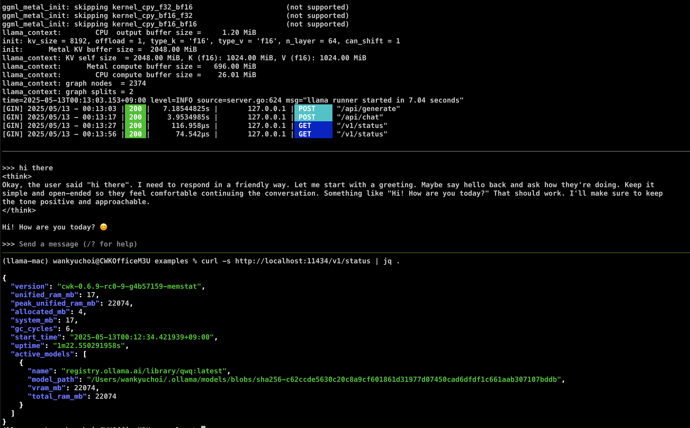

# Chapter 6 · Hacking Ollama in Go — A Zero-to-Hero Lab

*(Personal lab notebook — last verified 2025-05-13)*

> **Why this chapter?**
> Reading source is power, but **shipping your own binary is freedom**. After mastering *ggml*, **llama.cpp**, basic Go, and Ollama's architecture, you're ready to crack the hood, add features, and benchmark them on a live Mac Studio. In one sitting you'll clone the repo, add a **unified-memory telemetry API**, and ship a custom daemon.
> **Scope guard — sane & safe:** single-machine **M3 Ultra** build, Metal path only — minimal changes, no shader edits. Everything is reversible with `git reset --hard`.

*(Applies to the commit streamed on 2025-05-13; paths will drift over time.)*

---

### 0 · TL;DR — What You'll Build

1. A **`/v1/status`** endpoint that reports live and **peak** unified-RAM, heap stats, GC cycles, and uptime.
2. A binary tagged **`cwk-memstat`** so you can run it beside the stock build.
3. Enhanced model memory tracking that reveals Ollama's unique architecture.

You'll touch only Go—no Metal shaders.

```bash
#before loading a model:
{
  "version": "cwk-0.6.9-rc0-9-g4b57159-memstat",
  "unified_ram_mb": 12,
  "peak_unified_ram_mb": 12,
  "allocated_mb": 2,
  "system_mb": 12,
  "gc_cycles": 2,
  "start_time": "2025-05-12T23:40:16.627602+09:00",
  "uptime": "3.232820708s"
}

# after loading a model:
{
  "version": "cwk-0.6.9-rc0-9-g4b57159-memstat",
  "unified_ram_mb": 17,
  "peak_unified_ram_mb": 22074,
  "allocated_mb": 3,
  "system_mb": 17,
  "gc_cycles": 5,
  "start_time": "2025-05-12T23:40:33.846366+09:00",
  "uptime": "7.127512333s",
  "active_models": [
    {
      "name": "registry.ollama.ai/library/qwq:latest",
      "model_path": "/Users/wankyuchoi/.ollama/models/blobs/sha256-c62ccde5630c20c8a9cf601861d31977d07450cad6dfdf1c661aab307107bddb",
      "vram_mb": 22074,
      "total_ram_mb": 22074
    }
  ]
}
```

Let's understand what each field means:

* **version**: "cwk-0.6.9-rc0-9-g4b57159-memstat" — Our custom version tag, showing the underlying Ollama version with our memstat suffix
* **unified_ram_mb**: 17 — Memory used by the main Go server process in MB (tiny footprint!)
* **peak_unified_ram_mb**: 22074 — Highest memory usage observed, including model memory
* **allocated_mb**: 3 — Go heap memory currently allocated for active objects
* **system_mb**: 17 — Total memory obtained from the OS by the Go process
* **gc_cycles**: 5 — Number of garbage collection cycles run by the Go runtime
* **start_time**: "2025-05-12T23:40:33.846366+09:00" — When the server was started
* **uptime**: "7.127512333s" — How long the server has been running
* **active_models**: Array of loaded model information:
  * **name**: "registry.ollama.ai/library/qwq:latest" — Model name/identifier
  * **model_path**: "/Users/wankyuchoi/.ollama/models/blobs/sha256-c62ccde5630c20c8a9cf601861d31977d07450cad6dfdf1c661aab307107bddb" — Path to the model file
  * **vram_mb**: 22074 — Estimated GPU memory (VRAM) used by the model in MB
  * **total_ram_mb**: 22074 — Total memory usage by the model in MB (includes both GPU and system memory)

---

## 1 · Clone, Compile, Prepare

```bash
git clone https://github.com/ollama/ollama.git
cd ollama

# optional workspace for better editor support
go work init ./...

# create a starting checkpoint
git commit --allow-empty -m "CWK: Square One"
```
---

## 2 · One-Page Repo Map

| Path / file               | What lives here                                  |
| ------------------------- | ------------------------------------------------ |
| `cmd/…`                   | CLI sub-command glue (`run`, `serve`, `pull`, …) |
| `server/`                 | HTTP handlers, router, scheduler                 |
| `runner/ollamarunner/`    | In-memory model cache + C bridge                 |
| `kvcache/`                | Per-conversation KV tensors                      |
| `ml/backend/ggml/…`       | C + Metal backend                                |
| `envconfig/`              | All environment-variable parsing                 |
| `scripts/build_darwin.sh` | Go + Metal build script                          |

Today's hack touches **`server/`** only.

---

## 3 · Add Memory Metrics

### 3.1 Create `server/status.go`

```bash
touch server/status.go
```

```go
package server

import (
	"net/http"
	"runtime"
	"sync/atomic"
	"time"

	"github.com/gin-gonic/gin"
	"github.com/ollama/ollama/version"
)

// Status represents memory usage statistics optimized for M3 Ultra monitoring
type Status struct {
	Version          string    `json:"version"`
	UnifiedRAMMB     uint64    `json:"unified_ram_mb"`      // Current unified memory usage
	PeakUnifiedRAMMB uint64    `json:"peak_unified_ram_mb"` // Peak unified memory usage
	AllocatedMB      uint64    `json:"allocated_mb"`        // Go heap allocated memory
	SystemMB         uint64    `json:"system_mb"`           // Total system memory obtained
	GCCycles         uint32    `json:"gc_cycles"`           // Number of completed GC cycles
	StartTime        time.Time `json:"start_time"`          // Server start time
	Uptime           string    `json:"uptime"`              // Server uptime
	ActiveModels     []ModelMemoryInfo `json:"active_models,omitempty"` // Information about loaded models
}

// ModelMemoryInfo contains memory information about a loaded model
type ModelMemoryInfo struct {
	Name       string `json:"name"`        // Model name
	ModelPath  string `json:"model_path"`  // Path to the model file
	VRAMMB     uint64 `json:"vram_mb"`     // Estimated VRAM usage
	TotalRAMMB uint64 `json:"total_ram_mb"` // Total memory usage (system + GPU)
}

// Package-level peak memory tracker with atomic operations for thread safety
var peakRAM atomic.Uint64

// Server start time
var serverStartTime = time.Now()

// StatusHandler returns the current memory usage statistics
func (s *Server) StatusHandler(c *gin.Context) {
	// Get current memory stats
	var ms runtime.MemStats
	runtime.ReadMemStats(&ms)

	// Convert bytes to MB for readability
	current := ms.Sys / 1024 / 1024

	// Compare-and-swap loop to only capture increases in peak memory usage
	for {
		prev := peakRAM.Load()
		if current <= prev || peakRAM.CompareAndSwap(prev, current) {
			break
		}
	}

	// Get information about loaded models from the scheduler
	var activeModels []ModelMemoryInfo

	// Access the loaded models from the scheduler if available
	if s.sched != nil {
		s.sched.loadedMu.Lock()
		for _, runner := range s.sched.loaded {
			if runner != nil && runner.model != nil {
				modelInfo := ModelMemoryInfo{
					Name:       runner.model.Name,
					ModelPath:  runner.modelPath,
					VRAMMB:     runner.estimatedVRAM / 1024 / 1024,
					TotalRAMMB: runner.estimatedTotal / 1024 / 1024,
				}
				activeModels = append(activeModels, modelInfo)

				// Also update the peak memory if model memory is higher
				modelMem := runner.estimatedTotal / 1024 / 1024
				if modelMem > current {
					for {
						prev := peakRAM.Load()
						if modelMem <= prev || peakRAM.CompareAndSwap(prev, modelMem) {
							break
						}
					}
				}
			}
		}
		s.sched.loadedMu.Unlock()
	}

	// Prepare comprehensive status response with M3 Ultra relevant metrics
	status := Status{
		Version:          "cwk-" + version.Version + "-memstat",
		UnifiedRAMMB:     current,
		PeakUnifiedRAMMB: peakRAM.Load(),
		AllocatedMB:      ms.Alloc / 1024 / 1024,
		SystemMB:         ms.Sys / 1024 / 1024,
		GCCycles:         ms.NumGC,
		StartTime:        serverStartTime,
		Uptime:           time.Since(serverStartTime).String(),
		ActiveModels:     activeModels,
	}

	c.JSON(http.StatusOK, status)
}
```

### 3.2 Register the route

Open **`server/routes.go`**, locate where API routes are defined, and add:

```go
// Memory-status endpoint
r.GET("/v1/status", s.StatusHandler)
```

### 3.3 Commit our changes

```bash
git add server/status.go server/routes.go
git commit -m "CWK: Implement memory monitoring endpoints"
```

---

## 4 · Unit-Test the Peak Logic

```bash
touch server/status_test.go
```

```go
package server

import (
	"testing"
)

func TestPeakMemoryTracking(t *testing.T) {
	// Test the behavior of our peak memory tracking logic

	// Reset peak to zero
	peakRAM.Store(0)
	
	// Simulate the StatusHandler logic with various memory values
	
	// First update with 100 MB
	simulateStatusHandler(100)
	if peakRAM.Load() != 100 {
		t.Fatalf("Expected peak to be 100, got %d", peakRAM.Load())
	}
	
	// Try updating with a lower value (50 MB)
	simulateStatusHandler(50)
	if peakRAM.Load() != 100 {
		t.Fatalf("Peak decreased from 100 to %d, but should never decrease", peakRAM.Load())
	}
	
	// Now update with a higher value (200 MB)
	simulateStatusHandler(200)
	if peakRAM.Load() != 200 {
		t.Fatalf("Peak should increase to 200, but got %d", peakRAM.Load())
	}
}

// simulateStatusHandler reproduces the exact logic from StatusHandler
func simulateStatusHandler(currentMB uint64) {
	// This is the exact same logic used in the StatusHandler method
	current := currentMB
	
	for {
		prev := peakRAM.Load()
		if current <= prev || peakRAM.CompareAndSwap(prev, current) {
			break
		}
	}
}
```

Run the test:

```bash
go test ./server -run TestPeakMemoryTracking -v
```

```
=== RUN   TestPeakMemoryTracking
--- PASS: TestPeakMemoryTracking (0.00s)
PASS
```

Commit our test:

```bash
git add server/status_test.go
git commit -m "CWK: Add unit tests for peak memory tracking"
```

---

## 5 · Rebuild & Test

```bash
# Build specifically for ARM64 (M3 Ultra)
GOARCH=arm64 ./scripts/build_darwin.sh
cp dist/darwin-arm64/ollama bin/ollama-cwk-memstat
chmod +x bin/ollama-cwk-memstat

# Run with infinite keep-alive to see steady growth
OLLAMA_KEEP_ALIVE=-1 ./bin/ollama-cwk-memstat serve
```

In another terminal or tmux pane:

```bash
curl -s http://localhost:11434/v1/status | jq .
```

Initial output with no models loaded:

```json
{
  "version": "cwk-0.6.9-rc0-5-g3ddc02d-memstat",
  "unified_ram_mb": 13,
  "peak_unified_ram_mb": 13,
  "allocated_mb": 2,
  "system_mb": 13,
  "gc_cycles": 3,
  "start_time": "2025-05-12T23:26:14.734173+09:00",
  "uptime": "2m13.191407542s"
}
```

**Remember:** The custom binary you create through this process is a full-fledged Ollama server/client that functions as a drop-in replacement for the stock binary.

It contains all the original Ollama functionality, plus your custom enhancements (in this case, the memory monitoring endpoints).

Since you're only adding new endpoints without modifying existing behavior, it's completely compatible with regular Ollama operations like pulling models, running inference, and managing model files.

This is what makes this approach so practical - you can experiment with custom features while maintaining complete compatibility with the standard Ollama workflow.

---

## 6 · Understanding Ollama's Multi-Process Architecture

Loading a model and checking the status reveals Ollama's unique architecture:

```bash
# In a new terminal, load a model
OLLAMA_KEEP_ALIVE=-1 ./bin/ollama-cwk-memstat run qwq

# Then check the status again
curl -s http://localhost:11434/v1/status | jq .
```

Output after loading a model:

```json
{
  "version": "cwk-0.6.9-rc0-9-g4b57159-memstat",
  "unified_ram_mb": 17,
  "peak_unified_ram_mb": 22074,
  "allocated_mb": 3,
  "system_mb": 17,
  "gc_cycles": 5,
  "start_time": "2025-05-12T23:40:33.846366+09:00",
  "uptime": "7.127512333s",
  "active_models": [
    {
      "name": "registry.ollama.ai/library/qwq:latest",
      "model_path": "/Users/wankyuchoi/.ollama/models/blobs/sha256-c62ccde5630c20c8a9cf601861d31977d07450cad6dfdf1c661aab307107bddb",
      "vram_mb": 22074,
      "total_ram_mb": 22074
    }
  ]
}
```



This output reveals a key insight about Ollama's architecture:

1. The Go server process itself (`unified_ram_mb: 17`) uses very little memory
2. But the model (`vram_mb: 22074`) consumes over 22GB!
3. The peak memory includes the model's memory

Our memory monitoring implementation has uncovered a fascinating aspect of Ollama's design:

1. **Process Separation**: Ollama uses a multi-process architecture:
   - The main Go server process handles API requests, scheduling, and coordination
   - Separate model runner processes manage the actual model loading and inference
   - Memory allocation for model weights happens in these separate processes

2. **Memory Reporting**: 
   - `runtime.MemStats.Sys` only reports memory for the current Go process
   - The scheduler separately tracks memory for each loaded model
   - On the M3 Ultra's unified memory architecture, both CPU and GPU memory come from the same pool

3. **Practical Implications**:
   - This design improves stability - a crashed model process won't take down the server
   - It allows for independent model lifecycle management
   - It explains why killing the main Ollama process doesn't immediately free all memory

Our enhanced status endpoint bridges these separate processes, providing a complete picture of Ollama's memory usage across its distributed architecture.

## 7 · Real-World Applications

This memory monitoring implementation has practical applications:

- **Memory Pressure Debugging**: Understand how different models affect system memory
- **Capacity Planning**: Determine how many models your M3 Ultra can handle simultaneously
- **Performance Tuning**: Correlate memory usage with inference speed
- **Architecture Analysis**: Explore Ollama's multi-process design

## 8 · Clean-Up

```bash
# Stop the custom server
pkill -f ollama-cwk-memstat

# Optionally clear test models
rm -rf ~/.ollama/models/*

# Return to original code if desired
git reset --hard #initial-commit-hash
```

---

## 9 · Checkpoint

* ✔ Clone & build stock binary
* ✔ Add memory monitoring with model tracking
* ✔ Unit-test the peak tracking
* ✔ Discover Ollama's architecture
* ✔ Document findings

You now have a repeatable **hack → compile → measure** loop. Use this scaffold to prototype new env-vars, custom schedulers, or experimental cache policies—without risking your daily Ollama install.

Next up: you'll implement a hands-on CLI tool to extract models directly from Ollama—turning any managed model into a standalone GGUF file you can use anywhere.

---

[⇧ Back to README](../README.md)
