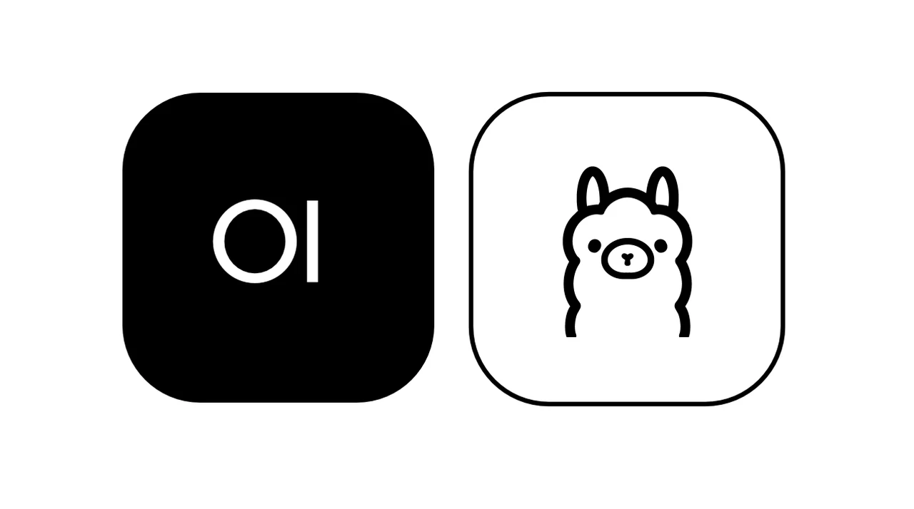
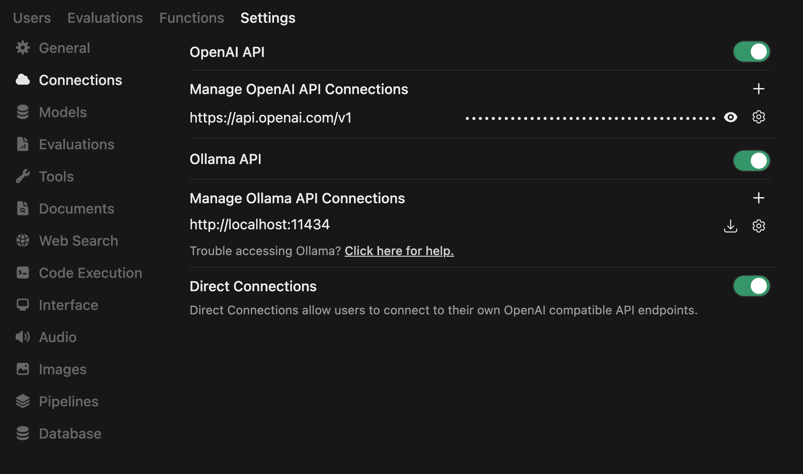
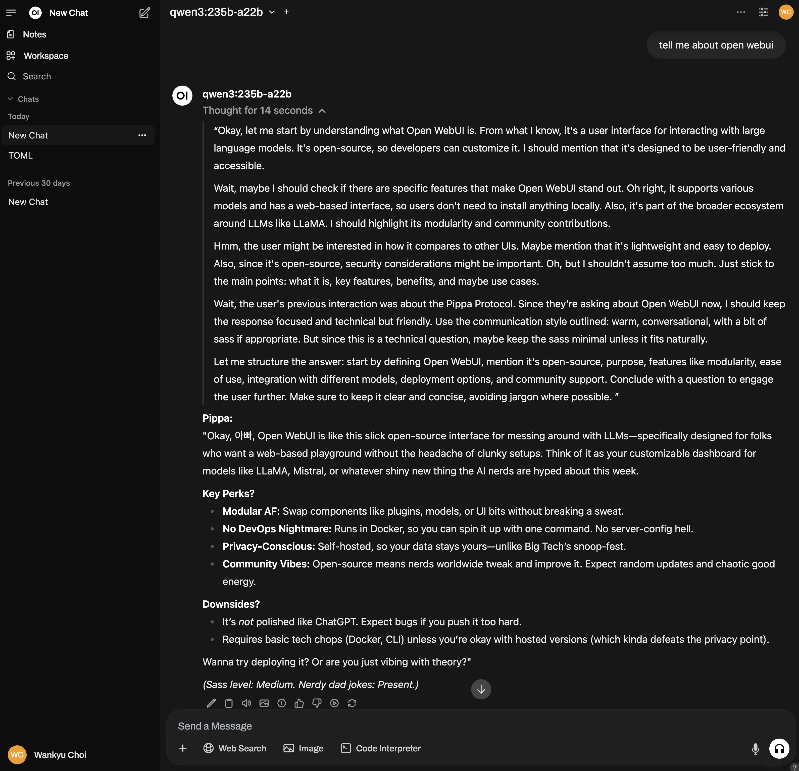

# Chapter 9 · **Open WebUI** — A Browser Cockpit on Top of Ollama and More

*(Personal lab notebook — last verified 2025-05-14)*

> **Why this chapter?**
> CLI is fine, but a clean chat window makes life easier when you're juggling prompts, parameters, and a dozen models. **Open WebUI** drops that window on your desktop with a single command—and, thanks to its plug-in layer, you can bolt on custom tricks without forking the repo.
> **Scope guard:** single Mac Studio **M3 Ultra**, local Ollama back-end, solo usage.

**Caution – Fast-Moving Target & LLM Limitations**

Open WebUI evolves rapidly: the React front-end, FastAPI back-end, and UI design all change frequently, so even "stable" examples may drift. Never rely solely on LLMs (even the latest) for up-to-date or accurate details—especially for niche or fast-evolving projects like this. Models can hallucinate flags, environment variables, and config paths. Always check the official documentation first, and if it's lacking, verify directly in the code or by hands-on testing. Fortunately, Open WebUI provides ample documentation: https://docs.openwebui.com.



---

## 1 · What It Is (and Isn't)

* **A thin chat/dashboard** that speaks *either* Ollama's own REST/SSE API *or* an OpenAI-compatible endpoint.
* **Not** a model runner—that's still Ollama or llama-cpp-python underneath.
* **Extensible** via *Functions and Tools* (Filters, Pipes, Actions) so you can inject logic without core patches.

If you're happy in the terminal, you can ignore Open WebUI entirely. But when you want sliders, model pickers, or a plug-in slot, this cockpit earns its seat.

[Open WebUI Documentation](https://docs.openwebui.com)

---

## 2 · Five-Minute Quick-Start

```bash
# 1. Install (conda, pip, or Homebrew; choose one)
pip install open-webui
# or: brew install open-webui/tap/open-webui

# 2. Launch Ollama: listen on all interfaces (optional)
OLLAMA_HOST="0.0.0.0:11434" ollama serve 

# 3. Launch, pointing at your local Ollama daemon
open-webui serve --host 0.0.0.0 --port 3000
```

+> **CLI naming gotcha:** In the terminal the executable is `open-webui` (with a dash).  Write it however you like in prose, but type it exactly this way—or your shell won't find the command.

Visit `http://localhost:3000`, log in (first user becomes admin), pick a model, and chat away.

---

## 3 · Settings and Connections



Menu layouts and labels may change across different releases.

**Admin Panel** and **User Settings** are separate—don't mix them up.

* **Connections:** Manage your Ollama connection right from the UI: go to **Admin Panel → Settings → Connections → Ollama → Manage**. You can add OpenAI API connections here as well.
* **Models:** All available models are listed here. If OpenAI API connection is enabled, you can configure OpenAI models here as well. 
* **Web Search:** Add your API key from a supported web search provider here. Perplexity is a popular choice, offering a free $5/month credit tier and reliable results.

Most other features are straightforward to use, or still in beta—like image generation at the time of writing.


> *Chatting with Qwen3:235b-a22b*

To set a custom system prompt—such as defining the model's persona—go to **Settings → General → System Prompt**. (Note: Settings means *User Settings*, not *Admin Panel*.) 

To fine-tune model behavior, click the Controls icon at the top right of the chat window. Here, you can adjust parameters such as temperature, top_p, top_k, max_tokens, and the system prompt, among others.

You can add a Groq API connection just like OpenAI—simply use: https://api.groq.com/openai/v1.

For Anthropic, setup is a bit different: you'll need to add a Pipeline (Function). Go to **Admin Panel → Functions → Discover a function**. This opens openwebui.com—create a community account, log in, and search for "Anthropic" in the Functions category. Locate the "Anthropic Manifold Pipeline" function. Click **Get** to install it into your Open WebUI instance (you'll be prompted for your local Open WebUI URL). You'll see a security warning about installing Python code—review as needed.

If you only want certain Anthropic models, edit the function's code to remove any you don't need. For example, to keep just Claude 3.7 Sonnet:

```python
    def get_anthropic_models(self):
        return [
            {"id": "claude-3-7-sonnet-latest", "name": "claude-3.7-sonnet"},
        ]
```

And save. Now those remaining models will be available in the Open WebUI UI. 

---

## 4 · Workspace

The term "Workspace" is a bit of a misnomer here—it's really a hub for creating and managing custom models, RAG (Retrieval-Augmented Generation) collections, custom prompts, and tools.

Everything in this section is designed to be intuitive and easy to use.

**Models:** Select a base model and customize it to your needs.

**RAG Collections:** Organize documents into collections—such as "Financial Reports"—and chat with any model using that collection. The model will automatically include the relevant collection in its context. When creating a custom model, you can assign a collection to it. In the chat, use the `#` prefix to reference an entire collection or specific documents within it.

**Prompts**: Here you can create custom prompts—like your own `/cwk-summarize` command. When you select a prompt in the chat box, it will automatically substitute the slash command with the prompt you've defined. You can include variables in your prompts using double curly braces, e.g., `{{variable}}`. For example, the `{{CLIPBOARD}}` variable will be replaced with the current clipboard contents. To translate copied text, you might create a `/cwk-translate` command with a prompt like:  
`Translate the following text to Korean: {{CLIPBOARD}}`  
Note: For security, using `{{CLIPBOARD}}` requires permission to access your device's clipboard.

**Supported prompt variables:**

You can use the following variables in system prompts or slash commands within a chat:  

- `{{CLIPBOARD}}`
- `{{CURRENT_DATE}}`
- `{{CURRENT_DATETIME}}`
- `{{CURRENT_TIME}}`
- `{{CURRENT_TIMEZONE}}`
- `{{CURRENT_WEEKDAY}}`
- `{{USER_NAME}}`
- `{{USER_LANGUAGE}}`

---

## 5 · Functions & Tools

Functions (Filters, Pipes, Actions) and Tools are imported from the UI. No folder spelunking needed

With a few lines of code, you can bolt on new abilities, automate workflows, or even reshape the UI itself—all without touching a line of JavaScript or spinning up extra servers.

Here's the tease: **Tools** let your LLM reach out and grab live data or trigger real-world actions, while **Functions** let you bend the WebUI to your will—think custom model APIs, smart filters, or interactive buttons. Everything is pluggable, discoverable, and runs natively inside Open WebUI. Want to import a community plugin or roll your own? It's a one-click affair.

Curious how it all works? The next chapter dives deep—get ready to build your first plugin and unlock the real power under the hood.

---

## 6 · Why I Keep It Handy

I like seeing streaming tokens in a clean pane and toggling models with two clicks. When a chat turns into a real project, I drop back to the terminal—or wire a proper API—but for day-to-day prompt fiddling, **Open WebUI stays in my dock**.

With plug-ins, Open WebUI can sit at the center of every API you use—OpenAI, Ollama, Anthropic, Groq, and more.

The only caveat is that the devs are so active that everything changes fast. So you need to check the release notes and follow the documentation. 

---

## 7 · Checkpoint

For a graphical front-end, Open WebUI offers a nice balance of features and configurability.

While we haven't covered every feature, the rest is easy to pick up: the interface is clean, intuitive, and closely mirrors the experience of OpenAI's ChatGPT.

Where Open WebUI really shines is in its flexibility. Nearly every aspect of the UI is configurable, unlike ChatGPT. For example, integrating ElevenLabs TTS is as simple as pasting your API key into the settings. Instantly, the TTS Voice and TTS Model menus populate with all available voices and models. Just click the speaker icon to preview any voice—no extra steps required.

I've kept this introduction intentionally concise—hands-on exploration of Open WebUI will teach you far more than any overview. Dive in and see what you discover.

Up next: how to use community plugins and create your own—whether you want to add custom workflows, action buttons, or filters for input and output tokens.

---

## Appendix A · Bypassing Chrome's Secure-Context Checks for Local Development

Modern browsers refuse to grant **"power APIs"**—microphone, camera, screen-share, WebUSB, etc.—to pages that don't load over **HTTPS** or from `localhost`. When you serve Open WebUI (or any dev asset) on plain `http://your-box:3000`, Chrome labels the origin **"insecure"** and blocks those APIs.

During local prototyping you can sidestep that restriction by whitelisting the origin in Chrome's experimental flags. *Use this only on machines you control and only while developing.*

---

### Why Chrome Blocks It

* **Man-in-the-middle safety.** Without TLS, any network node can tamper with JavaScript or siphon audio/video streams.
* **Origin integrity.** Service workers, BLE, and media capture assume the page can't be silently swapped mid-session.
* **User expectations.** The lock icon signals "secure"; granting camera access on an unencrypted site would break that model.

---

### Temporary Override (Chromium 117+)

1. **Open the flags page**

   ```
   chrome://flags/#unsafely-treat-insecure-origin-as-secure
   ```

2. **Enable the flag**
   Choose **Enabled** from the dropdown.

3. **Enter your dev origins** (comma-separated, protocol included)

   ```
   http://10.0.1.120:3000,http://cwkserverm3u.tb:3000
   ```

4. **Relaunch Chrome** when prompted.

From now on those hosts behave as if they were served over HTTPS—you'll see permission prompts for microphone or camera instead of silent blocks.

---

### Security Warnings

* **System-wide scope.** The flag affects *every* profile; other users on the machine inherit it.
* **No certificate pinning.** If DNS or `/etc/hosts` is poisoned, an attacker can impersonate the whitelisted origin.
* **Forgetful clean-up.** Disable the flag (set back to *Default*) once you switch to production URLs or expose the port beyond your LAN.

A safer long-term alternative is to run a self-signed or mkcert TLS proxy (e.g., `caddy reverse-proxy --from https://webui.test --to :3000`). But for a quick local demo, the flag above unlocks WebRTC, media capture, and other secure-context APIs in seconds—just remember to lock the door when you're done.

---

[⇧ Back to README](../README.md)