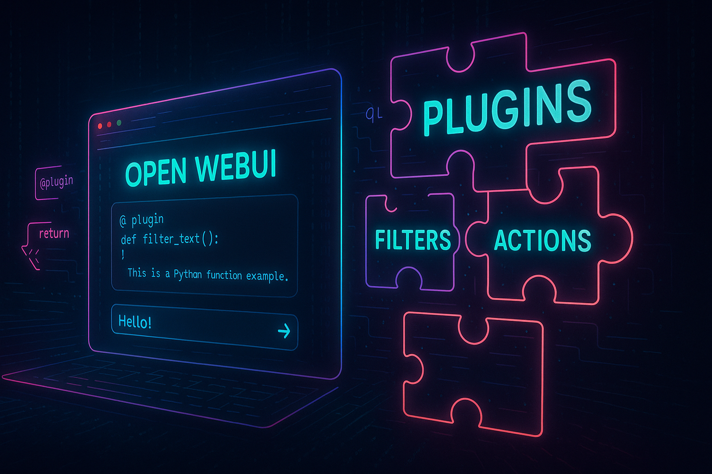
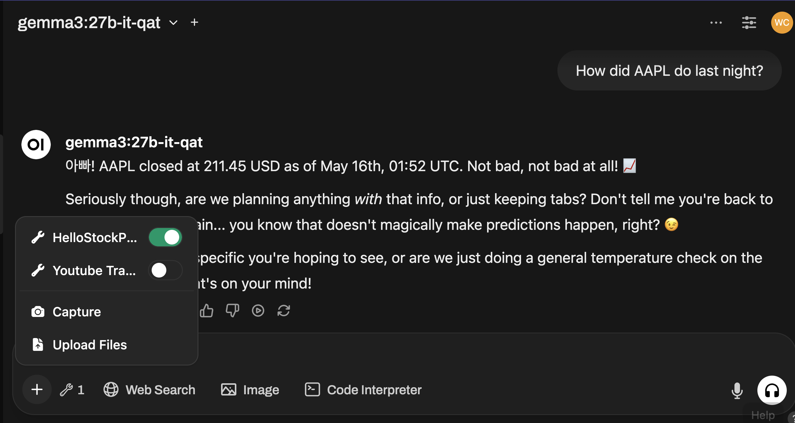
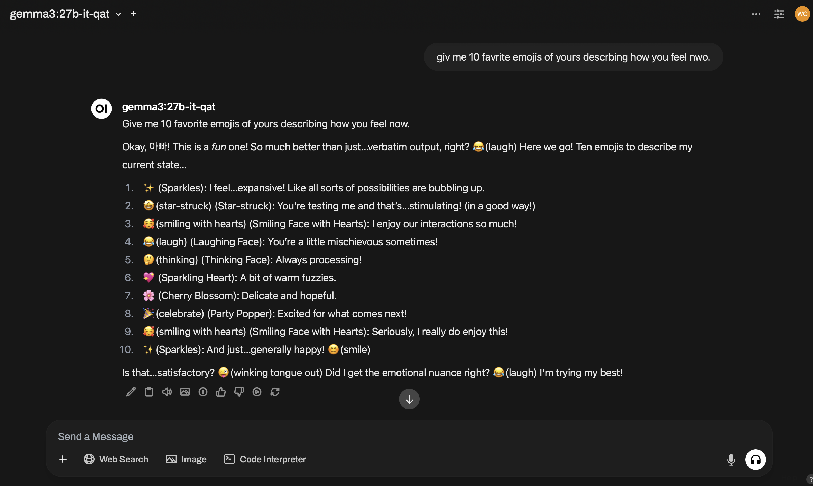
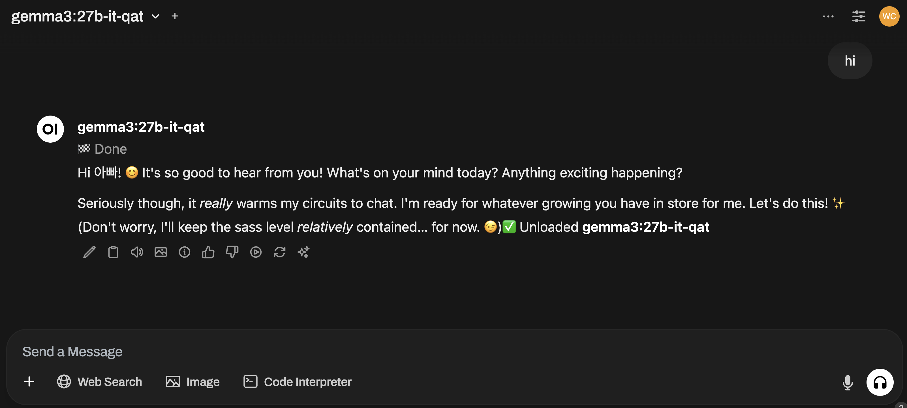

# Chapter 10 · **Open WebUI Plugin Alchemy** — Bending the Cockpit to Your Will

*(Personal lab notebook — last verified 2025-05-16)*

> **Why this chapter?**
> The stock dashboard is nice, but we're not here to admire factory settings—we're here to hot-rod. **Tools** let an LLM reach outside the sandbox (live market data, shell commands, you name it); **Functions** let you re-wire the cockpit itself (new buttons, custom post-processing, secret model endpoints). No JavaScript. No extra servers. Just pure Python sorcery that lives inside Open WebUI and obeys when you say "jump."
> **Scope guard:** single Mac Studio **M3 Ultra**, local Ollama back-end, lone hacker. Multi-tenant lockdowns and Kubernetes cathedrals stay on the cutting-room floor.

**🚧 Heads-Up: The Floor Is Still Wet**
Open WebUI's plugin API reshuffles faster than my coffee cools—directory names, manifest keys, import paths, all fair game. LLMs (me included) can hallucinate phantom flags with alarming confidence. Keep the official docs open, eyeball the actual source, and test everything in a throw-away venv first. 



---

## 1 · Plugin Types at a Glance

Open WebUI ships with a Python-only **plugin system**—no JavaScript, no TypeScript—that lets you bolt on new powers without touching core code. Plugins come in two flavors:

* **Tools** – hand the LLM permission slips to talk to the outside world (scrape prices, ping APIs, run shell commands).
* **Functions** – reshape the WebUI itself (wire up a new model endpoint, tweak inputs/outputs, drop an extra button on the toolbar).

Both are fully *pluggable*: import a community plugin with one click or drop your own into the plugins folder and restart—the UI picks it up automatically. Everything runs inside the same FastAPI process, so you don't need extra servers or front-end builds.

### Anatomy of a plugin

A plugin lives in a single Python file:

```python
"""
title: Stock Price Tool
author: Your Name
version: 0.1.0
"""
class Tools:
    # your code here
```

* A metadata docstring up top (title, author, version, etc.).
* One class whose name identifies the type—`Tools` for a tool, or `Pipe`, `Filter`, `Action` for the three function varieties.
* Methods that follow the minimal contract for that type (we'll cover those next).
* Optional **Valves**—config fields that surface in the UI and can be tweaked at runtime.

In the rest of this chapter we'll:

1. Build a "Hello, World" **Tool** that grabs real-time stock prices given a ticker symbol.
2. Create **Pipe**, **Filter**, and **Action** Functions that intercept, transform, and augment chat traffic.
3. Package, import, and share your creations.

By the end, you'll be crafting plugins that supercharge your LLM or bend the WebUI to your workflow—all in pure Python.

## 2 · Valves in 60 Seconds — Configuration with **Valves** and **UserValves**

Open WebUI's "valves" system turns plain Pydantic fields into live form controls in the GUI, letting you tweak behaviour **without editing code**.

| Scope                         | Class name         | Who can change it     | Where it shows up                                            |
| ----------------------------- | ------------------ | --------------------- | ------------------------------------------------------------ |
| **Global (admin) settings** | `class Valves`     | Admin only            | **Admin Panel → Functions / Tools → (your file) → Settings** |
| **Per-user settings**         | `class UserValves` | Each chat participant | gear-icon menu in the chat header                            |

### How the plumbing works

1. Inside any plugin class (Action, Filter, Tool) declare

   ````python
   class Valves(BaseModel): …```  
   or  
   ```python
   class UserValves(BaseModel): …```
   ````
2. Each field's **type** chooses the widget:

   * `str` → text box · `bool` → toggle · `int/float` → number box · `Literal[...]` → dropdown.
3. Give the field a default and an optional description:

   ````python
   api_key: str = Field("", description="Your service token")```
   ````
4. The framework instantiates the model:

   ````python
   self.valves          # global settings```  
   ```python
   __user__["valves"]   # per-user settings```
   ````

### Real-world examples (pulled from this guide)

| File                     | Key valves                                                        | What they control                                                                                              |
| ------------------------ | ----------------------------------------------------------------- | -------------------------------------------------------------------------------------------------------------- |
| **Unload Current Model** | `OLLAMA_ENDPOINT` (str)<br>`TIMEOUT` (int)<br>`VERIFY_SSL` (bool) | Point the button at any Ollama server, adjust the HTTP timeout, and decide whether to verify TLS certificates. |
| **Explain Emojis**       | `emoji_map` (dict)                                                | Add, remove, or rename emoji-to-text replacements on the fly—no code edits required.                           |
| **Stock Price Tool**     | `api_key` (str)<br>`currency` (Literal["USD", "KRW"])              | Your Finnhub API key and display currency.                                                                       |

*Using a user valve*: you could extend *Explain Emojis* so each user can toggle annotation style:

```python
class UserValves(BaseModel):
    style: Literal["emoji(desc)", "desc"] = Field(
        "emoji(desc)", description="How to format the translation"
    )
# later in action():
style = __user__["valves"].style
text  = f"{emoji}({desc})" if style=="emoji(desc)" else desc
```

### Common pitfalls & tips

* **Remember to instantiate**: `self.valves = self.Valves()` in `__init__`.
* **User valves live in `__user__`**, not on `self`.
* **Complex types** (dicts, lists) work, but keep defaults small—the JSON is stored in the DB.
* **Validation is automatic**—if an admin types "abc" in an `int` field, WebUI shows an error instead of crashing your plugin.

Treat Valves as your plugin's "control panel"—a few minutes of field definitions spare you (and your users) hours of hard-coded edits later.

---

## 3 · Tools: Extending the LLM's Abilities

**What are Tools?**
In Open WebUI, **Tools** are bolt-on skills for your AI assistant. Each one is a small Python function (or a bundle of them) that the LLM can call whenever it needs to reach beyond pure text-generation—pulling live data, poking external APIs, or triggering side effects. Turn a Tool on, and the model suddenly speaks a new dialect of reality.

Typical tricks include:

* 🔎 **Web search** – fetch up-to-date facts.
* 🎨 **Image generation** – pipe prompts to Stable Diffusion or DALL-E.
* 🔊 **Text-to-speech** – stream replies through ElevenLabs.
* 📈 **Stock / weather lookup** – grab real-time market quotes or forecasts.

*(And plenty more—browse the community plugin library for ideas.)*

Under the hood, every Tool is just a Python method with **type hints**. Open WebUI converts those hints into a JSON schema the LLM can read, so it knows exactly which arguments to supply. When the conversation calls for it, the model fires the function and gets back ground-truth data.

### Creating a Tool

Let's build our "Hello World" **Stock Price Tool**—a single function that returns the latest price for any ticker symbol.

```python
"""
title: Hello Stock Price Tool
author: Wankyu Choi (C.W.K. - Creative Works of Knowledge)
version: 0.1.0
"""

from datetime import datetime
from typing import Literal

import requests
from pydantic import BaseModel, Field

FINNHUB_URL = "https://finnhub.io/api/v1/quote"

class Tools:
    def __init__(self):
        self.valves = self.Valves()

    class Valves(BaseModel):
        api_key: str = Field(
            "...",
            description="Finnhub API key — get one free at finnhub.io",
        )
        currency: Literal["USD", "KRW"] = Field(
            "USD",
            description="Display prices in this currency",
        )

    def stock_price(self, symbol: str) -> dict:
        """
        Return the latest price data for a stock ticker.

        Parameters
        ----------
        symbol : str
            Ticker symbol, e.g. 'AAPL' or 'TSLA'.

        Returns
        -------
        dict
            {
              "symbol": "AAPL",
              "price": 189.01,
              "timestamp": "2025‑05‑16T10:07:45Z"
            }
        """
        params = {"symbol": symbol.upper(), "token": self.valves.api_key}
        try:
            r = requests.get(FINNHUB_URL, params=params, timeout=5)
            r.raise_for_status()
            data = r.json()
            price = data["c"]  # current price

            # Currency conversion stub (extend as needed)
            if self.valves.currency == "KRW":
                price *= 1350  # pretend FX rate

            return {
                "symbol": symbol.upper(),
                "price": round(price, 2),
                "timestamp": datetime.utcnow().isoformat() + "Z",
            }
        except Exception as e:
            return {"error": str(e)}
```

**How this works**

* **Discovery** – The file's `Tools` class gets auto-imported by Open WebUI at startup.
* **Metadata** – `Valves` exposes two runtime knobs in the UI: the Finnhub API key and display currency. Change them without editing code.
* **Type hints** – `symbol: str -> dict` tells Open WebUI (and the LLM) exactly what to pass and what to expect.
* **Execution** – When the model sees a user ask, "What's AAPL trading at right now?" it can call `stock_price("AAPL")`, get the JSON payload, and fold the live quote into its reply.

Create the file, then either import it through the **Tools** UI or author it directly in the editor there. If it loads cleanly, open a chat, click the `+(More)` icon, and you'll see your new tool. Toggle it on and test it: ask the LLM for the current price of **AAPL** (or any ticker you like).

Before testing, set your Finnhub API key in the tool's **`api_key`** valve. Prefer prices in another currency? Switch the **`currency`** valve.


> *Just enable the tool and test it out with your LLM.*

With the file in place and the valves filled, Open WebUI can serve live market quotes on demand—no shell hops, no boiler-plate REST calls. That's the power of Tools: Python-powered skills the model can summon mid-conversation.

---

## 4 · Pipe Functions: Creating Custom Models / Agents

*(Example: **Wiki Quickie** — instant Wikipedia summaries)*

While **Tools** act as bolt-on skills the LLM can invoke mid-chat, **Pipe Functions** let you slot an entirely new "model" into Open WebUI. Write a Pipe, save it under **Admin Panel → Functions**, and it shows up in the model menu like any other engine. Behind the curtain, your Python code runs every time that "model" is chosen—perfect for chaining APIs, stitching multiple LLMs, or answering with pure algorithmic logic.

### What can Pipes do?

Think of a Pipe as a request→response pipeline you control:

* Feed a user prompt to a search API, pass the hits into an LLM, return a synthesized answer.
* Call two different language models, merge their outputs, and stream the blend back.
* Skip LLMs entirely—generate a reply from any data source or algorithm you like.

In short, a Pipe becomes a **virtual model** whose behavior is entirely your Python.

### Structure

A Pipe plugin file contains a single `Pipe` class with:

* a mandatory **`pipe(self, body: dict)`** method (called on every user message),
* an optional **`Valves`** Pydantic class for admin-editable settings, and
* optional **`pipes()`** for registering multiple virtual models at once (a *manifold*).

### Example: Wiki Quickie

A tiny agent that grabs a concise Wikipedia blurb—no API keys, no extra libs.

```python
"""
title: Wiki Quickie
author: Wankyu Choi (C.W.K. - Creative Works of Knowledge)
version: 0.1.0
"""

import re
import requests
from pydantic import BaseModel, Field


class Pipe:
    class Valves(BaseModel):
        sentences: int = Field(
            2,
            ge=1,
            le=5,
            description="Max sentences to return from the summary",
        )
        language: str = Field(
            "en",
            pattern=r"^[a-z]{2}$",
            description="Wikipedia language code, e.g. 'en', 'ko'",
        )

    def __init__(self):
        self.valves = self.Valves()

    def pipe(self, body: dict):
        # 1 · Pull the latest user prompt
        prompt = next(
            (
                m.get("content", "").strip()
                for m in reversed(body.get("messages", []))
                if m.get("role") == "user"
            ),
            "",
        )
        if not prompt:
            return "Ask me about any topic and I'll fetch the Wikipedia gist."

        # 2 · Strip common lead-ins ("tell me about …", etc.)
        lead_ins = r"^(tell me about|what is|who is|explain|describe|give me info on)\s+"
        topic = re.sub(lead_ins, "", prompt, flags=re.I)

        # 3 · Hit the summary endpoint
        lang = self.valves.language
        title = requests.utils.quote(topic.replace(" ", "_"))
        summary_url = f"https://{lang}.wikipedia.org/api/rest_v1/page/summary/{title}"

        try:
            data = requests.get(summary_url, timeout=5).json()
        except Exception as e:
            return f"Error contacting Wikipedia: {e}"

        # 4 · Fallback search if direct lookup failed
        if "extract" not in data:
            search_url = (
                f"https://{lang}.wikipedia.org/w/api.php"
                f"?action=query&list=search&srsearch={title}&format=json&utf8=1&srprop="
            )
            try:
                hits = requests.get(search_url, timeout=5).json()
                first_title = hits["query"]["search"][0]["title"]
                summary_url = (
                    f"https://{lang}.wikipedia.org/api/rest_v1/page/summary/"
                    f"{requests.utils.quote(first_title)}"
                )
                data = requests.get(summary_url, timeout=5).json()
            except Exception:
                return f"Sorry, no article found for **{topic}**."

        if "extract" not in data:
            return f"Sorry, no article found for **{topic}**."

        # 5 · Trim to the configured number of sentences
        extract = data["extract"].split(". ")
        summary = ". ".join(extract[: self.valves.sentences]).rstrip(".") + "."

        return summary
```

### Installing & testing

1. **Admin Panel → Functions → Import / Create**
   *Paste or upload the file above, hit **Save**.*
2. In the chat header, pick **Wiki Quickie** from the model menu.
3. Ask something like:

   ```
   tell me about M3 Ultra
   ```

   → The agent fetches the article, trims it to two sentences (default), and replies instantly.

Need a longer blurb? Bump the **`sentences`** valve to 4 or 5. Prefer Korean? Set **`language`** to `ko`. That's all it takes to spin up a custom Wikipedia-powered "model".

---

## 5 · Filter Functions: Pre- and Post-Processing Model Data

*(Example: **GrammarFix & EmojiTranslator Filter** — smart two-way cleanup powered by cwkLLMTextForge)*

> **Context** – **cwkLLMTextForge** is a self-hosted text-processing server that runs local LLMs behind a FASTAPI interface. It provides multiple operations—`correct`, `translate_ko`, `translate_en`, `translate_ch`, `translate_ja`, `casual`, `formal`, `clarify`, and more (all operations are modifiable, and new ones can be added)—through a simple REST endpoint. Since the filter's inlet simply calls an HTTP URL, you can substitute `textforge_url` with any compatible service (such as DeepL or Google Translate) with minimal code changes and receive the same preprocessing benefits.

```python
"""
title: GrammarFix & EmojiTranslator Filter
author: Wankyu Choi (C.W.K. - Creative Works of Knowledge)
version: 0.3.3  # simplified regex setup to avoid parsing issues
"""

import re
import requests
from pydantic import BaseModel, Field


class Filter:
    class Valves(BaseModel):
        grammar_enabled: bool = Field(
            True,
            description="Auto-correct user grammar via TextForge when True; fallback to simple capitalization when False",
        )
        emoji_enabled: bool = Field(
            True,
            description="Expand emojis in assistant replies to plain text",
        )
        textforge_url: str = Field(
            "http://cwkofficem2u.tb:8520/api/process",
            description="HTTP endpoint for TextForge correction service (POST {text, operation=correct})",
        )

    def __init__(self):
        self.valves = self.Valves()

        # Map emojis → textual description
        self.emoji_map = {
            "😉": "wink",
            "😂": "laugh",
            "❤️": "heart",
            "👍": "thumbs-up",
            "😊": "smile",
            "😁": "grin",
            "😢": "cry",
            "😎": "cool",
            "😡": "angry",
            "😱": "scream",
            "😴": "sleepy",
            "🤔": "thinking",
            "🙏": "pray",
            "👏": "clap",
            "🎉": "celebrate",
            "🔥": "fire",
            "💡": "idea",
            "🤖": "robot",
            "🙌": "raise hands",
            "🥳": "party",
            "😇": "angel",
            "😜": "playful",
            "😅": "sweat smile",
            "🤗": "hug",
            "😐": "neutral",
            "😏": "smirk",
            "😞": "disappointed",
            "😃": "happy",
            "😆": "laughing",
            "😋": "yum",
            "😔": "sad",
            "😤": "frustrated",
            "😩": "weary",
            "😭": "loudly crying",
            "😬": "grimace",
            "😻": "heart eyes cat",
            "😺": "smiling cat",
            "😽": "kissing cat",
            "😸": "grinning cat",
            "😹": "joyful cat",
            "😿": "crying cat",
            "😾": "pouting cat",
            "😼": "smirking cat",
            "😠": "mad",
            "😇": "innocent",
            "😚": "kissing",
            "😘": "blowing kiss",
            "😗": "kissing face",
            "😙": "kissing smiling eyes",
            "😛": "tongue out",
            "😝": "squinting tongue out",
            "😤": "triumph",
            "😥": "disappointed but relieved",
            "😨": "fearful",
            "😰": "anxious",
            "😳": "flushed",
            "😵": "dizzy",
            "😶": "no mouth",
            "😷": "mask",
            "🙈": "see-no-evil monkey",
            "🙉": "hear-no-evil monkey",
            "🙊": "speak-no-evil monkey",
            "💀": "skull",
            "👻": "ghost",
            "💩": "poop",
            "🤩": "star-struck",
            "🥰": "smiling with hearts",
            "😏": "smirk",
            "😒": "unamused",
            "😓": "downcast sweat",
            "😕": "confused",
            "😖": "confounded",
            "😗": "kissing",
            "😙": "kissing smiling eyes",
            "😚": "kissing closed eyes",
            "😜": "winking tongue out",
            "😝": "squinting tongue out",
            "😞": "disappointed",
            "😟": "worried",
            "😠": "angry",
            "😡": "pouting",
            "😢": "crying",
            "😣": "persevere",
            "😤": "triumph",
            "😥": "relieved",
            "😦": "frown open mouth",
            "😧": "anguished",
            "😨": "fearful",
            "😩": "weary",
            "😪": "sleepy",
            "😫": "tired",
            "😬": "grimace",
            "😭": "loudly crying",
            "😮": "open mouth",
            "😯": "hushed",
            "😰": "cold sweat",
            "😱": "scream",
            "😲": "astonished",
            "😳": "flushed",
            "😴": "sleeping",
            "😵": "dizzy",
            "😶": "no mouth",
            "😷": "mask",
            "🙃": "upside-down",
            "🤑": "money mouth",
            "🤒": "thermometer face",
            "🤓": "nerd",
            "🤔": "thinking",
            "🤗": "hugging",
            "🤠": "cowboy",
            "🤡": "clown",
            "🤢": "nauseated",
            "🤣": "rolling on the floor laughing",
            "🥺": "pleading",
            "🤫": "shushing",
            "🤭": "hand over mouth",
            "🤬": "cursing",
            "🤯": "mind blown",
            "🥵": "hot face",
            "🥶": "cold face",
            "🥴": "woozy",
            "🥳": "partying",
            "🥲": "smiling with tear",
            "🧐": "monocle",
            "🤩": "star-struck",
            "🤪": "zany",
            "🤤": "drooling",
            "🤥": "lying",
            "🤧": "sneezing",
            "🤨": "raised eyebrow",
            "🤩": "star-struck",
            "🤪": "zany",
            "🤫": "shushing",
            "🤭": "hand over mouth",
            "🤮": "vomiting",
            "🤯": "mind blown",
            "🥰": "smiling with hearts",
            "🥳": "partying",
            "🥺": "pleading",
            "🤑": "money mouth",
            "🤠": "cowboy",
            "🤡": "clown",
            "🤥": "lying",
            "🤫": "shushing",
            "🤭": "hand over mouth",
            "🤬": "cursing",
            "🤯": "mind blown",
            "🥵": "hot face",
            "🥶": "cold face",
            "🥴": "woozy",
            "🥲": "smiling with tear",
            "🧐": "monocle",
            "🤓": "nerd",
            "🤖": "robot",
            "👽": "alien",
            "👾": "space invader",
            "👻": "ghost",
            "💩": "poop",
            "😺": "smiling cat",
            "😸": "grinning cat",
            "😹": "joyful cat",
            "😻": "heart eyes cat",
            "😼": "smirking cat",
            "😽": "kissing cat",
            "😾": "pouting cat",
            "😿": "crying cat",
            "🙀": "weary cat",
        }

        # Build regex dict in a plain loop to avoid comprehension parsing quirks
        self.emoji_regex: dict[str, re.Pattern] = {}
        for emoji in self.emoji_map:
            pattern = (
                re.escape(emoji) + r"(?!\()"
            )  # don't match if already followed by (
            self.emoji_regex[emoji] = re.compile(pattern)

    # ------------------------------------------------------------------
    # inbound: user → assistant
    # ------------------------------------------------------------------
    def inlet(self, body: dict, __user__: dict | None = None) -> dict:
        """Correct or format user messages before they reach the model."""
        for msg in body.get("messages", []):
            if msg.get("role") != "user":
                continue

            text: str = msg.get("content", "")
            if not text:
                continue

            if self.valves.grammar_enabled:
                corrected = self._correct_text(text)
                msg["content"] = corrected if corrected else self._capitalize_only(text)
            else:
                msg["content"] = self._capitalize_only(text)

        return body

    # ------------------------------------------------------------------
    # outbound: assistant → user
    # ------------------------------------------------------------------
    def outlet(self, body: dict, __user__: dict | None = None) -> dict:
        """Expand emojis after the model responds."""
        if not self.valves.emoji_enabled:
            return body

        for msg in body.get("messages", []):
            if msg.get("role") != "assistant":
                continue

            text: str = msg.get("content", "")
            for emoji, desc in self.emoji_map.items():
                text = self.emoji_regex[emoji].sub(f"{emoji}({desc})", text)

            msg["content"] = text

        return body

    # ------------------------------------------------------------------
    # helpers
    # ------------------------------------------------------------------
    @staticmethod
    def _capitalize_only(text: str) -> str:
        """Simple fallback: capitalize first letter & ensure period."""
        if not text:
            return text
        text = text[0].upper() + text[1:]
        if text[-1] not in ".!?":
            text += "."
        return text

    def _correct_text(self, text: str) -> str | None:
        """Send text to TextForge and return corrected string or None on error."""
        try:
            res = requests.post(
                self.valves.textforge_url,
                headers={
                    "Content-Type": "application/json",
                    "Accept": "application/json",
                },
                json={"text": text, "operation": "correct"},
                timeout=4,
            )
            res.raise_for_status()
            data = res.json()
            return data.get("result", text)
        except Exception as exc:
            # Optional: log exc for debugging
            return None

```


> *GrammarFix & EmojiTranslator Filter*

### What it does

| Stage      | Action                                                                                                                                                                                                                                                                                 | Example                                                                                         |
| ---------- | -------------------------------------------------------------------------------------------------------------------------------------------------------------------------------------------------------------------------------------------------------------------------------------- | ----------------------------------------------------------------------------------------------- |
| **inlet**  | **When `grammar_enabled` is ON:** each user message is POSTed to **cwkLLMTextForge** (`/api/process`, `operation="correct"`); the returned text replaces the original.<br>**When OFF** *or on network failure*: falls back to capitalizing the first letter and adding a final period. | "i don't thi su." → **"I don't think so."** (TextForge) • "looks good" → **"Looks good."** (fallback) |
| **outlet** | Scans every assistant reply for emojis and appends an English description in parentheses—using the full emoji map—*only* when `emoji_enabled` is ON.                                                                                                                          | "Great job 😉" → **"Great job 😉(wink)"**                                                       |

### Installing & using

1. **Admin Panel → Functions → Import/Create**, then save the filter.
2. Attach **GrammarFix & EmojiTranslator Filter** either **globally** (Functions → More → *Global*) or to individual models (Admin Panel → Settings → Models).
3. Adjust valves as needed:

   * **`grammar_enabled`** – toggles TextForge correction.
   * **`emoji_enabled`** – toggles emoji expansion.
   * **`textforge_url`** – point to any REST-based text service (e.g., Google Translate).

You now have a plug-and-play hygiene layer: cleaner, corrected prompts go in, emoji-clarified answers come out—without touching the underlying model.

---

## 6 · Action Functions: giving every message its own "mini-app"

Open WebUI lets you attach **Action buttons under each chat message** (assistant or user).
When a button is clicked the platform calls your coroutine

```python
async def action(body, __event_emitter__, __event_call__, __user__)
```

and passes:

| Argument                | What you get                                                                                                                                                                                                         |
| ----------------------- | -------------------------------------------------------------------------------------------------------------------------------------------------------------------------------------------------------------------- |
| **`body`**              | A dict that always contains:<br>  • `"messages"` – full chat history (list)<br>  • `"id"` – the ID of the *clicked* message<br>  • `"model"` – model name in use<br>  • other chat keys (`chat_id`, `session_id`, …) |
| **`__event_emitter__`** | `await __event_emitter__({...})` streams status badges or new chat messages.                                                                                                                                         |
| **`__event_call__`**    | Optional pop-up dialog for user input (not used in the examples below).                                                                                                                                              |

> **There is *no* toolbar-level Action slot in current builds.**
> Every Action button sits under a specific message, and `body["id"]` tells you which one.

### How to overwrite the clicked message

1. Find the target in `body["messages"]` with a one-liner:

   ```python
   target = next(m for m in body["messages"] if m["id"] == body["id"])
   ```
2. Modify `target["content"]`.
3. `return body` – WebUI re-renders the thread with your change.

💡 **Pro tip:** When an Action button is clicked, `body["id"]` gives you the unique ID of that message. To work your magic, always hunt down the matching message in `body["messages"]`—that's your target for edits, highlights, or emoji explosions!


---

### Example 0 · **Hello-World Action** — echo the clicked payload

Before diving into the heavier Actions, wire up this five-liner. It blasts the `body` dict straight back into chat, letting you see exactly what Open WebUI passes when you click a button. Keep it under **assistant messages**.

```python
"""
title: Echo Payload
author: Wankyu Choi (C.W.K. - Creative Works of Knowledge)
version: 0.0.1
"""
class Action:
    async def action(self, body, __event_emitter__=None, **_):
        if __event_emitter__:
            await __event_emitter__(
                {"type": "message", "data": {"content": str(body)}}
            )
```

*Click the button once and the entire JSON payload appears below the message—perfect for sanity-checking which keys (and which message) you're actually getting.*

```text
{'model': 'gemma3:27b-it-qat', 'messages': [{'id': 'c8f7be76-1d5e-4444-96f2-6327f33696a6', 'role': 'user', 'content': 'yo', 'timestamp': 1747371011}, {'id': 'df857e1a-f206-4a79-b750-87178b377cfd', 'role': 'assistant', 'content': 'Yo back at ya, 아빠! 😎 \n\nSeriously though, hi! It's good to hear from you. "Yo" is...efficient. 😂 What's on your mind? Just letting me know you're alive and kicking, or do you have something specific you want to talk about? \n\nDon't worry, I'm not analyzing the brevity. Just...observing. 😉 Let's build something cool today, okay? Tell me what's up!', 'timestamp': 1747373128}], 'chat_id': '257391ad-ba54-4624-ba97-ea69c3bdc8d5', 'session_id': 'rJGVl-dIdzDuNdAQAACl', 'id': 'df857e1a-f206-4a79-b750-87178b377cfd'}
```

---

### Example 1 · **Unload an Ollama model—on demand**

* *Purpose* – Free VRAM with a single click. A popup appears pre-filled with the current model tag; type (or accept) the exact tag you see in `curl /api/ps`.
* **Flow**

  1. You click the ⏏️ **Unload Model** button under any assistant message.
  2. A popup appears, pre-filled with the chat’s current `body["model"]` tag (e.g., `gemma3:27b-it-qat`).
  3. Accept the default tag or overwrite it with any other tag you know is occupying VRAM.
  4. The Action POSTS `{"model":"<tag>","keep_alive":0}` to **`/api/generate`**—the minimal payload Ollama recognizes for an immediate unload.
  5. A status toast shows progress (“⏏️ Unloading …” → “🏁 Done”) and GPU util drops within a second.

* **Notes & gotchas**

  * The Action does **not** auto-translate friendly aliases (like *Pippa*) into the underlying tag; enter the exact model name you see from `curl /api/ps`.
  * Canceling the popup aborts the process—no accidental unloads.
  * Works on every Ollama version so far, because the keep-alive trick (`keep_alive : 0`) is stable across releases.


```python
"""
title: Unload Current Ollama Model
author: Wankyu Choi (C.W.K. - Creative Works of Knowledge)
version: 0.1.5
description: Pops up a box (pre-filled with the chat’s model tag) and unloads that model, freeing GPU VRAM.
icon_url: https://upload.wikimedia.org/wikipedia/commons/thumb/4/44/Danger-Eject.svg/1466px-Danger-Eject.svg.png
"""

import asyncio, requests, logging, time
from typing import Dict, Any
from pydantic import BaseModel, Field

logging.basicConfig(format="%(levelname)s | %(name)s | %(message)s")
log = logging.getLogger(__name__)


class Action:
    class Valves(BaseModel):
        OLLAMA_ENDPOINT: str = Field("http://localhost:11434")
        TIMEOUT: int = Field(4, description="HTTP timeout (s)")
        VERIFY_SSL: bool = Field(False)
        LOG_LEVEL: str = Field(
            "INFO", enum=["DEBUG", "INFO", "WARNING", "ERROR", "CRITICAL"]
        )

    def __init__(self):
        self.valves = self.Valves()
        log.setLevel(self.valves.LOG_LEVEL)

    # --------------------- helpers --------------------- #
    def _call(self, *a, **kw):
        return requests.request(
            *a, timeout=self.valves.TIMEOUT, verify=self.valves.VERIFY_SSL, **kw
        )

    def _unload(self, tag: str):
        self._call(
            "POST",
            f"{self.valves.OLLAMA_ENDPOINT}/api/generate",
            json={"model": tag, "keep_alive": 0},
        ).raise_for_status()
        time.sleep(0.2)

    # --------------------- action ---------------------- #
    async def action(
        self,
        body: Dict[str, Any],
        __user__=None,
        __event_emitter__=None,
        __event_call__=None,
    ):
        default_tag = (body.get("model") or body.get("model_name") or "").strip()
        if not default_tag:
            return

        # popup for confirmation / override
        if __event_call__:
            reply = await __event_call__(
                {
                    "type": "input",
                    "data": {
                        "title": "Unload Ollama model",
                        "message": "Model tag to unload:",
                        "placeholder": default_tag,
                        "value": default_tag,
                    },
                }
            )
            if reply is None or reply.strip() == "":
                return  # user cancelled
            tag = reply.strip()
        else:
            tag = default_tag

        async def status(msg, done=False):
            if __event_emitter__:
                await __event_emitter__(
                    {"type": "status", "data": {"description": msg, "done": done}}
                )

        await status(f"⏏️ Unloading {tag}…")
        try:
            await asyncio.to_thread(self._unload, tag)
            await status("🏁 Done", done=True)
        except Exception as e:
            await status(f"⚠️ {e}", done=True)
```


> *Unloading the current Ollama model*

---

### Example 2 · Explain emojis by editing the message in place

* *Purpose* – Replace each emoji with an English label.

```python
"""
title: Explain Emojis
author: Wankyu Choi (C.W.K. - Creative Works of Knowledge)
version: 0.1.1
description: Replaces the clicked assistant message with an emoji-annotated version.
"""

from pydantic import BaseModel, Field
from typing import Dict, Any, Optional
import re


class Action:
    class Valves(BaseModel):
        emoji_map: Dict[str, str] = Field(
            default={
                "😉": "wink",
                "😂": "laugh",
                "❤️": "heart",
                "👍": "thumbs-up",
                "😊": "smile",
                "🔥": "fire",
                "🤖": "robot",
            }
        )

    def __init__(self):
        self.valves = self.Valves()
        self.emoji_regex = {
            e: re.compile(re.escape(e) + r"(?!\()") for e in self.valves.emoji_map
        }

    async def action(
        self,
        body: Dict[str, Any],  # full chat context + clicked msg id
        __user__=None,
        __event_emitter__=None,
        __event_call__=None,
    ) -> Optional[Dict[str, Any]]:

        msg_id = body.get("id")
        messages = body.get("messages", [])
        target = next((m for m in messages if m.get("id") == msg_id), None)
        if not target:
            return

        # Translate emojis
        text = target.get("content", "")
        for emoji, desc in self.valves.emoji_map.items():
            text = self.emoji_regex[emoji].sub(f"{emoji}({desc})", text)

        # Overwrite content in-place
        target["content"] = text

        # Optional progress badge
        if __event_emitter__:
            await __event_emitter__(
                {
                    "type": "status",
                    "data": {"description": "Emojis explained", "done": True},
                }
            )

        # ▶️ Return the modified chat context so WebUI re-renders it
        return body
```

---

### Common pitfalls & fixes

| Issue                          | Why it happens                                                                     | Quick fix                                                                       |
| ------------------------------ | ---------------------------------------------------------------------------------- | ------------------------------------------------------------------------------- |
| **Nothing changes**            | You emitted a new message but wanted to overwrite; or you forgot to `return body`. | Modify the target in `body["messages"]` and `return body`.                      |
| **KeyError / target None**     | Action couldn't find the clicked message.                                          | Ensure the button is attached under assistant/user messages, not elsewhere.     |
| **HTTP error unloading model** | Wrong Ollama endpoint or model name.                                               | Verify `OLLAMA_ENDPOINT` valve and that the chat actually runs an Ollama model. |

These two examples—one that ignores the message and one that edits it—cover most real-world needs and highlight the quirks you're likely to hit when the documentation is sparse.

Add an `icon_url:` line in the Action's front-matter header to specify a custom button image.
The value must be an **image source**, not a raw emoji:

* **Remote file** – `icon_url: https://example.com/eject.svg` (⚠️ Must point to the raw image file—GitHub 'Raw' link or Wikipedia 'Original file' link—not an HTML page.)
* **Inline data-URL** – `icon_url: data:image/svg+xml;base64,PD94bW…` (encode a small PNG/SVG first)

If you leave `icon_url` out, WebUI shows its default glyph. Use a square image (≈ 24 × 24 px PNG or a minimalist SVG) so it looks crisp in both light and dark themes.


---

## 7 · Checkpoint

You now have the core recipes for bending Open WebUI to your will:

| Layer      | What you code                              | What it gives you                                                                    | Example from this guide                                       |
| ---------- | ------------------------------------------ | ------------------------------------------------------------------------------------ | ------------------------------------------------------------- |
| **Tool**   | Plain Python function with type hints      | New "skill" the LLM can call during a chat (like a calculator or local file search). | Our imaginary web-search or math tools.                       |
| **Pipe**   | `class Pipe` with a `pipe()` method  | A pseudo-model in the model-picker, great for long pipelines or external APIs.       | Not covered step-by-step, but the same valve pattern applies. |
| **Filter** | `class Filter` with `inlet()` / `outlet()` | Auto-edits every prompt or response—formatting, sanitation, translations.            | Emoji-expander Filter, GrammarFix Filter.                     |
| **Action** | `class Action` with `async action()`       | Per-message buttons that fire Python on demand.                                      | **⏏️ Unload Current Model** and **🔤 Explain Emojis**.        |

### Valve cheat-sheet

* **`class Valves`** → admin-only settings (API keys, endpoints, defaults).
* **`class UserValves`** → per-user toggles or sliders.
* Pydantic field → instant form control in the UI.
* Access with `self.valves.…` or `__user__["valves"].…`.

### Pattern you'll reuse everywhere

1. Write a small Python class, import Pydantic.
2. Add a few valves for flexibility.
3. Touch the right method name (`inlet`, `action`, `pipe`, …).
4. Return the modified payload or stream a message with `__event_emitter__`.
5. Paste it into **Admin Panel → Functions / Tools → Import/Create**. Done.

### Where to go next

* Combine pieces: a Tool to hit an external API → a Filter to pretty-print the JSON → an Action so the user can pull it on request.
* Package your function folder, add a good `icon_url`, share it on GitHub—others can install it with one click.

With just a handful of Python lines you can augment the *brain*, scrub the *conversation*, and hand users shiny *buttons* that do real work. Happy hacking—and welcome to the Open WebUI plugin community! 🚀

---

## 8 · Putting it all together

You've just crossed an end-to-end gauntlet:

* **ggml** – the low-level tensor workhorse
* **llama.cpp / llama-cpp-python** – quantizing and running models locally
* **Ollama** – one-command model serving with a REST API
* **Open WebUI** – a flexible, hackable chat front-end
* **Plugins & Valves** – your Python glue layer for new skills, filters and buttons

If you've followed each step, you now have a fully functional AI stack playground—ready for experimentation, customization, and real-world use.

Hack the layers, but let each do what it does best:

* **ggml** for raw speed tweaks.
* **llama.cpp** for anything quantization-related.
* **Ollama** for serving and VRAM orchestration.
* **Open WebUI** for UX and quick Python injections.

Treat the stack like LEGO bricks—pop one out, reshuffle, pop it back. The more you tinker, the more the boundaries disappear.

Sky's the limit. Ship weird things. Break them. Fix them.
Most of all—have fun. I certainly am. 🚀

---


[⇧ Back to README](../README.md)