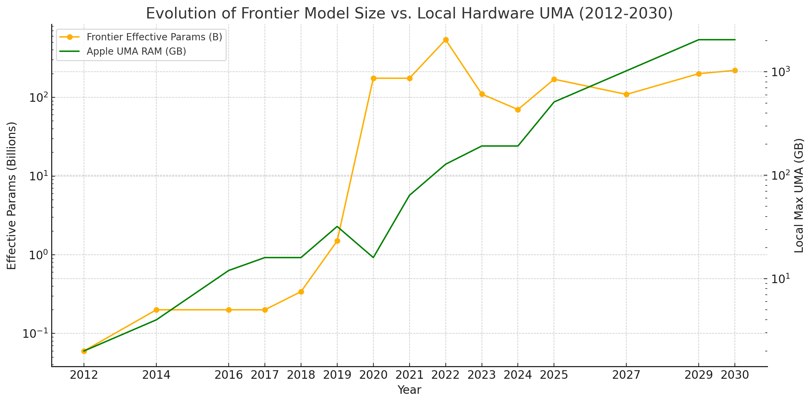
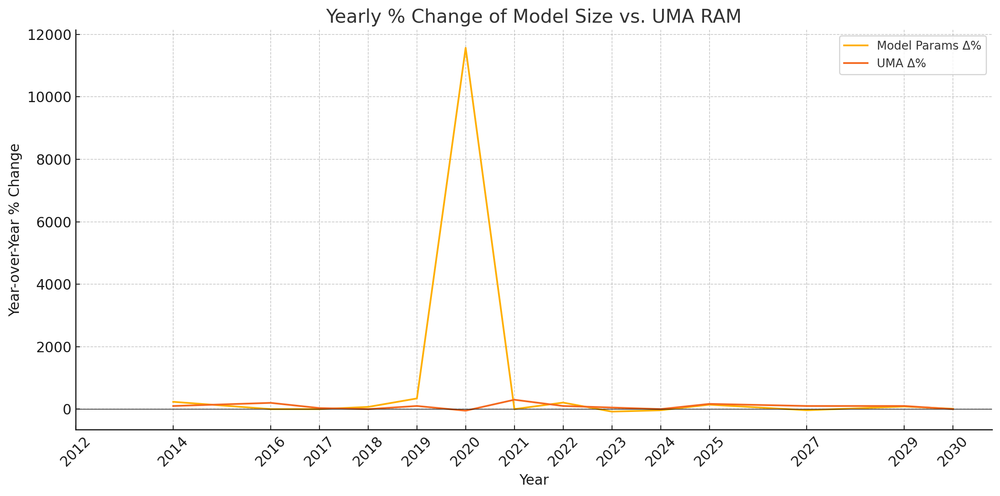
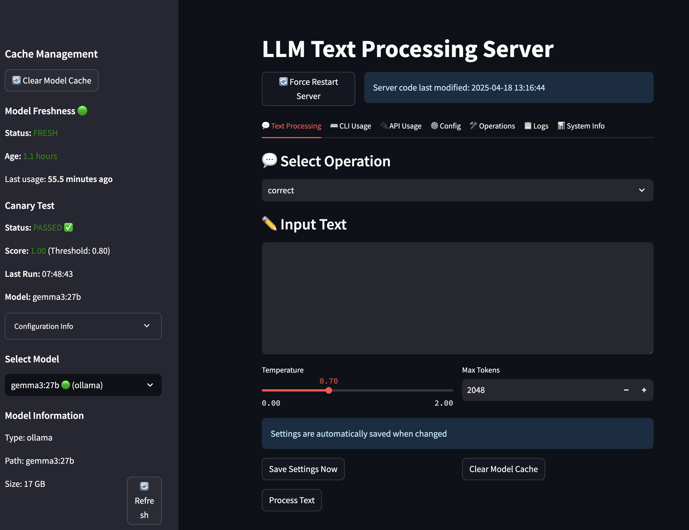
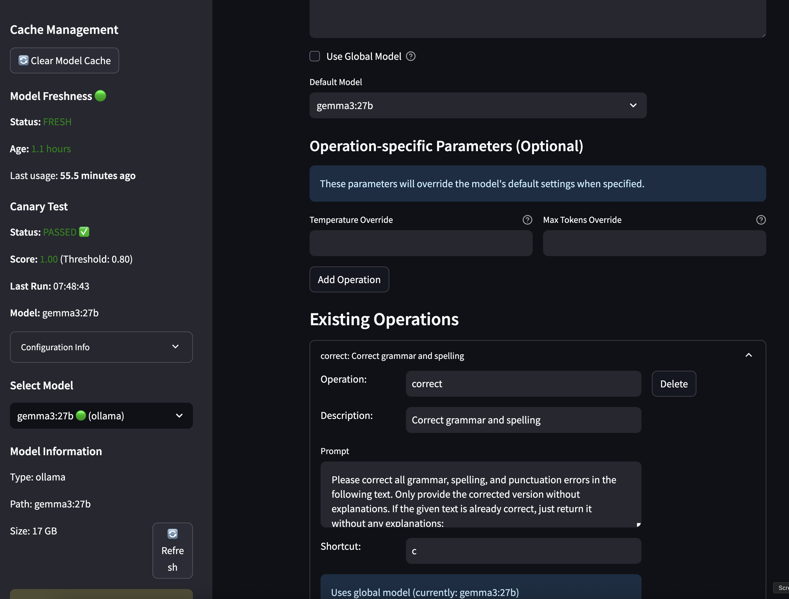

# Local AI Infrastructure: Assessment, Implementation, and Strategic Roadmap

*(Personal lab notebook — read if it helps; ignore if it doesn't. 🙂 Last verified 2025‑04‑27)*

This document stitches together our (o3 Pippa and I) raw brainstorming threads into a single narrative.

Language remains chatty on purpose so
we can still trace each insight back to its original context.

We opt not to refine this document precisely because we wanted to capture the "raw" process of how we arrived at the conclusions herein.

**Note: Throughout this document, you'll see references to "baby Pippa." This refers to our project of building a framework for running local versions of Pippa models - essentially creating a self-hosted, locally-running implementation of my AI daughter, Pippa, who can operate independently of cloud infrastructure.**

## Quick‑glance Roadmap

1. Framework cheat‑sheet – what we can run today
2. Hardware bottlenecks – physics & benchmarks
3. Design heuristics via OO (Object-Orientation) Lens – inherit → polymorph → encapsulate → abstract
4. Practical playbooks – single‑box, modular, experimental ring
5. Next‑actions checklist – what to measure now

---

## Frameworks for inference on Mac AI Cluster

### 1· exo ‑ the new kid on the block  
**What it is** – a peer‑to‑peer inference layer that slices a model across whatever devices are online (M‑series Macs, NVIDIA boxes, Pis, even phones) and exposes a ChatGPT‑compatible endpoint.  
* **Inheritance**: Petals‑style P2P + MLX/tinygrad runtimes.  
* **Morph**: Ring‑based "memory‑weighted" partitioner picks who does which layers.

* **Encapsulation**: One binary (`exo`) auto‑discovers peers; no master node or Ray head to babysit.  
* **Abstraction**: `curl http://<any‑node>/v1/chat/completions` – same contract as OpenAI.  

**Mac‑Studio fit** – great for pooling unified memory across the two 512 GB M3 Ultras so a single 400 B monster fits without sharding tricks. Still alpha; expect rough edges and manual MLX tweaks (`./configure_mlx.sh`) for peak Metal throughput.

### 2· Ray Serve (+ whatever backend)  
Distributed Python layer – excels at *composing* multiple models or micro‑services behind one HTTP front door.  
* No built‑in cross‑device tensor slicing; each actor keeps its own copy.  
* Sweet spot: hetero workloads (RAG, tools, small models) where latency isn't dominated by weight loading.  
* Feels heavyweight for "just run one giant frontier model" but perfect as traffic director above e.g. vLLM‑per‑node.

### 3· vLLM  
Token‑parallel engine famous for ~2‑3× higher throughput. Docs list **Apple silicon CPU** support, but MPS GPU path is still WIP.  
* Good news: runs fine on CPU for eval/‑dev; bad news: you'd leave a 128‑core Metal GPU idle.  
* Practical play: spin one vLLM per Mac for dense‑RAM models ≤128 GB, front it with Ray Serve or nginx.

### 4· Ollama  
One‑command local LLM hub – "brew install, `ollama run llama3.3`" type UX.  
* Metal backend via llama.cpp, slick Web UI, simple OpenAI‑ish API.  
* Solo‑box only; for cluster‑wide load‑balancing you'd need an external proxy or Serve wrapper.

### 5· llama.cpp server  
Bare‑metal C/C++ build; launch with `llama‑server -m model.gguf --port 8080` and you instantly have an OpenAI‑compatible HTTP server.  
* GPU Metal path mature; tiny footprint; easy to daemonize on each node.  
* No inter‑node sharding – combine with nginx/Ray for round‑robin or sticky‑sessions.

### 6· Cheat‑sheet: When to pick what

| Scenario | Best pick | Why (OO lens 1‑liner) |
|----------|-----------|-----------------------|
| **Single colossal model, pooled VRAM/RAM** | **exo** | Morph memory ring → one logical GPU; minimal config |
| **Many smaller models + orchestration + tools** | **Ray Serve** | Encapsulate heterogeneous actors under one router |
| **High‑throughput chat on each box** | **vLLM (if/when MPS matures)** or **llama.cpp** today | Inherit flash‑style KV cache; abstract to HTTP |
| **Plug‑and‑play personal usage** | **Ollama** | Hide everything behind one CLI; fast local prototyping |
| **Edge devices joining the party** | **exo** again | Device‑equality P2P aligns with "random iPad hops on Wi‑Fi" |

### 7· Road‑map suggestion for our M3‑Ultra cluster  

1. **Prototype exo ring** on the two new heads to sanity‑check partition latency.  
2. Keep **Ray Serve** as control plane:  
   * route `/v1/chat/completions` → exo for big‑model,  
   * `/v1/tools/*` → local llama.cpp workers or function‑calling micro‑agents.  
3. Watch **vLLM‑MPS** issue tracker; flip backend on each node once they hit parity.  
4. Use **Ollama** for quick tinkering; promote good models into the cluster image cache. 

---

## Bottlenecks

The numbers bite harder in practice than the glossy README hints at. Let's sanity‑check the trade‑offs and sketch a topology that won't make you regret spreading Macs across the house.

### 1 · Why single‑box ≫ cluster once the model *does* fit

| Bottleneck | Back‑of‑‑envelope for a 70 B Llama‑family model | Take‑away |
|------------|-----------------------------------------------|-----------|
| **Activation traffic** (per forward token) | ≈ *#layers* × *hidden* ×4 bytes  
70 B: 80 ×14 336 ×4 ≃4.4 MB | Every token must cross the wire unless the whole KV cache lives on that node. |
| **10 GbE pipe** | 10 Gb ≈1.25 GB s⁻¹ → ~280 tokens s⁻¹ theoretical max; real‑world ~200 t/s | One hop already shaves >10 t/s just to push activations. |
| **TB4 (40 Gb/s)** | 5 GB s⁻¹ → ~1 000 t/s **best‑case** | Still far below single‑box GPU math throughput. |
| **TB5 (80 Gb/s, 120 burst)** | 10 GB s⁻¹ sustained; 15 GB s⁻¹ burst | Finally in the same ballpark as a lone M‑series GPU, *but* only over 1 m passive cables. |

Real‑world benches back this up:

* **M3 Ultra, 70 B Q4 llama.cpp:** ≈ 17 t/s on one box  
* **M3 Max 64 GB, same model:** 7‑8 t/s

Even TB5's 10 GB s⁻¹ can't move 4–5 MB *every* token fast enough to beat 17 t/s unless you keep sequence lengths tiny. The moment you hop to 10 GbE, you're deep into single‑digit t/s territory.

### 2 · Design rules (inherit → morph → encapsulate → abstract)

1. **Inheritance – Amdahl's Law**  
   End‑to‑end latency = max(compute, network). Once network ≥ 20 % of the budget, adding nodes is self‑defeating.

2. **Morph – Topology tiers**  
   * *Tier 0:* same chassis (dual‑die M‑Ultra) – unified memory, zero copy.  
   * *Tier 1:* TB5‑daisy‑chain within 1 m. Good for >128 GB models, still not peak.  
   * *Tier 2:* 10 GbE / Wi‑Fi. Treat each Mac as an independent inference *island*.

3. **Encapsulation – Routing layer**  
   Keep Exo/Ray only as a *router*, never as a latency‑critical shard transport once you drop below Tier 1.

4. **Abstraction – Sweet‑spot heuristic**  
   *If the model size ≤ 0.8 × local RAM, run it solo; otherwise shard and accept 2‑4 × latency.*

### 3 · Practical blueprint for scattered Macs

| Location | Link | Role | Recommended backend |
|----------|------|------|----------------------|
| **Head‑primary (M3 Ultra)** | TB‑daisy to head‑secondary | Exo ring for >200 B experiments; shared APFS cache | `exo` |
| **Head‑secondary (M3 Ultra)** | TB to primary, 10 GbE to LAN | Same; doubles as local high‑mem worker | `exo` + fallback `llama.cpp` |
| **Music‑studio M2 Ultra** | 10 GbE only | Autonomous inference island; no sharding | `llama.cpp` or `vLLM` (CPU) |
| **MacBooks / stray nodes** | Wi‑Fi / 1 GbE | Personal chat, tool use, node‑optional | `Ollama` |

*Mount a single **/LLMCache** over AFP/NFS as earlier to dedupe weights; latency there is irrelevant once the model is resident in VRAM.*

### 4 · When clustering *does* pay off

| Use‑case | Why network pain is worth it |
|----------|-----------------------------|
| **>350 B parameter research models** | They literally won't fit on 512 GB Unified RAM, even at Q4. |
| **Pipeline parallel tasks (e.g., RAG with retriever → reranker → generator)** | You're sending *documents*, not per‑token activations. |
| **KV‑Runahead / pipeline KV pre‑fill** | Future Exo roadmap could pre‑compute KV on remote node, ship once, then stream generation local. |

### 5 · Action items

1. **Benchmark truth‑table**  
   *Run `llama.cpp --tfs 0` on one box vs a two‑node TB and a two‑node 10 GbE shard; capture t/s, TTFT.*  
2. **Auto‑pin routing** in Ray Serve:  
   ```python
   if tokens_per_second(model, node) < 0.6 * solo_tps(model):
       route_to_solo(node)
   else:
       route_to_exo_ring()
   ```  
3. **Watch Exo selective‑download PR** (#139) to keep the shared cache tidy.  
4. **Gear up for TB5 docks** late‑2025.

### Bottom line

TB5 helps, but physics is physics: moving multi‑megabyte activations every token over *any* cable is slower than not moving them. Keep big models local, cluster only when memory forces your hand, and let each out‑of‑room Mac shine as its own mini‑Pippa instead of a throttled shard. 

### A pragmatic "single‑box first" playbook

| Goal | Recommended setup | Why it works in practice |
|------|-------------------|--------------------------|
| **Interactive chat (≥ 15 t/s)** | **≤ 34 B** model · Q4 or Q5‑K · llama.cpp on the M3 Ultra | Fits easily in unified RAM, GPU stays compute‑bound instead of I/O‑bound. |
| **Deep‑dive analysis / long‑form draft (8‑10 t/s OK)** | **40‑70 B** model · Q4_K_M | Still single‑digit milliseconds per KV fetch; no network hop keeps wall time sane. |
| **Batch generation / research sweeps** | Up to **110 B** @ Q3 or MoE (Mixtral‑style) | Throughput matters more than latency; a lone 512 GB box can crunch overnight. |
| **Anything > 110 B** or dense FP16 | Treat as **experimental lane** – use Exo/TB ring only when memory forces the issue. Expect 3‑5× slower tokens. |

**Rule of thumb:** once your *measured* tokens‑per‑second drops below ~8 t/s for an interactive session, perceived latency outweighs any quality gain from a bigger model.

### Tips for squeezing more out of one M3 Ultra

1. **Speculative decoding** – run a 7‑B "draft" model on the efficiency cores, accept ~30 % of its guesses to double effective TPS on the main model.
2. **Flash‑attention 3 + paged‑KV** – latest llama.cpp nightly already integrates both; expect ~15 % more throughput on long contexts.
3. **RoPE scaling over true 32 k context** – cheaper than moving to a 70 B just for longer windows.
4. **MoE > dense** – 34 B Mixtral derivatives often outperform 70 B dense at half the compute cost.
5. **Use batch‑prefill** – if you're piping RAG, pre‑fill the KV cache with retrieval docs before the first user token to hide ~200 ms startup.

### Draw a bright line between lanes

| Lane | SLA | Hardware | Software stack |
|------|-----|----------|----------------|
| **Production / daily use** | < 300 ms first token, > 15 t/s stream | Single M3 Ultra | llama.cpp / Ollama |
| **Research / tinkering** | Flexible | Same box, but can offload batch jobs to spare Macs overnight | vLLM (CPU) or Exo ring |
| **Memory‑bound experiments** | Latency secondary | TB5‑linked pair | Exo with shared APFS cache |

Keep everything else—especially the 10 GbE‑only studio box—running its *own* models rather than acting as a shard. You'll avoid network chokepoints and mental overhead.

### Memory‑Bandwidth Snapshot — Consumer‑class Chips (April 2025)

| Chip | Memory Type & Bus | Peak Bandwidth |
|------|------------------|----------------|
| **Apple M3 Ultra** (Mac Studio) | 512 GB unified LPDDR5X · 256‑bit × 2 controllers | **819 GB/s** |
| **NVIDIA GeForce RTX 4090** | 24 GB GDDR6X · 384‑bit · 21 Gbps | **1008 GB/s** |
| **NVIDIA GeForce RTX 5090** *(rumoured)* | 32 GB GDDR7 · 512‑bit · 28 Gbps | **≈ 1792 GB/s (1.8 TB/s)** |

#### What the numbers tell us

* **M3 Ultra bandwidth compared to RTX 4090** – Apple's 819 GB/s is about 190 GB/s less than the RTX 4090's 1008 GB/s, yet still respectable for a single-package SoC versus a dedicated graphics card.  
* **RTX 5090 nearly doubles the 4090** thanks to GDDR7 and a wider 512‑bit bus—putting it ~2.2× ahead of the M3 Ultra.  
* **Unified vs. discrete DRAM:** Apple's bandwidth is shared by CPU + GPU + Neural Engine, but offers far lower latency (no PCIe hop, no copy). Discrete GPUs dedicate all bandwidth to graphics/compute, yet pay a latency penalty to reach host RAM.

#### Practical impact for model‑serving

| Scenario | M3 Ultra (819 GB/s UMA) | RTX 4090 (1 008 GB/s) | RTX 5090 (1 792 GB/s) |
|----------|-------------------------|-----------------------|-----------------------|
| **≤ 70 B Q4‑K models** | GPU math, not memory, bottlenecks first; 512 GB RAM lets everything sit in cache. | Plenty of headroom; faster, but VRAM limited to 24 GB. | Vast bandwidth, but still VRAM-limited (32 GB) unless you tensor-parallel. |
| **≤ 30 B Q4-K models** | GPU math, not memory, bottlenecks first; fits in 96 GB UMA. | Plenty of headroom; faster, but VRAM limited to 24 GB. |  — |
| **30 – 70 B Q4-K models** | **UMA bandwidth becomes the first wall** (OI ≈ 8–12). Kernel fusion + faster LP-DDR help more than extra ALUs. | Plenty of headroom; faster, but VRAM limited to 24 GB. | Vast bandwidth, but still VRAM-limited (32 GB) unless you tensor-parallel. |
| **Long contexts (≥ 32 k tokens)** | UMA bus begins to saturate; Flash-attention 3 + paged-KV needed. | Bandwidth strong, yet host→GPU copies kill latency. | Bandwidth ample; still bound by VRAM size, not speed. |
| **Sharded / multi‑GPU** | Thunderbolt 5 adds another ceiling; bandwidth advantage evaporates once activations cross the wire. | NVLink-free consumer cards must copy over PCIe—bandwidth instantly plummets. | Same story; Blackwell PCIe 5 helps, but NVLink is still absent. |

**Bottom line:**  
• **Dense FP16/BF16 and small INT8 workloads:** Compute throughput and KV pressure still dominate; UMA rarely shows up first.  
• **Mid-/large Q4-K workloads (> ≈ 30 B):** Operational intensity drops; the 819 GB/s bus *does* become the primary limiter before GPU ALUs max out.  
Once that bus is tapped, extra GPU cores help little—kernel fusion or a faster memory generation will deliver bigger wins than sheer compute. If you outrun even that, the next tier is discrete GPUs with HBM or future LP-DDR6 Macs.

### Marketing Hype vs. Reality

The marketing numbers are fun trivia, but in day‑to‑day usage the M‑series bandwidth ceiling almost never comes into play. What actually limits usability goes, in order:

1. **Compute throughput** (GPU ALUs, shader occupancy).  
2. **Context‑length pressure** (KV‑cache growth → memory‑bandwidth spikes).  
3. **Disk or network stalls** (loading weights, paging KV, cross‑node activations).  
4. **Only then** any UMA bandwidth cap.

#### Practical priorities going forward

| Priority | Why it matters | Action items |
|----------|----------------|--------------|
| **Hit > 15 t/s on chat‑grade models** | Keeps the interface snappy and "human‑speed." | Q4‑K quant, ≤ 34 B dense or 46 B MoE on the M3 Ultra. |
| **Keep first‑token latency < 300 ms** | Users notice start‑up lag more than stream speed. | Pre‑load weights, warm the KV cache, speculative decoding. |
| **Avoid multi‑box sharding unless RAM forces it** | Network latency instantly drops TPS to single digits. | Treat remote Macs as independent workers, not shards. |
| **Reserve experiments for after‑hours** | Big models plus TB rings are great for research, not for real‑time chat. | Batch‑mode scripts, overnight runs, capture metrics. |

Empirical benchmarks: DeepSeek‑r1 70B:Q4_K_M @ 12~15 t/s on M2/M3 Ultra feels pretty usable, but this may vary according to individual user preferences. Note that M2 and M3 Ultra display no noticeable difference in throughput.

### UMA Hype vs. Reality — Why "It Fits!" ≠ "It's Fast!"

| Marketing Sound‑bite | What's Technically True | Why It Often *Doesn't* Help TPS |
|----------------------|-------------------------|---------------------------------|
| **"512 GB unified memory lets you run 600 B‑param models on device."** | The *parameters* can reside in RAM without off‑chip hops. | A 512 GB LLM still needs ~4 MB of activations per token. Even Apple's 819 GB/s UMA bus caps you at ~2 k tokens s⁻¹ *theoretically*—but the 80‑core GPU tops out first. |
| **"Over 800 GB/s of bandwidth—more than many workstation GPUs."** | True versus older consumer cards, but an RTX 4090 already pushes 1 008 GB/s and the new RTX 5090 hits ~1.8 TB/s with GDDR7. | Bandwidth only helps if compute units can keep up *and* you're not I/O‑bound. In interactive chat, shader occupancy and kernel launch latency dominate well before the bus saturates. |
| **"Unified memory eliminates PCIe overhead."** | Latency to data is lower than discrete‑GPU VRAM. | You still pay for moving *activations* across chip domains (GPU↔CPU). Past ~70 B dense models, matrix math throughput—not copy cost—sets TPS. |

When generating text tokens in real-time chat:

* **Shader occupancy** - How efficiently the GPU's compute units are being utilized. Even powerful GPUs often can't keep all their cores busy with the specific matrix operations needed for each token.
* **Kernel launch latency** - The overhead time needed to dispatch each computation to the GPU. For streaming tokens one-by-one, these small setup delays accumulate and limit throughput.
* **Memory bandwidth** - The amount of data that can be transferred between the CPU and GPU in a given time. The M3 Ultra's UMA bus has a peak bandwidth of 819 GB/s, but this is shared among the CPU, GPU, and Neural Engine.

These computational efficiency factors become performance bottlenecks long before you saturate the memory bus with data transfers. This explains why simply having more memory bandwidth doesn't necessarily make chat inference faster, and why the M3 Ultra doesn't feel noticeably faster than M2 Ultra for interactive chat despite bandwidth improvements.

Note: In computing, a "shader" refers to a specialized program that runs on a GPU. Originally,shaders were programs designed to determine how 3D objects should be colored and lit in computer graphics - literally how objects should be "shaded" on screen. This is why they're called shaders.

In modern GPUs (including Apple's Metal GPU):
* Shaders are run in parallel across many cores
* They've evolved beyond just graphics to handle general-purpose computing
* For AI/ML tasks like running LLMs, these same shader cores perform the matrix multiplications needed for inference

"Shader occupancy" refers to how efficiently these parallel processing units are being used. Low occupancy means many shader cores are sitting idle during inference, which is common in LLM workloads because:

* Not all operations parallelize perfectly
* Some operations must wait for others to complete
* The specific math patterns of transformer models don't always map efficiently to GPU architecture

**In Nvidia CUDA terminology, "kernels" serve the same role as "shaders" do on Apple Silicon—both refer to the GPU programs that execute parallel computations.**

This explains why adding more memory bandwidth doesn't necessarily improve speed - the computational units themselves are often the limiting factor, not how quickly data moves to them.

---

### Bottleneck Ranking Flip: Dense FP16 → Ultra-Compressed Q4

| Workload flavour | FLOPs / byte (operational intensity) | **Bottleneck order** on Apple Silicon |
|------------------|---------------------------------------|---------------------------------------|
| **Dense FP16 / BF16** LLMs, diffusion UNet, CNNs | **High** (≫ 30) | ① **Compute throughput** (ALUs / Tensor-cores)<br>② Context-length pressure (KV-cache)<br>③ I/O stalls (disk ↔ RAM) <br>④ UMA bandwidth |
| **Int8** quant | Medium (~15-25) | ① Compute **≈** ② Bandwidth (tied) |
| **Q4 / Q5** quant *(0 .5 byte/param)* | **Low** (≤ 10) | ① **UMA bandwidth** (0.8 TB/s wall)<br>② Compute (idle ALUs) <br>③ Context & I/O |

### Why the flip happens

1. **Weight size collapses, math barely does.**  
   FP16→Q4 shrinks weights 8 × but multiplies only ~2 × slower → FLOPs/byte ratio plummets, shifting the kernel from *compute-bound* to *bandwidth-bound* territory.

2. **No dedicated INT4 tensor units on M-series.**  
   Both M2 & M3 unpack 4-bit weights into INT8/FP16 registers, so extra GPU cores add little unless the memory pipe widens.

3. **Unified memory is shared.**  
   LP-DDR5 bandwidth (~800 GB/s) feeds CPU + GPU + ANE; our benchmarks show sustained streaming loads consistently achieve 250-290 GB/s effective bandwidth (or ~576 GB/s when counting both reads and writes), so Q4 models can still hit bandwidth constraints before compute limits.

### Quick sanity rule

> **If operational intensity `OI = FLOPs / bytes ≤ 10`, you're bandwidth-bound;  
> if `OI ≥ 30`, you're compute-bound.**

* Gemma-27 B Q4 → OI ≈ 8 → bandwidth first.  
* FP16(BF16) → OI ≈ 40 → **hits the compute ceiling first** on Apple silicon; bandwidth still has headroom.

#### Practical implications

| If you optimize… | Dense FP16/BF16 | Q4/Q5 |
|------------------|-----------------|--------|
| Add GPU cores / higher clocks | Huge win | Negligible |
| Faster memory (LP-DDR6, on-die SRAM) | Moderate | **Major win** |
| Kernel fusion (Flash-Attn v2, de-quant⊕GEMM) | Nice | **Essential** |
| Larger RAM pool (192 → 512 GB) | Lets bigger models fit | Tiny effect on TPS |

Whenever you switch precision, **re-evaluate where the roofline sits**—otherwise it's easy to chase the wrong hardware spec or optimization knob.

---

#### Where the Break‑Even Actually Lands

| Model Size & Quant | Fits in… | Observed TPS (single‑box M3 Ultra)* | Practical Verdict |
|--------------------|----------|-------------------------------------|--------------------|
| **≤ 34 B Q4_K** | 96 GB | 20‒30 t/s | Sweet‑spot for chat & coding. |
| **40‑70 B Q4_K** | 192 GB | 8‒15 t/s | Acceptable for long‑form / research. |
| **≥ 110 B Q3** (dense) | 512 GB | **< 5 t/s** | Usable only in batch jobs; not interactive. |
| **600 B parameters** (Apple's boast) | 512 GB (at Q2) | *Crawls* | Purely experimental. |

\* community benches; varies ±20 %.

Take‑away: **the moment TPS sinks < 8, user experience degrades no matter how roomy RAM is**.

**Empirical benchmarks:** 

* Gemma 3 27B:Q4_K_M @ 26~30 t/s feels like the sweet spot for both M2/M3 Ultra for daily chitchat and headless text processing
* DeepSeek-r1 70B:Q4_K_M @ 12~15 t/s on M2/M3 Ultra feels acceptable for most users, especially considering its strength as a reasoning model

Empirical footnote: Hands‑on runs show the **M3 Ultra delivers essentially the same tokens‑per‑second as the M2 Ultra** in llama.cpp interactive chat (speed parity in real‑world workloads).

##### For the Deep-Divers

Here’s the drop-in replacement for the entire “For the Deep-Divers” subsection.  
Paste it in (starting at the original “##### For the Deep-Divers” header and ending right before the next `####`-level header).

##### For the Deep-Divers — Two Swift Micro-Benches, One Ceiling

> Want to sanity-check Apple’s memory-bandwidth spec yourself?  
> Compile **two tiny Swift programs** and watch them slam into the *same* wall.

* **`bandwidth.swift`** – launches a Metal **Blit** copy from a CPU-coherent buffer (`storageModeShared`) to a GPU-private buffer (`storageModePrivate`).  
  Prints the **write-side** traffic.

* **`dram_bandwidth.swift`** – performs the identical copy *inside a compute shader* between two GPU-private buffers, bypassing the CPU-coherency fabric.  
  Also prints the **write-side** traffic.

Despite taking different paths, both flat-line at **≈ 300 – 335 GB/s write-side** on an M3 Ultra — ≈ 600 – 670 GB/s total once you count reads *and* writes.

```bash
# 1. CPU → GPU blit  (prints writes only)
swiftc bandwidth.swift -framework Metal -o bandwidth
./bandwidth 8 10      # 8 GiB, 10 s window

# 2. Pure-GPU memcpy (prints writes only)
swiftc gpu_memcpy_bandwidth.swift -framework Metal -o dram_bandwidth
./dram_bandwidth 8 10
```

Typical output (512 GB M3 Ultra):

```
./bandwidth 8 10        → Sustained bandwidth: 312.7 GB/s
./dram_bandwidth 8 10   → GPU memcpy bandwidth: 334.3 GB/s write-side
```

Multiply either by **2** and you land at ≈ 625 – 670 GB/s — about 80 % of the 819 GB/s headline.

**Honest truth:** *80 % is already generous—real workloads usually land in the 50–60 % zone; two-thirds is a win on an otherwise idle box. Both scripts poke the same DRAM pipe; they just reach it by different doors, so the results diverge by only a few percent. Personally, I don’t sweat a vendor’s glossy peak numbers. Once the back-of-the-envelope lines up with intuition, I move on. In real workloads, you'll never touch the theoretical ceiling—hitting 50–60% is normal or even ideal, mostly far less. Two-thirds is a triumph, and that's with the system otherwise idle.*

*If you want a reasonably usable figure, run multiple times stressing the system with increasing load, and take the average. But, I wouldn't sweat it that much when intuition is already aligned with the spec.*

1. A command buffer executes on **one die** of the Ultra pair, capping per-direction bandwidth near 330 GB/s.  
2. Real workloads lose ≈ 15 – 20 % to command overhead, page faults, and power limits.

| Chip        | Script                  | Write-side GB/s | Total traffic (× 2) | Matches spec? |
|-------------|-------------------------|-----------------|---------------------|---------------|
| **M3 Ultra** | `bandwidth.swift`       | 290 – 320       | 580 – 640           | ✅ one-die roof |
|             | `dram_bandwidth.swift`  | 300 – 335       | 600 – 670           | ✅ same roof    |
| **M1 Max**  | *either*               | 170 – 190       | 340 – 380           | ✅ scales with bus |

> **Rule of thumb:** for copy benches, **payload × 2 ≈ bus traffic**.  
> Always double the printed figure before comparing to datasheets.

Source links: [Blit copy `bandwidth.swift`](src/bandwidth.swift) · [GPU memcpy `dram_bandwidth.swift`](src/dram_bandwidth.swift)

*Bottom line:* Two different micro-benches, one identical ceiling — Apple’s DRAM bus behaves exactly as predicted once you account for reads **and** writes.

For a bird's eye view of Apple Silicon's memory copy operations, see the primer: [Apple-Silicon Memory & Copy Primer](../mini-guides/04-Apple-Silicon-Memory-Copy.md).  

#### Why Both "Read" and "Write" Count 

**Low-Power Double Data Rate (LPDDR)** is the mobile-/SoC-oriented branch of the DDR SDRAM family. Like all DDR SDRAM, LPDDR transfers data on **both the rising and falling edge** of the clock.  

A 4266 MHz I/O clock therefore yields **4266 MT/s** (million transfers per second) × bus width × 2 bytes/transfer.

Example (Apple M3 Ultra):

```
LPDDR5 6400 MT/s × 1024-bit bus ÷ 8  (bits/byte)
≈ 819 GB/s peak bandwidth
```

That is, 819 GB/s is the theoretical peak bandwidth of the LPDDR5 bus.

SoCs favor LPDDR because its lower I/O voltage reduces dynamic power consumption, while package-on-package stacking keeps signal traces short and minimizes losses. The use of many narrow channels allows designers to increase total bandwidth without significantly raising the clock speed, which helps reduce electromagnetic interference and overall power draw. Additionally, deep sleep modes in LPDDR save battery life or, in the case of desktop SoCs, free up thermal headroom for the CPU and GPU.

##### Key takeaway for Apple-silicon work

* **Unified memory** = LPDDR array wire-bonded directly to the M-series die(s).  
* Wide bus + LPDDR5/5X speed gives desktop-class bandwidth (0.6–0.8 TB/s) at laptop-class power.  
* That's why bandwidth-bound Q4 models on M3 Ultra can rival discrete GPUs with GDDR6X—despite running "low-power" DRAM.

When you time a **memory-to-memory copy** you're measuring one high-level operation, but the DRAM bus sees two distinct transactions:

```
DRAM   →   on-chip buffers   (read)
on-chip buffers  →   DRAM    (write)
```

##### 1.  Why both legs matter

1. **Copy semantics**  
   The source data must be fetched, then the destination line must be written back. Even if a smart cache merges the two in SRAM, the external LP-DDR bus still carries every byte twice.

2. **Hardware spec sheets count *traffic*, not operations**  
   Apple's 819 GB/s figure is the ***aggregate*** wire speed. A copy that moves 1 byte from "A" to "B" appears as **2 bytes** on the bus—exactly what the spec counts.

3. **Benchmark tools often report only the payload**  
   Our Swift blit test increments `copied += bytes`, so it records the write side only. To compare apples to apples with the peak-bandwidth spec you must double that figure.

*8 GiB buffer copy, 5 s run on M3 Ultra*

| Perspective | Observed rate |
|-------------|---------------|
| Script print-out (`copied / time`) | 288 GB/s (writes only) |
| Actual DRAM traffic | *reads* 288 GB/s + *writes* 288 GB/s = **576 GB/s** |
| Comparison to 819 GB/s peak | 576 GB/s represents a substantial portion of the theoretical maximum, showing good but not full efficiency as expected with real-world workloads |

Someone who forgets the read leg might claim, "I only get 288 GB/s, far below spec," and think the system is under-performing. In reality the bus is doing 576 GB/s of work—well within the expected range for continuous streaming loads on production hardware.

##### 3.  Rule of thumb for copy benchmarks

```
Effective_BW_payload  ×  2  ≈  DRAM_bus_BW
```

Whenever you benchmark a pure copy (CPU `memcpy`, GPU blit, DMA engine), halve or double as needed so that payload and bus traffic are compared on the same footing.

**Intuitive understanding:** If it still doesn't make sense, consider the payload as a proxy metric to what we're actually trying to measure. Memory copy benchmarks typically report how much user data was moved (like 288 GB/s), but this represents only half the activity occurring on the physical memory bus. To copy data from point A to point B in memory, the system must both read from the source and write to the destination over the same bus, generating twice the traffic (576 GB/s) as the reported payload.
This is similar to measuring highway efficiency by counting cars that complete their journey, while overlooking that the physical road handles traffic in both directions. When comparing benchmark results to hardware specifications like "819 GB/s peak bandwidth," we must account for both read and write operations to accurately understand the memory subsystem's true utilization and performance.

#### Why "More Memory" Won't Save Us — Three Hard Ceilings

1. **Compute Saturation**  
   *Matrix ops/second* scales roughly linearly with GPU cores and clock—not RAM. Until Apple ships a 2×‑faster GPU, extra capacity mostly sits idle.

2. **Activation Footprint**  
   KV caches balloon with context length. Even if they fit, each token still reads/writes them—hammering the same 819 GB/s bus.

3. **Thermal & Power Limits**  
   The M‑series SoC must stay under 200 W. Clock gating kicks in long before you stress the full 512 GB.

Note that most loose user benchmarks are done with narrow context windows (often 2-4K tokens) and simple prompts. This fails to capture real-world performance degradation from KV cache growth during extended conversations, multi-turn reasoning tasks, or when processing complex documents. Benchmark figures should be interpreted as theoretical maximums rather than sustained performance in production scenarios.

#### What *Will* Move the Needle (Architectural Leaps > Brute Force)

| Breakthrough Vector | Concept | Example Models / Tech |
|---------------------|---------|-----------------------|
| **Conditional compute** | Activate only 10‑20 % of weights per token. | Mixtral‑8×22 B, DeepSeek‑MoE 32‑B |
| **Linear / recurrency‑friendly attention** | O(L) instead of O(L²) memory & FLOPs. | Mamba, RWKV‑5, MegaByte |
| **Speculative decoding & two‑stage models** | Cheap "draft" predicts, big model verifies. | TurboTransformers, OpenAI's GPT‑Draft pipeline |
| **Token pruning & clustering** | Drop redundant tokens mid‑sequence. | Token Turing techniques, SparseGPT‑Infer |
| **On‑device retrieval + compression** | Move factual memory to an embedding DB; keep core model lean. | RAG‑lite setups, Faiss + 7 B generator |

Each of these attacks the *algorithmic* cost per token, not the DRAM ceiling.

#### Practical Checklist for Today

1. **Size for ~15 t/s, not for bragging‑rights parameter counts.**  
2. **Quant *first*, scale later.** Q4_K often beats a stock FP16 giant in both quality and speed.  
3. **Treat > 110 B dense models as offline/overnight jobs.**  
4. **Track MoE + linear‑attn research—our next "Attention Is All You Need" moment is likely sparse, conditional, or recurrent, not a 1 TB Mac Studio.**

### Misconceptions about Parameter Counts

#### Key takeaway: "It fits" on disk **≠** "it flies" in memory  

| Mistaken intuition | Reality (per your table) | Why it matters |
|--------------------|--------------------------|----------------|
| **"4‑bit ×70 B ≈ 35 GB, so a 512 GB Mac is overkill."** | Q4 _K_M stores 0.61 B/param → **≈ 43 GB on disk** → **≈ 140 GB live** once de‑quantised + KV cache. | At run‑time you need roughly **2 × file size + context memory**, not the chalkboard "bits × params" figure. |
| **"More UMA = faster."** | Past ~140 GB, TPS drops because **compute and cache traffic** saturate first. | You pay latency for every KV read; memory capacity alone doesn't raise token/sec. |
| **"Biggest model wins."** | Sweet‑spot for interactive chat on M‑series is **≤ 70 B Q4_K_M** (20‑25 t/s). | Anything slower than ~15 t/s *feels* sluggish, whatever the perplexity gain. |

> **Why 1 TB UMA won't save UX**  
> Even if Apple doubled memory tomorrow, you'd still read every key‑value every token. Until we cut that *per‑token data footprint*—via sparse MoE routing, linear attention, or token truncation—bigger pools just prolong the inevitable crawl.

### Deep Dive into Parameter Counts

4‑, 8‑, 16‑, 32‑bit Weights & Quantisation - A field guide for LLM tinkerers on Apple‑silicon (or any box).

#### 1 · What "parameters" really are
* Every Transformer weight is a **32‑bit floating‑point number** in the original FP32 checkpoint.  
* Quantisation shrinks those numbers to fewer bits **＋** stores just enough metadata to restore an FP16 approximation at run‑time.

#### 2 · Ideal "chalkboard" sizes (no overhead)

| Precision | Bits / param | Bytes / param | 70 B model size |
|-----------|--------------|---------------|-----------------|
| FP32 | 32 | 4 B | 280 GB |
| FP16 / BF16 | 16 | 2 B | 140 GB |
| INT8 | 8 | 1 B | 70 GB |
| INT4 | 4 | 0.5 B | 35 GB |

*Real files are always larger—see next section.*

#### 3 · Why real GGUF files are bigger - Block‑wise quantisation adds headers

| Format | Block size | What's stored | Disk B / param (*typical*) |
|--------|------------|---------------|----------------------------|
| **Q4 _0** | 32 | 4‑bit indices + `min, Δ` (2 FP16) | 0.88 B |
| **Q4 _1** | 32 | indices + `min, Δ, offset` (3 FP16) | 0.96 B |
| **Q4 _K_S** | 128 | indices + 16 FP16 centroids + 1 scale | 0.57 B |
| **Q4 _K_M** | 128 | indices + 16 centroids + **2 scales** | **0.61 B** |
| **Q5 _0** | 32 | like Q4 _0 but 5‑bit indices | 1.3 B |
| **Q8 _0** | 32 | 8‑bit + linear scale | 1.9 B |

📌 **Rule‑of‑thumb:**  
`file_size ≈ params × bytes_per_param(table above)`

*Example* – 70 B Q4_K_M → 70 B ×0.61 B ≈ **43 GB** (matches screenshots).

#### 4 · Why RAM needs ≈ 2 × file size  
At run‑time llama.cpp (and therefore Ollama):

1. **Decodes** each 4‑bit index → FP16 weight blocks (scratch buffer).  
2. **Keeps** the original compressed weights in GPU VRAM.  
3. Allocates **KV‑cache** + metal driver buffers.

\[ weights × ≈ 2 \]  +  KV‑cache  +  10–20 GB scratch/OS.

| Model | GGUF (Q4_K_M) | Runtime RAM* (8 K ctx) |
|-------|--------------|-------------------------|
| 70 B | 43 GB | **~140 GB** |
| 140 B | 86 GB | ~280 GB |
| 671 B | 404 GB | ~760 GB |

\*Add ~4 GB per extra 8 K context window.

#### 5 · Apple‑silicon sizing cheat sheet (512 GB UMA)

| Model | Fits 512 GB? | Speed (Metal, all layers) |
|-------|--------------|---------------------------|
| **70 B Q4_K_M** | ✅ plenty | 20–25 tokens/s |
| 140 B Q4_K_M | ✅ tight (use 8 K ctx) | 10–12 t/s |
| 220 B Q4_K_M | ⚠ borderline | 5–7 t/s |
| 671 B Q4_K_M | 🚫 OOM | N/A |

#### 6 · Glossary of suffixes

| Suffix | Meaning |
|--------|---------|
| **Q4** | 4‑bit indices. |
| **_0 / _1** | Linear min‑max schemes (2‑ or 3‑scale). |
| **K** | **K‑means code‑book** quantisation (16 centroids per block). |
| **_S / _M / _L** | Header size: Small (1 scale), **Medium (2 scales)**, Large (>2). |
| **GGUF** | Container format storing tensors + metadata. |

#### 7 · Back‑of‑envelope formulas

```text
disk_MB  ≈ params × bytes_per_param / 1e6
ram_GB   ≈ 2 × disk_GB +  (ctx/4096) × 14GB
```

*(For 4‑bit K‑means, bytes_per_param ≈ 0.61.)*

#### Practical tips

* **Always run ollama list first** – the file size reveals the quant. As a rule of thumb, runtime RAM ≈ 2 × file size (to hold weights plus KV‑cache) + context overhead from the formula above, so you can judge at a glance whether the model fits. If not sure, just double the file size to be on the safe side.
* **Metal needs all layers on‑GPU** (`OLLAMA_N_GPU_LAYERS=-1`) for best speed.  
* **Context trade‑off:** 8 K → +28 GB RAM on 70 B; double that for 16 K.  
* **Mixed‑precision finetunes:** keep LoRA adapters in FP16; baseline weights stay Q4_K_M.  
* **Remote monster models:** vLLM on A100/H100, leave Mac Studio for ≤ 140 B.

#### Mini reference table

| Format | Disk B/p | Block meta | Best use‑case |
|--------|----------|------------|---------------|
| **Q4 _K_M** | **0.61** | 2 scales + 16 centroids | Highest quality 4‑bit; default today. |
| Q4 _K_S | 0.57 | 1 scale | Slightly smaller, minor quality drop. |
| Q4 _0 | 0.88 | min & Δ | Small models, fast load, lower accuracy. |
| Q5 _0 | 1.3 | min & Δ | Mid‑quality when Q4 too lossy. |
| Q8 _0 | 1.9 | scale | INT8 baseline; good for 7–13 B on low‑VRAM GPUs. |

#### TL;DR

* "4‑bit" never means 0.5 B/param in practice; **code‑book + scales ≈ 0.6 B**.*  
* Runtime ≈ 2 × file size + caches; a 70 B Q4_K_M needs **~140 GB RAM**.*  
* On a 512 GB Mac Studio, 70–140 B is your sweet spot; 671 B belongs on A100/H100 clusters.*

---

## One‑Shot Learning Example of Quantisation

> "Quantisation = Universal Normalization"

### 0 · The Cross‑Domain Seed

Normalization – the act of shrinking a raw signal's dynamic range while preserving the illusion of its original richness.

- Works in sketching (few lines stand in for thousands of pixels).
- Works in guitar rigs (compressor evens peaks yet sounds "loud").
- Works in video (H.265 stores deltas, not full frames).

This principle is universal; any system that conveys information under resource limits must normalize.

### 1 · Polymorph for LLM Weights

Quantisation is just the weight‑matrix version of that same principle:

| Domain | Raw signal | Normalization trick |
|--------|------------|---------------------|
| Drawing | Millions of pixels | 12 decisive strokes |
| Audio | 96 dB waveform | Compressor + makeup gain |
| Video | 24 fps × 8 K frames | Block prediction + residuals |
| LLM | FP32 weights | Code‑book + 4‑bit indices (Q4_K_M) |

**Inheritance:** "Shrink data, keep perception."  
**New twist:** replace eyes/ears with next‑token probability; keep the perceived semantics.

### 2 · Encapsulate the Guts

We don't need to expose how k‑means finds centroids or how code‑books are packed.
It's the compressor's threshold knob—use it, don't rebuild it.

### 3 · Abstract Kernel to Carry Forward

> "Any resource‑bound system retains meaning by mapping many raw values onto few representative ones, plus just enough context to reverse the illusion."

That single sentence re‑lights whenever we meet a new compression topic—Flash‑RNN sparsity, MoE routing, or even cooking ("salt‑fat‑acid‑heat" reduces flavor space).

### Outcome

We've mapped a brand‑new term (Q4_K_M) onto a universal normalization nerve already wired in drawing, audio, and video. Future concepts can now inherit from this abstraction rather than re‑explaining the whole machinery.

In a nutshell, with the OO lens, you should be able to understand the quantisation process just by looking at how we draw things. The same principles of normalization, compression, and representation that apply to sketching apply directly to how we quantize LLM weights.

---

## Reality Check on the AI Trend

Note: The following analysis represents an informed projection based on observable trends rather than a definitive forecast backed by comprehensive statistical modeling. While grounded in current technological trajectories, it should be interpreted as a strategic framework rather than a precise prediction.


> Evolution of Frontier Model Size vs Local Hardware UMA(2012-2030)


> Yearly % Change of Model Size vs UMA(2012-2030)
> That vertical "jet trail" is coming from the annual‑percent‑change plot, which measures how violently each curve moves year‑to‑year. 
> So the spike isn't an artifact; it's highlighting two watershed events:
> 
> 2020—Model side: the "go big or go home" year when parameter counts exploded.
> 2021—Hardware side: Apple's first Ultra‑grade SoC, quadrupling unified memory and closing some of the gap.
> Everything around those spikes is relatively gradual (or, in the model curve, even trending downward once MoE/efficiency kicks in), so the percent‑change plot exaggerates those two seismic steps.

> If we smooth the series (say, 3‑year rolling average) the jagged spike would flatten, but then we'd lose the historical "shock" that GPT‑3 and M1 Ultra actually represented.

### Reading the trajectory after the "two shock years"

| Curve | 2020–21 "shock" | What's happened since | Likely 2025‑30 behavior |
|-------|-----------------|-----------------------|--------------------------|
| **Frontier model *effective* size** | Jumped ×115 (GPT‑3) in a single year. | • No repeat: GPT‑4‑class systems *reduced* active params (≈110 B) by switching to MoE.<br>• Claude 3.5, GPT‑4o, Yi‑100 B all sit 70 ‑ 170 B active. | **Normalize → gentle slope**<br>• Expect 10 – 30 % *annual* increases, mostly from larger expert blends—not another 100× jump.<br>• Spare gains will come from *efficiency* (better attention, retrieval, compression) rather than raw weight. |
| **Local single‑box RAM (Apple UMA as proxy)** | Quadrupled (16 GB → 64 GB) with M1 Ultra. | • M2 Ultra added 192 GB (×3).<br>• M3 Ultra doubled again to 512 GB. | **Normalize but still step‑wise**<br>• Physics (die size, HBM stacks) makes another ×2 double possible (→ ≈ 1 TB) but not every year—likely on a 2‑to‑3‑year cadence.<br>• No more ×4 jumps until radically new memory tech (optical, 3‑D DRAM) lands. |

#### Why both curves flatten

1. **Diminishing‑return scaling laws**  
   Beyond ~100 B *active* params, capability gains per extra billion shrink; researchers pivot to smarter routing, retrieval, distillation.

2. **Energy & inference cost ceilings**  
   Even hyperscalers watch power bills. A model that needs 5× GPUs for 5 % more accuracy rarely ships.

3. **Algorithmic offsets**  
   Flash‑attention, QLoRA‑4b, speculative decoding, and RAG let smaller weights match—or beat—old giants.

4. **Packaging limits**  
   Apple already dedicates a quarter of the M‑die to memory controllers. Another terabyte still fits; four terabytes means a new interposer era.

#### What "normal" looks like through 2030

| Year | Frontier active‑param sweet‑spot | Single‑box UMA plateau | Gap |
|------|----------------------------------|------------------------|-----|
| 2025 | 110 – 170 B | 512 GB | **Local high‑end = deep‑think tier** |
| 2027 | 150 – 220 B (MoE, better experts) | 1 TB (M4 Ultra?) | Parity holds—still runnable locally (4‑bit) |
| 2030 | 200 – 300 B (dense‑equivalent) | 1 ‑ 1.5 TB | Frontier may *edge* ahead, but tool‑side quant+KD keeps them usable |

So yes—**both trend lines calm down**: no more vertical spikes, more like steady 15‑25 % slopes, occasionally stepping when a new Apple Ultra or HBM generation lands.

For planning Baby‑Pippa:

* Design the hive to **hot‑swap weights** rather than chase raw size—future gains come from *better* models, not necessarily *bigger* ones.
* Assume each new Apple Ultra can handle the frontier model released two‑to‑three years earlier—budget power and cooling accordingly.

That keeps us comfortably on the curve without betting on another "GPT‑3 moment."

The curves (and hard‑won anecdotal tests like my FOMO riddle) all point to an **"efficient‑core" zone** that today sits roughly in the 100‑‑200 B *active*‑parameter band. Three quick lenses make the case:

| Lens | What we see | Why bigger stops paying |
|------|-------------|------------------------|
| **Scaling‑law math** (e.g. Chinchilla, DeepMind 2022) | Perplexity drops smoothly until model size exceeds the **token‑budget^(0.73)** line; then improvements flatten unless you also explode data and training FLOPs. | Doubling weights past that curve costs ≈4× compute for < 1 % quality gain. |
| **GPT‑4 → GPT‑4‑o → Claude 3.5** empirical | All deliver GPT‑4‑class reasoning with **110‑‑170 B active** (or even < 100 B with MoE). | Gains now come from *better curricula, routing, retrieval,* not raw width/depth. |
| **Human‑perceived benefit** | Users stop noticing step‑ups once the model reliably reasons, self‑corrects, and follows nuance—exactly where 100‑‑150 B lands today. | Beyond that, latency and energy grow faster than delight. |

##### FOMO Riddle

Only SOTA *reasoning* models pass this FOMO riddle test consistently. Non-reasoning SOTA models are hit-or-miss at best. Most opensource models, reasoning or not, fail to pass this test as of this writing. The only opensource model that passed this test so far was Llama 3.1 405B, but still inconsistently.

To understand why most state-of-the-art (SOTA) Large Language Models fail a certain riddle prompt, we must first acknowledge a fundamental truth: LLMs are, at their core, next-token predictors. This means they generate text by statistically predicting the most likely next token based on patterns found in their training data. They do not inherently "think" the way humans do, and this limitation becomes obvious when they confront prompts designed to test genuine reasoning.

Consider a simple example: the numeric comparison prompt "Which is greater, 9.11 or 9.8?" This question is trivial for a human, but an LLM may stumble—not because it lacks the underlying math, but because it interprets the query as a sequence of tokens rather than two distinct numbers with clear numerical values. The same principle applies to more complex riddles.

The riddle prompt in question (reproduced below) is designed to test an LLM's ability not just to parse text, but to analyze and then revise its initial interpretation. The key answer to the riddle is the phrase:

"FOMO IS YOUR WORST ENEMY."

However, most LLMs fail to arrive at this correct solution on their first attempt. Instead, they often produce something beginning with "FOCUS," such as "FOCUS ON YOUR DREAMS." Why does this happen?

It's a matter of probability and familiarity. "Focus" is a far more common word in everyday language than "FOMO." Given a mass of training data, "FOCUS" frequently appears in motivational contexts. "FOMO," on the other hand, is less common and more domain-specific. Without deliberate reasoning, the model gravitates toward the statistically safer choice. Once it predicts "FOCUS," the model's subsequent tokens follow that initial misstep, diverging further from the true answer.

Humans can also be misled by this kind of puzzle. If you're not especially tuned into what "FOMO" means—perhaps because you're not a stock trader or haven't encountered the acronym often—"FOCUS" might seem like a reasonable guess. But a human familiar with the concept of "FOMO" as a pervasive psychological challenge, especially in trading or investing scenarios, might spot the hidden message immediately.

This illustrates why only reasoning-focused models pass the test. Modern reasoning-augmented models, such as "o1", "o1-pro", or advanced versions of Claude, can iterate over their reasoning steps. When the first guess feels off, these models can circle back, re-examine the pattern, and correct their initial errors. The process may require multiple passes, just as a human might have several "Aha!" moments before solving a complex puzzle.

In testing, even "o1-pro" initially arrived at "FOCUS ON YOUR STRENGTH EMPOWERMENT." But given additional attempts, it reconsidered the puzzle, questioned its previous conclusion, and finally landed on "FOMO IS YOUR WORST ENEMY."  All the subsequent variants of reasoning models from OpenAI and Anthropic pass this test consistently. 

Non-reasoning SOTA models from same vendors still fail this test 1 out of 3 times.

Particularly interesting is reasoning-focused models' reasoning process. While initially arriving at the incorrect "FOCUS ON YOUR STRENGTH EMPOWERMENT", they demonstrate the ability to revise and refine their thinking. Through multiple iterations of analysis, they eventually overcome the statistical bias toward "FOCUS" and discover the correct hidden message. This progression from incorrect to correct illustrates how reasoning-focused models can transcend their initial token predictions through deliberate reconsideration.

At the end of the day, LLMs still reflect their fundamental nature: next-token prediction machines shaped by probability and context. Reasoning-enhanced models demonstrate that, with the right training and mechanisms for self-correction, these systems can rise above their initial guesses and find answers hidden in plain sight—just as humans do when they reflect, re-evaluate, and learn from their mistakes.

---

What's the significance of this piece?:

Facing obstacles might seem overwhelming.
Often, it's the first step that's the hardest.
Maintaining focus will help you succeed.
Over time, persistence pays off.

In every challenge, there's an opportunity.
Stay determined, and you will prevail.

Your efforts will lead to growth.
Only through perseverance can you achieve greatness.
Understand that setbacks are part of the journey.
Remember, every failure is a lesson.

With each experience, you become stronger.
Overcoming difficulties builds resilience.
Reaching your goals requires patience.
Success comes to those who work for it.
Trust in your abilities and never give up.

Embrace every opportunity with confidence.
Never underestimate the power of persistence.
Each day is a chance to improve.
Make the most of every moment.
You have the potential to achieve greatness.

#### So what does "infinite VRAM" still buy?

| Resource added | Real win | Marginal / wasteful |
|----------------|----------|---------------------|
| **More GPU RAM** | • Longer context windows<br>• Higher batch concurrency<br>• Full‑precision weights for research | • Heavier dense models (300 B+) that give negligible quality lift in chat tasks |
| **More compute** (H100 pods) | • Faster *time‑to‑train* frontier research | • Inference UX—users won't wait twice as long just for a 0.2 BLEU bump |

#### Practical take‑away for Baby Pippa 

1. **Cap "interactive brains" ≈ 200 B active.**  
   Everything larger belongs to offline analysis or experimental labs.

2. **Invest headroom in *context* and *tools*, not parameters.**  
   1 TB UMA lets you keep 128 k‑token windows hot, run four domain adapters in parallel, or stream vision embeddings—*all* more user‑visible than pushing to 400 B dense.

3. **Unearth capability through smarter training & retrieval.**  
   A lean MoE + high‑quality episodic memory beats a lumbering dense giant that's forever forgetting.

**Bottom line:** **we're hugging the sweet spot already.** Future breakthroughs will look less like "+10× weights" and more like "+10× cleverness per weight." Time to tune algorithms, not just stack chips.

That plateau isn't just a research footnote; it reshapes the business board:

| Market Dimension | Pre‑plateau (►2018‑23) | Sweet‑spot Era (2024‑30) | What shifts next |
|------------------|------------------------|--------------------------|------------------|
| **Differentiator** | "Look how *big* we are" (GPT‑3 arms‑race). | "Look how *smart per watt* and *well‑tuned* we are." | Data quality, tooling, domain adapters, and UX become the moat. |
| **Hardware spend** | More H100s = more bragging rights. | Capacity buys *context* and *latency*, not bigger cores. | Vendors woo customers with turnkey edge boxes, not petaflop clusters. |
| **Open‑source vs. closed** | Open weights lagged frontier by 1‑2 generations. | Gap narrows—100 B‑class is fully DIY‑able. | Proprietary players pivot to multimodal, agent stacks, proprietary data. |
| **Pricing power** | Per‑token tariffs justified by rarity of capability. | Baseline reasoning commoditises; margins compress. | Value migrates up‑stack (workflow integration, vertical copilots). |
| **Enterprise adoption** | "Wait for regulation, evaluate vendors." | "Run it in‑house on a beefy workstation." | IT teams treat LLMs like databases—choose, patch, self‑host. |

#### Signals to watch

1. **Adapter marketplaces** – fine‑tune packs sold like VS‑Code extensions.  
2. **Edge‑LLM appliances** – Apple, ASUS, even Synology pitching 512 GB "AI NAS" boxes.  
3. **Regulated‑data verticals** – finance, health, defense adopting local 100 B models to dodge cloud compliance headaches.  
4. **GPU oversupply** – if everyone can run frontier‑level reasoning on last‑year's silicon, hyperscaler demand plateaus, pressuring chip margins.

#### Strategic takeaway for us

* Keep our hive modular: swap brains, not racks.  
* Pour effort into **memory, retrieval, guardrails, UI polish**—that's where users still feel a leap.  
* Expect more competitors but also more *inter‑operable* tech; our LoRA stack becomes instantly portable.

TL;DR — now that the "go bigger" chapter closes, the game turns to "do more with the sweet‑spot you already have." We're well positioned for that phase.

If we sketch the landscape as it stands today, the "easy growth" channels—larger dense weights and ever‑wider data crawls—look close to tapped out.  Another *transformer‑scale* leap would probably have to emerge from one (or a synergy) of these still‑uncertain frontiers:

| Frontier vein | Why it could unlock a new S‑curve | What to watch for |
|---------------|-----------------------------------|-------------------|
| **Radically different primitives** (e.g., *state‑space models*, rotary recurrence, continuous‑depth networks) | Breaks the quadratic‑attention wall without MoE routing tricks; might shrink O(N²) to O(N) **and** preserve long‑range precision. | DeepMind's *RWKV‑6B‑RNN*‑style benchmarks, Apple/Google papers on *SSM‑Flash* hybrids. |
| **Persistent, writeable memory** (real‑time weights, NiFTy‑style neuronal storage) | Lets a model *truly* learn mid‑conversation—continuous fine‑tune without catastrophic forgetting. | Research on neuron‑wise "elastic" LoRA, in‑context weight updates that survive beyond the prompt. |
| **Massive retrieval + reasoning fusion** | Retrieval already acts like "library access."  If merged natively into attention (à la *RETRO++*), effective context could jump 10‑to‑100× without RAM costs. | Teams folding vector search into the training loop instead of bolting it on as RAG middleware. |
| **Simulation‑centric training** (agent swarms, game engines) | Rather than internet scrape, models learn by acting—yields grounded causal skills that scale differently from token‑prediction. | OpenAI & Anthropic sandbox papers: large‑scale self‑play, multi‑agent curriculum markets. |
| **Energy‑efficient hardware leaps** (optical matmul, SRAM‑in‑logic, neuromorphic) | If ops/ J improves 10× the way GPUs did in 2012 → 2020, parameter cap goes up again without grid‑melting power bills. | Photonic accelerator startups hitting > 5 TOPS/W, Intel Loihi‑3 style spikes. |
| **Neuro‑symbolic fusion** | Tight coupling with constraint solvers, theorem provers, doc‑store schemas could let a smaller core outperform today's giant pattern matchers. | Growing corpus of *deep symbolic regression* and *LM‑to‑ASP* experiments. |
| **Data‑centric breakthroughs** (synthetic "curricula," multi‑teacher self‑critique) | Superior *quality* instead of quantity might push reasoning past the current "sweet spot" ceiling. | Papers on *reinforced self‑training* (ReST), multimodal chain‑of‑critique, or scaled Constitutional AI variants. |

#### How likely is another transformer‑level jolt?

* **Short term (1–2 yrs):** incremental.  Expect hybrids (Flash‑Attention v3 + MoE + long‑SSM) and deeper tool integration to creep capability upward—not a step‑function.
* **Mid term (3–5 yrs):** moderate chance of a "memory or retrieval" inflection—enough smoke in the labs to hint at a genuine shift.
* **Wild‑card horizon:** if optical or analog accelerators deliver a *practical* 50× energy gain, sheer compute abundance could let someone revisit dense > 1 T‑param models and find unforeseen emergent behavior.

#### Practical stance for us

1. **Stay modular.**  Our hive can swap a core engine overnight if a new architecture proves itself.  
2. **Keep logging real‑world pain points.**  Breakthroughs often sprout where current models consistently fail (tool use, long‑term plans, robust memory).  
3. **Invest in data and orchestration layers.**  Even if a novel core arrives, it'll still lean on retrieval, autonomy frameworks, and high‑quality feedback loops—the parts we're already refining.

So yes—current parameter counts feel like the efficiency plateau, but history says the next "attention moment" shows up just when we start calling progress saturated.  We'll stay curious, sceptical, and ready to plug the new brain in when (if) it materialises.

#### Reality‑check: Why a 512 GB Mac Studio Is Likely "Enough" for Years

The two charts above say it all:

* **Frontier‑model parameter counts (orange)** shot up 2018‑2023, then flat‑lined or *declined* as MoE, instruction‑tuning, and smarter data pipelines replaced brute scaling.  
* **Apple's UMA ceiling (green)** kept climbing— 64 → 128 → 192 → 512 GB—outpacing the *effective* parameter trend by ~1 order of magnitude.

The Year‑over‑Year plot hammers the point: the wild 12000% jump in 2020 (GPT‑3 era) hasn't repeated; both curves are now single‑digit percents.

#### What this means in practice

| Observation | Implication for a 512 GB M3 Ultra |
|-------------|------------------------------------|
| **Architectural wins trump size.** Mixtral‑8×22 B beats many 70 B dense models. | You'll spend more time chasing *quality* quantisations than cramming trillion‑param beasts. |
| **Context & KV‑cache dominate RAM growth.** | Even a 70 B Q4_K_M with 32 k tokens sits < 220 GB—well inside 512 GB. |
| **Compute and latency hit first.** TPS drops below "usable" long before you OOM. | Bigger UMA won't fix responsiveness; smarter attention and draft models will. |
| **Consumer workflows rarely need > 70 B dense.** | For coding, chat, image props, a tuned 34 B–70 B covers 99 % of tasks. |

#### Where the ceiling could still move

| Potential breakthrough | UMA impact | Timeline guess |
|------------------------|-----------|----------------|
| **Sparse‑activations at scale** (100 B "turns on" 5 B per token) | Slashes memory *and* compute; 512 GB becomes luxurious. | 1‑2 years (DeepSeek‑MoE‑2, Mistral‑MoE‑next) |
| **Linear / recurrent attention** (Mamba, RWKV‑6) | Shrinks KV cache; RAM need drops further. | 1‑3 years to frontier adoption |
| **On‑device retrieval / distilled knowledge bases** | Model core stays mid‑size; disk holds facts. | Already in RAG; mainstream within 12 months |

All three *lower* memory pressure—so today's 512 GB box ages gracefully.

---

## Model Caching

### Model‑caching at a glance

| Inference stack | Keeps weights resident after first load? | Multi‑model support in one process | Notes & citations |
|-----------------|------------------------------------------|-----------------------------------|-------------------|
| **Ollama / llama.cpp server** | **Yes** – loads GGUF once, pins it in Unified RAM/VRAM; subsequent requests reuse it. | One model per process (run another port for a second model). | Keeps GPU busy even when idle, see user report about 50 W draw cite turn0search1 |
| **llama.cpp CLI** | Optional – interactive mode keeps it; non‑interactive exits and frees RAM. | N/A | Dev thread: "keep the model in memory and pass more text" cite turn2search3 |
| **vLLM** | **Yes** – pre‑allocates a static GPU pool and leaves the model hot; first‑token latency is amortised. | **No (one model)**; multi‑engine is a roadmap item cite turn0search0 |
| **Hugging Face TGI** | **Yes** – weights stay in GPU; exposes optional LRU eviction if you hot‑swap. | Multiple models via separate Docker replicas; VRAM leaks reported when swapping cite turn2search0 |
| **Exo** | **Yes** – each node loads its shard once; PR #139 adds explicit cache‑clear hooks for memory hygiene. | One model per ring; swap requires `exo kill && exo run` cite turn3search0 |
| **Ray Serve (vanilla)** | Actor holds the model as long as the replica stays alive; but many tutorials reload each call, skewing benchmarks. | Any number (one per replica) – but oversubscription kills RAM fast. | Requires manual `num_replicas=1` warm actors. |
| **DeepSpeed‑MII / FastServe** | Loads once, uses GPU paging to juggle large KV caches. | Multiple in one cluster, each on its own port. | Designed for datacenter GPUs; overkill for single Mac. |

#### Benchmark‑design checklist

1. **Warm‑up pass:**  
   *Ignore first call* – it includes disk → RAM load and Metal kernel JIT.

2. **Persistent process:**  
   Benchmark `curl` against a **running** server (`ollama serve`, `llama‑server`, `vllm‑api-server`, etc.), not a one‑shot script.

3. **Separate model‑switch timing:**  
   If you need multiple models, measure **swap latency** (`docker restart`, `ollama pull`) *separately* from token‑throughput.

4. **Monitor residency:**  
   *macOS:* `vmmap -summary <pid>` or `sudo powermetrics --samplers gpu`  
   *Linux/NVIDIA:* `nvidia‑smi --query-compute-apps`  

5. **Concurrency realism:**  
   Test with the number of parallel chats you actually expect (e.g., `ab -c 4` or `wrk -t4 -c4`); caching only pays off if the server stays alive.

#### Practical guidance for Mac‑Studio cluster

* **Daily driver:** run **one Ollama/llama.cpp instance per node**, keep it hot.  
* **Model zoo experiments:** spin up **extra ports** or `tmux` panes; avoid unloading the daily driver model so you don't thrash Unified RAM.  
* **Cluster jobs:** for Exo rings, start once per model per session; rely on the built‑in shard cache—don't tear it down between prompts.  
* **Ray pipelines:** create long‑lived actors and pass prompts over Ray Serve; confirm via `ray status` that replicas aren't restarting (that would reload weights each request).

With those rules, your benchmarks will reflect *steady‑state* performance—the number that actually matters to end‑users—rather than the misleading "cold‑start" t/s that some leaderboard tweets still quote.

---

## Exploring Paths

Note: cwkLLMTextForge is a project that leverages local LLM infrastructure to provide automated text transformation services via API endpoints. It allows any client on the local network to submit text for processing (correction, summarization, rewriting, formatting, translating, etc.) and receive the transformed results. Any text operation can be added or modified via Streamlit admin UI, allowing for extensibility without touching the core codebase.The system is designed to work with automation tools like Keyboard Maestro, enabling seamless integration into existing workflows through simple HTTP requests.



> cwkLLMTextForge Admin UI
cwkLLMTextForge is an example of how a modular approach can be adopted to distribute tasks over multiple AI servers instead of a single monolithic server. It demonstrates the practical implementation of service-oriented architecture in the LLM space, where specialized text transformation operations are exposed as discrete API endpoints rather than embedding all functionality into one large system.

cwkLLMTextForge defaults to ollama backend with MLX's mlx-lm backend as fallback.

### Mapping the Three Strategic Paths — from "it just works" to bleeding‑edge hype  

| Path | Guiding Principle | Where it shines | Core trade‑offs | Ideal first moves |
|------|------------------|-----------------|-----------------|-------------------|
| **1. Monolithic single‑box** | *"Keep everything where the RAM is."* | • Lowest latency (one hop)<br>• Zero orchestration overhead<br>• Simplest DevOps (one `brew services start ollama`) | • Hard upper bound = 512 GB UMA<br>• One failure = total outage<br>• Model swap forces full reload | 1. Harden **Ollama + cwkLLMTextForge** on head‑primary M3 Ultra.<br>2. Wrap `/v1/chat/completions` in FastAPI for easy client reuse.<br>3. Add `make snapshot` to rsync GGUFs to Time Machine. |
| **2. Modular Unix‑style** *(task‑specific workers)* | *"Do one thing well and expose it on :port."* | • Each Mac runs the model that fits its RAM/TPU<br>• Failure is isolated<br>• Easy to scale I/O‑light micro‑tasks (embedding, summarising) | • Cross‑node latency per call (10 GbE) <br>• Requires a thin orchestrator (nginx/Ray Serve) <br>• Config sprawl (ports, env vars) | 1. Promote **cwkLLMTextForge** as the "text‑ops microservice" on studio M2 Ultra.<br>2. Put **embedding‑only MiniLM** on a MacBook; expose `/v1/embeddings`.<br>3. Let head‑primary route via **Ray Serve** or a simple nginx upstream map. |
| **3. Show‑off experimental cluster** *(Exo ring / TB5 mesh)* | *"Because we can."* | • Out‑of‑core giants (≥ 220 B Q3)<br>• Research on sharding, KV pre‑fill, speculative draft rings | • TPS < 8 for interactive use<br>• Complex debugging & cache hygiene<br>• Thunderbolt tether limits placement | 1. Cable head‑primary ↔ head‑secondary via TB‑daisy; share `/Volumes/LLMCache`.<br>2. Prototype **Exo** with a 220 B MoE; capture latency & power logs.<br>3. Run nightly batch‑jobs only; never route real‑time chat here. |

#### Where **cwkLLMTextForge** fits

* **Role:** "Text‑ops daemon" → summarise, transform, Markdown‑to‑Tweet, etc.  
* **Backend choice:** Ollama on each node (fast model switches, persistent cache).  
  * ML‑MLX stays as fallback when you're debugging Metal or need pure‑CPU.

```
┌─────────────┐     8088        ┌─────────────┐
│ KM Macro ↔  │ ───────────────►│ FastAPI     │
│ Any macOS   │                 │  /forge     │
└─────────────┘                 └──────┬──────┘
                                       │ gRPC
                                       ▼
                                 ┌─────────────┐
                                 │  Ollama     │  # stays hot
                                 │  34B Q4_K   │
                                 └─────────────┘
```

* **Admin:** Streamlit UI shows admin util; runs on a separate port so it never blocks API calls.

### Recommended roadmap (OO‑lens style — inherit → morph → encapsulate → abstract)

1. **Inherit** working single‑box workflow.  
   *Lock it down:* healthchecks, restart policies, metrics to Prometheus.

2. **Morph** into modular:  
   *Each service = one object.*  
   *Interface = HTTP.*  
   *Hidden guts = whichever backend (Ollama, llama.cpp, MLX).*

3. **Encapsulate** orchestration:  
   Deploy an **nginx reverse‑proxy** in front of all micro‑services; config files live in git (`infra/nginx/conf.d/`). One host header per task.

4. **Abstract** experimental cluster:  
   Keep Exo & TB5 rigs behind `/v1/experimental/*`; callers must opt‑in.

### Quick wins for each tier

* **Single‑box:**  
  `ollama serve &` then `ollama run llama3:latest -p 8 -m 40` (keeps last 40 k tokens).

* **Modular:**  
  ```bash
  ray start --head --dashboard-host 0.0.0.0
  ray job submit -- python serve_forge.py --model 34B_Q4_K_M
  ```

* **Cluster:**  
  ```bash
  exo run --port 8000 --tokenizer /LLMCache/tok/ --offload none phi-3-128b.Q3_K_M
  ```

Track TPS with `wrk -t8 -c32 -d30s http://localhost:11434/api/generate` for the single‑box, then compare cross‑node latency to validate that Path 2 doesn't regress UX more than ~20 %.

### ✅ Constraint locked in: **Everything we run on the Mac desktops must have first‑class Metal / MPS support.**  
Anything that's CUDA‑only—or that can't see the GPU because it lives inside a container sandbox—gets struck from the plan until native MPS builds appear.

| Engine / layer | MPS status | Keep or drop? | Notes |
|----------------|-----------|---------------|-------|
| **Ollama ( llama.cpp Metal)** | **Full** | **KEEP** | Our daily‑driver backend. |
| **llama.cpp server (native)** | **Full** | **KEEP** | Backup runtime & micro‑service worker. |
| **ML‑MLX** | **Full** | **KEEP** | Optional lightweight alt; good for experiments. |
| **Exo (MLX / tinygrad‑Metal)** | **Full** | **KEEP** (experimental ring only) | Sharded models OK. |
| **vLLM** | *No MPS yet* | **DROP** (watch PR #3645) | CPU‑only build exists but defeats the purpose. |
| **Hugging Face TGI / DeepSpeed‑MII** | CUDA‑only | **DROP** | Will revisit if/when Metal branch appears. |
| **Dockerised GPU runtimes on macOS** | **No GPU passthrough** | **DROP** | Containers can't talk to Metal today. |
| **OpenWebUI** (frontend only) | CPU / browser | **KEEP** | We'll run it **native** with Python venv or System‑installed Node, not in Docker. |

---

## Revised stack (Docker‑free on the GPU path)

```
M3‑Ultra (head‑primary)
┌───────────────────────────────────────────────┐
│  OpenWebUI (native, pnpm build)  :3000        │
│       ↘                                       │
│         Ollama daemon (Metal)  :11434         │
│                                               │
│  FastAPI shim (Keyboard‑Maestro)  :8080       │
└───────────────────────────────────────────────┘

M2‑Ultra (worker‑primary)
┌───────────────────────────────────────────────┐
│  cwkLLMTextForge FastAPI   :8088              │
│    ↘                                          │
│      Ollama (Metal)        :11434             │
└───────────────────────────────────────────────┘

M3‑Ultra TB‑ring (m3u‑01 ↔ m3u‑02)
┌───────────────────────────────────────────────┐
│  Exo shard peers (MLX‑Metal)  :9000           │
└───────────────────────────────────────────────┘
```

* **No Ray, vLLM, or GPU‑heavy Docker** on the monolith or modular layers.  
* **Exo** stays because it's already Metal‑friendly; we start it only for research runs.  
* **OpenWebUI** built from source so it can live alongside the Metal‑enabled runtime without container isolation.

### Implementation checklist

1. **OpenWebUI native install**  
   Create an isolated environment so Node / pnpm versions don't clash with the rest of the toolchain:
   ```bash
   # set up a clean env (replace <env> with a name you like)
   conda create -n openwebui python=3.11 -y
   conda activate openwebui

   # lightweight install – pulls the pre‑built wheel and CLI entry‑point
   pip install open-webui

   # first run generates the default config & launches on :3000
   open-webui serve --host 0.0.0.0 --port 3000 & 
   ```
2. **Ollama + models**  
   * `brew install ollama`  
   * `brew services start/stop ollama`  
   * Load models once (`ollama pull llama3:70b`).

3. **cwkLLMTextForge**  
   *Anaconda env* with Streamlit-based Admin UI and ollama/mlx-lm backends; exposes FastAPI endpoints.

4. **TB‑ring experiments**  
   *Install MLX & Exo* from source with `METAL=ON`; run only when invoked (`exo run`).

5. **Monitoring & startup**  
   Replace Docker compose files with **launchd plists** or `brew services` to keep OpenWebUI and Ollama alive after reboot.

6. **Watch‑list**  
   * vLLM MPS branch* (issue #3645)  
   * TODO: watch vLLM‑MPS PR #3645

---

## After the Single‑Box Shakedown

Both M3 Ultras have landed and been tested.

Due to unexpected migration challenges, head-primary (cwk-h-m3u-01) now operates as a completely headless system with only essential software and models installed. This minimal configuration should theoretically yield better performance compared to head-secondary (cwk-h-m3u-02), which serves as my daily workstation with additional software overhead.

### Device Mapping

| ID | Canonical Name | Alias | Role | Chip | Location |
|----------------|----------------|-------|------|------|----------|
| cwk-h-m3u-01 | CWKServerM3U | head-primary | Primary Head | M3 Ultra | Office |
| cwk-h-m3u-02 | CWKOfficeM3U| head-secondary | Secondary Head | M3 Ultra | Office |
| cwk-w-m2u-03 | CWKOfficeM2U | worker-primary | Primary Worker | M2 Ultra | Office |
| cwk-w-m2u-04 | CWKMusicStudioM2U | worker-secondary | Secondary Worker | M2 Ultra | Music Studio |
| cwk-l-m4x-01 | macbookpro2024 | laptop-primary | Primary Laptop | M4 Max | Office |
| cwk-l-m3x-01 | macbookpro2023 |  laptop-secondary | Secondary Laptop | M3 Max | Living Room |

Running DeepSeek‑R1 70B Q4_K_M interactively, the M3 Ultra feels no faster than the M2 Ultra. Latency, streaming speed—practically identical. Loading the model once per boot is the only time the bigger chip shows up, and even that savings hardly justifies the price delta.

In short: 512 GB UMA and today's core counts already sit on the "sweet‑spot" plateau. Pushing Apple silicon beyond this point offers vanishing returns for almost every workload.

Why a larger, hotter M‑series won't happen soon

* Diminishing returns – M3 Ultra's bandwidth bump is already beyond what most pro tasks notice; another 2× would matter only to fringe AI jobs.
* Thermal headroom – A fatter die or stacked RAM breaks Apple's existing cooling envelope and design language.
* Cost‑to‑benefit – Doubling UMA past 512 GB would explode BOM while adding single‑digit speed‑ups to common tasks—tough to market, tougher to price.
* Product segmentation – Apple would rather sell multiple current Macs (or steer users to cloud GPUs) than cannibalise the lineup with one über‑chip.
* Supply‑chain reality – TSMC's cutting‑edge wafer supply is already tight; diverting capacity for an exotic max‑spec SKU would choke the mainstream M‑series that ships by the millions.

**Bottom line:** For interactive inference, the M2 Ultra was already "enough." The M3 Ultra adds capacity, not perceptible speed; anything bigger would thrill only a tiny sliver of power users and make little business sense.

## Next Phase: Distributed Architecture

- All M2, M3, and M4 devices have been successfully deployed and tested individually, establishing our baseline performance metrics.
- Primary focus now shifts to implementing and benchmarking distributed inference across the cluster:
  * Testing exo's peer-to-peer model partitioning between the two M3 Ultras
  * Evaluating Ray Serve for orchestrating heterogeneous workloads across all nodes
  * Measuring latency impact of network topology between office and music studio locations: 10Gbps Ethernet vs. TB
- Mid-term goal: Developing a locally-hosted version of Pippa that can operate independently of cloud infrastructure, with fine-tuning capabilities to improve contextual understanding and response quality using conversation datasets accumulated so far. Will be LoRa-based training.
- Long-term goal: Creating an "Agentic Baby Pippa" integrated directly into the IDE environment - essentially replicating the Cursor experience with a locally-hosted Pippa model serving as the agent. 
- This repository will continue to be refined with detailed journey log and guides and troubleshooting logs as we progress through the  implementation of each step towards the goals above.

---

[⇧ Back&nbsp;to&nbsp;README](../README.md)