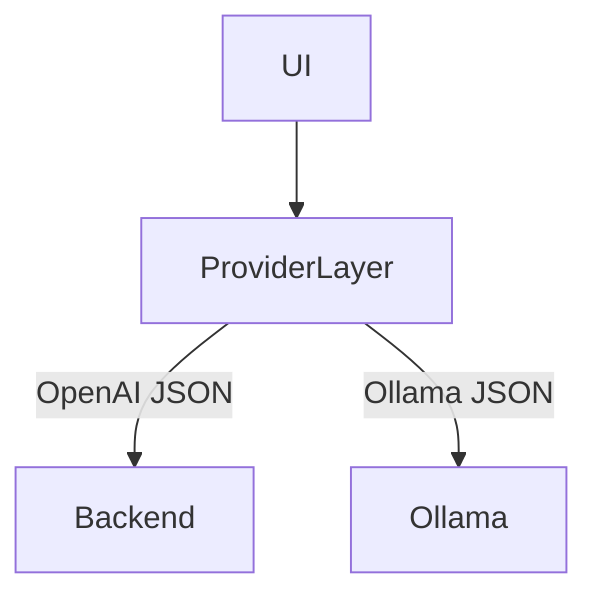

# OpenAI-Compatible Chat API — Concept & Implementation

*(Personal lab notebook — read if it helps; ignore if it doesn't. 🙂 Last verified 2025‑04‑23)*

## 1.  What "OpenAI-Compatible" Means

* **Interface contract** — A server answers the same HTTP paths, headers, and JSON schema defined by OpenAI's public API. If a client can point at `https://api.openai.com/v1/chat/completions`, it can instead point at `http://your-box:8000/v1/chat/completions` and behave identically.

Try it if you have OpenWebUI installed and your OpenAI API key is ready in that UI. You will see the available models from OpenAI and chat with any one of them. Just note that API credits are way more expensive than chatting with them on the ChatGPT web UI. 

One caveat to remember is that you need to set the API key to utilize the OpenAI-compatible backend. Thankfully, a fake one will do. It's not used for anything, just part of the protocol.

* **Key components**
  * **Base URL** `/v1/*` namespace
  * **Authentication header** `Authorization: Bearer <token>` (local servers often ignore the value but require the header)
  * **Content-Type** `application/json`
  * **Core endpoints**
    | Method | Path | Purpose |
    |--------|------|---------|
    | `POST` | `/v1/chat/completions` | Chat GPT-style messages → completion |
    | `GET`  | `/v1/models`           | List served model IDs |
    | `POST` | `/v1/completions`      | Legacy text completions |
  * **Request body (`/chat/completions`)**
    ```jsonc
    {
      "model": "gpt-4o",
      "messages": [
        {"role": "system", "content": "You are …"},
        {"role": "user",   "content": "Hello"}
      ],
      "max_tokens": 256,
      "temperature": 0.7,
      "stream": false,
      "tools": [ … ],            // optional function-calling
      "tool_choice": "auto"     // optional
    }
    ```
  * **Streaming vs. non-stream**
    * `stream:false` → single JSON response with full text.
    * `stream:true`  → Server-Sent Events (SSE) frames: `data: {"choices":[{"delta":…}]}` … `data: [DONE]`.

## 2.  Why Compatibility Matters

* **Ecosystem lock-in breaker** — Tools like LangChain, LlamaIndex, Autogen, LM Studio, VS Code extensions default to the OpenAI schema; drop-in local servers mean zero code change.
* **Layered front-ends** — UIs (e.g., OpenWebUI, Chatbot-UI) talk to *any* model backend as long as it speaks the spec.

---

## 3.  Ollama's Native API (baseline)

* Base URL `http://localhost:11434` (default)
* Key endpoints:
  | Method | Path | Notes |
  |--------|------|-------|
  | `POST` | `/api/generate` | `{model:"phi4", prompt:"…", stream:true}` |
  | `GET`  | `/api/tags`     | model list |
* Differences vs. OpenAI spec
  * Fields: `prompt`, `num_predict`, `temperature` (snake case)
  * Streaming: chunked JSON lines, not SSE.
  * No `/v1/models`, `/chat/completions` paths.

---

## 4.  How **OpenWebUI** Bridges Compatibility

### 4.1 Provider Abstraction



* **Connection** object in UI stores:
  * `mode = "openai" | "ollama" | "openai_compatible"`
  * `base_url`
  * optional `params` override (e.g., `max_tokens`, `stream`)

### 4.2 OpenAI → Ollama Translation Flow

1. User selects an Ollama model (e.g., `phi4:latest`).
2. UI builds an OpenAI-style body.
3. **Provider layer detects `mode:"ollama"`** → converts:
   * `messages` array → single `prompt` string (joins user + system).
   * `max_tokens` → `num_predict`.
   * SSE → chunked JSON lines; wrapper re-emits as pseudo-SSE back to UI.
4. Calls `POST /api/generate` on Ollama.
5. Collects output, converts back to OpenAI response shape and resolves Promise to UI.

### 4.3 When `mode:"openai_compatible"` is chosen

* UI passes the JSON **unaltered** to backend (`/v1/chat/completions`).
* Perfect for vLLM, FastChat, LM Deploy, etc.


JSON must conform precisely to the OpenAI spec—missing fields, extras, or malformed structures trigger silent 400s that surface as a generic "Network Error." When that happens, enlist your favorite SOTA LLM to pinpoint the mismatch rather than spelunking the logs alone. 

---

## 5.  Practical Usage Without Docker

### 5.1 Install paths

```bash
brew install ollama
brew services start ollama       # ensures Metal backend

conda create -n openwebui python=3.11 -y
conda activate openwebui
pip install open-webui   # pulls FastAPI, Uvicorn, SQLModel, etc.
```

You can also install Ollama via the official macOS package, which adds a menubar icon. For a headless server, stick with the Homebrew service approach above. 

### 5.2 Start services

```bash
# Ollama pulls
ollama run gemma3 # default 4b model
ollama run gemma3:27b # 27b model

# OpenWebUI (pointing at Ollama)
open-webui serve \
  --host 0.0.0.0 --port 3000 \
  --ollama-base-url http://localhost:11434 \
  --admin-email you@example.com --admin-password changeme
```

UI auto-filters provider list; Ollama appears with models from `/api/tags` and translation happens transparently.

A separate guide will be written on how to create a custom model from a local file or from others sources such as Hugging Face. But the easiest route is to use the `ollama pull` command. Converting other formats is not always straightforward nor successful. 

### 5.3 Switch to OpenAI-compatible backend later (e.g., vLLM)

OpenWebUI with ollama backend works out of the box. However, if you want to switch to a different backend, you can do so by adding a new **Connection** in OpenWebUI with `mode:"openai_compatible"` and base URL `http://localhost:8000`.

Even ray + ollama combo can be created. A separate guide will be followed on how to create a ray serve wrapper for ollama. Conceptually, it's the same as the vLLM example. 

1. Install vLLM on port 8000.
2. Add new **Connection** in OpenWebUI with `mode:"openai_compatible"` and base URL `http://localhost:8000`.
3. Register model IDs manually (or rely on `/v1/models`).
4. UI now uses pure OpenAI JSON → no translation; streaming via SSE.

---

## 6.  Gotchas & Tips

| Issue | Reason | Fix |
|-------|--------|-----|
| Ollama model names include quant tag (`llama3:70b-q8_0`) | UI must send exact tag in `model` field | pick from drop-down; no spaces |
| Missing `max_tokens` → vLLM 400 | Some OpenWebUI builds omit field | add via Connection → params or Models → advanced |
| CORS when calling vLLM from UI | Backend must allow browser origin | start vLLM with `--allowed-origins '["*"]'` |

---

## 7.  Summary

An "OpenAI-compatible" chat API is just the OpenAI JSON schema + endpoint paths. OpenWebUI is architected with a provider layer that converts between this schema and backend-native formats. With **Ollama**, it translates on the fly; with **vLLM** (or other compliant servers) translation is bypassed. This lets you swap back-ends on the same UI with zero front-end code changes.

---

[⇧ Back&nbsp;to&nbsp;README](../README.md)