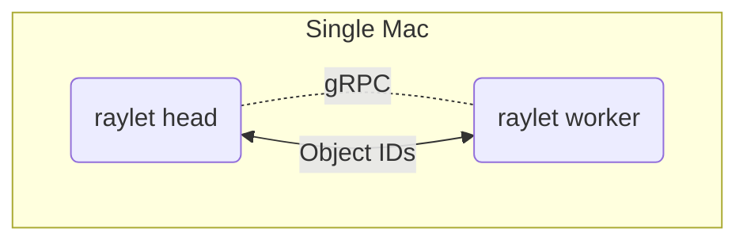

# Ray — Concept Explainer & Single-Box Benefits

*(Personal lab notebook — read if it helps; ignore if it doesn't. 🙂 Last verified 2025‑04‑23)*


## 1. What is Ray?

Ray is a **general‑purpose distributed computing framework for Python**. Think of it as `multiprocessing.Pool` that transparently spans many processes, many GPUs, or even many machines—while staying *Pythonic*.

### Core pieces

* **Ray Core** – task & actor API, distributed object store, resource-aware scheduler.
* **Ray Serve** – high-throughput model-serving layer (micro-batching, HTTP, gRPC).
* **Ray Data / Train / Tune / RLlib** – higher-level libraries for ETL, multi-GPU training, hyper-param search, reinforcement learning.
* **Dashboard** – real-time graph of tasks, actors, memory, GPUs.

---

## 2. How Ray Works (bird's-eye)



* A **head raylet** runs a global scheduler + metadata Redis.
* Every **worker raylet** (even on the same machine) starts a local object store.
* You mark functions/ classes with `@ray.remote`; Ray schedules them to any available CPU/GPU tagged in the cluster.
* Data passed between tasks is stored **once** in shared memory; other tasks receive only a 20-byte object ID.

---

## 3. Why Ray helps on **a single Mac** (Apple Silicon)

| Pain point without Ray | How Ray helps, even locally |
|------------------------|-----------------------------|
| *Manual process juggling* to keep UI responsive while heavy model inference runs | Launch inference in a **stateful Ray actor** pinned to specific cores; UI thread stays free. |
| Tensor workflows mixing CPU & GPU steps (tokenization → Metal inference → post-proc) | Chain tasks; scheduler pipes object IDs through shared mem, zero extra copies. |
| Re-spinning heavy models per request | Keep vLLM/Ollama inside a long-lived actor; tasks share it. |
| Ad-hoc benchmarking scripts using `multiprocessing` | Change to `@ray.remote`; Ray auto-profiles and shows realtime timings in the dashboard. |
| Future scale-out to Beta/Alpha cluster requires rewriting code | Ray code written today runs unmodified when you add `ray start` workers on new Macs. |

---

## 4. Getting Ray on Apple‑silicon

```bash
conda activate raylab
pip install -U ray[serve]
```

Ray wheels are **universal2**; ARM-64 binaries inside, no compilation needed.

Start a single-box cluster:

```bash
ray start --head --port=6379 --dashboard-port=8265
open http://localhost:8265
```

---

## 5. Hello-World Example (single Mac)

```python
import ray, time, psutil, socket
ray.init("ray://localhost:10001")   # Ray Client over gRPC

@ray.remote
def whoami(i):
    time.sleep(0.1)
    return f"{i} → {socket.gethostname()} ({psutil.cpu_count()} cores)"

print(ray.get([whoami.remote(i) for i in range(8)]))
```

Tasks fan out across your Mac's performance + efficiency cores; dashboard shows object store usage.

---

## 6. Ray Serve in Single-Box LLM Serving

```bash
serve run my_app:app  --route-prefix /
```

* Ray Serve handles **micro-batching** (merging multiple chat requests), keeps GPU saturated.
* Automatic **back-pressure** and **replica** scaling: add `#ray_remote num_cpus=4 num_gpus=1`.
* Upgrade path: later start additional worker Macs with `ray start --address=...`—Serve schedule expands automatically.

---

## 7. Key CLI commands Cheat-sheet

```bash
# start head locally
ray start --head --port=6379 --dashboard-port=8265

# start a worker (same or another Mac)
ray start --address=localhost:6379

# stop everything
ray stop --force

# inspect object store sizes
ray memory | head
```

---

## 8. Common Troubles & Fixes

| Symptom | Why | Remedy |
|---------|-----|--------|
| **`ray memory` shows store full** | default is ~30% of RAM | start head with `--object-store-memory=…` or delete old refs. |
| **`grpc._channel._InactiveRpcError`** when calling `ray.init` | wrong port or Ray not running | ensure `ray start --head` succeeded; match ports. |
| **Actor launch slow** on first run | model weights load per actor | use a *single* actor and share it; or set `max_restarts=-1` to persist. |

---

## 9. Takeaways

* Ray isn't *just* for clusters; even one Mac gains task isolation, memory-efficient pipeline chaining, and a ready path to multi-Mac scaling.
* Pair Ray Serve with your preferred backend (vLLM, Ollama via proxy) to get load-balancing and metrics out-of-the-box.
* Learning Ray now means zero refactor later when Beta, Alpha, or Node-M2 join the party.

---

# Single‑Box LLM Stack (Ray Serve + vLLM backend, OpenWebUI front‑end)

> **Goal**  Run Microsoft Phi‑4 locally with Metal acceleration, expose an OpenAI‑compatible `/v1/chat/completions` via **Ray Serve + vLLM**, and chat through **pip‑installed OpenWebUI**—all on one Apple‑silicon Mac, no Docker, no Ollama layer.

---

## 0. Environment checklist

```bash
macOS 14.5        # Apple Silicon
brew --version    # Homebrew ≥ 4.x
conda --version   # Anaconda / Miniforge
```

---

## 1. Create the `raylab` conda environment

```bash
conda create -n raylab python=3.12 -y
conda activate raylab
```

---

## 2. Install core packages

```bash
pip install -U "vllm>=0.4.2"     # Metal + SSE support
pip install -U "ray[serve]"       # Ray 2.44 or newer
pip install -U openai             # curl‑style tests
```

---

## 3. Download Phi‑4 weights (optional)

```bash
export HF_HOME="$HOME/.cache/huggingface"
huggingface-cli download microsoft/phi-4 --local-dir "$HF_HOME/phi-4"
```

---

## 4. Start Ray Head (single box)

```bash
ray start --head --port=6379 --dashboard-port=8265
```
Browse dashboard: <http://localhost:8265>

---

## 5. Launch vLLM as an OpenAI server

```bash
python -m vllm.entrypoints.openai.api_server \
    --model microsoft/phi-4 \
    --served-model-name phi4 \
    --host 0.0.0.0 --port 8000 \
    --allowed-origins '["*"]'
```
**Why each flag matters**
* `--served-model-name` → exposes short ID `phi4` in `/v1/models`.
* `--allowed-origins` → JSON list; bare `'*'` throws *invalid loads* error.

*Smoke test*
```bash
curl -s http://localhost:8000/v1/models | jq '.data[].id'   # → "phi4"
```

---

## 6. Install OpenWebUI from source (no Docker)

```bash
conda create -n openwebui python=3.11 -y
conda activate openwebui
pip install --no-cache-dir "git+https://github.com/open-webui/open-webui@v0.2.14#egg=open-webui"
```

`v0.2.14` or newer includes the fix that **injects `max_tokens` by default** when talking to OpenAI‑compatible providers.

Start the server:
```bash
open-webui serve \
  --host 0.0.0.0 --port 3000 \
  --openai-base-url http://localhost:8000 \
  --openai-api-key dummy
```
(older flag `--ollama-base-url` is not used here.)

---

## 7. First‑run UI setup

1. Visit <http://localhost:3000> → create admin user.
2. **Settings → Connections**
   * Provider : **OpenAI Compatible**
   * Base URL : `http://localhost:8000`
   * API Key  : `dummy`
   * Verify → should pass (requires CORS flag above).
3. **Settings → Models → ＋ Add Model**
   * Name     : `phi4`
   * Connection: your OpenAI provider
   * Model ID : `phi4`  *(exact string from `/v1/models`)*
   * (Optional) Max tokens: `256`  (if you're on a pre‑0.2.14 build)
   * Save → star ⭐ as default.

---

## 8. Chat!

Open a new chat tab → model dropdown shows **phi4** → type "Hello" → tokens stream back.

---

## 9. Troubleshooting diary (problems we hit & fixes)

| Symptom | Root cause | Fix |
|---------|------------|-----|
| **`400 Bad Request` from vLLM** | Missing `max_tokens` or UI sent `stream:true` to an old vLLM | Upgrade to vLLM ≥ 0.4.2 (adds streaming) **or** set `"stream": false` + `"max_tokens": XXX` in model params. |
| **`unrecognized arguments: --served-model-names`** | Flag name is singular in vLLM 0.4.x | Use `--served-model-name` (no "s"). |
| **`allowed-origins: invalid loads value`** | Passed `--allowed-origins '*'` (not JSON) | Use `'["*"]'` (JSON list in quotes). |
| **OpenWebUI shows "No models found"** | It lists only registered IDs | Add the model in *Settings → Models* or expose alias via `--served-model-name`. |
| **CORS error in browser** | vLLM missing header | Ensure `--allowed-origins '["*"]'` on server. |
| **CPU fallback** | Using Docker or wrong arch wheel | Stay on host binary; confirm `vllm` wheel is arm64 (`pip show vllm`). |

---

## 10. Adding workers later (Alpha / Node‑M2)

```bash
# on a worker Mac
ray start --address=beta.local:6379
```
> vLLM on a single box ignores remote GPUs, but Ray can schedule data‑prep or future model replicas.

---

## 11. Service management snippets

```bash
# stop services
pkill -f open-webui            # UI
pkill -f vllm.entrypoints     # backend
ray stop --force              # Ray

# start again (same commands as above)
```

---

## 12. Upgrade workflow

```bash
# vLLM
conda activate raylab
pip install -U vllm

# OpenWebUI (source clone)
cd ~/src/open-webui
git pull
pip install -e .[server]      # rebuilds backend & static assets
```

---

[⇧ Back&nbsp;to&nbsp;README](../README.md)