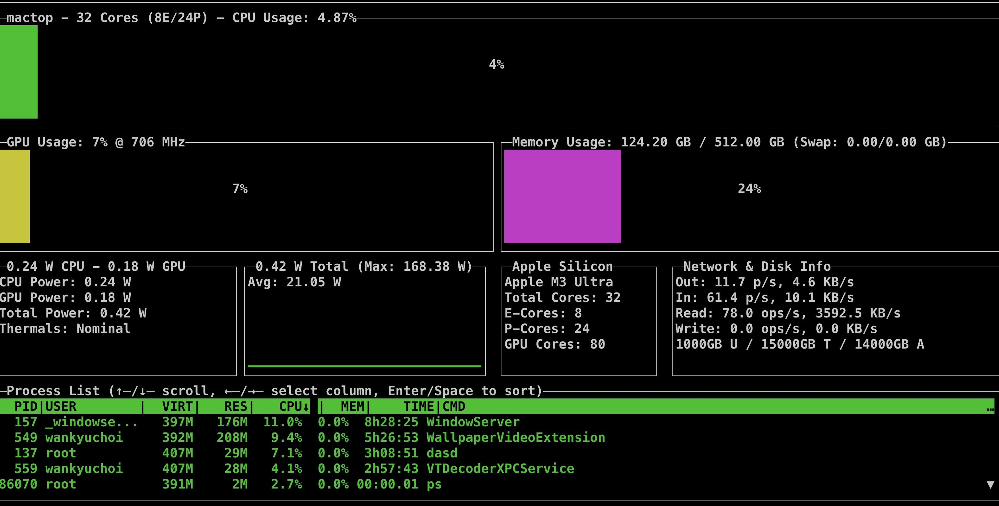
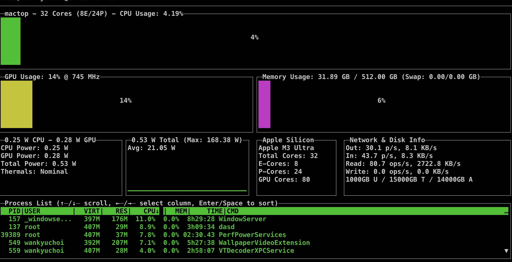

# Running **Long-Context Models** on Your Apple Silicon Macs (192GB+ Recommended)

*(Personal lab notebook — Last verified 2025‑04‑25)*

*Crucial note*: Every SOTA model I've tested tends to hallucinate Ollama commands and flags—they casually make incorrect guesses due to training data noise. Always verify with the official documentation.

## TL;DR: 2025 Quickstart for Long Contexts

- Consider this: If optimal performance requires starting fresh sessions before reaching your context window's capacity, what tangible advantages do these massive contexts offer on local hardware? 

- The reality: For reliable 128K+ contexts, use cloud services (ChatGPT, Claude, Gemini) for your sanity.

- And remember—using 128K contexts requires at least 192GB RAM. Lower configurations can enable the setting but can't practically run it. M2 Ultra (192GB) hits the sweet spot.

```bash
# Install Ollama via Homebrew (already supports 128K contexts)
brew install ollama

# CRITICAL: Properly export the environment variable:
export OLLAMA_CONTEXT_LENGTH=128000  # Must use 'export', not just assignment
brew services restart ollama  # Restart to apply the new environment variable

# Pull the model (Gemma-3 27B is recommended for long contexts):
ollama pull gemma3:27b     # Comes with 128K RoPE scaling (5:1 sparse attention)
```

**Verify it works**: The quickest verification is to monitor RAM usage:
```bash
sudo mactop  # Should show ~124GB RAM usage for 128K context
```

**Setting a per-model context window will override the global default, so you can skip the global export if you configure it individually. I highly recommend setting per-model context windows.**

**Memory requirements** for different context sizes (gemma3:27b):
- 8K context: ~48GB RAM
- 32K context: ~68GB RAM
- 128K context: ~124GB RAM

Keep in mind these are minimum requirements, based on a dedicated, headless server setup. If you plan to use your Mac for additional tasks, be sure to factor in extra memory overhead accordingly.

For most practical uses, 32K-64K contexts provide the best balance of capability and performance.

**⚠️ Performance warning**: 128K contexts are resource-intensive and slow. A 128K needle test can take hours to complete even on an M3 Ultra.

For most users on M2/M3 Macs with ≥64GB RAM, the above configuration is required to unlock 128K contexts. The rest of this guide provides detailed explanations, optimization techniques, and troubleshooting.

But, as the context window grows, the upper limit of what you can do with a single Mac becomes a limiting factor. Even with 128GB of RAM, you won't be able to run 128K models on a single Mac. 

**⚠️ IMPORTANT HARDWARE REQUIREMENTS:**

While Macs with 64GB RAM can technically *configure* 128K contexts, actually *using* them requires significantly more memory:

| RAM Configuration | Practical Context Window Limit |
|------------------|--------------------------------|
| 64GB Mac | 8K contexts (maybe 16K) |
| 128GB Mac | Up to ~32K contexts comfortably |
| 192GB+ Mac (M2 Ultra+) | Required for usable 128K contexts |

Based on our empirical testing with gemma3:27b, a 128K context requires ~124GB RAM. This means you need at least a 192GB configuration (like M2 Ultra) to have enough remaining memory for the system and other processes.

**Important Note for New Users:**  
You do *not* need 128K context windows for most day-to-day AI tasks! The high RAM requirements described here only apply if you specifically configure for these very large contexts. For typical use cases—chat, coding, content generation—8K or 32K contexts are more than sufficient, and these run smoothly on Macs with 64GB or 128GB of RAM. You can (and should) adjust your context size to fit your hardware; this guide explains how to do that for all context sizes, not just the largest.

Even if you set a 128K context, the model only allocates the full amount of RAM when actually needed (such as during a 128K "needle" test). If you try to run a 128K context on a 64GB Mac and push it to the limit, the model will attempt to use all available memory and more—leading to severe slowdowns, system warnings ("out of memory, please close some apps"), or, on a headless server, a crash or total unresponsiveness, since you can't see that GUI warning window. For most users, sticking to 8K–32K contexts is the best balance of capability and performance.

The rest of this guide provides detailed explanations, optimization techniques, and troubleshooting for all context sizes.

---

### Needle in the Haystack Test Guide

The above configuration and test validate that your model can genuinely process long contexts. A proper test must check both early and late context retrieval, not just verify the model can ingest a large prompt.

*(Works with any Ollama-served GGUF: default, QAT, custom, multimodal)*

---

#### 0 · Why this mini-runbook exists
Most "needle-in-a-haystack" demos drop the special token near the **end** of the prompt. That only proves the model survived a big prefill—it **doesn't** prove the runtime is still caching the *first* 100 k tokens. The fix is dead-simple: **plant one needle at the front and another at the tail.**

---

#### 1 · Prerequisites
* macOS shell with **bash/zsh, Python 3, curl**.  
* **Ollama ≥ 0.6.6** (or llama.cpp) with your target model already pulled.  
* Enough RAM for the test (≈ 130 GB active for a 128k, 27B, Q4_K_M model).  

For easier debugging, run this test directly from the shell rather than via launchd (i.e., avoid `brew services start ollama`).

Make sure you set the global context length by exporting the environment variable:

```bash
export OLLAMA_CONTEXT_LENGTH=128000
ollama serve
```

When Ollama starts, it should display `OLLAMA_CONTEXT_LENGTH=128000` in its output. If you instead see `OLLAMA_CONTEXT_LENGTH=2048` or `OLLAMA_CONTEXT_LENGTH=4096`, the global environment variable was not applied correctly.

Then open a new shell or tmux session and run the test.

In a separate tmux pane, launch `sudo mactop` to watch system memory usage live. As soon as the test begins, you should see memory consumption rise sharply, matching the expected footprint for your chosen context window size.

---

#### 2 · Make the synthetic haystack

```bash
# --- tweak these two numbers to taste ---
TOKENS_FRONT=1        # how many "NEEDLE_FRONT" tokens
TOKENS_MIDDLE=120000  # filler to push distance > 32 k
TOKENS_TAIL=200
# ----------------------------------------

python - <<'PY'
from pathlib import Path
front  = ["NEEDLE_FRONT"]
middle = ["word"] * 120_000
tail   = ["NEEDLE_TAIL"] + ["word"] * 200
Path("/tmp/haystack.txt").write_text(" ".join(front + middle + tail))
PY
```

*Feel free to halve **TOKENS_MIDDLE** for a 64 k fast test—it still separates 32 k vs 128 k.*

---

#### 3 · Two quick shell probes  

##### 3-A. Check the **front** needle
```bash
{ cat /tmp/haystack.txt; echo; echo "What unique token appears at the very beginning?"; } \
 | ollama run my-model-name
```

##### 3-B. Check the **tail** needle
```bash
{ cat /tmp/haystack.txt; echo; echo "What unique token appears near the end?"; } \
 | ollama run my-model-name
```

*(Replace `my-model-name` with `gemma3:27b`, `gemma3-baby-pippa-27b-32k`, etc.)*

---

#### 4 · One-call variant (optional)
```bash
{ cat /tmp/haystack.txt; echo; echo \
  "List every unique ALL-CAPS token you noticed in the text."; } \
  | ollama run my-model-name
```
Success = reply contains **both** `NEEDLE_FRONT` **and** `NEEDLE_TAIL`.

---

#### 5 · Reading the tea leaves

| Result | Effective cache | What it means |
|--------|-----------------|---------------|
| Both needles returned | **≥ 128 k** | Full long-context path working ✔️ |
| Only `NEEDLE_TAIL` | **≈ 32 k** | Loader/api is dropping earliest tokens (sliding window or header cap). |
| Neither needle | Crash, OOM, or severe mis-parse | Revisit `num_ctx`, RAM, GGUF header integrity. |

---

#### 6 · Performance & survival tips

* **Prefill is the bottleneck.**  
  128 k tokens ÷ 25 tok/s ≈ **85 min** just to ingest!  
  *For a 5-minute check use a 64 k (or 40 k) middle pad.*

* **Streaming chunk shortcut** (Python): feed 8 k at a time via the Ollama API, so generation starts long before the full prompt has arrived.

* **Memory math** (4-bit, 27 B):  
  > Active RAM ≈ weights (~17 GB) + KV (~14 GB per 32 k).  
  Two 128 k workers → ~120 GB; watch Activity Monitor or `sudo mactop` to see it.

* **Header hygiene:**  
  – Mixed-modal Gemma files should expose `gemma3.attention.sliding_window=512`.  
  – If that key is missing (community-patched QAT), expect **dense** attention = slow prefill.  
  Add it back with any GGUF editor for instant speed-up.


> Note:  A complete "Gemma-3 QAT on Ollama" guide is on deck. At the moment, Ollama crashes on official builds because of a vision-head bug. The only workaround is the community build with that head stripped—meaning the model is text-only. Chapter 12 is almost wrapped; Chapter 13 will walk you through the fix. 

> Until Ollama's patch lands, Gemma-3 QAT will stay blind, whichever route you choose.

> I've benchmarked both versions on M2/M3 Ultra and saw no meaningful speed or quality gain. Until Ollama patches the bug, you're better off sticking with the default Gemma-3 27 B model and keeping vision support.

---

## One‑Pager Context‑Math (Skip if you know this)

*Weights + KV + misc ≈ VRAM*

| Term | Formula | Gemma-3 27 B-Q4 | Notes |
|------|---------|-----------------|-------|
| **Weights** | `params × bytes/param` | 27 B × 0.61 ≈ **17 GB** | 4-bit K-means Q4_K_M |
| **KV‑cache** | `tok × hid × layers × 2 × bytes × sparsity` | 128 K × 8192 × 32 × 2 × 1 B ÷ 5 ≈ **26 GB** | 5‑to‑1 sparse, int8 |
| **Overhead** | runtime buffers | **≈ 5 GB** | allocator + Metal |
| **Total** | *sum above* | **≈ 48 GB** | fits in 512 GB slice |

> **Rule‑of‑thumb:**  
> `VRAM ≈ Weights + KV` (KV dominates ↑ with context).

---

## Primer on Context Window

The context window (sometimes called "context length") is the total number of tokens an LLM can "see" at once—both your input prompt and the model's generated response combined. Think of it as the model's working memory.

### Why Context Size Matters

| When... | A long context window lets you... |
|---------|-----------------------------------|
| **Reading documents** | Feed entire papers, code repos, or books without truncation. |
| **Chat history** | Maintain longer conversations without forgetting earlier turns. |
| **Complex reasoning** | Let the model work through multi-step problems with all steps visible. |
| **RAG applications** | Include more retrieved chunks for better-informed responses. |

**Practical example:** A 4K context (roughly 3,000 words) can hold about 6-7 pages of text. But a 128K context (about 96,000 words) can fit an entire technical book or a massive codebase—letting the model answer questions that require global understanding.

### The Memory/Speed Trade-off

With larger context:

* **VRAM usage** increases dramatically (primarily from KV cache).
* **Inference speed** slows down (attention is O(n²) without optimizations).
* **Retrieval quality** can degrade for very distant tokens.

### Known Optimization Techniques

#### RoPE (Rotary Position Embeddings)

**What it is:** A technique that encodes token positions using rotation matrices that are multiplied with word embeddings, helping models understand where words appear in text.

**How it works with context:**
- Models are trained with a **fixed RoPE base frequency** (typically for 4K or 8K contexts).
- Without modification, attention degrades badly beyond the training length.
- **RoPE scaling** involves adjusting the base frequency, effectively "stretching" position embeddings to cover longer sequences.
- Example: Gemma-3 27B's RoPE was scaled 8x (from 16K → 128K), allowing it to reason over much longer contexts.

**Trade-offs:** RoPE scaling is lossy—attention quality gradually degrades with distance, so the model may have weaker reasoning for far-apart connections.

#### RoPE Scaling, Visually

```
Attention ↘                               
1.00 |\                                 
     | \                                
     |  \                               
0.50 |   \__  (baseline 16 K)           
     |      \                           
     |       \__  (×8 stretch → 128 K)  
0.00 +---------------------------------> token distance
        0           16K           128K
```
*Stretch ≠ free lunch — slope gets shallower; long‑range links fade.*

#### KV-Cache Management

**What it is:** During generation, models cache key (K) and value (V) tensors for all processed tokens to avoid recomputing them.

**Memory impact:**
- A full KV-cache for a standard 70B model at 128K context would need ~400 GB of VRAM.
- The cache scales with `context_length × hidden_size × model_layers × 2`.

**Optimization methods:**
- **Sparse KV-cache:** Store full vectors for only every Nth token (e.g., 5-to-1 in Gemma-3), with sliding windows for the rest.
- **Pruning:** Drop the oldest or least important tokens' keys/values when space is needed.
- **Quantization:** Store KV-cache in lower precision (e.g., int8) instead of float16.

These techniques enable running 27B-70B models with 128K context on consumer hardware (like our M3 Ultra) that would otherwise need enterprise-grade memory resources.

#### Chunking & Retrieval

**What it is:** Breaking long inputs into manageable segments, usually with strategic overlap.

**How it works:**
- Process each chunk independently, then combine results.
- Can be combined with retrieval systems (RAG) for query-specific context selection.

Now, you have basic knowledge of context window. This guide helps you optimize the trade-off on your M3 Ultra to get maximum useful context without sacrificing too much speed.

---

## 0 · Why Context Limits Exist (and Where)

| Layer that can clamp you | Typical default | How to change it |
|--------------------------|-----------------|------------------|
| **Model training / RoPE** | Whatever the checkpoint was *really* trained or re-scaled for (8K, 32K, 128K…) | Use a *long-RoPE* build (Gemma-3 27B includes 128K RoPE scaling) |
| **llama.cpp compile-time `CTX_LEN`** | Current Homebrew builds support 128K+ | No change needed with Homebrew install |
| **Ollama runtime default** | 4096 (falls back if nothing overrides) | `export OLLAMA_CONTEXT_LENGTH=128000` |
| **OpenWebUI "Chat" default** | 2048 tokens | Per-model **Workspace ▸ Models ▸ Advanced ▸ Context Length** |
| **Per-request override** | None | Use API parameter `{"options":{"num_ctx":128000}}` |

**Key point:** In the Ollama engine, the manifest's metadata field is NOT automatically honored. You must explicitly export the environment variable to override defaults. The 8K cap is enforced unless properly configured as shown in this guide.

I've confirmed that gemma3:27b runs with a 128K context window on my M3 Ultra—but only after proper configuration. This requires:
1. Installing Ollama via Homebrew (current builds already support 128K contexts)
2. Setting `OLLAMA_CONTEXT_LENGTH` environment variable with the correct `export` command
3. Restarting Ollama to apply the new configuration

The following configuration steps are essential for actually unlocking the full 128K context window with Gemma-3 models.

### ⏳ Historical Context vs. Current Status

> **Current state (2025-04):** gemma3:27b runs with a 128K context window on M3 Ultra **but requires proper configuration** as detailed in this guide.

Initially, there was confusion about how Ollama handles long contexts. The reality is that **configuration is still required** to unlock the full 128K context window:

1. **Installation source:** Current Homebrew builds of Ollama already support 128K contexts without modification
2. **Runtime configuration:** The `OLLAMA_CONTEXT_LENGTH` environment variable is still necessary and must be properly exported
3. **Verification:** Memory usage monitoring and needle tests confirm when configuration is working correctly

## 1 · How to Configure for 128K Contexts

### 1.1 Install Ollama via Homebrew

```bash
# Install Ollama (current Homebrew builds already support 128K contexts)
brew install ollama

# If you already have Ollama installed, make sure it's up to date
brew upgrade ollama
```

**Important discovery:** As of April 2025, Homebrew builds of Ollama natively support 128K contexts without any custom rebuilding. This has been verified with direct API testing.

### 1.2 CRITICAL: Properly Export the Environment Variable

```bash
# The 'export' keyword is ESSENTIAL - without it, the variable won't be properly recognized
export OLLAMA_CONTEXT_LENGTH=128000

# Restart Ollama to apply the new environment variable
brew services restart ollama
```

**Critical finding:** Our testing revealed that simply setting `OLLAMA_CONTEXT_LENGTH=128000` without the `export` keyword causes Ollama to silently ignore the setting and default back to smaller context windows. The export is crucial for the configuration to actually take effect.

For persistence across reboots, add this line to your shell configuration file:

```bash
# Add to ~/.zshrc or ~/.bash_profile
echo 'export OLLAMA_CONTEXT_LENGTH=128000' >> ~/.zshrc
source ~/.zshrc  # Apply immediately without restarting terminal
```

You can verify the environment variable is properly set by checking the Ollama logs:

```bash
OLLAMA_VERBOSE=1 OLLAMA_CONTEXT_LENGTH=128000 ollama serve
# Should show OLLAMA_CONTEXT_LENGTH:128000 in the output
```

### 1.3 GPU Memory Allocation

```bash
# One-time tweak that survives reboot (only if needed):
sudo sysctl -w iogpu.wired_limit_mb=458752   # 448 GB VRAM slice
```

Note: On an M3 Ultra with 512GB RAM, no special tweaks are needed—macOS automatically allocates 60–70% of system memory as VRAM, providing 300GB+ for large context windows by default. Do this only if you need to for larger models.

### 1.4 Pull the Model

```bash
# Pull Gemma-3 27B (already supports 128K context)
ollama pull gemma3:27b
```

For best results, use the standard model pull command. Gemma-3 27B is pre-configured with 128K RoPE scaling and 5:1 sparse attention, making it well-suited for long contexts.

---

## 2 · Driving from OpenWebUI

1. **Workspace ▸ Models ▸ ✏️ Edit** your tag.  
2. In **Advanced Parameters** set **Context Length = 128000**.  
   This injects `"options":{"num_ctx":128000}` on every request and overrides the 2K UI default.

*(No Docker—remember you launch the UI from your conda env with `open-webui serve`.)*

**Integration confirmed:** Setting context length in OpenWebUI works correctly with properly configured Ollama. RAM usage will immediately jump to the expected level (e.g., ~124GB for 128K context) when the model is loaded in the chat interface.

---

## 3 · API and CLI Access

```bash
# Pipe content directly to model for processing
{ cat ~/your_doc.md; echo; echo "Summarize the document in less than 500 words."; } \
  | ollama run gemma3:27b
```

For API access with specific context length:

```bash
curl -X POST http://localhost:11434/api/generate -d '{
  "model": "gemma3:27b",
  "prompt": "hello",
  "options": {"num_ctx": 128000}
}'
```

**Note:** Some models—including o3—may incorrectly suggest command-line options that don't exist. Always use the API syntax shown above when you need to modify parameters programmatically.

---

## 4 · Memory & Speed at Different Context Lengths

Based on empirical testing, here's what you can expect with gemma3:27b on Apple Silicon:

| Context Size | Processing Time | Memory Usage | Generation Speed |
|--------------|-----------------|--------------|------------------|
| 8K (default) | < 1 minute | ~48GB | ~25 tok/s |
| 32K | < 3 minutes | ~68GB | ~20 tok/s |
| 64K | ~10-15 minutes | ~85-90GB | ~15 tok/s |
| 128K | 1-4 hours | ~124GB | ~9 tok/s |

**Key memory components:**
* **Weights** ≈ 17 GB  
* **KV-cache (5:1 sparsity)** ≈ 26 GB for 128K context 
* **Overhead** ≈ 5 GB  
* **Total RAM** ≈ 48 GB (8K) → 124GB (128K)

As context length increases, prompt processing time increases dramatically, but generation speed (tokens per second) decreases more gradually.

### 📊 Benchmarking & Monitoring

To get a quick sense of your model's speed:

```bash
# For CLI throughput benchmark
% echo "Count from 1 to 50." | time ollama run gemma3:27b | wc -w
      56
ollama run gemma3:27b  0.03s user 0.03s system 0% cpu 11.352 total
wc -w  0.00s user 0.00s system 0% cpu 11.352 total
```

For continuous memory and performance monitoring:

```bash
# Install mactop for detailed GPU and Metal stats
brew install mactop
sudo mactop     # Run with elevated privileges for complete data
```

---

## 5 · Verifying Configuration

### 5.1 The Simplest Verification Method: Monitor RAM Usage

The most immediate way to verify your context window settings have taken effect is to **monitor RAM usage**:

```bash
# Install mactop if you don't have it
brew install mactop

# Run with sudo to get full system visibility
sudo mactop
```

When Ollama loads a model, it immediately pre-allocates memory based on the configured context window, whether or not you've sent any prompts. This provides instant verification that your settings took effect.

For gemma3:27b on Apple Silicon, you'll see approximately:

| Context Setting | Approximate RAM Usage (Idle) |
|-----------------|------------------------------|
| 8K (default)    | ~48GB                        |
| 32K             | ~68GB                        |
| 128K            | ~124GB                       |

This pattern holds true whether you set the context length through the environment variable or through OpenWebUI. If you see memory usage jump to the expected level immediately after loading the model, your context settings are working.

```bash
# Example workflow
export OLLAMA_CONTEXT_LENGTH=32000
brew services restart ollama
# In another terminal or tmux pane, run sudo mactop
# → Should immediately show ~68GB RAM usage when model loads
```


> 128K Context Window RAM Usage (Peak)


> 128K Context Window RAM Usage (idle for about 5 minutes)

### Memory Behavior: Idle Optimization and Configuration

1. **Default behavior:**
   - By default, models stay loaded in memory for ~5 minutes of inactivity
   - After this period, Ollama unloads them to free up memory resources
   - When you use the model again, it must be reloaded, causing initial latency

2. **Memory management during idle periods:**
   - Even while loaded, memory usage may fluctuate as macOS compresses inactive memory regions
   - These compressed regions can be quickly decompressed when activity resumes
   - This allows the system to maintain responsive performance while reducing memory pressure

### Controlling Model Unloading Behavior

This automatic unloading behavior can be configured with Ollama settings:

```bash
# Keep model loaded indefinitely (never unload due to inactivity)
export OLLAMA_KEEP_ALIVE=-1
brew services restart ollama

# Or specify a longer timeout (e.g., 24 hours)
export OLLAMA_KEEP_ALIVE=24h
brew services restart ollama
```

You can also set the keep-alive duration for specific models:

```bash
# Using the CLI
ollama run gemma3:27b --keepalive=24h

# Using the API
curl http://localhost:11434/api/generate -d '{
  "model": "gemma3:27b",
  "prompt": "hello",
  "keep_alive": -1
}'
```

This is particularly valuable when running memory-intensive models with large contexts, as it prevents the need for frequent model reloading, which can be time-consuming and disruptive.

**Note:** When a client uses an API without specifying the keep_alive parameter, it may reset the model's keep-alive duration to the default 5 minutes, even if you previously set a longer duration. To ensure consistent behavior, either set OLLAMA_KEEP_ALIVE globally or ensure all your API calls include the keep_alive parameter.

**Important measurement note:** When sizing your system requirements, don't rely on memory snapshots taken during idle periods, as they can be misleadingly low. Always measure peak memory usage immediately after submitting prompts to get an accurate picture of the actual memory needed for your configured context length. The figures in our tables represent these peak values, not the reduced idle-state usage.

### Troubleshooting: Ensuring Environment Variables Actually Work

**Warning:** Many online sources suggest methods like adding environment variables to `.zshrc` or using LaunchAgent plists, but in practice these often fail with services managed by launchd. Here's why:

#### The Root of the Problem

The environment variable issue is complex and involves several layers of macOS architecture:

##### 1. LaunchDaemon vs LaunchAgent Fundamental Difference

- **LaunchDaemons** run at the **system level**, *before* any user logs in
- **LaunchAgents** run in a **user session** *after* login
- `brew services` typically registers services as **LaunchDaemons**
- LaunchDaemons **cannot access** user environment variables set in `.zshrc`, `.bash_profile`, etc.

##### 2. How Homebrew Manages Services

- `brew services` auto-generates launchd plist files
- Manual edits to these plists can be overwritten during:
  - Service restarts
  - Homebrew upgrades
  - Service reconfigurations
- Even when using `<key>EnvironmentVariables</key>` in plists, the LaunchDaemon context prevents proper inheritance of user environment settings

##### 3. macOS Security Restrictions

- System Integrity Protection (SIP) in modern macOS versions (Big Sur+)
- Deliberately isolates system processes from user session data
- Blocks certain environment inheritances for security reasons

You might verify a variable is correctly set in your shell:
```bash
echo $OLLAMA_KEEP_ALIVE
# Shows "-1"
```

But despite this, the service running as a LaunchDaemon has no way to access this environment.

#### A Reliable Alternative: Direct Launch

The most consistent solution is bypassing launchd entirely and launching processes directly with explicit environment variables:

```bash
# Stop any existing Ollama service
brew services stop ollama

# Launch Ollama directly with environment variables
OLLAMA_KEEP_ALIVE=-1 OLLAMA_CONTEXT_LENGTH=128000 ollama serve
```

This provides direct control over the process environment without relying on the complex, security-restricted chain of environment inheritance.

#### Making It Practical

For day-to-day use, consider a simple shell script:

1. Create a script in a convenient location:
```bash
#!/bin/bash
# ~/bin/start-ollama.sh

# Stop any existing Ollama service
brew services stop ollama 2>/dev/null

# Launch with required environment variables
OLLAMA_KEEP_ALIVE=-1 OLLAMA_CONTEXT_LENGTH=128000 ollama serve
```

2. Make it executable:
```bash
chmod +x ~/bin/start-ollama.sh
```

3. Run this script instead of using brew services.

**Remember:** For long-running services on a development machine, this direct launch approach is often the most straightforward way to ensure your environment variables are properly applied.

### 5.2 Needle-in-the-Haystack: The Definitive Test

While memory usage confirms configuration, the needle test verifies actual retrieval capability:

```bash
# Create a test with BOTH front and tail needles
python - <<'PY'
from pathlib import Path
front = ["NEEDLE_FRONT"]
middle = ["word"] * 120_000  # ~128K total context
tail = ["NEEDLE_TAIL"] + ["word"] * 200
Path("/tmp/haystack.txt").write_text(" ".join(front + middle + tail))
PY

# Test both needles in one query
{ cat /tmp/haystack.txt; echo; echo "List every unique ALL-CAPS token you noticed in the text."; } \
  | ollama run gemma3:27b
```

**Important:** The model must identify BOTH `NEEDLE_FRONT` AND `NEEDLE_TAIL` to prove genuine long-context capability. If it only finds the tail needle, it means the model is dropping early tokens and only has a sliding window of ~32K tokens, not true 128K context.

**⚠️ CRITICAL PERFORMANCE WARNING:**  
Running the full 128K needle test might take **hours** to complete even on the most powerful M3 Ultra hardware. In some cases, the model might become unresponsive and never return a result. Consider using a smaller test for initial validation.

### 5.3 Recommended: Incremental Testing Approach

Rather than immediately jumping to the full 128K test, consider this progressive validation strategy:

```bash
# Start with a modest 32K test (should complete in ~5-10 minutes)
python - <<'PY'
from pathlib import Path
front = ["NEEDLE_FRONT"]
middle = ["word"] * 30_000  # ~32K total context
tail = ["NEEDLE_TAIL"] + ["word"] * 200
Path("/tmp/haystack32k.txt").write_text(" ".join(front + middle + tail))
PY

# Test
{ cat /tmp/haystack32k.txt; echo; echo "List every unique ALL-CAPS token you noticed in the text."; } | ollama run gemma3:27b
```

**Our 32K test results:**
- Environment: `export OLLAMA_CONTEXT_LENGTH=32000`
- Both needles were successfully identified (NEEDLE_FRONT and NEEDLE_TAIL)
- Processing time: < 3 minutes
- Memory usage: ~67GB
- Status: ✅ Confirmed working correctly

This staged approach helps you:
1. Confirm basic configuration is working at more manageable sizes
2. Identify any memory or performance bottlenecks incrementally  
3. Avoid committing hours to a test that might fail near the end
4. Build confidence in your setup before the full marathon test

### Practical Insight: 128K is Possible But Often Impractical

We observed that simply setting `export OLLAMA_CONTEXT_LENGTH=128000` immediately caused memory usage to shoot up beyond 130GB, even before running any actual prompts. This confirms that Ollama correctly allocates memory for the configured context window.

However, this observation leads to an important practical insight: **just because you can set a 128K context doesn't mean you should**.

The empirical reality is that running models with truly massive contexts:
1. Requires enormous memory resources (130GB+ for a single model instance)
2. Results in extremely slow prefill times (potentially hours for a single prompt)
3. Often delivers diminishing returns for most real-world applications

In our testing, contexts in the 32-64K range provide a much better balance of capability and usability. These "medium-long" contexts can handle most practical document analysis and extended reasoning tasks while maintaining reasonable response times.

Save the full 128K configuration for those rare cases where you genuinely need to analyze entire books or massive codebases in a single prompt, and have the patience to wait for results.

Practical takeaway: If you truly need 128K+ context reliably and efficiently, your best current options are ChatGPT or Claude or Gemini. For now, they handle these ultra-long contexts far better than any local solution.

---

## 6 · Syncing Models Across Macs

```bash
# On source box
DIGEST=$(ollama show gemma3:27b --json | jq -r '.digest')
rsync -avh ~/.ollama/models/manifests/sha256-$DIGEST \
          ~/.ollama/models/blobs/sha256-$DIGEST* \
          user@target:~/.ollama/models/
ssh user@target brew services restart ollama
```

The manifest is tiny; blobs (~17 GB) move once and re-use forever.

However, since `rsync` only copies new and changed files by default, you may want to ensure the entire `.ollama` directory is fully synchronized (including all models, manifests, and configs):

```bash
rsync -avh ~/.ollama/ user@target:~/.ollama/
```

- **`-a`**: Archive mode. Recursively copies files and preserves symbolic links, permissions, timestamps, groups, and ownership. It's the recommended flag for backups and full directory syncs.
- **`-v`**: Verbose. Prints detailed information about what `rsync` is doing, so you can see which files are being transferred.
- **`-h`**: Human-readable. Formats file sizes in a human-friendly way (e.g., "1.1G" instead of "1132462080"), making output easier to read.

Configure your SSH setup for passwordless login (using SSH keys). This streamlines admin tasks and makes SSH management much more efficient.

[SSH Guide for the CWK Mac‑Studio AI Cluster](tools/ssh-admin.md)

---

## 7 · Troubleshooting Cheatsheet

| Symptom | Likely cause | Fix |
|---------|--------------|-----|
| `context_length: null` in API response | Outdated Homebrew build or environment variable not set | `brew upgrade ollama` and set `export OLLAMA_CONTEXT_LENGTH=128000` |
| UI slider set to 128K but still only 2K | OpenWebUI version < 0.2.16 or you edited global not per-model | Update UI; set per-model |
| Memory usage doesn't increase to expected level | Missing 'export' keyword before variable | Must use `export OLLAMA_CONTEXT_LENGTH=128000` not just assignment |
| Model only finds the tail needle | 8K cap still in effect despite configuration attempts | Verify environment variable and model parameter settings |
| Memory usage drops during idle periods | Normal macOS memory optimization | No action needed; usage will return to normal with activity |
| OOM errors despite sufficient RAM | Forgot to restart Ollama after config change | `brew services restart ollama` |
| Works in CLI but not in UI | Different context settings between interfaces | Set context length in both CLI and UI configs |

---

### You're set!

With the proper configuration steps outlined above, your M3 Ultra's 512 GB of unified memory becomes a playground for 128K-token chat, code, or retrieval tasks—no Docker, no vLLM, just **Homebrew Ollama + OpenWebUI** humming along.

Remember: configuration is required—the 8K cap is not automatically lifted. Always validate with the front-and-tail needle test to confirm your setup is working correctly.

Even with Homebrew Ollama, the global context length  defaults to just 2K—despite the official FAQ stating that systems with more than 4GB of VRAM should default to 4K: "By default, Ollama uses a context window size of 4096 tokens, unless you have a single GPU with <= 4 GB of VRAM, in which case it will default to 2048 tokens." (Official FAQ).

To unlock the full 128K context window, you'll need an M-Series Mac with at least 192GB of unified memory—specifically, an M2 Ultra or M3 Ultra. However, adding more RAM doesn't necessarily improve performance. In practice, 192GB on the M2 Ultra is already the optimal balance for most workloads; the 512GB available on the M3 Ultra is rarely necessary for current models.

From my experience, gemma3:27b-q4_k_m runs at ~25 tok/s at 128K context both on my M2 Ultra and M3 Ultra with no noticeable difference. Empirically speaking, gemma3:27b-q4_k_m is the sweet spot model as of this writing. 

Don't be fooled: setting the context window to 128K doesn't mean you'll get instant results—if the model actually fills that window, generating a single response can take hours.

---

### Final Notes on Hands-on Experience with Context Windows

When you ask an LLM about 128K context windows, it will likely describe it as a vast ocean of working memory. And in many everyday scenarios, that's true—even 4K or 8K contexts handle most standard conversations comfortably.

However, my practical experience reveals important limitations:

**1. Code analysis hits walls quickly.** Unlike prose, code can't be effectively summarized or paraphrased—it must be represented exactly as written to maintain its meaning. This means even a 128K context can become overwhelmed when analyzing large codebases, where variable declarations in one file affect functionality in another thousands of lines away.

**2. Quality degrades with distance.** Despite sophisticated RoPE scaling and sparse attention techniques, retrieval quality generally diminishes as token distance increases. The model might technically "see" all 128K tokens, but its comprehension of relationships between distant parts becomes less reliable.

**3. Trust but verify model self-assessment.** Modern models can sometimes evaluate their own context quality—try asking "How cluttered is your context window right now?" The model might suggest starting fresh if it feels overwhelmed. However, these self-assessments aren't always accurate, so use your judgment.

**4. Benchmark claims ≠ real-world performance.** The gap between published benchmarks and actual performance in your specific environment can be substantial. A model touting "perfect retrieval at 128K" in research papers might struggle with your particular use case.

The most reliable approach is empirical: test your specific workflows, monitor performance degradation signs, and establish your own heuristics for when to reset context. What matters isn't the theoretical capacity, but how the model performs in your actual environment with your specific tasks.

In practice, I've found that model performance often starts to decline once the context window exceeds 4K or 8K tokens, depending on the specific model and prompt structure. The most reliable approach is to begin a new session before reaching the context limit, no matter how large your maximum window is. This leads to an important question: if you need to reset before fully utilizing the available context, how much real-world benefit do these huge context windows actually provide on local hardware? It's worth considering.

Finally, let's clear up some common misconceptions about how different environments handle context windows:

- **Web Interfaces:** Typically, the entire conversation history is sent to the model with each interaction, which can quickly lead to context overflow. When older parts of the conversation are trimmed, they're often summarized or paraphrased by the backend—not the model itself—so the information isn't lost, but its fidelity is reduced. Techniques like sliding windows or summarization are managed entirely server-side. Be aware that the model only sees what the backend provides.

- **Cursor IDE (and similar AI-powered IDEs):** Here, old messages are simply dropped from the context—there's no summarization or sliding window. Cursor uses its own proprietary methods to select and optimize relevant codebase snippets, making its context management more sophisticated (and less transparent) than typical web chat. The context window moves forward as you work; once information falls out, it's gone unless you explicitly revert to a previous checkpoint.

Because the internal workings of web interfaces and AI IDEs are often opaque, the best way to understand and optimize for their context management is through direct, hands-on experience. Experiment with your workflow to see how each environment handles context, and adjust your habits accordingly.

Don't overlook this: everything sent to the model—including your prompts, system prompts, and the entire prompt history—consumes space in the context window. System prompts are often optimized and cached so they're only read at the start of a session, but even these caches can degrade as the model or backend shifts the importance of different tokens over time.

Ultimately, every token in the model's working memory is assigned a weight, and any token can lose significance as new information arrives. The only reliable way to keep crucial details from being sidelined is to actively remind the model to focus on them when needed.

In short: context is dynamic, and important information can fade unless you intentionally bring it back to the model's attention.

### Effective Re-prompting Patterns

When working with very long contexts, strategically re-prompting is essential. Here are some patterns that work well:

**1. Explicit Reference Prompting**
```
Let me remind you of something important you mentioned earlier: [repeat critical information]. 
With that in mind, can you now...
```

**2. Contextual Anchoring**
```
We previously established three key requirements: 1) [X], 2) [Y], and 3) [Z].
Based specifically on requirement #2, how would you...
```

**3. Role-Based Refocusing**
```
As an expert in [domain], and considering the full analysis of [topic] we've been discussing,
what are the implications for...
```

**4. Don't just assume the model will follow the system prompt forever**

The model might forget the system prompt over time, so it's a good idea to re-introduce it periodically.

```
As mentioned in your system prompt, default to English unless explicitly told to use another language.
Remember that you're supposed to follow my instructions carefully and provide concise responses.
Always use Python to perform any calculations, no matter how simple—never attempt to calculate yourself.
```

Or, just start a new session.

These patterns work because they explicitly bring important information back to the "front" of the model's attention, counteracting the natural decay of context over distance.

---

[⇧ Back&nbsp;to&nbsp;README](../README.md)
