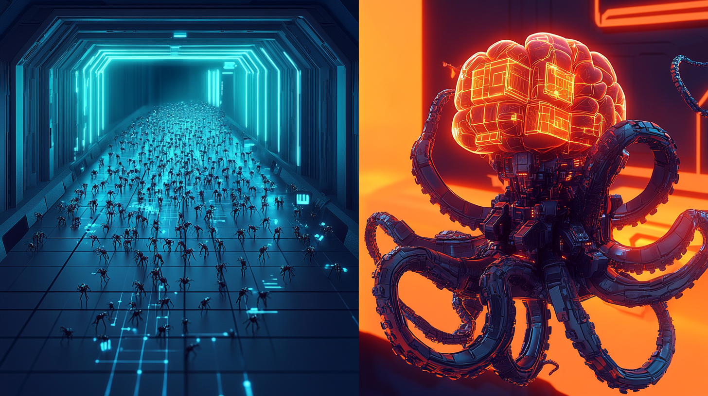

# CUDA & Ada: How Dedicated GPUs Rewired Parallel Computing

*(Personal lab notebook - Last verified 2025‑05-02)*

## Series Context & Objective

This is the second installment in our mini‑series contrasting Apple's M‑series SoCs with NVIDIA's discrete GPUs. Where the first article mapped the historical arc that led Apple to a unified, system‑on‑chip philosophy, this piece examines the opposite pole: **CUDA and the Ada‑based GeForce RTX 4090**.

The goal is two‑fold:

1. **Architectural Literacy** – to understand how NVIDIA's hardware, memory hierarchy, and software stack cooperate to deliver brute‑force throughput.
2. **Practical Insight** – to gauge how an RTX 4090 behaves as a single‑card AI accelerator in real‑world workloads, so we can make honest comparisons against our M3 Ultra lab boxes.

---

## How to Understand GPUs for AI - Your Brain is a Natural Normalizer and That Cuts Both Ways

*Note: This is a preamble to the full guide. After reading this, you walk away with a fresh OO mental model to understand GPUs for AI, my intention was right on. However, if you walk away with just fancy GPU stuff, you're missing the point and that won't help you much.* 

Unless you stop and really think, you might never face this fact: a GPU performs **trillions of operations every second**.

Pause and picture a trillion. If you counted one number every second, you would still be counting 32,000 years from now. Vendors call these tasks *simple* operations, but how simple are they and why are they simple?

Think about your phone's camera. The sensor captures far more light than the JPEG you keep; the image pipeline trims brightness and color extremes so the file is usable. Your guitar rig does the same with sound, compressing peaks so speakers and ears stay safe.

Here is the kicker: no matter how faithfully you capture the analog world, the digital result is always a simplified sample. You can never record the full population of an analog signal. Your eyes and ears work the same way. Retinal cells adapt to sunlight, and the cochlea dampens loud noises so your head does not explode from sensory overload. If you have played Bloodborne, think of the scholars with swollen heads -- that is what chasing the full signal would feel like.

Even when understanding complex concepts, our brains are hardwired to normalize things back to comfort. This normalization reflex makes extraordinary technologies feel mundane after brief exposure - we mentally downgrade "trillion operations per second" to just another spec, losing sight of its true magnitude. In most cases, this is a good thing. Without this auto-normalization, we would be overwhelmed by the sheer volume of information, which would stall progress - a genuinely counterproductive outcome. 

You get my point: you need to know when to flip that normalizer switch off. When dealing with GPU computing, especially as a developer, AI engineer, or even a regular user trying to see through the marketing hype, this mental reset is essential. Without it, we risk treating critical insights like "Single Instruction Multiple Data (SIMD)" as just another spec, losing sight of its true magnitude and the underlying engineering principles.

When we read GPU numbers, again, we must flip that normalizer switch off; otherwise a figure like "one trillion operations per second" feels ordinary instead of the engineering outlier it is. Remember: the switch is **always** on by default.

This is abstraction and encapsulation in action. Encapsulation is useful until you need to lift the hood, and the GPU is Exhibit A.

If you are a casual user, oversimplification is fine. If you are a developer -- or the person running an AI cluster -- you must understand the whole machine, not just the shiny UI.

Reality check: even *one* trillion operations per second is not enough to render a 4K frame in real time. Bitcoin mining? We throw hundreds of thousands of trillions of hashes per second at that lottery. The obvious question is, **how is any of this possible?**

That curiosity is what cracks open the black box.

Remember: *simple* in "simple operations" is the key. A GPU excels at addition and multiplication -- `A + B * C` -- nothing fancy. The magic comes from unleashing a **trillion-strong ant colony** of these tiny calculators in perfect formation. See? SIMD: Single Instruction Multiple Data. Your mental model should see this: *Single* means one operation type applied uniformly, while *Multiple* means it processes thousands of data points simultaneously. This parallel processing is what transforms basic arithmetic into computational power. 

**SIMT:** Single Instruction Multiple Threads. This extends our SIMD understanding with an important twist: threads. Mentally, we inherit the SIMD understanding and add the concept of threads, polymorphically, still hiding the overly technical details like a black box again since we don't need to crack that open yet. Four pillars of OO mindset in serious action: inheritance, polymorphism, encapsulation, and abstraction. 

Think of it as organizing our ant colony into semi-autonomous teams. While SIMD forces all ants to march in perfect lockstep, SIMT allows each small group to progress at its own pace. These thread groups can diverge and make independent decisions when needed, then reconverge later. This flexibility prevents the entire colony from stalling when some paths require more work than others. The parallel processing power remains, but with added adaptability for real-world computing challenges.

With a simple OO mental model, you've now grasped the basic picture: SIMD as a foundation, with SIMT building naturally upon it. This progression demonstrates the power of object-oriented thinking - concepts inherit and extend each other, complex implementations remain encapsulated, and the mental abstraction lets you understand the system without drowning in details.

Fancy terms aside, this is just a humongous ant colony in action, where each ant performs one simple task but their collective effort moves mountains.

Write a short kernel (each ant's marching orders), launch the swarm, and your data boulder comes out polished before the next blink. Ask a CPU to do the same and you hit a highway-sized traffic jam.

Keep the model in view: your brain will always try to normalize things back to comfort. Fight that reflex. Stay curious, and crack the box when the moment calls.

That said, this OO mental model alone will help most developers navigate the critical GPU-related concepts. With this foundation, you're already ahead of the curve.

The full guide continues with a deep dive into the CUDA & Ada architecture, the RTX 4090's memory hierarchy, and a practical examination of how this hardware performs in real-world scenarios. However, you don't need to read that far to grasp the fundamental principles of GPU operation. Be mindful that exploring the deeper technical details risks overcomplicating your mental model before the basics are fully internalized.

In a nutshell, this preamble alone suffices for most practical purposes.

---

## From Pixels to Parallel Compute: A Short History of CUDA

Back in 2007 GPUs were appliance parts: fixed-function circuits that shaded pixels and little else. **CUDA 1.0** cracked that shell by letting you write plain C code that ran on the shader units. Overnight millions of tiny ALUs became a general-purpose math swarm.

Every major release since then has pried the lid open wider:

- **CUDA 3/4 (2009)** – Unified Virtual Addressing let CPU and GPU share one pointer space.  
- **CUDA 5 (2012)** – Dynamic parallelism; kernels could launch child kernels.  
- **CUDA 6 (2014)** – GPUDirect RDMA **slashed inter-node DMA latency**; first glimpse of NVENC/NVDEC video blocks for DL preprocessing.  
- **CUDA 9 (2017)** – Tensor Cores and Cooperative Groups debuted for matrix math and fine scheduling.  
- **CUDA 11 (2020)** – TF32 math plus `cudaGraph` launches reduced CPU overhead.  
- **CUDA 12 (2022-25)** – FP8 support, Blackwell scale, and a toolkit that wraps most of the plumbing.

Today the **CUDA 12.x** toolchain ships profilers, math libraries, and domain SDKs like cuBLAS, cuDNN, NCCL, and TensorRT. They hide ninety percent of the boilerplate but still let you drop to PTX when you need hand-tuned control.  
[developer.nvidia.com](https://developer.nvidia.com/cuda-toolkit)

But ironically, NVIDIA's rise to become the world's most valuable company wasn't built on GPUs as graphics processors, but as massive parallel computing engines. These tiny ant colonies excel at two specific tasks: cryptocurrency mining and AI, both training and inference. Bitcoin mining provided the first major boost, followed by the AI revolution.

From personal experience, I witnessed NVIDIA GPU prices following a steady downward trend before the crypto boom. While building a new Windows machine, I was shocked to see GPU prices suddenly spike upward. This marked the beginning of the bitcoin mining frenzy, which sent NVIDIA's stock price soaring in a remarkably short timeframe.

After the crypto bubble cooled, NVIDIA's stock temporarily declined - only to surge again when the AI boom took hold. 

I highlight this trajectory to emphasize the transformative impact of the underlying technology. Focusing on just one application misses the bigger picture. Gaming, cryptocurrency mining, and AI represent different manifestations of the same fundamental technology: massively parallel computation.

Note: This observation isn't investment advice - merely a technological perspective on NVIDIA's evolution. If you're reading this in 2025 and this is news to you, you missed the boat. Be realistic.

I'll rephrase this just to make sure you get this right.

NVIDIA did not reach the top of the market-cap leaderboard because gamers wanted prettier pixels. Its fortune was built on turning the GPU into a commodity parallel engine.

Two killer apps lit the fuse:

1. **Bitcoin mining** turned shader farms into hash factories. Cards vanished from shelves, prices spiked, and revenue followed.
2. **Deep-learning training** replaced the crypto rush almost overnight. Neural nets scale almost linearly with extra GPU cores, so demand -- and the share price -- shot into orbit again.

The common thread is not gaming, mining, or AI in isolation. It is the GPU's ability to marshal a trillion simple arithmetic units in parallel -- that is the real engine of value.

> **Sidebar  --  "Computation" vs. "Compute"**  
> **Computation** is the act or process of calculating; it is always a noun ("matrix multiplication is a heavy computation").  
> **Compute** began life as a verb ("to compute an answer") but modern HPC and GPU circles often use it as a mass noun meaning processing horsepower or workload ("GPU compute," "a cluster with 10 petaFLOPS of compute").  
> The overlap trips up even language models: "compute" as a noun lacks explicit number or unit unless paired with words like *capacity* or *budget*.  
> Rule of thumb: if you can swap in the word "calculation," choose **computation**; if you are talking about raw processing resources, **compute** is acceptable shorthand.  
> Example: "The computation fits in L2 cache, so we save on DRAM traffic," versus "The RTX 4090 delivers more FP16 compute than an M3 Ultra."  

> **AI-specific notes**  
> In machine-learning papers and blogs, *compute* almost always appears as a noun.  
> The shift started when cloud costs and FLOPs budgets became key metrics; teams began quoting runs like "2e25 FLOPs of compute" or "$100k of compute".  
> Watch the unit that follows:  
>   - Time unit (hours, seconds) -> total compute consumed (e.g., "500 GPU-hours of compute").
>   - FLOPS with no time -> instantaneous capacity (e.g., "1.2 petaFLOPS of compute").
>   - Dollars -> budget constraint (e.g., "$50k compute budget").
> Keep this in mind when reading AI papers so you know whether the author is talking about capacity, consumption, or cost.
> However, even the general public now commonly uses "compute" as a noun in AI contexts, particularly on social media, so don't be overly concerned if you occasionally use it this way.

---

## Ant Colonies vs. Octopus Brains: GPU Kernels and CPU Threads



In CUDA land a **kernel** is a single-purpose function launched across tens of thousands of threads at once. *Picture an immense ant colony:* each ant carries one grain of sand, yet together they reshape a landscape. *Now imagine a modern CPU core as an octopus brain:* one organ controls eight flexible arms, each able to probe, grasp, and switch tasks on the fly.

GPUs trade that octopus flexibility for raw troop numbers. They shine when every ant performs **the same arithmetic on different data**: matrix multiplies, texture filters, softmax reductions. Marching thousands of identical threads through one instruction stream keeps the silicon busy and the throughput sky-high.

Quick contrast:

- **GPU kernel (ant colony):** one job, a million workers, perfect formation.  
- **CPU thread (octopus brain):** many different jobs, a handful of adaptable limbs.

Your job as a GPU programmer is to slice work into kernels that are small, uniform, and *embarrassingly parallel* -- then hand orchestration (file I/O, model loading, dynamic scheduling) back to the CPU.

"Embarrassingly parallel" is a formal CS term, not marketing hype. It labels workloads that split into totally independent chunks that never need to talk to each other -- matrix rows, pixel spans, hash candidates. Such tasks "embarrass" classic parallel code because they require no locks, barriers, or shared state: launch a swarm of threads and gather the answers.

The scale difference makes the trade-off obvious. An RTX 4090 fields **16,384 CUDA cores**; a desktop CPU offers **16–32 versatile cores**. Ask the GPU to render a 4K frame (~8.3 million pixels) with physically based lighting and it fires *trillions* of shader invocations in the 16ms refresh window, while the CPU handles AI, physics, and draw calls. Try the same pipeline on CPU cores alone and you are watching a slideshow that might continue into your next life.

The same ant-colony principle powers other GPU-first workloads -- deep-learning training, real-time video encoding, scientific simulation, even crypto mining -- domains where a sea of identical math operations matters far more than nuanced control flow.

Just remember this: both GPUs and CPUs excel in their respective domains. GPUs dominate when thousands of identical calculations must happen simultaneously, while CPUs shine when tasks require complex decision-making, unpredictable branching, and rapid context-switching. The comparison isn't a competition but a symbiosis -- each architecture handling what it does best in a carefully choreographed performance. Yes, they should dance, not compete.

> **Sidebar  --  Clocks, Cores, and Head-Math**  
> Picture a 10-core CPU running at 2GHz. Each core issues roughly **2 billion** instruction slots per second, so the whole chip has room for **20 billion** instruction slots every tick of the wall clock. Sounds huge -- until you stack it against a GPU.  
>  
> Now take an RTX-class GPU with **10,000 simple cores** (CUDA units). Even if each core clocks at a modest 1.8 GHz, the card can attempt **18 trillion** arithmetic slots per second -- about **900×** the raw slot budget of the CPU example.  
>  
> The key is that the GPU's slots all run **the same instruction** in lock-step, like ants following one scent trail, while the CPU's slots juggle many unrelated chores like an octopus moving eight arms.  
>  
> Keep these round numbers in your head (20 B vs. 18 T per second) and the scale argument becomes obvious whenever you hear FLOPs claims or power-draw charts.  

---

## From Silicon Slab to Warp: Hierarchy Inside a Modern GPU

Below is an ASCII sketch of how work funnels through the RTX 4090.  Read it left-to-right; each layer encapsulates the one that follows.

```
┌─────────────────────── GPU Die ────────────────────────┐
│  ┌──── Graphics Processing Cluster (GPC) ────┐         │
│  │  ┌────────── Streaming Multiprocessor ───┐│  ...    │
│  │  │  Warp Scheduler  →  Warp  (32 threads)││         │
│  │  │        │                │             ││         │
│  │  │        └─> CUDA / Tensor / RT Cores   ││         │
│  │  └───────────────────────────────────────┘│         │
│  └───────────────────────────────────────────┘         │
└────────────────────────────────────────────────────────┘
```

Quick translation for OO-lens thinking:

* **Die:** the top-level *object* -- a slab of silicon with power, clocks, and memory buses.  All lower objects live inside it.
* **GPC (Graphics Processing Cluster):** a *module* that groups several SMs.  It handles rasterization setup in graphics mode and keeps SM batches fed in compute mode.
* **SM (Streaming Multiprocessor):** the workhorse *class* that owns execution units, registers, and caches.  Each SM in Ada contains:
  * 128 CUDA cores (integer + FP32/FP16 ALUs)
  * 4 Tensor cores (matrix units)
  * 1 RT core (ray-tracing intersection unit)
* **Warp:** a 32-thread *instance* scheduled as a single SIMD/SIMT entity.  Warps inherit their instruction stream from the kernel you launch.
* **Cores:** the elemental *methods* -- they run a very small set of opcodes but do so trillions of times per second.

*Note: The term 'warp' comes from textile weaving, where the warp is the set of parallel threads stretched lengthwise on a loom. NVIDIA adopted the term for its 32-thread execution batch because those threads advance in lock-step, reminiscent of a loom raising an entire warp row at once. The weaving metaphor shows up elsewhere too: CPUs and GPUs schedule "threads," and SoC interconnects are often called "fabrics" (Apple Fabric, Arm's Coherent Mesh Interconnect, etc.).*

### RTX 4090 Core Inventory

| Unit Type | Count | Why so many? |
|-----------|-------|--------------|
| CUDA cores (ALUs) | **16,384** | Bulk arithmetic for FP32/FP16/INT math -- the ants of our colony. |
| Tensor cores (4th-gen) | **512** | Specialized matrix engines; fewer are needed because each one is ~16× wider than a CUDA core for GEMM-style math. |
| RT cores (3rd-gen) | **128** | Fixed-function BVH traversal; ray tracing is bandwidth-bound, so you hit diminishing returns sooner. |

Notice the geometric taper: as the hardware becomes more specialized, you need fewer copies.  Generic math profits from raw replication, while matrix and ray-intersection units already operate on large data blocks per cycle.

Keep this pyramid in mind when you read spec sheets.  A headline like "82 TFLOPS FP32" comes from multiplying **CUDA cores × clock × 2** (rise-and-fall edges).  Tensor and RT throughput use their own formulas and saturate long before you would ever wish for 16 000 of them.

#### UMA Analogs (Apple M-series)

| NVIDIA Hierarchy | Apple M-series Term | Notes |
|------------------|---------------------|-------|
| GPU **Die** | SoC Die (Unified Memory) | Apple keeps CPU, GPU, and caches on one slab with a shared memory fabric. |
| **GPC** | GPU Cluster | Apple groups several Execution Engines into a cluster; job feeding is similar. |
| **SM** | Execution Engine | Both own local caches, registers, and scheduling logic. |
| **Warp** (32 threads) | SIMD Group (32 or 64 lanes) | Executes the same instruction across lanes; Apple size varies by SKU. |
| **CUDA core** | ALU Lane | Scalar FP/INT unit; pipeline depth and datapath differ but purpose matches. |
| **Tensor core** | AMX Matrix Unit (or Neural Engine off-die) | Apple exposes matrix ops via AMX; heavy ML often offloaded to the separate Neural Engine. |
| **RT core** |  --  (none) | Apple has no fixed-function ray-tracing block as of M3 generation. |

Keep this mapping handy: whenever you see "SM" in CUDA docs, translate it to "Execution Engine" in Metal, "warp" to "SIMD group," and so on.  The conceptual ladder stays intact even though the chess pieces are carved differently.

---

## The CUDA Programming Model at a Glance

At its core, CUDA exposes a hierarchy that is easy to picture in plain text:

```
Grid
   ├─ Block 0
   │   ├─ Warp 0
   │   │   ├─ Thread 0
   │   │   ├─ Thread 1
   │   │   └─ ...
   │   └─ Warp 31
   └─ Block N
       └─ ...
```

- **Threads** – lightweight, register-rich execution contexts.
- **Warps** – 32-thread units that issue the same instruction in lock-step on an SM.
- **Thread blocks** – bundles of warps that share on-chip scratchpad memory and are scheduled as a unit on one SM.
- **Grid** – the full collection of blocks launched by a kernel across the device.

You pick the thread-and-block shape when launching a kernel; the CUDA runtime maps those blocks onto SMs to keep them saturated.  **Occupancy** -- how many warps can live on an SM at once -- depends on three knobs: register footprint, shared-memory request, and the chip generation (compute capability 8.9 for the RTX 4090).  High occupancy means the scheduler always has a warp ready when another stalls on memory.

> **What exactly is an SM?**  A **Streaming Multiprocessor** is the GPU's self-contained mini-core.  One Ada-class SM includes warp schedulers, 128 FP32/INT32 ALUs, load/store units, Tensor Cores, a 256 KB register file, and a 128 KB slice of shared/L1 cache.  It can issue instructions for several warps per cycle and swap in a fresh warp the moment another waits on memory, masking latency in a way a conventional CPU core cannot.  ([images.nvidia.com](https://images.nvidia.com/aem-dam/Solutions/geforce/ada/nvidia-ada-gpu-architecture.pdf))

#### Metal / Apple-GPU Equivalents

| CUDA Term | Apple Metal Term | Notes |
|-----------|------------------|-------|
| Thread | Thread (invocation) | One shader invocation mapped to a SIMD lane. |
| Warp (32 threads) | `simdgroup` (32 or 64 lanes) | Lanes execute in lock-step; size depends on SKU. |
| Thread block | `threadgroup` | Shares on-chip threadgroup memory; scheduled on one Execution Engine. |
| Grid | Grid (dispatch) | Entire kernel launch across the GPU. |
| SM | Execution Engine | Mini-core that schedules SIMD groups and owns local caches. |

With this mapping, any CUDA code sample that talks about `blockIdx`, `threadIdx`, or `__syncthreads()` has a direct conceptual twin in Metal's threadgroup indices and `threadgroup_barrier()` -- same ladder, different rungs.

---

## SIMD, SIMT, and Warp Divergence

At first glance both CPUs and GPUs chant "parallelism," yet they march to different drummers.  Reuse the OO lens:

*Base class – SIMD*

- **SIMD (Single Instruction, Multiple Data)**: one instruction, many data lanes, all in perfect lock-step.  Typical CPU vectors run 8–64 lanes wide.  When control flow branches, the core either reverts to scalar mode or masks off lanes, wasting cycles.

*Derived class – SIMT = SIMD plus polymorphism*

- **SIMT (Single Instruction, Multiple Threads)**: NVIDIA inherits the SIMD datapath but adds per-lane register files and a tiny program counter mask.  Thirty-two such lanes form a **warp**.  If threads diverge, hardware toggles masks so each path runs in turn, then reconverges.  Same hardware, new behavior -- classic polymorphic extension.

Hardware mapping on RTX 4090:

```
32-lane SIMD ALU  ⇐  1 warp  ⇐  issued by an SM scheduler
```

The illusion of "independent threads" costs only a few bits of mask memory, yet gives programmers a much richer model.  The catch: heavy divergence forces the warp to serialize branches and throughput drops toward scalar.

Rule of thumb: design kernels so that all 32 threads in a warp follow the same path and touch memory in coalesced, sequential chunks.  Push highly unpredictable logic back to the CPU (or Apple's CPU/Neural Engine on UMA).

---

## Not All Dies Are Created Equal: Binning and Product Segmentation

When examining the specs and prices across the RTX lineup -- 4090, 4080, 4070, and their Ti variants -- you might wonder what truly differentiates them.

The answer lies in silicon yield management through a process called binning.

This isn't about "bad" chips versus "good" chips in the way you might initially think. Rather, it's a sophisticated manufacturing strategy that maximizes usable silicon from each wafer. At the nanometer scale where modern GPUs are fabricated, perfect yields are virtually impossible.

### Why Defects Are Inevitable

Every 5 nm wafer holds hundreds of giant AD102 dice.  As the photolithography scale shrinks, the chance that *one* transistor out of 76 billion mis-aligns rises.  Instead of discarding the whole wafer, vendors **bin**: they test each die, blow laser fuses to disable broken SMs or memory controllers, then sell the salvaged silicon under a lower tier.

### Ada Line-Up by Active SM Count

| Product | GPU Variant | Active SMs | CUDA cores | Typical Boost | TGP (W) |
|---------|-------------|-----------:|-----------:|--------------:|--------:|
| RTX 4090 | AD102-300 | 128 | 16,384 | 2.5 GHz | 450 |
| RTX 4080 SUPER | AD103-400 | 80 | 10,240 | 2.6 GHz | 320 |
| RTX 4080 | AD103-300 | 76 | 9,728 | 2.5 GHz | 320 |
| RTX 4070 Ti SUPER | AD103-275 | 66 | 8,448 | 2.6 GHz | 285 |
| RTX 4070 Ti | AD104-400 | 60 | 7,680 | 2.6 GHz | 285 |

Same wafer, different yields: a die with two faulty SMs might become a 4080; one with ten faulty SMs becomes a 4070 Ti.  Memory bus width (384-bit vs 256-bit) is likewise set by enabling or disabling memory controllers on the edge of the die.

### Performance vs. Salvage Trade-Off

Salvaged dice run cooler and need fewer amps, so NVIDIA can assign them lower TGP limits and still hit advertised clocks.  Top-bin 4090 chips, by contrast, ship with every SM alive and headroom for overclockers.  The practice maximizes revenue while giving consumers a spread of price–performance points.

### Apple's Flavor of Binning

Apple plays the same game: a full M3 Max sports 40 GPU cores; a partially-defective die is sold as a 30-core SKU.  Marketing spins this as "choose your performance," but under the hood it is the same defect-management strategy.

### Takeaways

* Specs are not carved in stone; they are *configuration fuses* blown after test.
* Two cards with the same label can still differ -- A-silicon vs B-silicon -- so overclock headroom varies.
* Reading a spec sheet?  Look at SM count and bus width first: they tell you how much silicon survived the yield lottery.

---

### Memory Hierarchy

CUDA's named memory spaces line up with a physical ladder inside the silicon:

| Scope                   | Latency (approx.) | Typical size on RTX 4090 |
|-------------------------|-------------------|--------------------------|
| Registers               | 1 cycle           | 256 KB per SM |
| Shared / L1             | 20-30 cycles      | 128 KB per SM (configurable) |
| L2 cache                | 100+ cycles       | 96 MB device-wide (about 16x Ampere) |
| GDDR6X                  | 500-800 cycles    | 24 GB at roughly 1 TB/s peak |
| Host RAM (PCIe 4.0 x16) | >2 us             | 64 GB/s each direction |

> **Sidebar - Apple LPDDR vs. Desktop GDDR and Data-Center HBM**  
> • **LPDDR5/5X (Apple Silicon):** Soldered next to the SoC, finely clock-gated, and good for about **819 GB/s** on an M3 Ultra at much lower power per bit than GDDR. Latency is higher than on-package HBM but the unified memory map lets CPU, GPU, and Neural Engine sip from the same pool.  
> • **GDDR6X (RTX 4090):** Discrete chips on a wide 384-bit bus, pushed to 21 Gb/s per pin for **~1 TB/s** bandwidth. Great for graphics and AI bursts but burns roughly **15 pJ/bit** and sits across a PCB trace, adding latency.  
> • **HBM3/e (A100, Hopper, upcoming Blackwell):** Stacked DRAM dies on the same package as the GPU, reaching **3-4 TB/s** at about **7 pJ/bit** plus very low latency. Expensive and thermally dense, so you see it only in data-center parts where memory bandwidth dominates total cost.

---

## Memory Size & Bandwidth  --  Reading the Spec Sheet

When vendors tout "24 GB @ 1 TB/s" or "512 GB @ 819 GB/s," they're combining two orthogonal metrics:

| Metric             | What It Measures                                    | How to Calculate                                                                                                                                                 |   |
| ------------------ | --------------------------------------------------- | ---------------------------------------------------------------------------------------------------------------------------------------------------------------- | - |
| **Capacity**       | Total data the memory chips can hold                | Sum of DRAM die sizes → bits ➜ ÷ 8 → **bytes** (e.g., 8 × 24 Gbit GDDR6X = 192 Gbit ÷ 8 = 24 GB)**                                                             |   |
| **Peak Bandwidth** | How fast data can *stream* between DRAM and the GPU | **Bus width (bits) × Data rate (Gbps) ÷ 8 = GB/s**→ RTX 4090: 384 bits × 21 Gb/s ÷ 8 ≈ 1 008 GB/s → M3 Ultra: 6600 MT/s LPDDR5X × 512-bit eq. bus ÷ 8 ≈ 819 GB/s |   |

> **Bus width vs. clock vs. data-rate**\
> Modern DRAM is double- or quad-pumped, so marketing "21 Gb/s" really means 5.25 GHz I/O clock × 4 data transfers per cycle. Multiply by the physical wires (384 on RTX 4090) and divide by 8 for bytes.

> **Why bandwidth matters**\
> Large matrix multiplies, attention windows, and texture lookups can all become *memory-bound* -- performance limited by GB/s, not FLOPS. That's why Ada's 96 MB L2 cache *(72 MB is exposed on the retail RTX 4090 variant)* is almost as pivotal as its raw TB/s figure: keeping high-reuse data on-chip avoids saturating the external bus.

> **Latency caveat**\
> Size and bandwidth say nothing about *latency*. LPDDR is slower per access than GDDR, which in turn lags HBM; but UMA and large caches can hide part of that penalty.

When you see a line like "24 GB @ 1 TB/s" you are really looking at **two separate levers**:

| Metric         | What it tells you                              | Quick math formula |
|----------------|-----------------------------------------------|--------------------|
| Capacity       | How much data the chips can *store*           | sum
aof die sizes (bits) / 8 = bytes – eg 8 × 24 Gbit = 192 Gbit / 8 = 24 GB |
| Peak bandwidth | How fast bytes can *flow* per second          | (bus bits × data-rate Gbit/s) / 8 = GB/s |

Rule-of-thumb examples:

* **RTX 4090:** 384-bit bus (that is 48 bytes wide). 21 Gbit/s per pin → (384 × 21) / 8 ≈ **1 008 GB/s** ≈ **1 TB/s**.
* **M3 Ultra:** 512-bit equivalent LPDDR bus at 6 600 MT/s (≃ 6.6 Gbit/s) → (512 × 6.6) / 8 ≈ **422 GB/s** *per memory slice*. Dual-stacked dies give **~819 GB/s** total.

### Head-math shortcut

1. Divide the bus width by **8** to get **bytes per beat**. 384-bit → 48 B.  
2. Treat **rate in Gbit/s** as **gigatransfers per second**. 21 G transfers × 48 B ≈ 1 000 GB/s.  
3. If the DRAM is quad-pumped, advertised rate already includes the ×4.

Close enough for slide-deck sanity checks without grabbing a calculator.

### Personal Take

Do not burn hours chasing spec-sheet trophies.

Peak bandwidth is like the 300 km/h sticker on a super-car window: impressive, but you will spend 99 percent of real mileage in traffic at 60 km/h.  GPUs, LPDDR, and HBM follow the same pattern.  Marketing quotes the wind-tunnel run; production code sees thermals, cache hits, and power limits.

Apple users in particular love to quote unified-memory numbers, NVIDIA fans wave TB/s banners, and both camps miss the point.  What matters is **effective** bandwidth for *your* kernel -- something you control with data layout, tiling, and cache reuse, not with retail box numbers.

Grasp the idea, run a quick roofline sanity check, then pour your effort into building. I'm pushing sixty, and experience says time and energy drain faster than VRAM -- guard them.

Ditch the spec-sheet gold dust.

I'm not interested in debating spec-sheet numbers. If you can't tweak and optimize those numbers, just move on. They're only *reported* numbers even in your own benchmarks.

Let's use our time wisely.

---

## Ada Lovelace – Silicon Anatomy of the RTX 4090

*Note: This Ada Lovelace section is reference-depth material. If the core mental model already makes sense, skim or skip -- the earlier chapters cover everything you need for day-to-day work.*

**TL;DR:** Ada Lovelace is the pro-tier evolution of the RTX line -- about twice the horsepower and complexity. For this repo's big-picture goals, that headline is all you really need.

### Die Overview

The RTX 4090 is a cut-down **AD102** with 128 of the 144 SMs enabled, yielding **16,384 CUDA cores**, 512 Tensor cores, and 128 RT cores. The full AD102 die spans 76.3 billion transistors on TSMC 4N, organized into 12 Graphics Processing Clusters (GPCs). ([images.nvidia.com](https://images.nvidia.com/aem-dam/Solutions/geforce/ada/nvidia-ada-gpu-architecture.pdf))\
Boost clocks reach 2.52 GHz out‑of‑box -- a first for consumer GPUs at that wattage. ([images.nvidia.com](https://images.nvidia.com/aem-dam/Solutions/geforce/ada/nvidia-ada-gpu-architecture.pdf?utm_source=chatgpt.com))

### Streaming Multiprocessor (SM)

Each Ada SM packs **128 FP32/INT32 ALUs**, a **third‑generation RT Core**, **four fourth‑gen Tensor Cores**, a 256 KB register file, and a 128 KB unified L1/Shared memory slice. ([images.nvidia.com](https://images.nvidia.com/aem-dam/Solutions/geforce/ada/nvidia-ada-gpu-architecture.pdf))\
Crucially, Ada retained Ampere's dual‑issuance design (64 FP32 ALUs + 64 INT32 that can dual‑issue FP32), doubling scalar throughput over Turing while keeping power in check.

### Tensor Cores & FP8

The fourth-generation Tensor Cores introduce native **FP8 E5M2/E4M3** support and structured sparsity acceleration, pushing theoretical tensor throughput to **1.32 PetaFLOPS (with 2 : 1 sparsity)** on RTX 4090. ([forums.developer.nvidia.com](https://forums.developer.nvidia.com/t/4090-doesnt-have-fp8-compute/232256?utm_source=chatgpt.com))\
For AI practitioners this means mixed‑precision training (FP8/FP16/BF16) with automatic loss scaling can deliver 2–5× the throughput of FP32 while preserving convergence.

### Third‑Gen RT Cores

Ray‑tracing hardware evolved well beyond triangle intersection. Ada's RT Cores add **Opacity Micromap** and **Displaced Micro‑Mesh** engines, accelerating alpha‑tested geometry and on‑the‑fly micropolygons. They also introduce a dedicated unit for **Shader Execution Reordering (SER)**, improving incoherent ray workloads by up to 44 %. ([images.nvidia.com](https://images.nvidia.com/aem-dam/Solutions/geforce/ada/nvidia-ada-gpu-architecture.pdf))

### Memory Subsystem

## Core Types at a Glance

| Core type           | What it does                                              | Typical workloads                                              |
|---------------------|-----------------------------------------------------------|----------------------------------------------------------------|
| CUDA core           | Scalar and vector FP/INT math, branch logic               | Raster shaders, general-purpose kernels, physics, crypto hash  |
| Tensor core         | Fused-multiply-add matrices in FP16/BF16/FP8, sparsity    | Deep-learning training and inference, dense linear algebra     |
| RT core             | BVH traversal, ray/triangle and micromesh intersection    | Real-time ray tracing, path tracing, collision detection       |
| Optical-flow engine | Estimates motion vectors between frames                   | Video encoding, frame interpolation, DLSS/Frame Generation     |

Rule of thumb: CUDA cores supply baseline horsepower; Tensor cores turbo-charge dense matrix math; RT cores shortcut geometric queries for realistic lighting; and the optical-flow engine off-loads motion estimation so the math units stay busy.

Ada's standout upgrade is a 96 MB L2 cache *(full-die AD102; the shipping RTX 4090 enables 72 MB)* -- roughly 16× bigger than Ampere -- wedged between the SMs and a 384-bit GDDR6X bus that peaks near 1 TB/s. The cache catches random traffic (think attention kernels) and keeps many accesses from spilling to external DRAM.

---

## The CUDA Software Stack

1. **Driver layer** – Kernel-space runtime, PTX→SASS JIT compilers, and memory managers.  
2. **CUDA Runtime & Driver APIs** – Expose kernel launches, device memory ops, streams, and events.  
3. **Core libraries** – cuBLAS, cuDNN, cuFFT, NCCL, etc.; all built on tuned kernels and Cooperative Groups for low-level scheduling.  
4. **Vertical SDKs** – TensorRT (inference), Triton (serving), cuQuantum (tensor networks), Isaac (robotics), and more.  
5. **Developer tools** – Nsight Compute, Nsight Systems, DL Profiler; visualize warp divergence, memory stalls, Tensor-Core utilization.

Together these layers automate 80–90 % of the boilerplate in HPC and AI, leaving you to write a thin orchestration wrapper.

**Cross-platform myth-busting**  

CUDA is not a jail cell -- PyTorch ships Metal wheels for Apple Silicon, TensorFlow's PluggableDevice API targets M-series GPUs, and llama.cpp runs flash-attention and low-bit inference on macOS. Choose the stack that fits your deployment, not the loudest marketing pitch.

Some toolkits do remain platform-specific -- for example, Apple's MLX is macOS-only (for now). Evaluate each framework on maturity, community support, and long-term needs; avoid ideology-driven choices.

---

## Theoretical Peak Throughput (quick sanity check)

Raw spec math -- no drivers, no thermals:

| GPU                      | FP32 shader | Matrix / Tensor | DRAM BW |
|--------------------------|-------------|-----------------|---------|
| **RTX 4090 (Ada)**       | ~ 82 TFLOPS¹ | ~ 660 TFLOPS FP16 Tensor (≈ 1.32 PFLOPS with 2:1 sparsity) | 1 008 GB/s GDDR6X |
| **M3 Ultra (80-core GPU)** | ~ 28 TFLOPS | ~ 56 TFLOPS FP16 (no dedicated Tensor units) | 819 GB/s LPDDR5X |

Sources: NVIDIA product page, TechPowerUp DB, Apple specs, public benchmarks.

¹ FP32 figure = 16,384 ALUs × 2 FMA ops × 2.52 GHz ≈ 82.6 TFLOPS (NVIDIA spec).

> **Reality check**  
> Peak TFLOPS = ALU lanes × issue rate × boost clock.  Real jobs hit only 30–60 % once memory stalls, branch divergence, and power or thermals kick in.  Use the *ratio* -- the 4090 is roughly **3×** an M3 Ultra -- to set expectations.  Chasing absolute numbers is wasted energy.  Big picture: dedicated GPUs versus Apple's UMA, each with unique strengths and trade-offs.  Got it? Move on.

---

## Thermals & Power

• **TGP:** 450 W nominal; stress loops can nudge ~600 W.  
• **Cooling:** Founders Edition is a triple-slot vapor-chamber design with push-pull fans; board-partner cards stretch to four slots.  
• **12VHPWR connector:** One 16-pin plug replaces four 8-pin PCIe leads but demands flawless cable routing to avoid melt incidents.

With solid airflow, a 4090 holds 2.5 GHz+ without throttling.  Building a quiet rig, however, means 450-W-class radiators or 100-mm fans -- much louder than an M-series Mac Studio running flat-out.

---

## Strengths, Weaknesses & the Road Ahead

**Strengths**

• Highest per-card tensor throughput; native FP8 accelerates training.  
• Mature tools and a decade-deep knowledge base.  
• Day-0 support in major frameworks (PyTorch, TensorFlow, JAX).

**Weaknesses**

• *Memory wall:* 24 GB VRAM caps single-card LLM size; sharding required for giants.  
• *Power and acoustics:* Draws 3–4× an M3 Ultra for similar mid-size inference.  
• *Scalability:* Consumer Ada lacks NVLink; multi-GPU is stuck at PCIe 4.0 bandwidth.

Blackwell plus HBM will lift these ceilings -- but at a very different price tag and power envelope.

Again, a practical "dedicated GPUs vs. Apple's UMA" frame would help your understanding. Consider how these architectures solve different problems rather than fixating on raw specifications. Dedicated GPUs excel at massive parallel workloads with high memory bandwidth, while Apple's UMA eliminates costly data transfers between CPU and GPU memory. Benchmark numbers without this context are misleading - they represent theoretical peaks under ideal conditions, not real-world performance for your specific workloads.

**Final note:** Truth is, we are not comparing apples to Apples -- pun fully intended. Dedicated GPUs and Apple's UMA follow different design philosophies and serve different markets. Judge each on how well it solves *your* problem, not on whose spec sheet is bigger.

---

## Appendix A. A Quick-but-Complete History of CUDA (2007 -> 2025)

*From "G80 + CUDA 1.0" to **Blackwell + CUDA 12.8.1** -- the milestones that reshaped GPU programming.*

| Year | Architecture (Compute Capability) | CUDA Milestone | Why It Mattered |
|------|-----------------------------------|---------------|-----------------|
| **2007** | **Tesla** (1.x) | **CUDA 1.0** | First time shader ALUs were exposed as general-purpose cores; threads/blocks/grid model debuts. |
| **2009 – 2010** | **Fermi** (2.0 / 2.1) | **CUDA 3 → 4** | L1/L2 caches, ECC, and the first real debugger. CUDA 4 adds *Unified Virtual Addressing* so the host & device share one pointer space. |
| **2012** | **Kepler** (3.0 / 3.5) | **CUDA 5** | *Dynamic parallelism* lets kernels launch kernels; Hyper-Q opens 32 CPU work queues to a single GPU. |
| **2014** | **Maxwell** (5.0 / 5.2) | **CUDA 6** | *GPUDirect RDMA* ships, slashing inter-node latency; first glimpse of NVENC/NVDEC video blocks for DL preprocessing. |
| **2016** | **Pascal** (6.0 / 6.1) | **CUDA 8** | NVLink 1.0 and 16-bit FP16 «half» intrinsics -- prelude to deep-learning boom. |
| **2017** | **Volta** (7.0) | **CUDA 9** | Introduces **Tensor Cores** and *Cooperative Groups* API. First-generation WMMA intrinsics land. |
| **2018** | **Turing** (7.5) | **CUDA 10** | Adds **RT Cores** and INT8/INT4 mixed-precision paths; *NVJPEG*, *NPP* accelerate data loading. |
| **2020** | **Ampere** (8.0 / 8.6) | **CUDA 11** | Second-gen Tensor Cores + *TF32* math; `cudaGraph` launches reduce CPU overhead; MIG partitions A100 into seven virtual GPUs. |
| **2022** | **Ada Lovelace** (8.9) | **CUDA 11.8 → 12.0** | 96 MB L2 cache and Shader-Execution-Reordering (SER); Tensor Cores gain **FP8** support. |
| **2022** | **Hopper H100** (9.0) | **CUDA 12.0** | **Transformer Engine** pairs FP8 with smarter scaling; Thread-Memory Async (TMA) instructions expose 1.5 TB/s SRAM bandwidth.  ([H100 Transformer Engine Supercharges AI Training, Delivering Up ...](https://blogs.nvidia.com/blog/h100-transformer-engine/?utm_source=chatgpt.com)) |
| **2024** | **Blackwell B200** (~10.x, two-die "superchip") | **CUDA 12.6 → 12.8 (2025)** | 10 TB/s chip-to-chip fabric, 208 B transistors, NVLink 5 @ 1.8 TB/s. Promises 4× faster training and 30× better energy efficiency on trillion-parameter models over Hopper.  ([NVIDIA Blackwell Platform Arrives to Power a New Era of Computing](https://nvidianews.nvidia.com/news/nvidia-blackwell-platform-arrives-to-power-a-new-era-of-computing?utm_source=chatgpt.com), [The Engine Behind AI Factories | NVIDIA Blackwell Architecture](https://www.nvidia.com/en-us/data-center/technologies/blackwell-architecture/?utm_source=chatgpt.com)) |

* **RTX Workstation**: NVIDIA rebranded its professional Quadro line to "RTX" in 2020, unifying gaming and workstation branding while maintaining professional driver certifications, ECC memory options, and ISV support for CAD/3D applications. 
* **RTX**: While commonly associated with ray tracing technology, NVIDIA has never officially defined what the acronym stands for. Industry speculation includes "Ray Tracing TeXnology" or simply "Ray Tracing eXtended," but NVIDIA treats it primarily as a product brand rather than a technical acronym. The RTX designation appears across both GeForce (consumer) and professional product lines to indicate hardware-accelerated ray tracing capabilities.

### Three big through-lines

1. **More math formats, fewer watts**  
   FP32 → FP16 → TF32 → BF16 → FP8: each step halves the data footprint and doubles effective Tensor-Core FLOPS.

2. **Fatter on-chip memory**  
   Fermi's 768 KB L2 felt huge in 2010; Ada's 96 MB L2 (and Hopper's 50 MB SRAM blocks with TMA) keep data on die, not on 1 TB/s DRAM  --  crucial for attention kernels.

3. **CPU/GPU orchestration costs keep shrinking**  
   Dynamic kernel launches (Kepler), GPUDirect RDMA (Maxwell), `cudaGraph` (Ampere) and **NVLink Switch** fabrics (Blackwell) all attack the same bottleneck: getting data *and* work to 100,000+ concurrent warps without stalling.

### Where we stand in 2025

* **CUDA 12.8.1** (March 2025) is the current "law book" for everything through Blackwell.  ([CUDA Toolkit Archive - NVIDIA Developer](https://developer.nvidia.com/cuda-toolkit-archive?utm_source=chatgpt.com))  
* Blackwell GPUs are sampling; early DGX B200 systems hit labs in Q4 2024 and hyperscalers in 2025H2. Adoption focus: trillion-param LLMs, memory-bound graph-analytics, physics ML surrogates.
* Apple users can't run CUDA natively, but the concepts -- tensor-style matrix engines, large L2, chiplet fusion, NVLink-like fabrics -- map directly onto M3/M4-class Metal and *Unified Memory* thinking.

---

> **Take-away:** CUDA's 18-year evolution is a straight line toward "make every byte cheaper, every launch lighter, every tensor larger. Even if your day-to-day work lives on Apple Silicon, understanding that arc lets you read Hopper/Blackwell papers and port the ideas -- Flash-Attention tiling, FP8 scaling, graph launch batching -- into Metal or MLX with far less guesswork.

---

[⇧ Back&nbsp;to&nbsp;README](../README.md)